# Versionshinweise für vorherige Versionen{#release-notes-for-previous-releases}

Versionshinweise zu früheren Versionen der Zielgruppe, einschließlich Versionshinweise zu Target Standard/Premium, der Zielgruppe-Plattform und der JavaScript-Zielgruppe (at.js). Versionshinweise sind in absteigender Reihenfolge sortiert: nach Monat und Jahr des Release.

>[!NOTE]
>
>Informationen zu den Target-Versionen (Plattform und Target Standard/Premium) finden Sie unter [Target-Versionshinweise (aktuell)](../r-release-notes/release-notes.md#reference_8FE40B43A5A34DDF8F26A53D55EE036A).

## Versionshinweise - 2020

### Target Standard/Premium 20.8.3 (15. September 2020)

| Funktion | Details |
| --- | --- |
|  Analytics for Zielgruppe (A4T)-Unterstützung für Aktivitäten mit automatischer Zielgruppe | [!UICONTROL Aktivitäten der automatischen Zielgruppe] unterstützen jetzt [Analytics für die Zielgruppe](/help/c-integrating-target-with-mac/a4t/a4t.md).<br>Diese Integration ermöglicht es Ihnen, mithilfe des [!UICONTROL Automatisch Zielgruppe] Lernalgorithmus ein optimales Erlebnis für jeden Besucher anhand seines Profils, seines Verhaltens und seines Kontexts zu wählen.<br>Wenn Sie bereits A4T [für die Verwendung mit A/B-Test- und Erlebnis-Targeting-Aktivitäten](/help/c-integrating-target-with-mac/a4t/a4timplementation.md) implementiert haben, sind Sie alle bereit!<br>Weitere Informationen finden Sie unter [Analytics for Zielgruppe (A4T)-Unterstützung für Aktivitäten](/help/c-integrating-target-with-mac/a4t/campaign-creation.md#a4t-aa) zur automatischen Zuordnung und automatischen Zielgruppe bei der Erstellung von *Aktivitäten*. |

### Target Standard/Premium 20.8.2 (10. September 2020)

| Funktion | Details |
| --- | --- |
|  Control-Empfehlungen-Slots innerhalb von Kriteriensequenzen | Kriteriensequenzen ermöglichen es Ihnen jetzt, die Anzahl der Slots zu steuern, die von den einzelnen Empfehlungskriterien aufgenommen wurden. So können Sie verschiedene Elementtypen oder verschiedene Algorithmuslogiken kombinieren und zuordnen.<br>Weitere Informationen finden Sie unter Kriteriensequenzen [erstellen](/help/c-recommendations/c-algorithms/create-criteria-sequence.md#sequence) . |

### Target Standard/Premium 20.8.1 (2. September 2020)

Diese Version enthält die folgenden Erweiterungen, Fehlerbehebungen und Änderungen:

* Es wurde ein Fehler behoben, der dazu führte, dass beim Laden der neuen [!UICONTROL Administrationsseiten] nach dem Wechsel der Organisation Fehler angezeigt wurden. (TGT-37730)
* Korrektur eines Anzeigefehlers, der dazu führte, dass auf der Seite [!UICONTROL Administration > Implementierung] der falsche Clientcode angezeigt wurde. (TGT-37849)
* Es wurde ein Problem behoben, das Benutzer manchmal daran hinderte, die Bearbeitungsfunktionen im [!UICONTROL Visual Experience Composer] (VEC) zu verwenden, nachdem VEC erfolgreich geladen wurde. (TGT-37162)
* Es wurde ein Fehler behoben, der verhinderte, dass Seiten in VEC und Enhanced Experience Composer (EEC) geladen wurden, obwohl die VEC Helper-Erweiterung installiert war. Dies war auf Änderungen in Google Chrome 80+ zurückzuführen. Laden Sie die [aktualisierte VEC Helper-Erweiterung](/help/c-experiences/c-visual-experience-composer/r-troubleshoot-composer/issues-related-to-the-visual-experience-composer-vec-and-enhanced-experience-composer-eec.md)herunter. (TGT-37893)
* Es wurde ein Problem behoben, das manchmal verhinderte, dass Benutzer at.js von der Seite [!UICONTROL Administration > Implementierung] herunterladen konnten, nachdem sie das Unternehmen gewechselt hatten. (TGT-37668)
* Die Download-Schaltfläche von at.js ist jetzt beim Laden deaktiviert, um zu verhindern, dass mehrere Anforderungen gesendet werden, wenn Benutzer mehrmals auf die Download-Schaltfläche klicken. [!DNL Target] (TGT-37633)
* Es wurde ein Fehler in den Aktivitäten [!UICONTROL Erlebnis-Targeting] (XT) behoben, der dazu führte, dass Erlebnisse über einen längeren Zeitraum &quot;Ergebnisse abrufen&quot;angezeigt wurden. (TGT-37684)
* Verbesserte Navigation und Funktionalität für Benutzer, die nur über Tastatur verfügen. (TGT-34479 und TGT-34473)
* Es wurden Beschriftungen in der Benutzeroberfläche hinzugefügt, um Benutzern mithilfe von Hilfstechnologien zu helfen. (TGT-34480)
* Die Fehlermeldung beim Löschen eines mobilen Viewports, der derzeit in einer Aktivität verwendet wird, wurde verbessert. Die Fehlermeldung lautet jetzt: &quot;Dieser Viewport ist derzeit einer oder mehreren Aktivitäten zugeordnet. Sie müssen den Viewport aus diesen Aktivitäten entfernen, bevor Sie ihn löschen können.&quot; (TGT-37030)
* Unterstützung im VEC hinzugefügt, um die Klick-Verfolgung auf einem CSS-Selektor zuzulassen, der mehr als einem Element auf der Seite entspricht. (TGT-37323)
* Es wurde ein Fehler behoben, der verhinderte, dass bestimmte Benutzer die Liste [!UICONTROL Aktivität] anzeigen konnten. Die folgende Fehlermeldung wurde angezeigt: &quot;URL-Vorschläge können nicht abgerufen werden.&quot; Der Fehler trat bei Benutzern auf, die Wagenrückgaben in ihrem Vornamen (Vorname/r/n) im Backend-System der Adobe verwenden. (TGT-37330)
* Es wurde ein Fehler behoben, der verhinderte, dass Benutzer die Seite &quot; [!UICONTROL Aktivität] &quot;anzeigen konnten, wenn der Arbeitsflächenname (in [!UICONTROL Adobe Admin Console für Enterprise]angegeben) einen Apostroph enthielt. (TGT-37709)
* Es wurde ein Problem in den Aktivitäten zur [!UICONTROL automatischen Zuordnung] bei der Auswahl von Optimierungs- und Konversionsmetriken behoben, bei dem eine Fehlermeldung fälschlicherweise die Benutzer zur Auswahl einer Report Suite informierte, obwohl bereits eine Report Suite angegeben wurde. (TGT-37689)
* Es wurde ein Fehler behoben, der manchmal dazu führte, dass Metriken auf der Seite &quot; [!UICONTROL Ziele und Einstellungen] &quot;leer waren, nachdem sie zur Seite &quot; [!UICONTROL Targeting] &quot;und dann zurück navigiert wurden. (TGT-37691)
* Es wurde ein Fehler behoben, der zu einem falschen Wert mit der letzten Änderung für [!DNL Recommendations] Kriterien führte. (TGT-37666)
* Es wurde ein Fehler behoben, der dazu führte, dass Mbox-IDs in der Dropdown-Liste &quot;Mboxes&quot;anstelle von Mbox-Namen angezeigt wurden. (TGT-37739)

### at.js 2.3.2 (24. Juli 2020)

Diese Version von at.js ist ein Maintenance Release und beinhaltet die folgende Fehlerbehebung:

* Es wurde ein Fehler behoben, der auftrat, wenn ein Skript oder Code dem Fenster oder Dokument die Standardeigenschaft hinzufügt.

### Target Standard/Premium 20.7.1 (27. Juli 2020) 

Dieses Release umfasst die folgenden Änderungen:

#### [!UICONTROL Aktualisierung der Benutzeroberfläche des Administrationsbereichs]

Die gesamte [!DNL Target] Benutzeroberfläche wird schrittweise mit einem neuen technischen Stapel umgeschrieben, um eine höhere Performance zu erzielen, die Wartungszeit bei der Veröffentlichung neuer Funktionen zu verkürzen und die Benutzerfreundlichkeit im gesamten Produkt zu verbessern. Der erste Abschnitt, der aktualisiert wurde, ist der Abschnitt [!UICONTROL Einstellungen] , der in [!UICONTROL Administration]umbenannt wurde.

Im Rahmen dieser Aktualisierung können Sie auf einfache Weise viele Aktionen mithilfe der Seiten im Abschnitt &quot; [!UICONTROL Verwaltung] &quot;durchführen, z. B.:

* Laden Sie die neueste Datei &quot;at.js&quot;von der Registerkarte &quot; [!UICONTROL Implementierung] &quot;herunter (**[!UICONTROL Administration]** > **[!UICONTROL Implementierung]**).
* Passen Sie Ihre at.js-Einstellungen an und können Sie Ihre Änderungen ganz einfach überprüfen (**[!UICONTROL Administration]** > **[!UICONTROL Implementierung]**).
* Ändern Sie erweiterte Einstellungen für Berichte wie Standardwährung und -zeit, IPs zum Ausschließen vom Berichte usw. (**[!UICONTROL Administration]** > **[!UICONTROL Berichte]**)
* IP-Adressen von Besuchern aus Datenschutzgründen verschleiern (**[!UICONTROL Administration]** > **[!UICONTROL Implementierung]**)
* Ansicht der bestehenden Liste der Benutzer nach Arbeitsbereich und deren Rollen, bevor sie in Adobe Admin Console verwaltet werden (**[!UICONTROL Administration]** > **[!UICONTROL Benutzer]**).
* Suchen und filtern Sie alle Tabellen im Abschnitt &quot; [!UICONTROL Administration] &quot;.

Weitere Informationen finden Sie unter Übersicht über [Zielgruppen verwalten](/help/administrating-target/administrating-target.md).

#### Verbesserungen, Korrekturen von Problemen und Änderungen

Diese Version enthält die folgenden Erweiterungen, Fehlerbehebungen und Änderungen:

* Es wurde ein Fehler behoben, der verhinderte, dass Site-Voreinstellungen nach der Aktualisierung beibehalten wurden. (TGT-37239)
* Es wurde ein Problem behoben, bei dem [!UICONTROL Einfügen nach] > [!UICONTROL Bild] nicht ordnungsgemäß mit SVG-Bildern (Scalable Vector Graphics) funktionierte. (TGT-37242)
* Es wurde ein Problem für Benutzer mit der Rolle [!UICONTROL Herausgeber] behoben, das das Löschen von Aktivitäten verhinderte. (TGT-37358)
* Es wurde ein Fehler behoben, der verhinderte, dass Benutzer eine Aktivität bearbeiten konnten, wenn &quot; [!UICONTROL Alle meine Arbeitsbereiche] &quot;ausgewählt wurde. (TGT-37276)

### Target Standard/Premium 20.5.1 (17. Juni 2020) 

| Funktion  / Verbesserung | Beschreibung |
| --- | --- |
| Analytics for Target (A4T) Unterstützung für [!UICONTROL Aktivitäten mit automatisierter Zuordnung] | [!UICONTROL Aktivitäten mit automatisierter Zuordnung] unterstützen jetzt [Analytics für die Zielgruppe](/help/c-integrating-target-with-mac/a4t/a4t.md).<br>Diese Integration ermöglicht Ihnen die Verwendung der [!UICONTROL Funktion &quot;Automatisierte Zuordnung] von Multi-Armed Bandit&quot;, um Traffic zu erfolgreichsten Erlebnissen zu steigern, während Sie eine [!UICONTROL Adobe Analytics] -Zielmetrik und/oder Funktionen für [!UICONTROL Adobe Analytics] -Berichte und -Analyse verwenden.<br>Wenn Sie bereits A4T [für die Verwendung mit A/B-Test- und Erlebnis-Targeting-Aktivitäten](/help/c-integrating-target-with-mac/a4t/a4timplementation.md) implementiert haben, sind Sie alle bereit!<br>Weitere Informationen finden Sie unter Unterstützung von [Analytics for Zielgruppe (A4T) für Aktivitäten](/help/c-integrating-target-with-mac/a4t/campaign-creation.md#a4t-aa) mit automatisierter Zuordnung bei der Erstellung von *Aktivitäten*. |
| Antwort-Token für die Traffic-Zuordnungsmethode für Aktivitäten der automatischen Zielgruppe und der Automated Personalization | Zwei [Antworttokens](/help/administrating-target/response-tokens.md) wurden zu den Aktivitäten [!UICONTROL Auto-Zielgruppe] und [!UICONTROL Automated Personalization] hinzugefügt, um festzustellen, ob ein Besucher ein bestimmtes Erlebnis erhalten hat, weil ihm &quot;Steuerung&quot;oder &quot;zielgerichteter&quot;Traffic zugewiesen wurde.<ul><li>`experience.trafficAllocationId` gibt 0 zurück, wenn ein Besucher ein Erlebnis aus dem Traffic &quot;Kontrolle&quot;erhalten hat, und 1, wenn ein Besucher ein Erlebnis aus der &quot;gezielten&quot;Traffic-Verteilung erhalten hat.</li><li>`experience.trafficAllocationType` gibt &quot;Kontrolle&quot;oder &quot;Targeting&quot;zurück.</li></ul>Weitere Informationen zu Kontroll- und zielgerichtetem Traffic finden Sie unter [Auswählen des Steuerelements für Ihre Automated Personalization- oder Auto-Zielgruppe-Aktivität](/help/c-activities/t-automated-personalization/experience-as-control.md). |
| [!UICONTROL Herausgeberrolle] | Diese neue Rolle ähnelt der aktuellen [!UICONTROL Beobachterrolle] (Aktivitäten können zwar Ansicht, aber nicht erstellt oder bearbeitet werden). Die [!UICONTROL Herausgeberrolle] verfügt jedoch über die zusätzliche Berechtigung zum Aktivieren von Aktivitäten.<br>Weitere Informationen finden Sie unter: <ul><li>**Target Standard-Benutzer**: [Legen Sie Rollen und Berechtigungen](/help/administrating-target/c-user-management/c-user-management/user-management.md#roles-permissions) in *Benutzern* fest.</li><li>**Zielgruppe Premium-Nutzer**: [Schritt 6: Legen Sie Rollen und Berechtigungen](/help/administrating-target/c-user-management/property-channel/properties-overview.md#section_8C425E43E5DD4111BBFC734A2B7ABC80) unter *Unternehmensberechtigungen* konfigurieren fest.</li></ul> |
| A4T-Unterstützung am 25. [!DNL Analysis Workspace]<br>Juni 2020 | [!UICONTROL Analytics für Zielgruppen] (A4T) wird jetzt in unterstützt [!DNL Analysis Workspace]. Im Bereich [!UICONTROL &quot;] Analytics for Zielgruppe&quot;(A4T) können Sie Ihre [!DNL Adobe Target] Aktivitäten und Erlebnisse in analysieren [!DNL Analysis Workspace].<br>Weitere Informationen finden Sie unter [Berichte in Analytics](/help/c-integrating-target-with-mac/a4t/reporting.md) im Bedienfeld *für* A4T-Berichte [und](https://docs.adobe.com/content/help/en/analytics/analyze/analysis-workspace/panels/a4t-panel.html) Analytics für Zielgruppe (A4T) im Handbuch *zu* Analytics-Tools. |

**Verbesserungen, Korrekturen von Problemen und Änderungen**

* Es wurde ein Fehler behoben, der dazu führte, dass die Metrik &quot;Besucher&quot;in der Definition der Aktivität statt &quot;UniqueVisitors&quot;gespeichert wurde. (TGT-37098)
* Es wurde ein Fehler in der [!DNL Target] Benutzeroberfläche behoben, der dazu führte, dass die vertikale Bildlaufleiste auf der Seite &quot; [!UICONTROL Audiencen] &quot;nicht korrekt funktionierte. (TGT-36968)

### Versionen von &quot;at.js&quot;1.8.2 und &quot;at.js 2.3.1&quot;(15. Juni 2020)

Die folgenden Verbesserungen und Fehlerbehebungen wurden in den [!DNL Target] at.js-Bibliotheken vorgenommen:

| Funktion  / Verbesserung | Beschreibung |
| --- | --- |
| at.js  1.8.2 | Diese Version von at.js ist ein Maintenance Release und beinhaltet die folgende Fehlerbehebung:<ul><li>Es wurde ein Problem bei der Verwendung von CNAME und Edge Override von at.js 1 behoben.*x* erstellt die Serverdomäne möglicherweise falsch, was dazu führte, dass die [!DNL Target] Anforderung fehlschlug. (TNT-35064)</li></ul>For more information, see [at.js version details](/help/c-implementing-target/c-implementing-target-for-client-side-web/target-atjs-versions.md). |
| at.js 2.3.1 | Diese Version von at.js ist eine Wartungsversion, die die folgenden Erweiterungen und Fehlerbehebungen enthält:<ul><li>Die `deviceIdLifetime` Einstellung wurde über [targetGlobalSettings](/help/c-implementing-target/c-implementing-target-for-client-side-web/targetgobalsettings.md)überschrieben. (TNT-36349)</li><li>Es wurde ein Problem bei der Verwendung von CNAME und Edge Override von at.js 2 behoben.*x* erstellt die Serverdomäne möglicherweise falsch, was dazu führte, dass die [!DNL Target] Anforderung fehlschlug. (TNT-35065)</li><li>Es wurde ein Problem behoben, das bei Verwendung der [!DNL Target] Erweiterung [!DNL Launch] v2 und der [!DNL Adobe Analytics] Erweiterung [!DNL Launch] den [!DNL Target][!DNL Analytics] `sendBeacon` Aufruf verzögerte. (TNT-36407, TNT-35990, TNT-36000)</li></ul>For more information, see [at.js version details](/help/c-implementing-target/c-implementing-target-for-client-side-web/target-atjs-versions.md). |

### Änderungen an Profil Batch Status API, Version 2 (14. Mai 2020)

Ab der Version vom 20. Mai gibt der Profil Batch-Status nur noch Fehlerdaten auf Zeilenebene zurück (Erfolgsdaten werden nicht zurückgegeben). Fehlgeschlagene Profil-IDs werden von der API in Zukunft zurückgegeben.

Die vorherigen und neuen API-Antworten lauten wie folgt:

`ProfileBatchStatus Api
http://<<edge>>/m2/<<client>>/profile/batchStatus?batchId=<batchid>`

**Zurzeit sehen wir die Antwort wie folgt:**

```
<response>
 
    <batchId>samplebatch-1585929692655-59449976</batchId>
 
    <status>complete</status>
 
    <batchSize>164</batchSize>
 
    <profile>
 
        <id>1514187733806-729395</id>
 
        <status>success</status>
 
    </profile>
 
    <profile>
 
        <id>1573612762055-214017</id>
 
        <status>success</status>
 
    </profile>
 
    <profile>
 
        <id>some profile id</id>
 
        <status>failed</status>
 
    </profile>
 
</response>
```

**Nach dem 4. Mai lautet die Antwort:**

```
<response>
 
    <batchId>samplebatch-1585929692655-59449976</batchId>
 
    <status>complete</status>
 
    <batchSize>164</batchSize>
 
    <profile>
 
        <id>some profile id</id>
 
        <status>failed</status>
 
    </profile>
 
</response>
```

### Target Standard/Premium 20.4.1 (6. Mai 2020) 

Diese Version enthält die folgenden Erweiterungen, Fehlerbehebungen und Änderungen:

* Es wurde ein Problem behoben, durch das Geräte- und Browsertypen für eine Audience fälschlicherweise qualifiziert wurden. (TGT-36266)
* Es wurde ein Fehler behoben, der verhinderte, dass Berichtsdaten angezeigt wurden, wenn sie auf Bildschirmen mit einer Breite von weniger als 963 Pixeln angezeigt wurden. (TGT-36549)
* Es wurde ein Fehler behoben, der dazu führte, dass Berichte zur automatischen Personalisierung nicht korrekt dargestellt wurden. (TGT-36619)
* Es wurde ein Fehler behoben, der dazu führte, dass inkompatible Metriken in Aktivitäten für die automatische Zuordnung und automatische Zielgruppe ausgewählt wurden, die Analytics für die Zielgruppe (A4T) verwenden. (TGT-36646)
* Es wurde ein Fehler behoben, der dazu führte, dass bestimmte Optionen im Visual Experience Composer (VEC) nicht korrekt angezeigt wurden. (TGT-36571)
* Es wurde ein Fehler in der Benutzeroberfläche der Zielgruppe behoben, der dazu führte, dass andere Recommendations-Angebot-Vorschauen den bearbeiteten Inhalt anzeigten, nachdem ein Benutzer den Inhalt in einem Erlebnis ersetzt hatte. (TGT-36053 und TGT-36894)
* Es wurde ein Fehler behoben, der verhinderte, dass einige Benutzer Elemente aus einem Recommendations-Katalog löschen konnten. (TGT-36455)
* Es wurde ein Fehler behoben, der verhinderte, dass Benutzer Recommendations-Kriterien auf einer mehrseitigen Aktivität speichern konnten. (TGT-36249)
* Es wurde ein Fehler behoben, der dazu führte, dass die Optionsfelder der verhaltensbasierten Datenquelle beim Bearbeiten der Kriterien eine zweite aufeinander folgende Zeit lang ausgeblendet wurden. (TGT-36796)
* Es wurde ein Anzeigeproblem behoben, das dazu führte, dass ein Recommendations-Algorithmus für einen längeren Zeitraum &quot;Ergebnisse abrufen&quot;anzeigte. (TGT-36550 und TGT-36551)
* Viele in verschiedenen Sprachen lokalisierte Benutzeroberflächenzeichenfolgen wurden aktualisiert.

### Zielgruppe at.js (25. März 2020)

Die folgenden neuen Versionen der JavaScript-Bibliotheken der Zielgruppe &quot;at.js&quot;sind verfügbar:

* at.js Version 2.3.0
* at.js Version 1.8.1

For more information, see [at.js version details](/help/c-implementing-target/c-implementing-target-for-client-side-web/target-atjs-versions.md).

### Target Standard/Premium 20.2.1 (23. März 2020) 

Diese Version enthält die folgenden Erweiterungen, Fehlerbehebungen und Änderungen:

* Es wurde ein Fehler behoben, der verhinderte, dass Kunden beim Durchführen einer Katalogsuche eine Sammlung auswählen konnten. (TGT-36230)
* Es wurde ein Problem behoben, durch das Kriterien, die über API erstellt wurden, aber nicht von einer in der Benutzeroberfläche der Zielgruppe erstellten Aktivität referenziert wurden, fälschlicherweise aus der Benutzeroberfläche gelöscht werden konnten. (TGT-35917)
* Implementierung von Sicherheitsverbesserungen in Content Security Policy (CSP). (TGT-36190)
* Es wurde ein Fehler behoben, der dazu führte, dass &quot;NaN%&quot;angezeigt wurde, wenn die prozentuale Attributgewichtung nach links verschoben wurde. (TGT-36211)
* Es wurden Probleme mit der lokale Anpassung behoben, sodass der Benutzeroberflächentext in verschiedenen Sprachen korrekt angezeigt wird.
* Wir haben die Liste der verfügbaren Metriken aus Adobe Analytics für die Zielgruppe (A4T)-Aktivitäten standardisiert, indem wir Adobe Analytics-Metriken, die in der aktuellen Version der Adobe Analytics-APIs nicht unterstützt werden, nicht mehr unterstützen. Dadurch können wir unsere A4T-Unterstützung in zukünftigen Adobe Target-Versionen erweitern.

   Folgende Änderungen wurden vorgenommen:

   * &quot;Durchschnittliche Besuchszeit pro Seite&quot;wurde durch &quot;Durchschnittliche Besuchszeit pro Site&quot;ersetzt. Alle Aktivitäten, die diese Metrik als Metrik für Primär gesetzte Ziele verwenden, haben &quot;Durchschnittliche Besuchszeit pro Site&quot;(Hinweis: in Minuten statt in Sekunden), die beim nächsten Bearbeiten der Aktivität als Primär-Zielmetrik ausgewählt wurde.
   * &quot;Besucher&quot;wurde durch &quot;Individuelle Besucher&quot;ersetzt. Bei allen Aktivitäten, die diese Metrik als Primär-Zielmetrik verwenden, wird beim nächsten Bearbeiten der Aktivität &quot;Individuelle Besucher&quot;als Primär-Zielmetrik ausgewählt.

* Die folgenden Metriken wurden nicht mehr unterstützt und können nicht mehr als Primär-Zielmetrik ausgewählt werden, wenn eine neue A4T-Aktivität erstellt wird.

   | Veraltete Metriken | Vorgeschlagene Ersatzmetriken |
   |--- |--- |
   | Tägliche Besucher, stündliche Besucher, monatliche Besucher, vierteljährliche Besucher, wöchentliche Besucher, jährliche Besucher | Unique Visitors |
   | Durchschnittliche Besuchstiefe | entfällt. Nicht als primäre Zielmetrik vorgeschlagen |
   | Bots | entfällt. Nicht als primäre Zielmetrik vorgeschlagen |
   | Absturzrate für Mobilgeräte, durchschnittliche Länge der vorherigen Sitzung, Durchschn. Avg. Rang für den Mobile App Store, Absturzrate für Mobilanwendungen, Durchschn. Bewertung für den App Store | entfällt. Nicht als primäre Zielmetrik vorgeschlagen |

### Adobe Experience Cloud-Navigation (22. Februar 2019)

* Wenn Sie sich bei der [!DNL Adobe Experience Cloud]Seite anmelden, werden Sie zur neuen Kopfzeilennavigation geleitet. Es sieht sehr ähnlich wie die vorherige Navigation mit der schwarzen Leiste oben aus, bietet jedoch die folgenden Verbesserungen:

   * Einfacherer Wechsel zwischen [!DNL Identity Management System] (IMS-)Organisationen oder zu einer anderen Lösung.
   * Verbesserte Benutzerhilfe: Zu den Suchergebnissen gehören die Ergebnisse der [!DNL Target] Produktdokumentation sowie Community-Foren und weitere Videoinhalte, sodass Sie leichter auf weitere Inhalte zugreifen können, um das Beste zu erzielen [!DNL Target]. Wir haben auch einen Feedback-Mechanismus direkt im Menü [!UICONTROL Hilfe] hinzugefügt, der es einfacher macht, Probleme zu melden oder Ideen auszutauschen.

   * Verbesserte Feedback-Funktion für Net Promoter Score (NPS), sodass der Umfrage-Modus Ihren Arbeitsablauf nicht stört.
   * Verbesserter Anmeldefluss. Bisher wurden alle [!DNL Target] Kunden auf der Landingpage Zielgruppe landet, nachdem sie auf das [!DNL Target] Symbol in der Kopfzeile geklickt hatten. Auf dieser Seite konnten Kunden dann fortfahren, [!DNL Target Standard/Premium], [!DNL Search&Promote]oder [!DNL Recommendations Classic], wie unten dargestellt:

      

      Wir haben diese Landingpage für alle unsere Kunden eliminiert. Sie gelangen jetzt immer direkt zur Liste [!UICONTROL der] Aktivitäten, indem Sie auf das [!DNL Target] Symbol in der neuen Kopfzeilennavigationsleiste klicken.

      Wenn Sie [!DNL Recommendations Classic]die Lösung verwenden, können Sie entweder direkt zur Lösung wechseln oder über den Kurzlink auf der Registerkarte &quot; [!UICONTROL Recommendations] &quot;gehen, wie nachfolgend gezeigt:

      

      Bei Verwendung [!DNL Search&Promote]müssen Sie direkt zur [Search&amp;Promote URL](https://center.atomz.com/center/?ims=1) (https://center.atomz.com/center/?ims=1) wechseln. Der Pfad, der von innen [!DNL Search&Promote] von [!DNL Adobe Target] zu erreichen ist, wurde vollständig entfernt.

   * Benachrichtigungen für [!DNL Target] sind derzeit nicht in der Dropdown-Liste &quot; [!UICONTROL Benachrichtigungen] &quot;in der Kopfzeile verfügbar.
   >[!NOTE]
   >
   >Bei der Einführung der neuen Navigationsleiste werden Sie auch einige URL-Änderungen feststellen. Alle vorherigen mit Lesezeichen versehenen Links funktionieren weiterhin, aber wir empfehlen Ihnen, neue Links mit einem Lesezeichen zu versehen, um das Öffnen zu beschleunigen.

### Target Standard/Premium 20.1.1 (4. Februar 2020)

Das Target Standard/Premium Release 20.1.1 ist ein Maintenance Release und umfasst Backend-Erweiterungen und -Verbesserungen. Darüber hinaus wurden folgende Fehlerbehebungen vorgenommen:

* Es wurde ein Fehler behoben, der dazu führte, dass auf der Seite &quot;Ziele und Einstellungen&quot;für bestehende Adoben für Zielgruppe-Aktivitäten (A4T) das Feld &quot;Adobe Analytics-Tracking-Server&quot;leer war. (TGT-35960)
* Es wurde ein Problem in der Benutzeroberfläche behoben, durch das Ihre Auswahl in der zweiten Dropdown-Liste beim Erstellen einer Audience für die Affinität der Kategorie nicht angezeigt wurde. (TGT-36098)

## Versionshinweise 2019 {#releases-2019}

### Zielgruppe Java SDK Version 1.1.0 (16. Dezember 2019)

* Unterstützung für die Proxy-Konfiguration hinzugefügt aufgrund eines Open-Source-Beitrags von @hisham-hassan.

Weitere Informationen finden Sie unter [Versionshinweise - Zielgruppe Java SDK](/help/c-implementing-target/c-api-and-sdk-overview/releases-target-java-sdk.md).

### Zielgruppe Java SDK Version 1.0.1 (11. November 2019)

Das folgende Problem wurde in Version 1.0.1 behoben:

* Senden Sie zusätzliche Daten-IDs in einer Zielgruppe-Anforderung, selbst wenn kein Besucher-API-Cookie vorhanden ist.

Weitere Informationen finden Sie unter [Versionshinweise - Zielgruppe Java SDK](/help/c-implementing-target/c-api-and-sdk-overview/releases-target-java-sdk.md).

### Plattform für Zielgruppe (31. Oktober 2019)

| Funktion  / Verbesserung | Beschreibung |
| --- | --- |
| Java SDK | Mit dem [!DNL Target] Java-SDK können Sie [!DNL Target] serverseitig bereitstellen. Mit diesem Java-SDK können Sie problemlos [!DNL Target] mit anderen [!DNL Adobe Experience Cloud] Lösungen wie dem [!DNL Adobe Experience Cloud Identity Service], [!DNL Adobe Analytics]und [!DNL Adobe Audience Manager]dem<br>Das Java-SDK führt Best Practices ein und entfernt bei der Integration mit [!DNL Target] über unsere Versand-API Komplexitäten, sodass sich Ihre Entwicklungsteams auf die Geschäftslogik konzentrieren können. Die folgenden bemerkenswerten Funktionen werden in der neuesten Version eingeführt:<ul><li>Unterstützung für Vorab-Abruf und Benachrichtigungen, mit denen Sie die Leistung durch Zwischenspeicherung optimieren können.</li><li>Unterstützung für die Leistungsoptimierung, wenn Sie eine Hybrid-Integration von sowohl auf Ihren Webseiten als auch auf [!DNL Target] der Serverseite haben. Wir führen eine Einstellung ein, `serverState` die von Erlebnissen gefüllt wird, die serverseitig abgerufen werden, sodass at.js 2.2 keinen zusätzlichen Serveraufruf mehr ausführt, um die Erlebnisse abzurufen. Dieser Ansatz optimiert die Seitenladeleistung.</li><li>Unterstützung für das Abrufen von VEC-erstellten Aktivitäten über das Java SDK, das durch die neue Versand-API ermöglicht wird.</li><li>Open Source, damit Ihre Entwickler zur [Zielgruppe Java SDK](https://github.com/adobe/target-java-sdk)beitragen können.</li></ul>Weitere Informationen finden Sie unter [Versionshinweise - Zielgruppe Java SDK](/help/c-implementing-target/c-api-and-sdk-overview/releases-target-java-sdk.md).<br>Erfahren Sie mehr über die Zielgruppe Java SDK auf der Adobe Tech Blog - [Serverseitige Optimierung mit der neuen Zielgruppe Java SDK](https://medium.com/adobetech/server-side-optimization-with-the-new-target-java-sdk-421dc418a3f2). |

### Target Standard/Premium 19.10.2 (31. Oktober 2019)

| Funktion  / Verbesserung | Beschreibung |
| --- | --- |
|  Multi-Wert-Attribute | Manchmal möchten Sie mit einem Feld mit mehreren Werten arbeiten. Sehen Sie sich folgende Beispiele an:<ul><li>Sie können Angebote an Benutzer senden. Ein Film hat mehrere Schauspieler.</li><li>Sie verkaufen Tickets für Konzerte. Ein Benutzer hat mehrere Lieblingsbands.</li><li>Du verkaufst Kleidung. Ein Hemd ist in verschiedenen Größen erhältlich.</li></ul>Um Empfehlungen in diesen Szenarien zu bearbeiten, können Sie Daten mit mehreren Werten an Zielgruppe Recommendations weiterleiten und spezielle Operatoren mit mehreren Werten verwenden.<br>Weitere Informationen finden Sie unter [Arbeiten mit Attributen](/help/c-recommendations/c-algorithms/work-with-multi-value-attributes.md)mit mehreren Werten. |

### Target Standard/Premium 19.10.1 (22. Oktober 2019)

| Funktion  / Verbesserung | Beschreibung |
| --- | --- |
|  Benutzerbasiertes Recommendations<br>(24. Oktober 2019) | Empfiehlt Artikel basierend auf dem Browsen, Anzeigen und Kaufverlauf jedes Besuchers. Diese Elemente werden allgemein als &quot;Empfohlen für Sie&quot;bezeichnet.<br>Mithilfe dieser Kriterien können Sie personalisierte Inhalte und Erlebnisse sowohl für neue als auch für wiederkehrende Besucher bereitstellen. Die Liste der Empfehlungen wird mit der neuesten Aktivität des Besuchers gewichtet und während der Sitzung aktualisiert und wird personalisierter, wenn der Besucher Ihre Site durchsucht.<br>Weitere Informationen finden Sie unter &quot;Benutzerbasiertes Recommendations&quot;in [Kriterien/Algorithmen](/help/c-recommendations/c-algorithms/algorithms.md#criteria-algorithms). |

**Adobe Experience Cloud-Navigation**

* Wenn Sie sich bei der [!DNL Adobe Experience Cloud]Seite anmelden, werden Sie zur neuen Kopfzeilennavigation geleitet. Es sieht sehr ähnlich wie die vorherige Navigation mit der schwarzen Leiste oben aus, bietet jedoch die folgenden Verbesserungen:

   * Einfacherer Wechsel zwischen [!DNL Identity Management System] (IMS-)Organisationen oder zu einer anderen Lösung.
   * Verbesserte Benutzerhilfe: Zu den Suchergebnissen gehören die Ergebnisse der [!DNL Target] Produktdokumentation sowie Community-Foren und weitere Videoinhalte, sodass Sie leichter auf weitere Inhalte zugreifen können, um das Beste zu erzielen [!DNL Target]. Wir haben auch einen Feedback-Mechanismus direkt im Menü [!UICONTROL Hilfe] hinzugefügt, der es einfacher macht, Probleme zu melden oder Ideen auszutauschen.

   * Verbesserte Feedback-Funktion für Net Promoter Score (NPS), sodass der Umfrage-Modus Ihren Arbeitsablauf nicht stört.
   * Verbesserter Anmeldefluss. Bisher wurden alle [!DNL Target] Kunden auf der Landingpage Zielgruppe landet, nachdem sie auf das [!DNL Target] Symbol in der Kopfzeile geklickt hatten. Auf dieser Seite konnten Kunden dann fortfahren, [!DNL Target Standard/Premium], [!DNL Search&Promote]oder [!DNL Recommendations Classic], wie unten dargestellt:

      

      Wir haben diese Landingpage für alle unsere Kunden eliminiert. Sie gelangen jetzt immer direkt zur Liste [!UICONTROL der] Aktivitäten, indem Sie auf das [!DNL Target] Symbol in der neuen Kopfzeilennavigationsleiste klicken.

      Wenn Sie [!DNL Recommendations Classic]die Lösung verwenden, können Sie entweder direkt zur Lösung wechseln oder über den Kurzlink auf der Registerkarte &quot; [!UICONTROL Recommendations] &quot;gehen, wie nachfolgend gezeigt:

      

      Bei Verwendung [!DNL Search&Promote]müssen Sie direkt zur [Search&amp;Promote URL](https://center.atomz.com/center/?ims=1) (https://center.atomz.com/center/?ims=1) wechseln. Der Pfad, der von innen [!DNL Search&Promote] von [!DNL Adobe Target] zu erreichen ist, wurde vollständig entfernt.

   * Benachrichtigungen für [!DNL Target] sind derzeit nicht in der Dropdown-Liste &quot; [!UICONTROL Benachrichtigungen] &quot;in der Kopfzeile verfügbar.
   >[!NOTE]
   >
   >Diese Funktionen werden nicht sofort bereitgestellt und auch nicht für alle Kunden gemeinsam bereitgestellt. Diese Funktionen werden wir im Laufe der nächsten Wochen, beginnend mit der Version vom [!DNL Target Standard/Premium] 19.10.1 (22. Oktober 2019), herausgeben.
   >
   >Bei der Einführung der neuen Navigationsleiste werden Sie auch einige URL-Änderungen feststellen. Alle vorherigen mit Lesezeichen versehenen Links funktionieren weiterhin, aber wir empfehlen Ihnen, neue Links mit einem Lesezeichen zu versehen, um das Öffnen zu beschleunigen.

### &quot;at.js&quot;-Versionen 2.2 und 1.8 (10. Oktober 2019)

| Funktion  / Verbesserung | Beschreibung |
| --- | --- |
| at.js Version 2.2<br><br>andat.js Version 1.8 | Diese Versionen von at.js bieten:<ul><li>Verbesserte Leistung bei der Verwendung von Experience Cloud ID Service (ECID) v4.4 und at.js 2.2 oder at.js 1.8 auf Ihren Webseiten.</li><li>Zuvor führte die ECID zwei Sperraufrufe durch, bevor at.js Erlebnisse abrufen konnte. Dies wurde auf einen einzigen Aufruf reduziert, wodurch die Leistung deutlich verbessert wird.</li></ul> Um diese Leistungsverbesserungen nutzen zu können, bietet ein Upgrade auf at.js 2.2 oder at.js 1.8 zusammen mit ECID Library v4.4.<br>at.js 2.2 folgende Funktionen:<ul><li>**serverState**: Eine in at.js v2.2+ verfügbare Einstellung, die zur Optimierung der Seitenleistung verwendet werden kann, wenn eine Hybridintegration der Zielgruppe implementiert wird. Hybrid-Integration bedeutet, dass Sie sowohl at.js v2.2+ auf Client- als auch Versand-API oder ein Zielgruppe-SDK auf Serverseite verwenden, um Erlebnisse bereitzustellen. `serverState` gibt at.js v2.2+ die Möglichkeit, Erlebnisse direkt aus Inhalten anzuwenden, die auf dem Server abgerufen und als Teil der bereitzustellenden Seite an den Client zurückgegeben werden.<br>Weitere Informationen finden Sie unter &quot;serverState&quot;in [targetGlobalSettings](/help/c-implementing-target/c-implementing-target-for-client-side-web/targetgobalsettings.md#server-state).</li></ul> |

### Plattform für Zielgruppe (9. Oktober 2019)

| Funktion  / Verbesserung | Beschreibung |
| --- | --- |
| Node.js SDK Version 1.0 | Mit dem Zielgruppe Node.js-SDK können Sie die Zielgruppe serverseitig bereitstellen.<br>Dieses Node.js-SDK unterstützt Sie bei der einfachen Integration von Zielgruppe in andere Experience Cloud-Lösungen, wie den Adobe Experience Cloud Identity Service, Adobe Analytics und Adobe Audience Manager.<br>Das Node.js-SDK führt Best Practices ein und entfernt bei der Integration mit Adobe Target über unsere Versand-API komplexe Aspekte, sodass sich Ihre Entwicklungsteams auf die Geschäftslogik konzentrieren können. Die folgenden bemerkenswerten Funktionen werden in der neuesten Version eingeführt:<ul><li>Unterstützung für Vorab-Abruf und Benachrichtigungen, mit denen Sie die Leistung durch Zwischenspeicherung optimieren können.</li><li>Unterstützung für die Leistungsoptimierung bei einer Hybrid-Integration von Zielgruppe auf Ihren Webseiten und serverseitig. Wir führen eine Einstellung ein, die von Erlebnissen aufgefüllt wird, die über die Serverseite abgerufen werden, sodass at.js 2.2 keinen zusätzlichen Server-Aufruf mehr vornimmt, um die Erlebnisse abzurufen. `serverState` Dieser Ansatz optimiert die Seitenladeleistung.</li><li> Unterstützung für das Abrufen von VEC-erstellten Aktivitäten über das Node.js SDK, das durch die neue Versand-API ermöglicht wird.</li><li>Open Source, damit Ihre Entwickler zum Node.js SDK beitragen können.</li></ul><br>Weitere Informationen finden Sie unter [Versionshinweise - Zielgruppe Node.js SDK](/help/c-implementing-target/c-api-and-sdk-overview/releases-nodejs.md). |
| Versand-API | Ein komplett neuer Versand-API-Endpunkt (/v1/Versand) ist in der Produktion verfügbar. Die wichtigsten Funktionen sind:<ul><li>Ein Endpunkt zum Abrufen von Erlebnissen für eine oder mehrere Mboxes.</li><li>Rufen Sie VEC-erstellte Aktivitäten über die API ab.</li><li>Unterstützung für ein völlig neues Objekt namens &quot;Ansichten&quot;, das für Einzelseitenanwendungen (SPAs) und Mobilanwendungen verwendet wird.</li></ul><br>Weitere Informationen finden Sie unter [Versionshinweise - serverseitige APIs](/help/c-implementing-target/c-api-and-sdk-overview/releases-server-side.md)für die Zielgruppe. |

### Target Standard/Premium 19.9.2 (30. September 2019)

Dieser Maintenance Release enthält die folgende Verbesserung:

* Verschiedene Korrekturen von Sicherheitsfehlern, einschließlich eines Sicherheits-Updates für den Rich-Text-Editor (RTE) im Visual Experience Composer (VEC). (TGT-35383)
* Recommendations-Angebot können jetzt neben DIV auch anderen Elementen (z. B. P, UL, H1) in den Aktivitäten A/B-Test und Erlebnis-Targeting hinzugefügt werden. (TGT-34333)
* Ereignis-Benachrichtigungen (das Glockensymbol in der Benutzeroberfläche der Zielgruppe) sind nicht mehr verfügbar. Die Benachrichtigungen werden demnächst neu angezeigt.

### Target Standard/Premium 19.9.1 (10. September 2019)

| Funktion  / Verbesserung | Beschreibung |
| --- | --- |
|  für Unternehmen | Mit der Version Zielgruppe September 2019 bieten Enterprise Permissions den Kunden die folgenden Zugriffskontrollen:<UL><li>Sie können die Arbeitsbereiche auswählen, auf die die Integration angewendet werden kann.</li><li>Sie können der Adobe I/O-Integration eine Rolle zuweisen: Genehmiger, Bearbeiter oder Beobachter.</li></ul>Schrittweise Anleitungen und weitere Informationen finden Sie unter [Gewähren von Zugriff von Adobe I/O Integrationen auf Arbeitsbereiche und Zuweisen von Rollen](/help/administrating-target/c-user-management/property-channel/configure-adobe-io-integration.md). |

### Target Standard/Premium 19.7.1 (24. Juli 2019) {#tgt-19-7-1}

Diese Version beinhaltet die folgenden neuen Funktionen und Erweiterungen:

(Die Ausgabennummern in Klammern dienen internen Adobe-Benutzern.)

| Funktion  / Verbesserung | Beschreibung |
| --- | --- |
| <br>Recommendations in A/B-Test- und Erlebnis-Targeting-Aktivitäten (XT) | Der Status der Recommendations-Angebote (Algorithmus) wird auf der Übersichtsseite für A/B-Test- und XT-Aktivitäten angezeigt, die Recommendations-Angebote enthalten. Zu den Status gehören: Ergebnisse bereit, Ergebnisse nicht bereit und Feed-Fehler. (TGT-33649)<br>Siehe [Empfehlungen als Angebot](/help/c-recommendations/recommendations-as-an-offer.md#status). |
| Unterstützung von domänenübergreifendem Tracking für at.js 2.0 und höher über die Experience Cloud ID-Bibliothek (ECID) | Bisher wurde das domänenübergreifende Tracking in at.js 2 nicht unterstützt.*x*. Mit dieser Version können jetzt Kunden, die at.js 2.0 oder höher verwenden, domänenübergreifendes Tracking über die ECID-Bibliothek nutzen. Damit das domänenübergreifende Tracking funktioniert, muss die ECID-Bibliothek gemeinsam mit at. js 2.0 oder höher auf der Seite installiert sein. [Experience Cloud-ID-Bibliothek 4.3.0+](https://docs.adobe.com/content/help/en/id-service/using/release-notes/release-notes.html) muss verwendet werden.<br>Siehe [Unterstützung von domänenübergreifendem Tracking in at.js 2.x](/help/c-implementing-target/c-implementing-target-for-client-side-web/upgrading-from-atjs-1x-to-atjs-20.md#cross-domain). |
| Target-Unterstützung für ITP 2.1 und ITP 2.2 von Apple über die Experience Cloud ID-Bibliothek 4.3 (ECID) | Jetzt können Target-Kunden ITP 2.1 und ITP 2.2 von Apple mithilfe des CNAME-Zertifizierungsprogramms von Adobe umgehen.<br>Mit dieser Version führt Zielgruppe eine nahtlose Integration mit der ECID-Bibliothek 4.3 ein, die ein serverseitiges Cookie nutzt, um ITP 2.1 und ITP 2.2 zu minimieren. Es wird dringend empfohlen, dass Zielgruppe-Kunden [ECID library 4.3+](https://docs.adobe.com/content/help/en/id-service/using/release-notes/release-notes.html) zusammen mit der JavaScript-Bibliothek der Zielgruppe bereitstellen, um zukünftige ITP-Versionen zu minimieren. Die ECID-Bibliothek wird weiterhin Verbesserungen veröffentlichen, die eine verlässliche Lösung für die sich ständig ändernden Cookie-Richtlinien von Browsern bieten.<br>Siehe [Apple Intelligent Tracking Prevention (ITP) 2.x](/help/c-implementing-target/c-considerations-before-you-implement-target/c-privacy/apple-itp-2x.md). |

**Verbesserungen, Fehlerbehebungen und Änderungen**

* Es wurde ein Fehler behoben, der verhinderte, dass in Recommendations-Aktivitäten Ausschlusswerte gelöscht wurden, wenn doppelte Werte hinzugefügt wurden. (TGT-34996)
* Sie können nun ein Design in einer Recommendations-Aktivität aus der Targeting-Seite entfernen (Schritt 2 des dreiteiligen geleiteten Arbeitsablaufs). Zum Entfernen eines Designs muss mehr als ein Design ausgewählt sein. (TGT-35118)
* Es wurde ein Problem behoben, durch das benutzerdefinierte Kriterienkarten mancher Kunden nicht ordnungsgemäß in der Target-Benutzeroberfläche geladen oder bearbeitet werden konnten. (TGT-35170)

### at.js Version 2.1.1 (24. Juli 2019)

Diese Version von at.js ist eine Wartungsversion, die die folgenden Erweiterungen und Fehlerbehebungen enthält:

(Die Problemnummern in Klammern sind für den internen Gebrauch von Adobe.)

* Es wurde ein Problem behoben, durch das mehrere Beacons ausgelöst wurden, wenn die Klick-Tracking-Metrik auf der Seite „Ziele und Einstellungen“ im Visual Experience Composer (VEC) verwendet wurde. (TNT-32812)
* Es wurde ein Problem behoben, durch das `triggerView()` Angebote nicht öfter als einmal gerendert hat. (TNT-32780)
* Es wurde ein Problem mit `triggerView()` behoben, sodass Anfragen jetzt Experience Cloud ID (ECID)-Informationen enthalten. (TNT-32776)
* Es wurde ein Problem behoben, durch das die `triggerView()`-Benachrichtigung auch dann nicht ausgelöst wurde, wenn keine gespeicherten Ansichten vorhanden waren. (TNT-32614)
* Es wurde ein Fehler behoben, der aufgrund der Verwendung von decodeURIcomponent auftrat, wenn die URL einen falsch formatierten Abfragezeichenparameter enthielt. (TNT-32710)
* Das Beacon-Flag ist nun im Kontext von Versandanfragen, die über die `Navigator.sendBeacon()`-API gesendet werden, auf „true“ gesetzt. (TNT-32683)
* Es wurde ein Problem behoben, durch das Recommendations-Angebote für manche Kunden nicht auf Websites angezeigt wurden. Kunden konnten zwar den Angebotsinhalt im Bereitstellungs-API-Aufruf sehen, das Angebot wurde jedoch nicht auf der Website gezeigt. (TNT-32680)
* Es wurde ein Problem behoben, durch das Klick-Tracking erlebnisübergreifend nicht wie erwartet funktionierte. (TNT-32644)
* Es wurde ein Problem behoben, durch das at.js die zweite Metrik nicht mehr anwenden konnte, wenn die Darstellung der ersten Metrik fehlgeschlagen war. (TNT-32628)
* Es wurde ein Problem beim Weiterleiten der `mboxThirdPartyId` mit der Funktion `targetPageParams` behoben, was dazu geführt hatte, dass die Payload der Anfrage weder in den Abfrageparametern noch in der Payload der Anfrage vorhanden war. (TNT-32613)
* Es wurde ein Problem behoben, durch das die Antworten auf Anzeige- und Klick-Benachrichtigungen in Chromium-basierten Browsern blockiert wurden (einschließlich Google Chrome). (TNT-32290)

Weitere Informationen zu dieser Version und vorherigen Versionen von at.js finden Sie unter [at.js-Versionsdetails](/help/c-implementing-target/c-implementing-target-for-client-side-web/target-atjs-versions.md).

### Target Standard/Premium 19.6.1 (26. Juni 2019) {#tgt-19-6-1-historical}

Diese Version umfasst die folgenden neuen Funktionen und Erweiterungen:

(Die Ausgabennummern in Klammern dienen internen Adobe-Benutzern.)

| Funktion  / Verbesserung | Beschreibung |
| --- | --- |
| Visual Experience Composer (VEC) | **Neue Menüoptionen im VEC**: Wenn Sie im VEC auf ein Seitenelement klicken, werden in einem Menü die für diesen Elementtyp verfügbaren Optionen angezeigt.<ul><li>Sie können jetzt die Option [!UICONTROL Stile > Hintergrund] verwenden, um das Hintergrundbild und die Hintergrundfarbe für das ausgewählte Element zu ändern. (TGT-15001)</li></ul>Siehe *Stile* in [Visual Experience-Optionen](/help/c-experiences/c-visual-experience-composer/viztarget-options.md#styles).<br>**Verbesserungen beim Klick-Tracking**: Der Vorgang zur Konfiguration des Klick-Trackings im VEC und im VEC für Einzelseiten-Apps (SPA) wurde verbessert.<ul><li>Bei der Auswahl von Elementen im Klick-Tracking werden auf der rechten Seite im Bedienfeld „Änderungen“ die Namen aller verfügbaren Elemente angezeigt, sodass die gewünschten Elemente schnell und einfach ausgewählt werden können.</li><li>Auf der Seite [!UICONTROL Ziele und Einstellungen] des dreiteiligen geführten Aktivitäts-Workflows wird eine Zahl angezeigt, die die Anzahl der für das Klick-Tracking ausgewählten Elemente wiedergibt. Wenn Sie den Mauszeiger über diese Zahl bewegen, werden die Namen aller ausgewählten Elemente angezeigt. (TGT-33878)</li></ul>Siehe [Klick-Tracking](/help/c-activities/r-success-metrics/click-tracking.md). |
| Visual Experience Composer für Einzelseiten-Apps (SPAs)  (SPA VEC) | **Geführter Workflow**: Ein neuer geführter Workflow hilft Ihnen dabei, die Einstellungen für die Seitenauslieferung zu konfigurieren, sodass eine Aktivität für eine Einzelseiten-App erfolgreich ausgeführt werden kann. (TGT-33718)<br> Siehe [Visual Experience Composer für Einzelseiten-Apps (SPAs)](/help/c-experiences/spa-visual-experience-composer.md#page-delivery-settings).<br>**Änderungen klonen**: Sie können jetzt eine Änderung mithilfe des SPA VEC definieren und diese Änderung dann klonen, um sie in anderen Ansichten Ihrer Einzelseiten-App zu verwenden. (TGT-33882)<br> Siehe [Visual Experience Composer für Einzelseiten-Apps (SPAs)](/help/c-experiences/spa-visual-experience-composer.md). |
|  Automatisierte Personalisierung (AP) und Automatisches Targeting | **Bestimmtes Erlebnis als Kontrollelement**: Sie können beim Erstellen eines AP oder eines automatischen Targetings ein Kontrollerlebnis auswählen. Mit dieser Funktion können Sie den gesamten Kontroll-Traffic basierend auf dem in der Aktivität konfigurierten Traffic-Zuordnungsprozentwert zu einem bestimmten Erlebnis leiten. Anschließend können Sie in den Leistungsberichten den personalisierten Traffic mit dem Kontroll-Traffic zu diesem einen Erlebnis vergleichen. Die aktuelle Kontrolloption (zufällig bereitgestellte Erlebnisse) ist weiterhin verfügbar. (TGT-32801, TGT-26572, &amp; TGT-26571)<br>Siehe [Auswahl des Kontrollelements für die Aktivität „Automatisierte Personalisierung“ oder „Automatisches Targeting“](/help/c-activities/t-automated-personalization/experience-as-control.md). Beachten Sie, dass es derzeit mit dieser Funktion [ein bekanntes Problem](/help/r-release-notes/known-issues-resolved-issues.md) gibt.<br>**Personalization Insights-Berichte**: Die marketerfreundliche Benennung von Attributen, wenn ein Besucher ein bestimmtes Inhaltselement an einem bestimmten Ort sieht, bietet aussagekräftigere Informationen. (TGT-33421 &amp; TGT-34957)<br>See [Datenerfassung für die Target-Personalisierungsalgorithmen](/help/c-activities/t-automated-personalization/ap-data.md). |
|  Recommendations | Sie können den Schalter „Zuvor gekaufte Artikel empfehlen“ beim Erstellen der Logik „Kürzlich angezeigte Elemente“ nutzen. (TGT-34030)<br>Weitere Informationen finden Sie unter [Kürzlich angezeigte Elemente](/help/c-recommendations/c-algorithms/create-new-algorithm.md#previously-purchased) in „Kriterien erstellen“. |
| SameSite-Cookie-Richtlinien von Google Chrome | Google kündigte kürzlich an, dass die Entwickler beginnend mit Chrome 76, das am 30. Juli 2019 veröffentlicht werden soll, explizit angeben müssen, welche Cookies auf allen Websites funktionieren und welche Cookies Benutzer tracken können.<br>Da die Branche Maßnahmen trifft, um das Web für Verbraucher sicherer zu machen, setzt sich Target intensiv dafür ein, personalisierte Erlebnisse zu liefern, gleichzeitig aber auch die Besuchererwartungen an den Datenschutz einzuhalten.<br>Siehe [SameSite-Cookie-Richtlinien von Google Chrome](/help/c-implementing-target/c-considerations-before-you-implement-target/c-privacy/google-chrome-samesite-cookie-policies.md). |

### at.js-Version 2.1.0 (3. Juni 2019)  {#atjs-210}

Wir freuen uns, folgende Funktionen in at.js 2.1.0 bekannt geben zu können:

| Funktion  / Verbesserung | Beschreibung |
| --- | --- |
| Opt-in-Unterstützung von Adobe | Adobe Opt-In bietet die Möglichkeit, Adobe-Lösungsintegrationen mit Genehmigungsverwaltungsplattformen zu vereinfachen.<br>Weitere Informationen zu Adobe Opt-In finden Sie unter [Privatsphäre und Datenschutz-Grundverordnung (DSGVO)](/help/c-implementing-target/c-considerations-before-you-implement-target/c-privacy/cmp-privacy-and-general-data-protection-regulation.md). |
| Kompatibel mit dem Branchenstandard CSP | at.js verwendet nicht mehr eval() mehr, um JavaScript auszuführen. |
| Clientseitige Analytics-Protokollierung | Damit hat der Kunden die volle Kontrolle darüber, wie Analysedaten an Adobe Analytics gesendet werden, ob Client- oder Server-seitig.<br>Weitere Informationen finden Sie unter [Clientseitige Analytics-Protokollierung](/help/c-integrating-target-with-mac/a4t/before-implement.md#client-side) in *Vor der Implementierung*. |
| Benachrichtigungen senden | Ermöglicht es Entwicklern, Benachrichtigungen zu senden, wenn ein Erlebnis durch ihren Code statt durch die Verwendung von `applyOffer()` oder `applyOffers()` gerendert wird.<br>Weitere Informationen finden Sie unter [adobe.target.sendNotifications(options)](/help/c-implementing-target/c-implementing-target-for-client-side-web/adobe.target.sendnotifications-atjs-21.md). |
| Geringere Dateigröße | Die Größe von at.js wurde um ~ 24 % verringert. Die kleinere Dateigröße verbessert die Seitenladeleistung und verringert die Ladedauer von at.js auf der Seite. |
| Aktualisierungen der Dokumentation von at.js | Eine vollständige Liste aller Artikel, die aufgrund der Veröffentlichung von at. js 2.1.0 aktualisiert wurden, finden Sie in den Einträgen vom 3. Juni 2019 der [Dokumentationsänderungen](/help/r-release-notes/doc-change.md). |

### [!DNL Target] Standard/Premium 19.5.1 (21. Mai 2019) {#tgt-19-5-1-historical}

(Die Ausgabennummern in Klammern dienen internen [!DNL Adobe]-Zwecken.)

#### Funktionsaktualisierungen

| Funktion  / Verbesserung | Beschreibung |
| --- | --- |
| Visual Experience Composer für Einzelseiten-Apps (SPAs)  (SPA VEC) | Der SPA VEC enthält die folgenden Verbesserungen, mit denen Sie Ihre Arbeit schneller und effizienter erledigen können:<ul><li>Durch Klicken auf eine Aktion in der SPA wird das Element auf der Site hervorgehoben, in dem diese Aktion angewendet wird. Jede VEC-Aktion, die unter einer Ansicht erstellt wurde, hat vier entsprechende Symbole: Informationen, Bearbeiten, Verschieben und Löschen. Mit der neuen Funktion „Verschieben“ in dieser Version können Sie die Aktion in ein Seitenladereignis oder eine beliebige andere Ansicht verschieben, die bereits im Änderungs-Bedienfeld vorhanden ist. (TGT-33746)</li><li>Sie können viele Aktionen ausführen, bevor die Seite im VEC geladen wird, oder selbst dann, wenn die Seite nicht vollständig geladen werden kann (wenn beispielsweise benutzerdefinierter Code nicht mehr funktioniert). Aktionen, die nicht bearbeitet werden können, bevor die Website geladen ist, sind in der Benutzeroberfläche von Target deaktiviert. (TGT-33851 und TGT-34149)</li></ul>Weitere Informationen finden Sie unter [Visual Experience Composer für Einzelseiten-Apps (SPAs)](/help/c-experiences/spa-visual-experience-composer.md). |

#### Verbesserungen, Fehlerbehebungen und Änderungen

* Die Symbole der Symbolleiste werden entsprechend angezeigt, nachdem Sie das Laden einer Seite innerhalb des VEC abgebrochen haben. Wenn bestimmte Aktionen erst nach dem vollständigen Laden der Seite ausgeführt werden können, werden die zugehörigen Symbolleistensymbole deaktiviert. (TGT-33811)

### [!DNL Target] Standard/Premium 19.4.2 (30. April 2019) {#release-19-4-2}

Dieses Release umfasst die folgenden Funktionen, Änderungen und Erweiterungen:

(Die Ausgabennummern in Klammern dienen internen [!DNL Adobe]-Zwecken.)

#### Funktionsaktualisierungen

| Funktion  / Verbesserung | Beschreibung |
| --- | --- |
| [!UICONTROL Visual Experience Composer] | Der [!UICONTROL Visual Experience Composer] (VEC) umfasst die folgenden Erweiterungen, um Ihre Arbeit schneller und effizienter zu gestalten:<ul><li>Die DOM-Pfad-Funktion steht jetzt beim Einrichten des Klick-Tracking zur Verfügung.<br>Weitere Informationen finden Sie unter [Klick-Tracking](/help/c-activities/r-success-metrics/click-tracking.md#considerations).</li><li>Verwenden Sie das Bedienfeld „Stile“, um den Wert vorhandener Stile für das ausgewählte Element anzuzeigen oder zu bearbeiten. Sie können auch zusätzliche Formatierungen hinzufügen.<br>Um auf das Bedienfeld „Stile“ zuzugreifen, klicken Sie innerhalb des VEC auf ein Seitenelement und dann auf [!UICONTROL Bearbeiten] > [!UICONTROL Stile].<br>Das Bedienfeld „Stile“ wird rechts im VEC angezeigt. Das Bedienfeld enthält eine Liste der Stile, mit denen Sie das ausgewählte Element bearbeiten oder die Sie zum ausgewählten Element hinzufügen können. Mit einem Echtzeit-CSS-Editor können Sie Änderungen anzeigen und Stile hinzufügen, wenn Sie mit Cascading Style Sheets (CSS) gut vertraut sind oder Code von Ihrem Entwickler erhalten.<br>Weitere Informationen finden Sie unter [Stile](/help/c-experiences/c-visual-experience-composer/viztarget-options.md#styles) in den *Visual Experience Composer-Optionen*.</li><li>Der Rich Text Editor unterstützt jetzt verschachtelte HTML5-Elemente.<br>HTML5-Spezifikationen ermöglichen neue Kombinationen von Tags zum Verschachteln. Die vorherige Version des Rich-Text-Editors unterstützt keine neue Verschachtelung von Tags, wie von der HTML5-Spezifikation zugelassen. Daher wurden verschachtelte Elemente, die im VEC ausgewählt wurden, nicht ordnungsgemäß verarbeitet, was zu unerwünschten HTML-Änderungen führte. (TGT -33618)<br>Weitere Informationen finden Sie unter [Edit Text/HTML](/help/c-experiences/c-visual-experience-composer/viztarget-options.md#edit-text-html) in den *Visual Experience Composer-Optionen*.</li> |

#### Verbesserungen, Fehlerbehebungen und Änderungen

* Wir haben den Arbeitsablauf beim Löschen von Assets mit dem VEC verbessert. Gelöschte Assets werden nun aus der [!UICONTROL Angebotsbibliothek] und aus [!DNL Scene7] (falls vorhanden) entfernt. Gelöschte Elemente werden nicht mehr in den Suchergebnissen angezeigt. (TGT-31981)
* Sie können Asset-Ordner jetzt auch dann löschen, wenn sie Bilder (nicht leere Ordner) enthalten. (TGT-33265)

   Zuvor war es nicht möglich, einen nicht leeren Ordner aus dem Target-Bild zu löschen ([!UICONTROL Angebote] > [!UICONTROL Bildangebote]). Sie erhielten die „Ordner ist nicht leer!“- Benachrichtigung beim Versuch, den Ordner aus der Benutzeroberfläche zu löschen.  Mit dieser Funktion fügen wir die Möglichkeit hinzu, mit der Sie den Ordner löschen können, um einen ganzen Ordner mit beliebig vielen Assets und Unterordnern zu entfernen. Diese Funktion ist auch in der Target-Benutzeroberfläche sowie in der Benutzeroberfläche von Adobe Experience Cloud Assets verfügbar.

   * Nicht leere Ordner in der Bildangebotsbibliothek können gelöscht werden. Wenn auf keines der Bilder im Ordner in irgendeiner Aktivität verwiesen wird, werden der gesamte Ordner und dessen Inhalte gelöscht. Wenn in einer Aktivität auf einige Bilder im Ordner verwiesen wird, werden alle nicht referenzierten Bilder gelöscht. Referenzierte Bilder und Ordner, die diese Bilder enthalten, bleiben erhalten.
   * Das Rendering von Bildangeboten in der Bild-Asset-Auswahl erfolgt schneller und effizienter.

   Weitere Informationen finden Sie unter [Arbeiten mit Inhalten in der Bibliothek](/help/c-experiences/c-manage-content/assets-working.md). (TGT-32897)

* Wir haben die Darstellung von Bildangeboten im Asset Picker verbessert. Das Anzeigen und Auswählen von Bildangeboten ist jetzt schneller und effizienter. (TGT-32897)
* Wir haben die Verarbeitung von Umleitungen auf URLs verbessert, wenn Sie das Laden einer Seite innerhalb des VEC abbrechen. (TGT-33815)
* Nachdem Sie eine [!UICONTROL Recommendations]-Sammlung aus der Sammlungsauswahl ausgewählt haben, müssen Sie nun auf die Schaltfläche [!UICONTROL Speichern] klicken. Dieser Arbeitsablauf ist konsistent mit anderen Arbeitsabläufen innerhalb von [!DNL Target]. (TGT-33205)
* Es wurde ein Fehler behoben, der dazu führte, dass ein kleiner Satz an Insight-Berichten anstelle der tatsächlichen Konversionsraten eine Konversionsrate von 0 % zurückgab. (TNT-32125)

### [!DNL Target] Standard/Premium 19.4.1 (15. April 2019) {#release-19-4-1}

Diese Version ist eine Wartungsversion und beinhaltet die folgenden Änderungen:

(Die Ausgabennummern in Klammern dienen internen [!DNL Adobe]-Zwecken.)

* Die [!DNL Adobe Experience Cloud]-Benutzeroberfläche von wurde aktualisiert, um Marken- und Produktänderungen zu berücksichtigen. (TGT-33546, TGT-33272 und TGT-33331)

#### [!DNL Target] Standard/Premium 19.3.1 (29. März 2019) {#release-19-3-1}

Dieses Release umfasst die folgenden Funktionen, Änderungen und Erweiterungen:

(Die Ausgabennummern in Klammern dienen internen [!DNL Adobe]-Zwecken.)

| Funktion  / Verbesserung | Beschreibung |
| --- | --- |
| Visual Experience Composer | Visual Experience Composer (VEC) umfasst die folgenden Erweiterungen, um Ihre Arbeit schneller und effizienter zu gestalten:<ul><li>Sie können jetzt das Laden einer Website in VEC abbrechen, um die Bearbeitung einer Aktivität zu entsperren. Diese Verbesserung ist nützlich, wenn Sie z. B. eine kleine Änderung an einer Aktivität vornehmen, die Einstellungen in der Vorschau ansehen oder benutzerdefinierten Code hinzufügen möchten, Sie aber nicht warten möchten, bis die Website geladen ist. (TGT -31288)<br>Siehe [Laden einer Seite im VEC abbrechen](/help/c-experiences/c-visual-experience-composer/visual-experience-composer.md#cancel-loading).</li><li>Sie können viele Aktionen ausführen, bevor die Seite im VEC geladen wird, oder selbst dann, wenn die Seite nicht vollständig geladen werden kann (wenn beispielsweise benutzerdefinierter Code nicht mehr funktioniert). Aktionen, die nicht bearbeitet werden können, bevor die Website geladen ist, sind in der Benutzeroberfläche von Target deaktiviert. (TGT-31288, TGT-31611 und TGT-32602)<br>Siehe [Bearbeiten einer Seite während der Ladezeit der Seite oder nach dem gescheiterten Laden der Seite](/help/c-experiences/c-visual-experience-composer/visual-experience-composer.md#loading).</li><li>Im VEC wird der DOM-Pfad angezeigt, sodass Sie einfach bei der Erstellung oder Bearbeitung von Erlebnissen das gewünschte Element auswählen können. (TGT -13422)<br>Siehe [Navigieren in Elementen mit dem DOM-Pfad](/help/c-experiences/c-visual-experience-composer/viztarget-options.md#dom-path).</li></ul> |

### at.js-Version 2.0.1 (19. März 2019) {#atjs201}

Dies ist eine Wartungsversion, die die folgenden Erweiterungen und Fehlerbehebungen enthält:

(Die Ausgabennummern in Klammern dienen internen [!DNL Adobe]-Zwecken.)

* Es wurde eine Race-Bedingung im DOM-Polling-Code behoben, durch die JavaScript-Ausnahmen für bestimmte Kunden verursacht wurden. (TNT-31869)
* Benachrichtigungen, die angezeigt wurden, wurden von Click-Tracking-Ereignishandlern entkoppelt. Target hat zunächst keine Benachrichtigungen gesendet, wenn Click-Ereignis-Handler, die zu einer gerenderten Ansicht gehören, nicht angehängt werden konnten. Target sendet jetzt eine Ansichtsbenachrichtigung, auch wenn Klickelemente nicht gefunden werden. (TNT-31969)
* Es wurde ein Fehler behoben, der dazu führte, dass das Ereignisumleitungsflag „request-succeeded“ immer auf „true“ gesetzt wurde. (TNT-31907)
* Es wurde ein Problem behoben, durch das die VEC-Neuanordnungs-Aktion als Erfolg protokolliert wurde, selbst wenn Elemente fehlen. (TNT-31924)
* Es wurde ein Problem behoben, durch das Benachrichtigungen für bestimmte Kunden das Eigenschafts-Token für die Unternehmensberechtigungen nicht enthalten. (TNT-31999)

>[!NOTE]
>
>[!DNL Adobe]Wenn Sie Unterstützung für Opt-in für die Datenschutz-Grundverordnung (DSGVO) benötigen, müssen Sie derzeit at.js 1.7.1 verwenden. Unterstützung für Opt-in wird zurzeit in at.js 2.x nicht unterstützt.*x*.

### at.js-Version 1.7.1 (19. März 2019){#atjs171}

Diese Version ist eine Wartungsversion und beinhaltet die folgenden Fehlerbehebungen:

(Die Ausgabennummern in Klammern dienen internen [!DNL Adobe]-Zwecken.)

* Es wurde eine Race-Bedingung im DOM-Polling-Code behoben, durch die JavaScript-Ausnahmen für bestimmte Kunden verursacht wurden. (TNT-31869)

### Plattformänderungen (19. Februar 2019) {#atjs2}

| Funktion/Verbesserung | Beschreibung |
| --- | --- |
| at.js Version 2.0.0<br>19. Februar 2019 | at.js 2.x ist jetzt verfügbar.<br>Die neueste Version von at.js bietet umfangreiche Funktionssätze, mit denen Ihr Unternehmen Personalisierungen auf clientseitigen Technologien der nächsten Generation durchführen kann. Diese neue Version konzentriert sich auf die Aktualisierung von at.js, um harmonische Interaktionen mit Einzelseitenanwendungen (SPAs) zu ermöglichen.<br>Hier einige Vorteile der Verwendung von at.js 2.x, die in früheren Versionen nicht verfügbar sind:<ul><li>Die Möglichkeit, alle Angebote beim Laden der Seite zwischenzuspeichern, um mehrere Server-Aufrufe auf einen einzelnen Server-Aufruf zu reduzieren.</li><li>Drastische Verbesserung der Erlebnisse Ihrer Endbenutzer auf Ihrer Site, da Angebote sofort über den Cache angezeigt werden, ohne dass die herkömmlichen Serveraufrufe verzögert werden.</li><li>Einfache einzeilige Code- und Einmalentwickler-Einrichtung, um Ihren Marketingmitarbeitern die Erstellung und Ausführung von A/B- und Experience-Aktivitäten (XT) über Visual Experience Composer (VEC) auf Einzelseitenanwendungen zu ermöglichen.</li></ul>at.js 2.x enthält die folgenden neuen Funktionen:<ul><li>getOffers()</li><li>applyOffers()</li><li>triggerView()</li></ul>Die folgenden Funktionen sind mit der Einführung von at.js 2.x veraltet:<ul><li>mboxCreate()</li><li>mboxDefine</li><li>registerExtension()</li></ul>Weitere Informationen finden Sie unter [Aktualisieren von at.js 1.x auf at.js 2.x](/help/c-implementing-target/c-implementing-target-for-client-side-web/upgrading-from-atjs-1x-to-atjs-20.md) und [at.js-Funktionen](/help/c-implementing-target/c-implementing-target-for-client-side-web/cmp-atjs-functions.md).<br>**Hinweis**: Wenn Sie für die [Datenschutz-Grundverordnung](/help/c-implementing-target/c-considerations-before-you-implement-target/c-privacy/cmp-privacy-and-general-data-protection-regulation.md) (DSGVO) Opt-In-Unterstützung von Adobe benötigen, müssen Sie derzeit at.js 1.7.0 verwenden. Opt-In-Unterstützung wird von at.js 2.x nicht unterstützt. |
| at.js-Version 1.7.0<br>14. Februar 2019 | at.js 1.7.0 ist verfügbar.<br>Bei dieser Version wird Adobe Opt-In unterstützt. Adobe Opt-In bietet die Möglichkeit, Adobe-Lösungsintegrationen mit Genehmigungsverwaltungsplattformen zu vereinfachen.<br>Weitere Informationen zu Adobe Opt-In finden Sie unter [Privatsphäre und Datenschutz-Grundverordnung](/help/c-implementing-target/c-considerations-before-you-implement-target/c-privacy/cmp-privacy-and-general-data-protection-regulation.md) (DSGVO).<br>Diese Version behebt auch ein Problem, bei dem Target möglicherweise Umleitungs-URL-Parameter mit Parametern überschreibt, die aus der Umleitungs-URL stammen.<br>**Hinweis**: Wenn Sie für die DSGVO Adobe Opt-In-Unterstützung benötigen, müssen Sie derzeit at.js 1.7.0 verwenden. Opt-In wird in at.js 2.x nicht unterstützt.<br>Eine Liste aller Versionen finden Sie unter [at.js-Versionsdetails](/help/c-implementing-target/c-implementing-target-for-client-side-web/target-atjs-versions.md). |

### [!DNL Target] Standard/Premium 19.2.1 (19. Februar 2019) {#target-19-2-1}

Dieses Release umfasst die folgenden Funktionen, Änderungen und Erweiterungen:

(Die Ausgabennummern in Klammern dienen internen [!DNL Adobe]-Zwecken.)

| Funktion  / Verbesserung | Beschreibung |
| --- | --- |
| Visual Experience Composer für Einzelseiten-Apps (SPAs) | Mit Visual Experience Composer (VEC) für Einzelseitenanwendungen (SPAs) können Marketingexperten Tests selbstständig erstellen und Inhalte auf SPAs ohne kontinuierliche Entwicklungsabhängigkeiten personalisieren. Mit VEC können Aktivitäten auf Basis der beliebtesten Frameworks erstellt werden, beispielsweise mit React oder Angular. (TGT-27916)<br>Weitere Informationen finden Sie unter [Einzelseitenanwendung (SPA) Visual Experience Composer](/help/c-experiences/spa-visual-experience-composer.md) und [Integration von Einzelseitenanwendungen](/help/c-implementing-target/c-implementing-target-for-client-side-web/how-to-deployatjs/target-atjs-single-page-application.md).<br>Zusätzlich zum obigen Artikel gibt es viele Themen im Zusammenhang mit SPAs und at.js, die diese Funktion behandeln und aufzeigen, wie sie implementiert wird. Weitere Informationen finden Sie unter [Änderungen an der Dokumentation](/help/r-release-notes/doc-change.md). |
| Visual Experience Composer | Visual Experience Composer (VEC) umfasst die folgenden Erweiterungen, um Ihre Arbeit schneller und effizienter zu gestalten:<ul><li>Sie können jetzt die Optionen „Einfügen vor“ und „Einfügen nach“ in VEC verwenden, während Sie [AEM-Erlebnisfragmente](/help/c-experiences/c-manage-content/aem-experience-fragments.md) einfügen. Siehe [Visual Experience Composer-Optionen](/help/c-experiences/c-visual-experience-composer/viztarget-options.md). (TGT-32385)</li><li>Mit der [!DNL Adobe Target] VEC Helper-Browsererweiterung für Google Chrome können Sie Websites zuverlässig in VEC laden, um schnell die Web-Erfahrung zu erstellen und die Qualität zu sichern. Siehe [Visual Experience Composer Helper Extension](/help/c-experiences/c-visual-experience-composer/r-troubleshoot-composer/vec-helper-browser-extension.md). (TGT-32746)</li></ul> |
| <br>Recommendations in [!UICONTROL A/B-Test]- und [!UICONTROL Erlebnis-Targeting]-Aktivitäten | Sie können jetzt Recommendations in [!UICONTROL A/B-Tests] (einschließlich [!UICONTROL Automatisierte Zuordnung] und [!UICONTROL Automatisches Targeting]) und [!UICONTROL Erlebnis-Targeting] (XT) einbeziehen. Dies eröffnet völlig neue Möglichkeiten wie z. B.:<ul><li>Testen und Targeting von Empfehlungen und Inhalt ohne Recommendations innerhalb derselben Aktivität.</li><li>Experimentieren Sie einfach mit Empfehlungen auf der Seite, einschließlich der Reihenfolge mehrerer Empfehlungen.</li><li>Traffic automatisch an die leistungsfähigsten Empfehlungserlebnisse mit [!UICONTROL Automatisierte Zuordnung] leiten.</li><li>Dynamische Zuweisung von Besuchern zu benutzerspezifischen Empfehlungserlebnissen basierend auf ihren individuellen Profilen mithilfe von [!UICONTROL Automatisches Targeting].</li></ul>Als Erstes erstellen Sie eine [!UICONTROL A/B-Test]- oder [!UICONTROL Erlebnis-Targeting]-Aktivität mit VEC und verwenden die Aktion [!UICONTROL Einfügen vor], [!UICONTROL Einfügen nach] oder [!UICONTROL Ersetzen mit], um einem Erlebnis Empfehlungen hinzuzufügen. (RECS-6166)<br>Weitere Informationen finden Sie unter [Recommendations als Angebot](/help/c-recommendations/recommendations-as-an-offer.md). |
| <br>Unterstützung von Enterprise-Berechtigungen in Target-APIs | [Adobe Target Admin-APIs](http://developers.adobetarget.com/api/#admin-apis) nutzt nun dieselben Enterprise-Berechtigungsfunktionen wie in der Target-Benutzeroberfläche. Ab dem **21. Februar 2019** können Systemadministratoren programmgesteuert auf Berichtsdaten zugreifen sowie Aktivitäten, Angebote und Zielgruppen in beliebigen Arbeitsbereichen erstellen und verwalten. Diese Aktionen waren zuvor auf den Standardarbeitsbereich beschränkt. Die Unterstützung für Automatisierte Personalisierung-Aktivitäten (AP) erfolgt in einer zukünftigen Version.<br>**Hinweis:** Es gibt ein [bekanntes Problem](/help/r-release-notes/known-issues-resolved-issues.md#api) bezüglich dieser Funktion. |

**Verbesserungen, Fehlerbehebungen und Änderungen**

* Um die Sicherheit zu verbessern, verhindert [!DNL Target] jetzt den Zugriff auf Amazon Web Services-Metadaten (AWS) beim Laden von VEC. (TGT-33129)

### Plattformänderungen (Januar 2019) {#platform-19-1-previous}

| Funktion  / Verbesserung | Beschreibung |
| --- | --- |
| Targeting<br>25. Januar 2019 | Es wurden Änderungen daran vorgenommen, wie Targeting-Übereinstimmungen für „equals“-Vergleiche mit Nicht-Dezimalwerten und Dezimalwerten mit Profilskripten oder einer anderen Quelle der Eingabe, wie mbox-Parameter, Profilparameter usw. funktionieren.<br>Weitere Informationen finden Sie in den FAQ unter [Ziele und Zielgruppen](/help/c-target/c-troubleshooting-targets-and-audiences/troubleshooting-targets-and-audiences.md). |
| Profilskripte<br>17. Januar 2019 | Aus Leistungsgründen empfehlen wir einen Rückgabewert, der nicht länger als 256 Zeichen ist.<br>Wenn für einen String-Rückgabewert die Größe des Rückgabewerts 2048 Zeichen überschreitet, wird das Skript vom System deaktiviert.<br>Wenn für einen Array-Rückgabewert die Größe der verketteten Werte des Arrays größer als 2048 Zeichen ist, wird das Skript vom System deaktiviert.<br>Weitere Informationen zu den Zeichenbeschränkungen und anderen Beschränkungen (Angebotsgröße, Zielgruppen, Profile, Werte, Parameter usw.), die Aktivitäten und andere Elemente in Target betreffen: siehe [Beschränkungen](../r-troubleshooting-target/target-limits.md). |
| at.js<br>16. Januar 2019 | at.js 1.6.4 ist ein Verwaltungsrelease und behandelt die folgenden Probleme:<ul><li>Es wurde eine Race-Bedingung in Microsoft Internet Explorer 11 behoben, die dazu führte, dass doppelte Angebote angewendet wurden. (TNT-31374)</li><li>Es wurde ein Problem behoben, das die Klick-Verfolgung beeinträchtigte, wenn ein Standardangebot mit einem Click-Token- und HTML-Angebot vorhanden war. (TNT-31493)</li><li>Erweiterung des mboxEdgeCluster-Cookies bei jeder Target-Anfrage. Dies wird nur verwendet, wenn mboxEdgeOverride aktiviert ist. (TNT-31485)</li></ul> |

### [!DNL Target] Standard/Premium 19.1.1 (22. Januar 2019) {#release-19-1-1-previous}

Dieses Release umfasst die folgenden Funktionen, Änderungen und Erweiterungen:

(Die Ausgabennummern in Klammern dienen internen Adobe-Benutzern.)

| Funktion  / Verbesserung | Beschreibung |
| --- | --- |
| <br/>[!UICONTROL Enterprise-Berechtigungen] Unterstützung in [!DNL Target]-APIs | [Adobe Target Admin-APIs](http://developers.adobetarget.com/api/#admin-apis) nutzt nun dieselben Enterprise-Berechtigungsfunktionen wie in der Target-Benutzeroberfläche. Ab **dem 21. Februar 2019** können Systemadministratoren programmgesteuert auf Berichtsdaten zugreifen sowie Aktivitäten, Angebote und Zielgruppen in beliebigen Arbeitsbereichen erstellen und verwalten. Diese Aktionen waren zuvor auf den Standardarbeitsbereich beschränkt. Die Unterstützung für Automatisierte Personalisierung-Aktivitäten (AP) erfolgt in einer zukünftigen Version. |
| <br/>[!UICONTROL Recommendations]: Filtern von Sammlungen und Ausschlüssen nach Umgebung (Hostgruppe) | Sie können jetzt eine Vorschau der Inhalte von [!UICONTROL Recommendations]-Sammlungen und Ausschlüssen für eine ausgewählte Umgebung (Hostgruppe) anzeigen.<br/>Wenn Sie zuvor eine Sammlung oder einen Ausschluss angezeigt haben, waren die angezeigten Elemente Ergebnisse für die Standard-Hostgruppe (angegeben in [!UICONTROL Recommendations > Einstellungen > Standard-Hostgruppe]).<br/>Wenn Sie nun eine Sammlung oder einen Ausschluss erstellen oder aktualisieren, können Sie die [!UICONTROL Umgebungs] auswahl verwenden, um die Umgebung für die Vorschau der Ergebnisse auszuwählen. Der neue Filter [!UICONTROL Umgebung] spart Ihnen Zeit und Mühe, da Sie nicht mehr zur Seite[!UICONTROL  Einstellungen] navigieren müssen, um die entsprechende Standardhostgruppe auszuwählen, bevor Sie Sammlungen und Ausnahmen erstellen oder bearbeiten.<br/>**Hinweis:** Nachdem Sie die ausgewählte Umgebung geändert haben, müssen Sie auf „Suchen“ klicken, um die zurückgegebenen Ergebnisse zu aktualisieren.<br/>Der neue [!UICONTROL Umgebungs]filter steht an den folgenden Stellen in der [!DNL Target]Benutzeroberfläche zur Verfügung:<ul><li>[!UICONTROL Katalogsuche] ([!UICONTROL Recommendations > Katalogsuche])</li><li>[!UICONTROL Sammlung erstellen]-Dialogfeld ([!UICONTROL Recommendations > Sammlungen > Neu erstellen])</li><li>[!UICONTROL Sammlung aktualisieren]-Dialogfeld ([!UICONTROL Recommendations > Sammlungen > Bearbeiten])</li><li>[!UICONTROL Ausschluss erstellen]-Dialogfeld ([!UICONTROL Recommendations > Ausnahmen > Neu erstellen])</li><li>[!UICONTROL Ausschluss aktualisieren]-Dialogfeld ([!UICONTROL Recommendations > Ausnahmen > Bearbeiten])</li></ul><br>Weitere Informationen finden Sie in den folgenden Themen:<uL><li>[Sammlungen](/help/c-recommendations/c-products/collections.md)</li><li>[Ausnahmen](/help/c-recommendations/c-products/exclusions.md)</li><li>[Katalogsuche](/help/c-recommendations/c-products/catalog-search.md)</li><li>[Einstellungen](/help/c-recommendations/plan-implement.md#concept_C1E1E2351413468692D6C21145EF0B84)</li><li>[Recommendations: Filtern von Sammlungen und Ausschlüssen nach Umgebung (Hostgruppe)](/help/administrating-target/hosts.md)</li></ul>(TGT-20622)</ul> |

**Verbesserungen, Fehlerbehebungen und Änderungen**

* Es wurde ein Fehler behoben, der dazu führte, dass die Schaltfläche „Speichern“ deaktiviert blieb, wenn sich der Benutzer über das Anmeldungs-Dialogfeld beim Ablaufen einer Sitzung während der Bearbeitung einer Zielgruppe anmeldet. (TGT-32722)

## Versionshinweise 2018 {#reference_36ACC83E135A41F28104C44755C26D5B}

### Plattform (15. November 2018) {#section_484A56774E004282B98FFFF851E4E670}

<table id="table_7320E43397D2471FA313A9D6FC21E55F"> 
 <thead> 
  <tr> 
   <th colname="col1" class="entry"> Funktion  / Verbesserung </th> 
   <th colname="col2" class="entry"> Beschreibung </th> 
  </tr>
 </thead>
 <tbody> 
  <tr> 
   <td colname="col1"> <p>at.js  1.6.3 </p> </td> 
   <td colname="col2"> <p>at.js Version 1.6.3 ist verfügbar. </p> <p> 
     <ul id="ul_2C7CB74B1AAF4B52B6EB382977F7DC28"> 
      <li id="li_07CF8EDB25E24A7AB9B7A0F3402BAEB1"> <p>Selektoren sind jetzt CSS-escaped, wenn sie IDs oder CSS-Klassen enthalten, die mit einer Ziffer, zwei Bindestrichen oder einem Bindestrich gefolgt von einer Ziffer (z. B. #-123) beginnen. (TNT-31061) </p> </li> 
      <li id="li_6504E90D7C534A1BB9A2DE8510CE3B90"> <p>Es wurde ein Problem behoben, das mit at.js 1.6.2 eingeführt wurde: Angebote von Visual Experience Composer (VEC) aus verschiedenen Aktivitäten, die für denselben CSS-Selektor gelten, berücksichtigten nicht die Aktivitätenpriorität. (TNT-31052) </p> </li> 
      <li id="li_D347CA513F1240E4BF79D757287AB30C"> <p>Es wurde ein Problem behoben, bei dem Zeitüberschreitungen für Zusagen in Umgebungen auftraten, in denen Zusagen nativ nicht unterstützt werden. (TNT-30974) </p> </li> 
      <li id="li_17F41A84CCFF41D7993E35DE10F87066"> <p>Probleme werden jetzt korrekt erfasst und über das Ereignis „Inhaltswiedergabe fehlgeschlagen“ gemeldet. Zuvor wurde unter Umständen gemeldet, dass JavaScript erfolgreich ausgeführt wurde, selbst wenn dies nicht der Fall war. (TNT-30599) </p> </li> 
     </ul> </p> <p>Weitere Informationen finden Sie unter <a href="../c-implementing-target/c-implementing-target-for-client-side-web/target-atjs-versions.md#reference_DBB5EDB79EC44E558F9E08D4774A0F7A" format="dita" scope="local">at.js-Versionsdetails</a>. </p> </td> 
  </tr> 
 </tbody> 
</table>

### Target Standard/Premium 18.11.1 (12. November 2018) {#section_6BBA8B1EE9D241C28E12856A375E97F6}

Die [!DNL Target] Standard-/Premium-Version vom 12. November enthält Backend-Verbesserungen, Fehlerbehebungen und Änderungen. Die [!UICONTROL Personalization Insights]-Berichte sind ab 14. November verfügbar.

<table id="table_EF529199D1C741F7BDBC9C41A37B7D26"> 
 <thead> 
  <tr> 
   <th colname="col1" class="entry"> Funktion  / Verbesserung </th> 
   <th colname="col2" class="entry"> Beschreibung </th> 
  </tr>
 </thead>
 <tbody> 
  <tr> 
   <td colname="col1" class="premium"> <p>Berichte zu Personalization Insights </p> <p> <p>Hinweis: Verfügbar ab dem 14. November 2018. </p> </p> </td> 
   <td colname="col2"> <p>Für Benutzer von AP (<span class="wintitle">Automated Personalization</span>)- und AT (<span class="wintitle">Automatisches Targeting</span>)-Aktivitäten sind zwei spezielle Berichte verfügbar: </p> <p> 
     <ul id="ul_C338AC34C57C49E1A8DFA471167EC40A"> 
      <li id="li_2329BFC8CC524EBBA99C2F8EDC745B90"> <p><b><span class="wintitle"> Automatisierte Segmente</span>:</b> Verschiedene Besucher reagieren unterschiedlich auf die Angebote/Erlebnisse in Ihrer AP-/AT-Aktivität. Dieser Bericht zeigt, wie unterschiedliche automatisierte Segmente, die von den Target-Personalisierungsmodellen definiert werden, auf die Angebote/Erlebnisse in der Aktivität reagiert haben. </p> </li> 
      <li id="li_48556C9BAD48476DA00DD666F5265E2B"> <p><b><span class="wintitle"> Wichtige Attribute</span>:</b> In unterschiedlichen Aktivitäten sind Attribute einmal mehr, einmal weniger wichtig für die Personalisierungsentscheidung des Modells. Dieser Bericht stellt die wichtigsten Attribute, die das Modell beeinflusst haben, und ihre relative Bedeutung dar. </p> </li> 
     </ul> </p> <p>Siehe <a href="../c-reports/c-personalization-insights-reports/personalization-insights-reports.md#concept_A897070E1EDC403EB84CFB7A6ECAD767" format="dita" scope="local"> Berichte zu Personalization Insights</a>. </p> </td> 
  </tr> 
 </tbody> 
</table>

### Target Standard/Premium 18.10.1 (24. Oktober 2018) {#section_FA37BF4E840B424E8BC4791D7234FE2A}

Dieses Release umfasst die folgenden Funktionen und Erweiterungen:

(Die Ausgabennummern in Klammern dienen internen Adobe-Benutzern.)

<table id="table_B1911F55CCE1428881D258380A8254A9"> 
 <thead> 
  <tr> 
   <th colname="col1" class="entry"> Funktion  / Verbesserung </th> 
   <th colname="col2" class="entry"> Beschreibung </th> 
  </tr> 
 </thead>
 <tbody> 
  <tr> 
   <td colname="col1"> <p>Erlebnisse </p> </td> 
   <td colname="col2"> <p>Sie können jetzt ein Erlebnis aus einer XT-Aktivität (Erlebnis-Targeting) kopieren, um kleinere Änderungen vorzunehmen, ohne das Erlebnis vollständig neu erstellen zu müssen. Diese Funktion war bereits für A/B-Tests verfügbar. (TGT-31504) </p> <p>Siehe Abschnitt <a href="https://docs.adobe.com/content/help/en/target/using/activities/experience-targeting/create-targeting/xt-add-experience.html" format="html" scope="external">Erstellen von Erlebnissen </a>. </p> </td> 
  </tr> 
  <tr> 
   <td colname="col1" class="premium"> <p>Angebote in AP-Aktivitäten (Automated Personalization) </p> </td> 
   <td colname="col2"> <p>In der Version vom September 2018 wurde eine Verbesserung hinzugefügt, mit der Sie Angebote nach Berichtsgruppen filtern können. Sie können jetzt nach nicht zugewiesenen Angeboten filtern, um ein Angebot, dem bisher noch keine Berichtsgruppe zugewiesen wurde, einer beliebigen Gruppe zuzuweisen. (TGT-31882) </p> <p>Siehe <a href="https://docs.adobe.com/content/help/en/target/using/activities/automated-personalization/create-ap-activity.html" format="html" scope="external">Erstellen einer Automated Personalization-Aktivität </a>. </p> </td> 
  </tr> 
  <tr> 
   <td colname="col1"> <p>Berichtsquelle für Aktivitäten </p> </td> 
   <td colname="col2"> <p>In <span class="wintitle"> Administration </span> &gt; <span class="wintitle"> Visual Experience Composer </span>, you can select the reporting source for your activities, either <span class="keyword"> Target </span> or <span class="keyword"> Adobe Analytics </span>. Sie können die Berichtsquelle auch für jede Aktivität neu auswählen. </p> <p>Ab dieser Version sind bei der Auswahl der Berichtsquelle unter <span class="wintitle">Voreinstellungen</span> oder je Aktivität einige wichtige Punkte hinsichtlich des Workflows zu beachten.</p></td> 
  </tr> 
 </tbody> 
</table>

**Erweiterungen, Korrekturen und Änderungen**

Diese Version von [!DNL Target] enthält folgende Verbesserungen, Fehlerbehebungen und Änderungen:

* Die Verarbeitung von in Target-Aktivitäten referenzierten Zielgruppen, die in Adobe Audience Manager (AAM) gelöscht wurden, wurde verbessert. (TGT-23338)

   * Wenn eine Zielgruppe in AAM gelöscht wurde, wird sowohl in der Liste [!UICONTROL „Zielgruppe“] als auch in der Zielgruppenauswahl ein Warnsymbol angezeigt. Darüber hinaus gibt eine QuickInfo an, dass die Zielgruppe in AAM gelöscht wurde.
   * Wenn Sie versuchen, mehrere Zielgruppen mit einer gelöschten Zielgruppe zu kombinieren oder eine Aktivität zu speichern, die auf eine gelöschte Zielgruppe verweist, wird eine Warnmeldung angezeigt.

   Siehe [Info über Zielgruppen](https://docs.adobe.com/content/help/en/target/using/audiences/create-audiences/audiences.html).

* Fixed an issue that prevented users in certain situations from being able to create an activity when Adobe Analytics was selected as the reporting source on the [!UICONTROL Administration] page. Benutzern wurde die Meldung „Bitte wählen Sie eine Berichtsquelle aus“ angezeigt, jedoch ohne die Option, eine Report Suite auszuwählen. (TGT-31968)

### Plattform (19. Oktober 2018)

<table id="table_7320E43397D2471FA313A9D6FC21E55F"> 
 <thead> 
  <tr> 
   <th colname="col1" class="entry"> Funktion  / Verbesserung </th> 
   <th colname="col2" class="entry"> Beschreibung </th> 
  </tr> 
 </thead>
 <tbody> 
  <tr> 
   <td colname="col1"> <p>at.js  1.6.2 </p> </td> 
   <td colname="col2"> <p>Dies ist eine Wartungsversion, die folgendes Problem behebt: </p> <p> 
     <ul id="ul_2C7CB74B1AAF4B52B6EB382977F7DC28"> 
      <li id="li_07CF8EDB25E24A7AB9B7A0F3402BAEB1"> <p>Es wurde ein Problem behoben, das auf einigen Kundensites auftrat und bei dem eine „asynchrone“ Endlosschleife auftrat. </p> </li> 
     </ul> </p> <p> <p>Wichtig: Darüber hinaus enthält auch „at.js“-Version 1.6.2 alle Verbesserungen und Fixes der Versionen 1.6.1 und 1.6.0. Diese Versionen stehen nicht mehr zum Download zur Verfügung. Wenn Sie noch Version 1.6.1 oder 1.6.0 verwenden, empfehlen wir ein Upgrade auf Version 1.6.2. </p> </p> <p>Weitere Informationen finden Sie unter <a href="https://docs.adobe.com/content/help/en/target/using/implement-target/client-side/target-atjs-versions.html" format="html" scope="external">at.js-Versionsdetails </a>. </p> </td> 
  </tr> 
 </tbody> 
</table>

### Target Standard/Premium 18.9.1 (26. September 2018) {#section_95CF405C95E44DBEA3CB308FDD5071CD}

<!-- 

target/r_release-notes-2018.xml

 -->

Dieses Release umfasst die folgenden Funktionen und Erweiterungen:

>[!NOTE]
>
>Die Ausgabennummern in Klammern dienen internen Adobe-Benutzern.

<table id="table_7ABC8E7477194D4C8C9E82ECE60E3498"> 
 <thead> 
  <tr> 
   <th colname="col1" class="entry"> Funktion  / Verbesserung </th> 
   <th colname="col2" class="entry"> Beschreibung </th> 
  </tr> 
 </thead>
 <tbody> 
  <tr> 
   <td colname="col1" class="premium"> <p>Angebote in AP-Aktivitäten (Automated Personalization) </p> </td> 
   <td colname="col2"> <p> 
     <ul id="ul_9C39ACD865CE4167BDBAA093EDFD3B68"> 
      <li id="li_19710BA5965E4F858B128E1E9FF89471"> <p>Sie können jetzt mehrere Angebote vom selben Standort in einer Ausschlussgruppe verwenden. Bei der Erstellung einer AP-Aktivität (Automated Personalization) mit einer großen Anzahl an Ausschlüssen (Auftrag von über 1.000) werden darüber hinaus das Dialogfeld „Inhalt verwalten“ und die Vorschauseite schneller geladen. (TGT-31329) Siehe  <a href="../c-activities/t-automated-personalization/managing-exclusions.md#topic_30B4E4F89C914EB2B20B038C0299ED2E" format="dita" scope="local"> Verwalten von Ausschlüssen </a>. </p> </li> 
      <li id="li_542C66E2998541BC87D0A96F4672C665"> <p>Sie können Angebote jetzt nach Berichtsgruppen filtern. (TGT-31643) Siehe <a href="../c-activities/t-automated-personalization/create-ap-activity.md#task_8AAF837796D74CF893CA2F88BA1491C9" format="dita" scope="local"> Erstellen einer Automatisierte Personalisierung-Aktivität </a> </p> </li> 
     </ul> </p> </td> 
  </tr> 
  <tr> 
   <td colname="col1"> <p>Visual Experience Composer (VEC) </p> </td> 
   <td colname="col2"> <p>Die Aktion <span class="wintitle">„Einfügen vor“</span> wurde zum VEC hinzugefügt. Sie ähnelt der bereits vorhandenen Option <span class="wintitle">„Einfügen nach“</span>. Wählen Sie ein Element auf der Seite aus, klicken Sie auf <span class="wintitle">„Einfügen vor“</span> und wählen Sie aus, ob Sie ein Bild, HTML-Code oder Text einfügen möchten. Das eingefügte Element wird vor dem ausgewählten Element angezeigt. (TGT-30473) Siehe  <a href="../c-experiences/c-visual-experience-composer/viztarget-options.md#reference_3BD1BEEAFA584A749ED2D08F14732E81" format="dita" scope="local"> Visual Experience Composer-Optionen </a>. </p> </td> 
  </tr> 
 </tbody> 
</table>

**Erweiterungen, Korrekturen und Änderungen**

Diese Version von [!DNL Target] enthält folgende Verbesserungen, Fehlerbehebungen und Änderungen:

* Die Kriterienkarten wurden intuitiver und benutzerfreundlicher gestaltet. (TGT-30469)
* Die UI-Performance wurde verbessert, damit Seiten schneller geladen werden.

### Target Standard/Premium 18.8.1 (21. August 2018) {#section_66A0030993D54565BE30E56AC9CAC1DA}

Dieses Release umfasst die folgenden Funktionen und Erweiterungen:

>[!NOTE]
>
>Die Ausgabennummern in Klammern dienen internen Adobe-Benutzern.

<table id="table_4785030753B24AA1A973E1DF790B83DD"> 
 <thead> 
  <tr> 
   <th colname="col1" class="entry"> Funktion  / Verbesserung </th> 
   <th colname="col2" class="entry"> Beschreibung </th> 
  </tr> 
 </thead>
 <tbody> 
  <tr> 
   <td colname="col1" class="premium"> <p>Berichte zu Personalization Insights </p> </td> 
   <td colname="col2"> <p>Erhalten Sie spezialisierte Berichte zu Ihren Automated Personalization (AP)- und Auto-Target (AT)-Aktivitäten: </p> <p> 
     <ul id="ul_54652C5AE0984657BB9A0E46673CB2F1"> 
      <li id="li_0807959BA7D94114BE47A43D3454CAB4"> <p><b>Automatisierte Segmente: </b>Sehen Sie, wie verschiedene durch die Personalisierungsmodelle von Target definierte automatisierte Segmente auf Angebote/Erlebnisse in Ihrer Aktivität reagieren. </p> </li> 
      <li id="li_48210B1E4EB24288B96CDECAF1CEE34A"> <p><b>Modellattributs-Ranking: </b>Sehen Sie die wichtigsten Attribute, die die Personalisierungsmodelle von Target beeinflussen, und die relative Wichtigkeit jedes Attributs. </p> </li> 
     </ul> </p> <p> <p>Hinweis: Diese Funktion ist in Kürze verfügbar. Das genaue Datum, zu dem diese Funktion zur Verwendung bereit sein wird, wird bald angekündigt. </p> </p> <p>Siehe <a href="../c-reports/c-personalization-insights-reports/personalization-insights-reports.md#concept_A897070E1EDC403EB84CFB7A6ECAD767" format="dita" scope="local"> Personalization Insights-Berichte </a> </p> </td> 
  </tr> 
  <tr> 
   <td colname="col1"> <p>Visual Experience Composer (VEC) </p> </td> 
   <td colname="col2"> <p> 
     <ul id="ul_406B95728467496CA6CC5892F88B69FE"> 
      <li id="li_6D717868FB204A3A95832E709773B424"> <p>Sie können das Panel „Änderungen“ vertikal an der Seite oder horizontal an der Unterseite der Target-Benutzeroberfläche andocken. </p> <p>Siehe <a href="../c-experiences/c-visual-experience-composer/c-vec-code-editor/vec-code-editor.md#concept_B3A6E9EE3A60406DB640E205EA1745B5" format="dita" scope="local">Änderungen </a>. </p> </li> 
      <li id="li_27750AFBCB3E4CB8B0B53592B2447E59"> <p>Wir haben verschiedene VEC-Aktionen gruppiert, um die Arbeit schneller und effizienter zu machen. (TGT-30472) </p> <p>Siehe <a href="../c-experiences/c-visual-experience-composer/viztarget-options.md#reference_3BD1BEEAFA584A749ED2D08F14732E81" format="dita" scope="local">Visual Experience Composer-Optionen</a>. </p> </li> 
      <li id="li_27FEBEE245E64ADF9ADF561C6CBBDE8F"> <p>Sie können außerdem mit dem größeren Bearbeitungsfenster Angebote effizienter bearbeiten. (TGT-31052) </p> </li> 
     </ul> </p> </td> 
  </tr> 
  <tr> 
   <td colname="col1"> <p>Tipps und Tricks </p> </td> 
   <td colname="col2"> <p>Nutzen Sie Adobe Target optimal, indem Sie mehr über verschiedene Funktionen und darüber, warum Sie sie ausprobieren sollten, erfahren. Die Funktion „Tipps und Tricks“ wird auf der Seite der Aktivitätenliste angezeigt und enthält Links zu Videos, Anwendungsbeispielen, Blogs, Dokumentation und vielem mehr. Werden Sie ein Target-Poweruser! </p> <p>Siehe <a href="../c-activities/activities.md#section_F77F30A246A14B538D9363B7F3639F97" format="dita" scope="local">Tipps und Tricks </a>. </p> </td> 
  </tr> 
  <tr> 
   <td colname="col1"> <p>Webinar-Reihe zu Target-Grundlagen </p> </td> 
   <td colname="col2"> <p>Nehmen Sie an der neuen Webinar-Serie Target-Grundlagen teil, einer Webinar-Serie über Kundenerfolg aus der Community. </p> <p> Das nächste Webinar, „Best Practices bei Reporting und Wertsozialisation“, findet am 22. August 2018 von 08:00 bis 09:00 Uhr (UTC−7) statt. </p> <p>Siehe <a href="../cmp-resources-and-contact-information.md#concept_11902FAC95C64479AABE020557A7EEE4" format="dita" scope="local"> Webinar-Reihe zu Target-Grundlagen </a>. </p> </td> 
  </tr> 
 </tbody> 
</table>

**Erweiterungen, Korrekturen und Änderungen**

Diese Version von [!DNL Target] enthält folgende Verbesserungen, Fehlerbehebungen und Änderungen:

* Wir haben mehrere Verbesserungen eingeführt, die Target noch sicherer als zuvor machen. (TGT-31090, TGT-31089 und TGT-31143)

### Target Standard/Premium 18.7.1 (25. Juli 2018)  {#section_A4A9C20EB677455F84FF0BA389F645E5}

Dieses Release umfasst die folgenden Funktionen und Erweiterungen:

>[!NOTE]
>
>Die Ausgabennummern in Klammern dienen internen Adobe-Benutzern.

<table id="table_7E3513EABA4948DC92EADCCE0234A9FF"> 
 <thead> 
  <tr> 
   <th colname="col1" class="entry"> Funktion  / Verbesserung </th> 
   <th colname="col2" class="entry"> Beschreibung </th> 
  </tr> 
 </thead>
 <tbody> 
  <tr> 
   <td colname="col1"> <p>A/B- und XT-(Erlebnis-Targeting-)Aktivitäten </p> </td> 
   <td colname="col2"> <p>Bearbeiten und löschen Sie Erlebnisse direkt über das Aktivitätsdiagramm. Sie können jetzt Erlebnisse direkt im Visual Experience Composer (VEC) öffnen oder ein Erlebnis direkt über das Diagramm löschen. </p> <p> 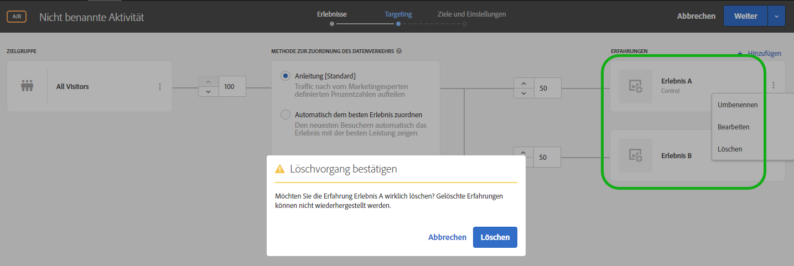 </p> <p>Siehe: </p> <p> 
     <ul id="ul_CB0C1146716F4C09BF924CF3DFA7DC1A"> 
      <li id="li_3767DD36F597481FB312CC577CD668F0"> <p>A/B-Aktivität:  <a href="../c-activities/t-test-ab/t-test-create-ab/ab-add-experience.md#task_454646F2895242D3B92DC395A0CE1A00" format="dita" scope="local"> Erlebnis hinzufügen </a> </p> </li> 
      <li id="li_E2990CA178C6446BA7206643A3164FEF"> <p>XT-Aktivität: <a href="../c-activities/t-experience-target/t-xt-create/xt-add-experience.md#task_454646F2895242D3B92DC395A0CE1A00" format="dita" scope="local">Erlebnis erstellen </a> </p> </li> 
     </ul> </p> <p>(TGT-30229) </p> </td> 
  </tr> 
  <tr> 
   <td colname="col1"> <p>Zielgruppen </p> </td> 
   <td colname="col2"> <p>Vergleichen Sie ein Profilattribut mit einem anderen statt mit einem statischen Wert. </p> <p>Siehe  <a href="../c-target/c-audiences/creating-a-profile-attribute-comparison-audience.md#concept_4C2124B79A5B4556A6C1D10C0F5E40A0" format="dita" scope="local"> Erstellen einer Zielgruppe zum Profilattributvergleich </a>. </p> <p> (TGT-28406) </p> </td> 
  </tr> 
  <tr> 
   <td colname="col1"> <p>Benutzerspezifischer Code </p> </td> 
   <td colname="col2"> <p>„Benutzerspezifischer Code“ ist jetzt über den Bereich „Änderungen hinzufügen“ statt über eine separate Registerkarte verfügbar. Sie können auch mehr als einen benutzerspezifischen Code hinzufügen und optional jeden Code individuell benennen. (TGT-28504) </p> <p>Siehe <a href="../c-experiences/c-visual-experience-composer/c-vec-code-editor/vec-code-editor.md#concept_B3A6E9EE3A60406DB640E205EA1745B5" format="dita" scope="local">Änderungen </a>. </p> </td> 
  </tr> 
  <tr> 
   <td colname="col1" class="premium"> <p>Recommendations </p> </td> 
   <td colname="col2"> <p> 
     <ul id="ul_371C18DFC6D24E94B3D4FFFD83FC8D3A"> 
      <li id="li_9D11939014E7479AB7FD8910852A5386"> <p>Zeigen Sie eine Liste der Aktivitäten an, die ein bestimmtes Kriterium auf der Karte „Kriterien“ referenzieren. Die Karte führt aktive und inaktive Aktivitäten auf. (TGT-27672) </p> </li> 
      <li id="li_B97BF9305EB04F6D8B1F6178B2E0CB34"> <p>Über das Aktivitätsdiagramm zeigen die Kriterienkarten es jetzt an, wenn die Ergebnisse zur Anzeige bereit sind. (TGT-27673) </p> <p>Weitere Informationen finden Sie im Abschnitt <a href="../c-recommendations/c-algorithms/algorithms.md" format="dita" scope="local">Kriterien </a>. </p> </li> 
     </ul> </p> </td> 
  </tr> 
  <tr> 
   <td colname="col1"> <p>Erlebnisvorlagen </p> </td> 
   <td colname="col2"> <p>Adobe Target-Erlebnisvorlagen sind vorkonfigurierte Codebeispiele für Angebote mit konfigurierbaren Eingaben, die in Target für verschiedene Marketing-Anwendungsfälle eingesetzt werden können. Diese Erlebnisvorlagen stehen Entwicklern und Marketing-Experten kostenlos zur Verfügung und bilden die Basis für beliebte externe Anwendungsfälle in Adobe Target – entweder über den Visual Experience Composer oder über den formularbasierten Experience Composer. Möglicherweise ist für die erfolgreiche Integration in Ihre Website- oder Plattformarchitektur eine Anpassung erforderlich. </p> <p>Siehe  <a href="../c-experiences/c-visual-experience-composer/c-vec-code-editor/experience-templates.md#concept_109BBD7EABC04DD39E6B7B1687786652" format="dita" scope="local"> Erlebnisvorlagen </a>. </p> </td> 
  </tr> 
  <tr> 
   <td colname="col1"> <p>Webinar-Reihe zu Target-Grundlagen </p> </td> 
   <td colname="col2"> <p>Nehmen Sie an der neuen <a href="../cmp-resources-and-contact-information.md#concept_11902FAC95C64479AABE020557A7EEE4" format="dita" scope="local">Webinar-Serie Target-Grundlagen</a> teil, einer Webinar-Serie über Kundenerfolg aus der Community. </p> </td> 
  </tr> 
 </tbody> 
</table>

**Erweiterungen, Korrekturen und Änderungen**

Diese Version von [!DNL Target] enthält folgende Verbesserungen, Fehlerbehebungen und Änderungen:

* Die Größe des Rich-Text-Editor-Fensters wurde zwecks Usability vergrößert. (TGT-24775)
* Die Diagramme im Target-Schritt (Schritt 2 des Drei-Schritte-Workflows) für AP-(Automated Personalization-) und MVT-(Multivariater Test-)Aktivitäten wurde umgestaltet, damit sie mehr den Designs für A/B-, XT-(Erlebnis-Targeting-) und Recommendations-Aktivitäten entsprechen. (TGT-30712)
* Der Metrikwert für den MVT-Bericht „Location Contribution“ ist jetzt konsistenter zu den Werten anderer Metriken, die auf zwei Kommastellen gerundet werden. (TGT-30921)

### at.js-Version 1.5.0 (22. Juni 2018) {#section_53C622F4978F4BC9ACD932D4B7194C12}

<table id="table_B332A93D4A6E4568BA3F7FA8EC0787F4"> 
 <thead> 
  <tr> 
   <th colname="col1" class="entry"> Funktion  / Verbesserung </th> 
   <th colname="col2" class="entry"> Beschreibung </th> 
  </tr> 
 </thead>
 <tbody> 
  <tr> 
   <td colname="col1"> <p>at.js </p> </td> 
   <td colname="col2"> <p>at.js Version 1.5.0 ist verfügbar. </p> <p> <p>Hinweis: Die Ausgabenummern in Klammern sind für den internen Gebrauch von Adobe bestimmt. </p> </p> <p> 
     <ul id="ul_41FE0EED2D8B4ADE84FC4CA0FA0CE8A0"> 
      <li id="li_2DC17381CB7949AFA35B054B9CA723FA"> <p>Die Details des Ereignisses <span class="codeph">at-request-succeeded</span> enthalten das Umleitungs-Flag. Mit diesem Flag lässt sich bestimmen, ob die Seite an eine andere URL umgeleitet wird. Die URL können Sie über <span class="codeph">at-content-rendering-redirect</span> ermitteln. (TNT-29834) </p> </li> 
      <li id="li_2852878862724BB2BD475C8FC7BF20DA"> <p>Es wurde ein Problem behoben, bei dem <span class="codeph">window.targetGlobalSettings.enabled</span> mit einem Laufzeitfehler fehlschlug, wenn es auf „false“ festgelegt war. (TNT-29829) </p> </li> 
      <li id="li_96E5E409B36444F1B0E3E2606DC03996"> <p>Es wurde ein Problem behoben, bei dem das Laden einer Seite im Visual Experience Composer (VEC) fehlschlug, wenn benutzerspezifischer Code verwendet wurde, um eine globale Mbox-Anfrage auszulösen, und der Body verborgen wurde. (TNT-29795) </p> </li> 
      <li id="li_818AA4EDDAC04D8B9BB4BA708D6BEF99"> <p>Es wurde Unterstützung für <span class="codeph">screenOrientation</span>, <span class="codeph">devicePixelRatio</span> und <span class="codeph">webGLRenderer</span> hinzugefügt. Diese neuen Parameter für Target-Anfragen werden verwendet, um das iPhone X und andere moderne Geräte zu erkennen. Weitere Informationen finden Sie unter <a href="../c-target/c-audiences/c-target-rules/mobile.md#concept_2A794199DC1A4D349FFFBC7DCF1FEB89" format="dita" scope="local">Mobilgeräte</a>. (TNT-29781) </p> </li> 
      <li id="li_87E3FB8B423C472AB1EE0DF2D7C64885"> <p>Es wurde ein Problem behoben, bei dem der Hinweis zum AAM-Standort (Adobe Audience Manager) nicht immer gesendet wurde. (TNT-29695) </p> </li> 
      <li id="li_E9E5A5035AC24F54ADEF5447E3F15D3B"> <p>Bei Browsern, die diese Funktion unterstützen, wechselt at.js 1.5.0 für den Selektorabruf zu MutationObserver. Versionen vor at.js 1.0.0 nutzten einen MutationObserver-Polyfill, der sich als problematisch erwies. Um die Polyfill-Probleme zu vermeiden, verwendet Version 1.5.0 folgenden Pseudocode, um zu entscheiden, welcher Planungsmechanismus verwendet wird: </p> <p> 
        <code>
          if MutationObserver is supported scheduler = MutationObserver else if document is visible scheduler = requestAnimationFrame else scheduler = setTimeout 
        </code> </p> </li> 
     </ul> </p> </td> 
  </tr> 
 </tbody> 
</table>

### Target Standard/Premium 18.6.1 (20. Juni 2018) {#section_B63C660815B245DA9922BE33E03734A1}

Dieses Release umfasst die folgenden Funktionen und Erweiterungen:

>[!NOTE]
>
>Die Ausgabennummern in Klammern dienen internen Adobe-Benutzern.

<table id="table_5A60FFE5E86148F4BDC6A7031D03D6BA"> 
 <thead> 
  <tr> 
   <th colname="col1" class="entry"> Funktion  / Verbesserung </th> 
   <th colname="col2" class="entry"> Beschreibung </th> 
  </tr> 
 </thead>
 <tbody> 
  <tr> 
   <td colname="col1"> <p>Visual Experience Composer (VEC) </p> </td> 
   <td colname="col2"> <p>Wenn Sie im Bereich „Änderungen“ auf eine Aktion klicken, scrollt der VEC automatisch zur passenden Position auf der Webseite und hebt das entsprechende Element hervor. Sie müssen also nicht länger manuell scrollen, um HTML-Elemente zu finden, die von der Änderung betroffen sind. </p> <p> 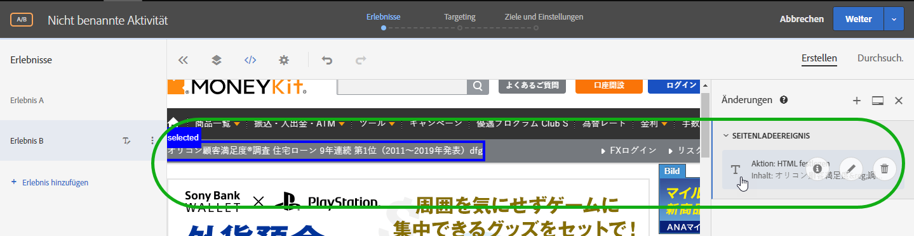 </p> <p>(TGT-30441) </p> </td> 
  </tr> 
  <tr> 
   <td colname="col1"> <p>Unterstützte Browser </p> </td> 
   <td colname="col2"> <p>Microsoft Edge-Unterstützung für Target-Benutzeroberfläche und Inhaltsbereitstellung hinzugefügt. </p> <p>Weitere Informationen finden Sie unter <a href="../c-implementing-target/c-considerations-before-you-implement-target/supported-browsers.md#reference_01B4BF99E7D545A7998773202A2F6100" format="dita" scope="local"> Unterstützte Browser </a> (TGT -14102) </p> </td> 
  </tr> 
  <tr> 
   <td colname="col1" class="premium"> <p>Recommendations </p> </td> 
   <td colname="col2"> <p>Das Kriterium „Kürzlich angezeigte Elemente“ liefert jetzt Ergebnisse speziell für die jeweilige <a href="../administrating-target/hosts.md#concept_516BB01EBFBD4449AB03940D31AEB66E" format="dita" scope="local">Umgebung </a>. Wenn zwei Sites zu unterschiedlichen Umgebungen gehören und ein Besucher zwischen den beiden Sites wechselt, zeigt jede Site nur die jeweiligen Elemente der entsprechenden Umgebung an. Wenn zwei Sites in derselben Umgebung enthalten sind und ein Besucher zwischen ihnen wechselt, erhält er die kürzlich angezeigten Elemente für beide Sites. </p></td> 
  </tr> 
 </tbody> 
</table>

**Erweiterungen, Korrekturen und Änderungen**

Diese Version von [!DNL Target] enthält folgende Verbesserungen, Fehlerbehebungen und Änderungen:

* Die Zeile „Backup“ des Recommendations-CSV-Downloads weist jetzt vorne doppelte gerade Anführungszeichen und ein Sternchen („*“) anstelle eines einfachen Sternchens (*) auf.
* Das Komma vorne in der Zeile „Top-Verkäufe“ und „Am häufigsten angezeigt“ im Recommendations-CSV-Download wurde entfernt.

### Änderungen an der Target-Plattform (19. Juni 2018)  {#section_0638BD69F3C640479A2A258AD78C0884}

Diese Version umfasst die folgende Verbesserung:

>[!NOTE]
>
>Die Ausgabennummern in Klammern dienen internen Adobe-Benutzern.

* Die Geräteliste wurde um die neuesten Telefonmodelle erweitert. Es wurde die Möglichkeit hinzugefügt, mithilfe von Gerätemarketingbezeichnung oder Gerätemodell gezielte Inhalte für bestimmte iPhone-Modelle bereitzustellen.

   Bei Kunden, die das Mobile SDK verwenden, ist keine Aktion erforderlich, um diese Funktion zu nutzen. Kunden, die at.js verwenden, müssen ein Upgrade auf at.js-Version 1.5.0 durchführen.

   Weitere Informationen finden Sie unter [Mobilgeräte](../c-target/c-audiences/c-target-rules/mobile.md#concept_2A794199DC1A4D349FFFBC7DCF1FEB89). (TNT-26714 &amp; TNT-28288)

### Target-Download-API (5. Juni 2018)  {#section_B8729DA10F18433C8D8E01B04F308ED2}

Sie können die Recommendations-Download-API zum Herunterladen Ihrer Empfehlungen in eine CSV-Datei verwenden, die Sie in einem Tabellenkalkulationsprogramm oder einem Texteditor anzeigen können. Um die Sicherheit zu erhöhen, blockiert Target ab **5. Juni 2018** alle HTTP-Anfragen und lässt nur noch HTTPS-Anfragen zu.

### Target Standard/Premium 18.5.1 (22. Mai 2018)  {#section_7C1427793C2A48DBAC39F8290717DC5B}

Dieses Release umfasst die folgenden Funktionen und Erweiterungen:

>[!NOTE]
>
>Die Ausgabennummern in Klammern dienen internen Adobe-Benutzern.

<table id="table_1C51F61184684072BC69AD15BA68BEBB"> 
 <thead> 
  <tr> 
   <th colname="col1" class="entry"> Funktion </th> 
   <th colname="col2" class="entry"> Beschreibung </th> 
  </tr> 
 </thead>
 <tbody> 
  <tr> 
   <td colname="col1"> <p>Berichte </p> </td> 
   <td colname="col2"> <p> 
     <ul id="ul_8D08FE4AC7D748EFB2BBFF87DBDC5CE5"> 
      <li id="li_B8929C19276D42168A28A3775CDEDFB3"> <p>Sie können bis zu zehn verschiedene Voreinstellungen für die Berichte der einzelnen Aktivitäten speichern, nachdem Sie sie wie gewünscht konfiguriert haben (Metriken, Zielgruppen, erweiterte Einstellungen usw.). Alle Target-Benutzer können die verschiedenen Voreinstellungen anzeigen, bearbeiten und löschen – unabhängig vom Ersteller. (TGT-21268) </p> </li> 
      <li id="li_7ADA62F2ACA049C9B4A8986B09A9F4AA"> <p>Sie können einzelne Aktivitätsberichte nach Bedarf konfigurieren und als Standardeinstellung oder Favoriten speichern. So wird jedes Mal, wenn Sie den Bericht der entsprechenden Aktivität öffnen, diese Ansicht angezeigt. (TGT-10082) </p> </li> 
      <li id="li_DC63C04F3A884BDDA55B5515E4643B7B"> <p>Warnhinweise und Meldungen weisen Sie darauf hin, wenn eine Zielgruppe, eine Metrik, eine Hostgruppe oder ein Erlebnis aus einem zuvor konfigurierten Voreinstellungsbericht gelöscht wurde. Die Hinweise oder Meldungen enthalten Anweisungen zur Auswahl einer anderen Zielgruppe, Metrik oder Hostgruppe oder eines anderen Erlebnisses, um das Problem zu beheben. (TGT-29424) </p> </li> 
     </ul> </p> <p>Weitere Informationen finden Sie im Abschnitt „Zielvorgabe“ in  <a href="../c-reports/c-report-settings/report-settings.md#concept_3A80D5A394EC4B639DC715E06085BDB0" format="dita" scope="local"> Berichteinstellungen </a> </p> </td> 
  </tr> 
  <tr> 
   <td colname="col1"> <p>Profilskripte </p> </td> 
   <td colname="col2"> <p> 
     <ul id="ul_F382C8E7708846A08676E1534BC92878"> 
      <li id="li_70E89504525C4119B588C230DCE772E8"> <p>Sie können Popupkarten mit Profilskriptinformationen (ähnlich den Karten mit Angebotsinformationen) anzeigen. Auf diesen Karten mit Profilskriptinformationen können Sie die Liste der Aktivitäten, die auf das ausgewählte Profilskript verweisen, sowie weitere nützliche Metadaten anzeigen. (TGT-28253) </p> <p>Weitere Informationen finden Sie im Abschnitt „Anzeigen der Karten mit Profilskriptinformationen“ in  <a href="../c-target/c-visitor-profile/profile-parameters.md#concept_8C07AEAB0A144FECA8B4FEB091AED4D2" format="dita" scope="local"> Profilskriptattribute </a>. </p> </li> 
     </ul> </p> </td> 
  </tr> 
  <tr> 
   <td colname="col1"> <p>Zielgruppen </p> </td> 
   <td colname="col2"> <p> 
     <ul id="ul_DFEB778393024E3EBBC482F31A5B39BC"> 
      <li id="li_4049E334A38F4F94842FF1E35F177FE9"> <p>Die Erstellung benutzerspezifischer Zielgruppen ermöglicht jetzt die direkte Verwendung des Mbox-Parameters, ohne zwingend den Mbox-Namen festlegen zu müssen. Der Mbox-Name ist jetzt optional. Mit dieser Änderung können Sie Parameter aus mehreren Mboxes verwenden oder auf einen Parameter verweisen, der noch nicht am Rand aufgezeichnet wurde. Alternativ können Sie mit dem Mbox-Namensfilter auch nach Mbox-Parameter filtern. </p> <p>Diese Verbesserung wurde auch in Recommendations-Kriterien und -Promotions sowie in Vorlagentestregeln umgesetzt. </p> </li> 
     </ul> </p> <p>Weitere Informationen finden Sie unter  <a href="../c-target/c-audiences/c-target-rules/custom-parameters.md#concept_C4C6E00D7C5A4BE9B72D471DB2E3027B" format="dita" scope="local"> Benutzerdefinierte Parameter </a>. </p> </td> 
  </tr> 
  <tr> 
   <td colname="col1" class="premium"> <p>Recommendations </p> </td> 
   <td colname="col2"> <p> 
     <ul id="ul_7765B69E679D4C94B1E863E340DFDE15"> 
      <li id="li_F2AF7E1AFBD6461990EF1D83D1989582"> <p>Bei der Auswahl der Recommendations-Kriterien im formularbasierten Experience Composer gibt es jetzt einen direkten Link zur ausgewählten Kriterienkarte, damit Sie die Kriterien schnell und einfach bearbeiten können. (TGT-28483) </p> <p>Weitere Informationen finden Sie unter <a href="../c-experiences/form-experience-composer.md#task_FAC842A6535045B68B4C1AD3E657E56E" format="dita" scope="local">Form-Based Experience Composer</a>. </p> </li> 
      <li id="li_517F0A174587416B8621D6F710C1AC48"> <p>Die Erstellung von Recommendations-Kriterien, -Promotions und Vorlagentestregeln ermöglicht jetzt die direkte Verwendung des Mbox-Parameters, ohne zwingend den Mbox-Namen festlegen zu müssen. Der Mbox-Name ist jetzt optional. Mit dieser Änderung können Sie Parameter aus mehreren Mboxes verwenden oder auf einen Parameter verweisen, der noch nicht am Rand aufgezeichnet wurde. Alternativ können Sie mit dem Mbox-Namensfilter auch nach Mbox-Parameter filtern. </p> <p>Diese Verbesserung wurde auch in der Erstellung benutzerspezifischer Zielgruppen umgesetzt. </p> <p>Weitere Informationen finden Sie unter     <a href="../c-recommendations/c-recommendations-faq/recommendations-faq.md#concept_EF272DE4AC6C47B19026BFBE816F5DB8" format="dita" scope="local"> Recommendations-FAQs </a>. </p> </li> 
      <li id="li_AAB242830D1E47B78E58A980B717C736"> <p>Die UI wurde für die Recommendations-Design-Karten geändert. </p> </li> 
      <li id="li_1BE3178663E54F4CA8714FE3ACDBB97B"> <p>Die Dokumentation zur Target Recommendations-API finden Sie auf der <a href="https://www.adobe.io/apis/experiencecloud/target/docs/getting-started.html" format="html" scope="external">Adobe I/0-Website zu Adobe Target</a> (https://www.adobe.io/apis/experiencecloud/target/docs/getting-started.html). </p> </li> 
     </ul> </p> </td> 
  </tr> 
 </tbody> 
</table>

**Erweiterungen, Korrekturen und Änderungen**

Diese Version von [!DNL Target] enthält folgende Verbesserungen, Fehlerbehebungen und Änderungen:

* Die UI wurde für Schritt 2 des Target-Drei-Schritte-Workflows zur Erstellung oder Bearbeitung von A/B-Test-, Erlebnis-Targeting-(XT-) oder Recommendations-Aktivitäten angepasst. (TGT-18911)

### Target Standard/Premium 18.4.1 (25. April 2018) {#section_445DBC5402BA456BAF2D24AEA33A91C9}

Dieses Release umfasst die folgenden Funktionen und Erweiterungen:

>[!NOTE]
>
>Die Ausgabennummern in Klammern dienen internen Adobe-Benutzern.

<table id="table_6D99C48B72D24728BF623608053931D3"> 
 <thead> 
  <tr> 
   <th colname="col1" class="entry"> Funktion </th> 
   <th colname="col2" class="entry"> Beschreibung </th> 
  </tr> 
 </thead>
 <tbody> 
  <tr> 
   <td colname="col1"> <p>Adobe Experience Manager (AEM)-Erlebnisfragmente </p> </td> 
   <td colname="col2"> <p>Mithilfe von in AEM in Target-Aktivitäten erstellten Erlebnisfragmenten können Sie die Benutzerfreundlichkeit und Leistungsfähigkeit von AEM mit den leistungsstarken Funktionen der automatisierten Intelligenz (AI) und des maschinellen Lernens (ML) in Target kombinieren, um Erlebnisse bedarfsgerecht zu testen und zu personalisieren.&amp;nbsp;&amp;nbsp; </p> <p>AEM kombiniert all Ihre Inhalte und Assets an einer zentralen Stelle, um Ihre Personalisierungsstrategie zu begünstigen. Mit AEM können Sie an einer Stelle problemlos Inhalte für Desktops, Tablets und mobile Geräte erstellen, ohne Code zu schreiben. Es müssen keine Seiten für jedes Gerät erstellt werden - AEM passt die einzelnen Erlebnisse automatisch mit Ihren Inhalten an. </p> <p> Mit Target können Sie personalisierte Erlebnisse bedarfsgerecht bereitstellen. Dies erfolgt auf der Grundlage einer Kombination aus regelbasierten und AI-gestützten Ansätzen des maschinellen Lernens, zu denen Verhaltens-, Kontext- und Offline-Variablen zählen.Mit Target können Sie mühelos A/B- und Multivarianz-Aktivitäten einrichten und ausführen, um die besten Angebote, Inhalte und Erlebnisse zu ermitteln. </p> <p>Erlebnisfragmente sind ein großer Schritt in Richtung der Verknüpfung zwischen den Erstellern von Inhalten/Erlebnissen und Managern mit den Optimierungs- und Personalisierungsexperten, die Geschäftsergebnisse mit Target optimieren. </p> <p>Weitere Informationen finden Sie unter <a href="../c-experiences/c-manage-content/aem-experience-fragments.md#topic_1E1E4EA01F074349B2CF8785387B5FE8" format="dita" scope="local">AEM-Erlebnisfragmente</a>. </p> </td> 
  </tr> 
  <tr> 
   <td colname="col1"> <p>Berichte </p> </td> 
   <td colname="col2"> 
    <ul id="ul_EAB90C510EA04D6A8AEFF23A77DB2337"> 
     <li id="li_47DA6EB92CC84FFDBFDC9CC9386AF654"> <p>Sie können nun einen Bericht aktualisieren, um ein Update der Tabellen- und Diagrammansicht des Berichts zu erhalten, ohne dass die gesamte Seite, die Konfiguration oder der Datumsbereich aktualisiert werden muss. (TGT-28125) </p> <p>Weitere Informationen finden Sie unter <a href="../c-reports/c-report-settings/report-settings.md#concept_3A80D5A394EC4B639DC715E06085BDB0" format="dita" scope="local">Berichtseinstellungen</a>. </p> </li> 
     <li id="li_AB2DE7A45D914FD7AEB0832187AF3844"> <p>Der Kalender in den Berichten enthält nun vordefinierte Datumsbereiche wie z. B. „Letzte 7 Tage“, „Letzte 15 Tage“ usw. (TGT-29171) </p> <p>Weitere Informationen finden Sie unter <a href="../c-reports/c-report-settings/report-settings.md#concept_3A80D5A394EC4B639DC715E06085BDB0" format="dita" scope="local">Berichtseinstellungen</a>. </p> </li> 
     <li id="li_46DF9037E0ED4935B3BCDB35E8BED065"> <p>Die Spaltenbreite der Tabellenansicht wurde geändert, um horizontales Scrollen zu reduzieren, wenn mehrere Metriken angewendet werden. (TGT-26575) </p> </li> 
    </ul> </td> 
  </tr> 
  <tr> 
   <td colname="col1"> <p>Lokalisierung der Benutzeroberfläche </p> </td> 
   <td colname="col2"> <p>Die Benutzeroberfläche von Target ist nun in den folgenden Sprachen verfügbar: </p> <p> 
     <ul id="ul_DB6C771FCFDF43F498F8754920A70BCD"> 
      <li id="li_A65D07DF66844AC8BEEC1D413F214191"> <p>Vereinfachtes Chinesisch </p> </li> 
      <li id="li_5986DD06AF5B4F76B3A02CFBF2DC3644"> <p>Traditionelles Chinesisch </p> </li> 
      <li id="li_341FDC1CEC2B4C4BBD45CB2A0A54F2A3"> <p>Koreanisch </p> </li> 
      <li id="li_A4C31539B98E42348D5F1A18C63EAB6C"> <p>Italienisch </p> </li> 
      <li id="li_97E3E0A916B64601BBF601AAED581174"> <p>Portugiesisch </p> </li> 
     </ul> </p></td> 
  </tr> 
  <tr> 
   <td colname="col1"> <p>Zielgruppen </p> </td> 
   <td colname="col2"> <p>Wenn Sie eine benutzerdefinierte Zielgruppe basierend auf einem mbox-Parameter erstellen, erhalten Sie von <span class="codeph">mboxParameter</span> keine Aufforderung mehr, <span class="codeph">mboxName</span> einzugeben. Der Mbox-Name ist nun optional. Mit dieser Änderung können Sie Parameter aus mehreren Mboxes verwenden oder auf einen Parameter verweisen, der noch nicht am Rand aufgezeichnet wurde. (TGT-25807) </p> <p> <p>Hinweis: Diese Funktion ist in der Target-UI sichtbar, zurzeit jedoch deaktiviert. Diese Funktion wird in Kürze aktiviert (Datum wird mitgeteilt). </p> </p> 
  </td> 
  </tr> 
 </tbody> 
</table>

**Erweiterungen, Korrekturen und Änderungen**

Diese Version von [!DNL Target] enthält folgende Verbesserungen, Fehlerbehebungen und Änderungen:

* Transport Layer Security (TLS) ist das am weitesten verbreitete Sicherheitsprotokoll, das aktuell in Webbrowsern und anderen Anwendungen Verwendung findet, bei denen über ein Netzwerk übertragene Daten geschützt werden müssen. Um die Sicherheitsstandards von Adobe einzuhalten, muss die Unterstützung für ältere Protokolle beendet und durch TLS 1.2 als obligatorisches Sicherheitsprotokoll ersetzt werden, damit die Daten durch die neueste und sicherste Version des Protokolls geschützt sind. Ab der Version Target 18.4.1 (veröffentlicht am 25. April 2018) leitet Adobe Target Schritte ein mit dem Ziel, zur Verschlüsselung mit TLS 1.2 überzugehen und die Unterstützung für die Verschlüsselung mit TLS 1.0 bis zum 12. September 2018 einzustellen. Für einen reibungslosen Übergang sollten Sie die Details zu diesem Thema genau durchlesen und die Änderungen entsprechend planen. Weitere Informationen finden Sie unter [TLS (Transport Layer Security)-Verschlüsselungsänderungen](../c-implementing-target/c-considerations-before-you-implement-target/tls-transport-layer-security-encryption.md#concept_CC1001E9D3AE4BABAF90B8311B0A6451).
* Die UI für Recommendations-Kriterienkarten wurde zur Erhöhung der Benutzerfreundlichkeit verbessert. (TGT-27829)

### at.js (3. April 2018) {#section_932DF1004F4648668FE4984BFAF2EC49}

Dieses Release umfasst die folgenden Funktionen und Erweiterungen:

<table id="table_76576D9D931B4DA99900F2C03175938E"> 
 <thead> 
  <tr> 
   <th colname="col1" class="entry"> Funktion </th> 
   <th colname="col2" class="entry"> Beschreibung </th> 
  </tr> 
 </thead>
 <tbody> 
  <tr> 
   <td colname="col1"> <p>at.js </p> </td> 
   <td colname="col2"> <p>at.js Version 1.3.0 ist verfügbar. Weitere Informationen finden Sie unter <a href="../c-implementing-target/c-implementing-target-for-client-side-web/how-to-deployatjs/implementing-target-without-a-tag-manager.md#concept_1E1F958F9CCC4E35AD97581EFAF659E2" format="dita" scope="local">at.js herunterladen</a> und <a href="../c-implementing-target/c-implementing-target-for-client-side-web/target-atjs-versions.md#reference_DBB5EDB79EC44E558F9E08D4774A0F7A" format="dita" scope="local">at.js-Versionsdetails</a>. </p> <p> 
     <ul id="ul_349BEB37B6C94FF0801F121042037803"> 
      <li id="li_4C2F82F4DD394ED5A0BFF978B15FEDDF"> <p>Die folgenden neuen Ereignisse stehen für die Ablaufverfolgungs-, Debugging- und Anpassungsinteraktionen mit at.js zur Verfügung: </p> <p> 
        <ul id="ul_EFF7E2FCEA0D42298779DDE13B54503F"> 
         <li id="li_6A2B06A522004EDE96D9A552571A7C30"> <p>LIBRARY_LOADED </p> </li> 
         <li id="li_61AA203A21DF4B7EAE075374A09C8FF0"> <p>REQUEST_START </p> </li> 
         <li id="li_DAF9CC1E86834C62B93419429B43A2CB"> <p>CONTENT_RENDERING_START </p> </li> 
         <li id="li_A52DC337115248A1BE5AF5B358BE5A9A"> <p>CONTENT_RENDERING_NO_OFFERS </p> </li> 
         <li id="li_7D71E48016B1446995493EBBF7D32447"> <p>CONTENT_RENDERING_REDIRECT </p> </li> 
        </ul> </p> <p>Weitere Informationen finden Sie unter <a href="../c-implementing-target/c-implementing-target-for-client-side-web/cmp-atjs-functions.md#reference_A828E4BA535F4E7692A075F3D70CF6CD" format="dita" scope="local">Benutzerspezifische at.js-Ereignisse</a>. </p> </li> 
      <li id="li_E2704294F8BA47FFAABE7572F67FB5C0"> <p>Sie können eine at.js-Anfrage um zusätzliche Parameter erweitern, die von Datenanbietern stammen. Datenanbieter sollten <span class="codeph">window.targetGlobalSettings</span> unter <span class="codeph">dataProviders key</span> hinzugefügt werden. </p> <p>Weitere Informationen finden Sie unter „Datenanbieter“ in <a href="../c-implementing-target/c-implementing-target-for-client-side-web/cmp-atjs-functions.md#concept_8DACBC47ABDE4279BB102B42609FE506" format="dita" scope="local">targetGlobalSettings() </a>. </p> </li> 
      <li id="li_02EAFE6DA0D44CF88980184FD14226A5"> <p>at.js-Anfragen verwenden nun GET. Sie wechseln jedoch zu POST, wenn die URL-Größe 2048 Zeichen überschreitet. Es gibt eine neue Eigenschaft mit dem Namen <span class="codeph">urlSizeLimit</span>, wo Sie die Größenbeschränkung bei Bedarf erhöhen können. Durch diese Änderung kann Target at.js an AppMeasurement ausrichten, das dieselbe Technik verwendet. </p> </li> 
      <li id="li_43363A4F3A764394AA88D2595F93D8C0"> <p>Target erzwingt nun, dass der <span class="codeph">mbox</span>-Schlüssel in der Funktion <span class="codeph">adobe.target.applyOffer(options)</span> verwendet wird. Dieser Schlüssel war früher erforderlich. Target erzwingt seine Verwendung jedoch nun, um sicherzustellen, dass Target ordnungsgemäß validiert ist und Kunden die Funktion richtig verwenden. </p> <p>Weitere Informationen finden Sie unter <a href="../c-implementing-target/c-implementing-target-for-client-side-web/cmp-atjs-functions.md#reference_BBE83F513B5B4E03BBC3F50D90864245" format="dita" scope="local">adobe.target.applyOffer(options) </a>. </p> </li> 
      <li id="li_7336D8D48A894291A378E0BB212B7F9B"> <p>at.js weist eine verbesserte Ereignis- und Klick-Tracking-Funktionalität auf. at.js verwendet <span class="codeph">navigator.sendBeacon()</span> zum Senden von Ereignis-Tracking-Daten und weicht zur synchronen XHR aus, wenn <span class="codeph">navigator.sendBeacon()</span> nicht unterstützt wird. Dies wirkt sich hauptsächlich auf Internet Explorer 10 und 11 und einige Safari-Versionen aus. Safari unterstützt <span class="codeph">navigator.sendBeacon()</span> ab der iOS 11.3-Version. </p> </li> 
      <li id="li_28D7324137B14C75BF6F1EA0B2487C9B"> <p>at.js kann Angebote nun sogar dann darstellen, wenn eine Seite auf Registerkarten im Hintergrund geöffnet wird. Einige Target-Kunden haben festgestellt, dass ein Problem besteht, wenn <span class="codeph">requestAnimationFrame()</span> deaktiviert war, was am Browserdrosselungsverhalten für Hintergrundregisterkarten lag. </p> </li> 
      <li id="li_3278979E1C6C41DEA7E8025AEB337985"> <p>Diese Version beinhaltet viele Leistungsverbesserungen, einschließlich kürzerer Callstacks, wenn ein Chrome-CPU-Profil untersucht wird. </p> </li> 
      <li id="li_AAA9C0DCC3354DFA8907968C8E6427F6"> <p>at.js 1.3.0 unterstützt die Bereitstellung von Inhalten in Microsoft Internet Explorer 9 nicht mehr. Eine Liste der unterstützten Browser finden Sie unter <a href="../c-implementing-target/c-considerations-before-you-implement-target/supported-browsers.md#reference_01B4BF99E7D545A7998773202A2F6100" format="dita" scope="local">Unterstützte Browser</a>. Von jetzt an werden alle Anfragen über <span class="codeph">XMLHttpRequest</span> mit CORS-Unterstützung ohne JSONP-Anfragen ausgeführt. Durch diese Änderung wird die Sicherheit erheblich verbessert. </p> </li> 
     </ul> </p> </td> 
  </tr> 
 </tbody> 
</table>

### Target Standard/Premium 18.3.1 (20. März 2018)  {#section_880706BE15544A03A2C951F267F4AEC5}

Dieses Release umfasst die folgenden Funktionen und Erweiterungen:

>[!NOTE]
>
>Die Ausgabennummern in Klammern dienen internen Adobe-Benutzern.

<table id="table_AE38682151A948AEA21E35A353F18D76"> 
 <thead> 
  <tr> 
   <th colname="col1" class="entry"> Funktion </th> 
   <th colname="col2" class="entry"> Beschreibung </th> 
  </tr> 
 </thead>
 <tbody> 
  <tr> 
   <td colname="col1" class="premium"> <p>Attribut für die Beliebtheit nach Entität </p> </td> 
   <td colname="col2"> <p><b>Neu: 22. März 2018</b> </p> <p>Sie können nun das Attribut für die Beliebtheit nach Entität im bestehenden Fluss auswählen, wenn ein benutzerspezifisches Attribut als Schlüssel ausgewählt ist. </p> <p>Nach der Auswahl des gewünschten Schlüssels (in diesem Fall ein benutzerspezifisches Profilattribut) können Sie für „Empfehlungslogik“ zwei neue Optionen auswählen: </p> <p> 
     <ul id="ul_7A6F2398ADE846EF8A7A3110C2736BF7"> 
      <li id="li_66BFF016564749B298B88F6B9638B64E"> <p>Am häufigsten angezeigt </p> </li> 
      <li id="li_937FE5C40ED8471391B282D1ACE8C133"> <p>Topverkäufe </p> </li> 
     </ul> </p></td> 
  </tr> 
  <tr> 
   <td colname="col1"> <p>Zielgruppen </p> </td> 
   <td colname="col2"> <p>Beim Anzeigen der Pop-up-Karte mit den Definitionen einer Zielgruppe (beispielsweise aus der Zielgruppenbibliothek) können Sie nun andere Aktivitäten sehen, die auf diese Zielgruppe verweisen, sofern verfügbar. So können Sie beim Bearbeiten von Zielgruppen nicht beabsichtigte Auswirkungen auf Aktivitäten verhindern. </p> <p>Wenn Sie zuvor versuchten, eine Zielgruppe zu löschen, auf die andere Aktivitäten verwiesen, wurde eine Warnung angezeigt, in der Sie informiert wurden, dass die Zielgruppe mit maximal 10 auf die Zielgruppe verweisenden Aktivitäten nicht gelöscht werden kann. </p> <p>Weitere Informationen finden Sie unter <a href="../c-target/c-audiences/audiences.md#concept_65BE870D290E412D8BBF557EEA67C271" format="dita" scope="local"> Info über Zielgruppen </a>. </p> </td> 
  </tr> 
  <tr> 
   <td colname="col1"> <p>Berichte </p> </td> 
   <td colname="col2"> <p>Die Informationen hinsichtlich der Steigerung und Steigerungsgrenzen wurden dahingehend verbessert, dass sie nun umfangreicher und nützlicher sind und eine QuickInfo enthalten, die erklärt, wie die Steigerungsgrenzen berechnet werden. (TGT-28729) </p> <p>Weitere Informationen finden Sie unter <a href="../c-reports/c-report-settings/average-lift-bounds-and-confidence-interval.md#topic_AFFDC672A8A34D028B100EF6BE5D8129" format="dita" scope="local">Durchschnittliche Steigerung, Steigerungsgrenzen und Konfidenzintervall </a>. </p> </td> 
  </tr> 
  <tr> 
   <td colname="col1" class="premium"> <p>Aktivitäten vom Typ „Automatisierte Personalisierung (AP)“ und „Automatisches Targeting“ </p> </td> 
   <td colname="col2"> <p>Es steht eine zusätzliche Anleitung auf der Benutzeroberfläche und in der Hilfe zur Verfügung, mit deren Hilfe Sie die Traffic-Prozentsätze in AP- (automatisierte Personalisierung) und AT-Aktivitäten (automatisches Targeting) effizienter zuordnen können. </p> <p>Weitere Informationen finden Sie unter <a href="../c-activities/auto-target-to-optimize.md#section_AB3656F71D2D4C67A55A24B38092958F" format="dita" scope="local">Bestimmen der Traffic-Zuordnung</a> und <a href="../c-activities/t-automated-personalization/create-ap-activity.md#task_8AAF837796D74CF893CA2F88BA1491C9" format="dita" scope="local">Erstellen einer Automatisierte Personalisierung-Aktivität</a>. </p> </td> 
  </tr> 
  <tr> 
   <td colname="col1" class="premium"> <p>Recommendations, Einschlussregeln, Sammlungen und Ausschlüsse für benutzerspezifische Kriterien </p> </td> 
   <td colname="col2"> <p>Zusätzlich zur Ausgabe Ihrer eigenen benutzerspezifischen Kriterien können Sie nun in Echtzeit filtern. So können Sie beispielsweise Ihre empfohlenen Elemente so begrenzen, dass nur die Favoritenkategorie oder -marke eines Besuchers angezeigt wird. Dadurch können Sie Offline-Berechnungen mit der Echtzeitfilterung kombinieren. </p> <p>Wenn benutzerdefinierten Kriterien Einschlussregeln hinzugefügt werden, wandelt dies auf der Grundlage eines Besuchers andernfalls statische Empfehlungen in dynamische Empfehlungen um. </p> <p> 
     <ul id="ul_BDD55AB34F4A43C691D2399C16AA3D6C"> 
      <li id="li_133C33E0D02E4861A4C855BD8A492E69"> <p>Benutzerdefinierte Kriterien können nun analog zu anderen Kriterien in Empfehlungen konfiguriert werden. </p> </li> 
      <li id="li_AC201F0917BF465C985E8947635F762E"> <p>Sie können Sammlungen, Ausschlüsse und Einschlüsse (einschließlich der speziellen Regeln für „Preis“ und „Bestand“) auf dieselbe Weise wie andere Kriterien verwenden. Sammlungen und Ausschlüsse wurden bereits unterstützt. Diese Version beinhaltet nun auch Einschlüsse. </p> </li> 
     </ul> </p> <p>Weitere Informationen finden Sie unter <a href="../c-recommendations/c-algorithms/algorithms.md" format="dita" scope="local"> Kriterien </a>. </p> <p>(TGT-28488) </p> </td> 
  </tr> 
  <tr> 
   <td colname="col1" class="premium"> <p>Recommendations, Einschlussregeln, Sammlungen und Ausschlüsse für kürzlich angesehene Kriterien </p> </td> 
   <td colname="col2"> <p>„Kürzlich angezeigte Elemente“ kann nun so gefiltert werden, dass nur Elemente mit einem bestimmten Attribut angezeigt werden. In einer multinationalen Firma mit mehreren Unternehmen zeigt beispielsweise möglicherweise ein Besucher Elemente über mehrere digitale Eigenschaften hinweg an. In diesem Fall können Sie die kürzlich angezeigten Elemente so begrenzen, dass nur die entsprechende Eigenschaft angezeigt wird, wo sie angezeigt wurden. Dadurch wird verhindert, dass kürzlich angezeigte Elemente für die Site einer anderen digitalen Eigenschaft angezeigt werden. </p> <p> 
     <ul id="ul_A2D260F01CA047EEA72EF56BD0EE88FA"> 
      <li id="li_DB107DD357B741CCB2B7A4FDAD16F9D6"> <p>Kürzlich angesehene Kriterien können nun analog zu anderen Kriterien in Empfehlungen konfiguriert werden. </p> </li> 
      <li id="li_85452C03F0924D4C8D854509F1293021"> <p>Sie können Sammlungen, Ausschlüsse und Einschlüsse (einschließlich der speziellen Regeln für „Preis“ und „Bestand“) auf dieselbe Weise wie andere Kriterien verwenden. Sammlungen und Ausschlüsse wurden bereits unterstützt. Diese Version beinhaltet nun auch Einschlüsse. </p> </li> 
     </ul> </p> <p>Weitere Informationen finden Sie unter <a href="../c-recommendations/c-algorithms/algorithms.md" format="dita" scope="local"> Kriterien </a>. </p> <p>(TGT-22843) </p> </td> 
  </tr> 
  <tr> 
   <td colname="col1"> <p>Target-Erweiterung für Adobe Launch </p> </td> 
   <td colname="col2"> <p>Launch ist die nächste Generation der Tag-Management-Funktionen von Adobe. Launch bietet Kunden eine einfache Möglichkeit, alle Analyse-, Marketing- und Werbe-Tags bereitzustellen und zu verwalten, die zur Unterstützung entsprechender Kundenerfahrungen erforderlich sind. </p> <p>Mit der Target-Erweiterung können Sie Target schnell und problemlos in Ihrer Umgebung implementieren. </p> <p>Weitere Informationen finden Sie unter <a href="../c-implementing-target/c-implementing-target-for-client-side-web/how-to-deployatjs/cmp-implementing-target-using-adobe-launch.md#topic_5234DDAEB0834333BD6BA1B05892FC25" format="dita" scope="local"> Implementieren von Target mit Adobe Launch </a>. </p> </td> 
  </tr> 
 </tbody> 
</table>

**Erweiterungen, Korrekturen und Änderungen**

Diese Version von [!DNL Target] enthält folgende Verbesserungen, Fehlerbehebungen und Änderungen:

* Beim Erstellen oder Bearbeiten von A/B- und Experience Targeting-Aktivitäten (XT) behält Target Informationen zum/zur letzten geöffneten Erlebnis, Seite oder Erlebnisversion (über die Funktion für mehrere Zielgruppen) bei und öffnet die entsprechende Seite, wenn Sie das nächste Mal die Target-Benutzeroberfläche öffnen. (TGT-28225)
* Es wurden Sicherheitskorrekturen zu Compliancezwecken vorgenommen.

### Target Standard/Premium 18.2.1 (15. Februar 2018) {#section_837CBBB7A89D45D99855A8C5F5E7BFFB}

Dieses Release umfasst die folgenden Funktionen und Erweiterungen:

<table id="table_1C7A462AE8D4492FA5555F060031F665"> 
 <thead> 
  <tr> 
   <th colname="col1" class="entry"> Funktion </th> 
   <th colname="col2" class="entry"> Beschreibung </th> 
  </tr> 
 </thead>
 <tbody> 
  <tr> 
   <td colname="col1"> <p>Die Adobe Marketing Cloud wurde mit einem neuen Branding versehen und heißt nun Adobe Experience Cloud. </p> </td> 
   <td colname="col2"> <p>Bei der Experience Cloud handelt es sich um die integrierte Adobe-Lösungs- und -Dienstfamilie für digitales Marketing. Außerdem handelt es sich hierbei um eine intuitive Schnittstelle, mit deren Hilfe Sie schnell auf Ihre Cloud-Lösungen und Hauptdienste zugreifen können. </p> <p>Neues Branding und Änderungen an der Benutzeroberfläche: Die Adobe Marketing Cloud wurde mit einem neuen Branding versehen und heißt nun Adobe Experience Cloud. Zusätzlich werden Sie Benutzeroberflächenänderungen auf der Target-Oberfläche und im Solution Switcher feststellen. </p> <p>Weitere Informationen über diese Änderung finden Sie unter <a href="https://docs.adobe.com/content/help/en/core-services/interface/about-core-services/solutions-core-services.html" format="html" scope="external">Über die neuen Cloud-Namen der Experience Cloud </a>. </p> </td> 
  </tr> 
 </tbody> 
</table>

**Erweiterungen, Korrekturen und Änderungen**

Diese Version von [!DNL Target] enthält einige Backend-Verbesserungen, -Fehlerbehebungen und -Änderungen.

### Target-Plattform (18. Januar 2018) {#section_F6A0DC31636D403F92BDB9DCE7A3F6ED}

Dieses Release umfasst die folgenden Funktionen und Erweiterungen:

<table id="table_0F5BF9370E214302BDFE0AC2D66EC773"> 
 <thead> 
  <tr> 
   <th colname="col1" class="entry"> Funktion </th> 
   <th colname="col2" class="entry"> Beschreibung </th> 
  </tr> 
 </thead>
 <tbody> 
  <tr> 
   <td colname="col1"> <p>at.js </p> </td> 
   <td colname="col2"> <p>at.js 1.2.3 fügt Unterstützung für JSON-Angebote hinzu. JSON-Angebote werden nur bei Aktivitäten unterstützt, die mit dem formularbasierten Experience Composer erstellt wurden. Die einzige Möglichkeit, JSON-Angebote zu nutzen, läuft derzeit über direkte API-Aufrufe. Siehe <a href="../c-experiences/c-manage-content/create-json-offer.md#concept_63C7BEE1F0DB4A7596D997219B7C136D" format="dita" scope="local">JSON-Angebot erstellen</a>. </p> </td> 
  </tr> 
  <tr> 
   <td colname="col1"> <p>Weitere Änderungen </p> </td> 
   <td colname="col2"> <p>Ausschlussregeln, Kataloge, Algorithmuseinschlussregeln und Laufzeitfilterung werden jetzt bei der Groß- und Kleinschreibung berücksichtigt. </p> </td> 
  </tr> 
 </tbody> 
</table>

### Target Standard/Premium 18.1.1 (23. Januar 2018)  {#section_3A2216543B064D6F82EC03E1F8AEC74D}

Dieses Release umfasst die folgenden Funktionen und Erweiterungen:

>[!NOTE]
>
>Die Ausgabennummern in Klammern dienen internen Adobe-Benutzern.

<table id="table_872FE2BE61CC4A5CA369D9A6C730686E"> 
 <thead> 
  <tr> 
   <th colname="col1" class="entry"> Funktion </th> 
   <th colname="col2" class="entry"> Beschreibung </th> 
  </tr> 
 </thead>
 <tbody> 
  <tr> 
   <td colname="col1"> <p>Zielgruppen </p> </td> 
   <td colname="col2"> <p> 
     <ul id="ul_42D7C86043C94A7BBA5ED405B2902E3A"> 
      <li id="li_50F2A7D05AB244E18D263A476BD906B3"> <p>Sie können nun Zeitrahmenzielgruppen ohne Start- oder Enddatum erstellen. Auf diese Weise können Sie dieselbe Zielgruppe in mehreren Aktivitäten verwenden, ohne eine Kopie der Zielgruppe zu erstellen, und gleichzeitig das Start- und Enddatum auf Aktivitätsebene steuern. Siehe <a href="../c-target/c-audiences/c-target-rules/time-frame.md#concept_0FE1E8DACD104F8B870B0BADE3197F0A" format="dita" scope="local">Zeitrahmen </a>. (TGT-25975) </p> </li> 
      <li id="li_6F08D63BC4F040859D51C47C3521C5E1"> <p>Die Kopier- und Bearbeitungsfunktionalität steht nur für aktive Zielgruppen zur Verfügung, wenn Sie mit der Maus über eine Zielgruppe auf der Seite „Zielgruppe auswählen“ &gt; „Nur aktive Gruppe“ fahren. Bisher gab es diese Funktionalität nur für Bibliothekszielgruppen. Siehe <a href="../c-target/creating-activity-only-audience.md#concept_A6BADCF530ED4AE1852E677FEBE68483" format="dita" scope="local"> Erstellen einer „Nur Aktivität“-Zielgruppe</a>. (TGT-27410) </p> </li> 
      <li id="li_A8CF45E6DC37401AA273F7D6CF617524"> <p>Aktive Zielgruppen können über Aktivitäten hinweg den gleichen Namen haben. Zuvor hatten doppelte Namen die Hinzufügung von Zeitstempeln zur Folge. Eine doppelt vorkommende Zielgruppe mit dem Namen „Target on Weekday“ wurde als „Target on Weekday-1456732099201“ gespeichert. </p> <p>Bibliothekszielgruppen benötigen nach wie vor eindeutige Namen. (TGT-17967) </p> </li> 
     </ul> </p> </td> 
  </tr> 
  <tr> 
   <td colname="col1"> <p>Berichte </p> </td> 
   <td colname="col2"> <p> 
     <ul id="ul_C595EEF916494342AD99FF0FDF999927"> 
      <li id="li_8C74478D3480406591DC876F69C19329"> <p>Sie können nun Konfidenzintervalle für aufeinanderfolgende Variablen anzeigen. (TGT-22085) </p> </li> 
      <li id="li_21B31F91685C46CAA47688FDE5735312"> <p>Target zeigt nun Steigerungsgrenzen an, wenn sie in Berichten statistisch signifikant sind.(TGT-27301, TGT-27794 und TGT-26387) </p> </li> 
     </ul> </p> <p>Siehe <a href="../c-reports/c-report-settings/report-settings.md#concept_4BB6A7FDAB6F4806A632F9CD989B8BFA" format="dita" scope="local">Berichteinstellungen </a>. </p> </td> 
  </tr> 
  <tr> 
   <td colname="col1"> <p>Angebote </p> </td> 
   <td colname="col2"> <p> 
     <ul id="ul_BD0C5B260E7E4F139FBC1FBA286C0B81"> 
      <li id="li_FCDBABE6C5034A3596F5BBF024245FB9"> <p>Target unterstützt nun die Erstellung von JSON-Angeboten in der Angebotsbibliothek zur Verwendung im formularbasierten Experience Composer. Siehe <a href="../c-experiences/c-manage-content/create-json-offer.md#concept_63C7BEE1F0DB4A7596D997219B7C136D" format="dita" scope="local">JSON-Angebot erstellen</a>. (TGT-27064) </p> </li> 
      <li id="li_5500AE7DCF4146E88E4619382CE8E836"> <p>Sie können nun die Aktivitäten, die sich auf ein Codeangebot beziehen, in der Pop-up-Karte der jeweiligen Angebotsdefinition einsehen. Diese Funktionalität gilt nicht für Bildangebote. Siehe  <a href="../c-experiences/c-manage-content/manage-content.md#concept_17874A6FCBB743AA84C5988E8571CCF3" format="dita" scope="local"> Angebote </a>. (TGT-26277) </p> </li> 
     </ul> </p> </td> 
  </tr> 
  <tr> 
   <td colname="col1" class="premium"> <p>Recommendations </p> </td> 
   <td colname="col2"> <p> 
     <ul id="ul_63613AD2D744442AA12CD23F4DAC75B4"> 
      <li id="li_4DD5CF06D93A4083BCB34A4FFA293C89"> <p>Die UI zeigt nun den Status des Hochladens von benutzerdefinierten Algorithmusdaten für Recommendations an. Siehe <a href="../c-recommendations/c-algorithms/recommendations-csv.md#task_1BBA49883E794670A09F0ABE1B3F4288" format="dita" scope="local">Hochladen benutzerdefinierter Kriterien </a>. (TGT-23891) </p> </li> 
      <li id="li_14FCFDD0A0E84B47AF1488DB4DDF197B">Die Operatoren „Wert ist vorhanden“ und „Wert ist nicht vorhanden“ sind jetzt bei der Erstellung von Algorithmuseinschlussregeln verfügbar. Siehe <a href="../c-recommendations/c-algorithms/use-dynamic-and-static-inclusion-rules.md#concept_4CB5C0FA705D4E449BD0B37B3D987F9F" format="dita" scope="local">Verwenden dynamischer und statischer Einschlussregeln </a>. (TGT-24110) </li> 
     </ul> </p> </td> 
  </tr> 
  <tr> 
   <td colname="col1"> <p>Newsletter „Adobe Target Insider“ </p> </td> 
   <td colname="col2"> <p>Adobe Target Insider ist ein monatlicher Newsletter für Mitglieder der Adobe Target Community. Erfahren Sie mehr über Produkt-Updates und Zukunftspläne, Tipps und Tricks zur Personalisierung und Optimierung, Kundenerfolge, bevorstehende Veranstaltungen, informative Whitepaper, beliebte Blog-Posts und vieles mehr. Lesen Sie den <a href="https://theblog.adobe.com/stay-optimized-adobe-target-insider-newsletter/" format="https" scope="external">Ankündigungsbrief</a>, um mehr darüber zu erfahren. </p> <p> <a href="https://www.adobe.com/subscription/adobe_target_newsletter.html" format="html" scope="external"> Abonnieren Sie den Newsletter</a>, damit Sie die außergewöhnlichen Kundenerlebnisse, die den Geschäftserfolg vorantreiben, auch wirklich genießen können. </p> </td> 
  </tr> 
 </tbody> 
</table>

**Erweiterungen, Korrekturen und Änderungen**

Diese Version von [!DNL Target] enthält folgende kundenrelevante Verbesserungen, Fehlerbehebungen und Änderungen:

* Sie können nun durch die Seite scrollen und beim Erstellen von Aktivitäten die Erlebnisse aus Stufe 2 des dreistufigen, geführten Workflows neu anordnen. (TGT-27652)
* Sie können mit der rechten Maustaste auf eine Aktivität in der Aktivitätenliste klicken, um die Aktivität in einer neuen Registerkarte zu öffnen. Klicken Sie beispielsweise in Firefox mit der rechten Maustaste auf die gewünschte Aktivität und dann auf „Link in neuem Tab öffnen“. (TGT-27409)
* Die Leistungsfähigkeit der Seite „Designs“ („Recommendations“ > „Designs“) wurde verbessert. Die Anzeige- und Suchgeschwindigkeit für Designs wurde verbessert. (TGT-21792)
* at.js ist nun die standardmäßige Option für das Herunterladen der Implementierung. (TGT-24676)
* Die URL-Validierung erlaubt nun die Verwendung von Doppelbindestrichen in der URL. Bisher konnte eine URL mit Doppelbindestrichen nicht in den Visual Experience Composer (VEC) geladen werden. (TGT-28176)
* Diverse Lokalisierungskorrekturen der UI für unterstützte Sprachen.

## Versionen 2017 {#reference_59C7622A111C4147804A8AAC6D27BB8D}

### Target-Plattform (8. November 2017) {#section_536B3C0F32ED441C8D82704B94F6AF7E}

Dieses Release umfasst die folgenden Funktionen und Erweiterungen:

<table id="table_793CDDF1BD9E48BDBABBF6CD979BE186"> 
 <thead> 
  <tr> 
   <th colname="col1" class="entry"> Funktion </th> 
   <th colname="col2" class="entry"> Beschreibung </th> 
  </tr> 
 </thead>
 <tbody> 
  <tr> 
   <td colname="col1"> <p>at.js </p> </td> 
   <td colname="col2"> <p>at.js Version 1.2.2 ist verfügbar. Weitere Informationen finden Sie unter <a href="../c-implementing-target/c-implementing-target-for-client-side-web/how-to-deployatjs/implementing-target-without-a-tag-manager.md#concept_1E1F958F9CCC4E35AD97581EFAF659E2" format="dita" scope="local">at.js herunterladen</a>. </p> <p> 
     <ul id="ul_3C4C9385A0F3489AA2137A2C88AE93CF"> 
      <li id="li_E658799D930547E6901ACFBF7C541F1F"> <p>Dort wurde ein Problem behoben, das einen JavaScript-Fehler zurückgab, wenn die Zielbibliothek im QUIRKS-Modus auf eine Seite geladen wurde. (TNT-28312) </p> </li> 
      <li id="li_050620115ED84CBDA736D94E9AAC6550"> <p>Es wurde ein Problem behoben, das dazu führte, dass die Target-Klickverfolgung die Anrufe zur Datensammlung von Analytics unterbrach. (TNT-28261) </p> </li> 
      <li id="li_97BC1B7295364ACDAD3FB07005ED592F"> <p>Es wurde ein Problem behoben, das dazu führte, dass <span class="codeph">getOffer() params</span> fehlschlug, wenn<span class="codeph"> targetPageParams()</span> eine leere Zeichenfolge zurückgab. (TNT-28359) </p> </li> 
      <li id="li_B542D4A4E37141BA8BE79D416E1B58DB"> <p>Es wurde ein Problem mit der Generierung von Sitzungs-IDs bei der Verwendung von x-only behoben. (TNT-28361) </p> </li> 
     </ul> </p> <p>Der voreingestellte Timeout für at.js wird von 15 Sekunden auf 5 Sekunden geändert. </p> <p>Wenn Ihre aktuelle Einstellung 15 Sekunden betrug, wird sie auf die neue Standardeinstellung von 5 Sekunden aktualisiert. Wenn Sie sie vorher auf etwas anderes geändert haben, wird Ihre Einstellung nicht verändert. </p> </td> 
  </tr>  
 </tbody> 
</table>

### Target Standard/Premium 17.11.1 (8. November 2017)  {#section_324A9B1DA0B14F5999FEE41F15B13A44}

Diese Version beinhaltet die folgenden Funktionen und Erweiterungen (die Problemnummern in Klammern dienen der internen Verwendung bei Adobe):

<table id="table_6ADDF3552AD04666B76F2D3F457BB042"> 
 <thead> 
  <tr> 
   <th colname="col1" class="entry"> Funktion </th> 
   <th colname="col2" class="entry"> Beschreibung </th> 
  </tr> 
 </thead>
 <tbody> 
  <tr> 
   <td colname="col1"> <p>Angebote </p> </td> 
   <td colname="col2"> <p> Wenn ein Anwender über die Zugriffsberechtigung „Bearbeiter“ verfügt, kann er ein Angebot, das sich auf eine laufende oder geplante Aktivität bezieht, nicht bearbeiten. </p> <p> <p>Hinweis: Bei Target Premium-Kunden, die <a href="https://docs.adobe.com/content/help/en/target/using/administer/manage-users/enterprise/property-channel.html" format="html" scope="external">Zugriffsberechtigungen für Unternehmensanwender</a> einsetzen, verwendet Target die höchste Berechtigung des Anwenders für alle Arbeitsbereiche, wenn ein Anwender die Option „Alle Arbeitsbereiche“ auswählt. Wenn die höchste Zugriffsberechtigung „Bearbeiter“ ist, schränkt Target die Bearbeitung wie oben beschrieben ein. </p>. </p> <p>Diese Einschränkungen gelten für alle Angebote und damit nicht nur für Angebote, die in Target erstellt wurden. (TGT-27276) </p> </td> 
  </tr> 
  <tr> 
   <td colname="col1"> <p>Antwort-Token </p> </td> 
   <td colname="col2"> <p>Die folgenden eingebauten Parameter wurden hinzugefügt: </p> <p> 
     <ul id="ul_17AD5B9788514E9DB14ED435A4224BFE"> 
      <li id="li_334F10A5B7934215B4D37278901BAF96"> <p>profile.tntId </p> </li> 
      <li id="li_AA9B4611035344549CC933FFC499289F"> <p>profile.marketingCloudVisitorId </p> </li> 
      <li id="li_DD751027371D4293BF9DB872278BD1B3"> <p>profile.thirdPartyId </p> </li> 
      <li id="li_B6D983A1B68D49AAA40CB401437676F1"> <p>profile.categoryAffinity </p> </li> 
      <li id="li_F5E86BFD14CA4C198F36F3F9987750F9"> <p>profile.categoryAffinities </p> </li> 
     </ul> </p> <p>Weitere Informationen finden Sie unter <a href="../administrating-target/response-tokens.md#concept_2B21B222F6A344D68CA5929817E836C4" format="dita" scope="local">Antwort-Token</a>. </p> </td> 
  </tr> 
 </tbody> 
</table>

### Target Standard/Premium 17.10.1 (25. Oktober 2017) {#section_EF74751744024C209A02F45322642D37}

Diese Version beinhaltet die folgenden Funktionen und Erweiterungen (die Problemnummern in Klammern dienen der internen Verwendung bei Adobe):

<table id="table_307DF0CD143048BC9E419444C556B8FB"> 
 <thead> 
  <tr> 
   <th colname="col1" class="entry"> Funktion </th> 
   <th colname="col2" class="entry"> Beschreibung </th> 
  </tr> 
 </thead>
 <tbody> 
  <tr> 
   <td colname="col1"> <p>Zielgruppen </p> </td> 
   <td colname="col2"> <p> 
     <ul id="ul_6E91AEC68A6E45D8B2907C77E752FEC6"> 
      <li id="li_A5778B528358433DB31D700D8F9BCB79"> <p>Sie können Zielgruppen „Nur Aktivität“ innerhalb des geleiteten Arbeitsablaufs mit drei Schritten erstellen, während Sie eine Aktivität erstellen. Diese Zielgruppe kann an anderen Orten innerhalb derselben Aktivität verwendet werden, wird aber nicht in der Zielgruppenbibliothek gespeichert und kann nicht in anderen Aktivitäten verwendet werden. (TGT-25474) </p> <p> 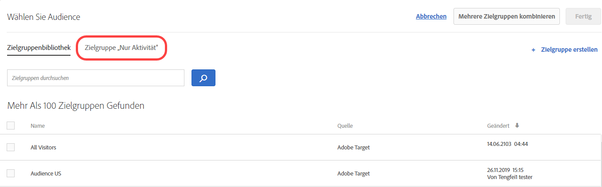 </p> <p>Weitere Informationen finden Sie unter  <a href="../c-target/creating-activity-only-audience.md#concept_A6BADCF530ED4AE1852E677FEBE68483" format="dita" scope="local"> Erstellen einer „Nur Aktivität“-Zielgruppe</a>. </p> </li> 
      <li id="li_691812682A5B42C0941324F2BC7D5740"> <p>Sie können für alle Aktivitäten eine Erfolgsmetrik auswählen, mit der sich ein Benutzer für die Zielgruppe qualifiziert. In der Vergangenheit qualifizierte Target Benutzer für eine Zielgruppe, wenn diese die Aktivität erreichten. Jetzt können Sie hingegen entscheiden, wann die Zielgruppe ausgewertet werden soll, indem Sie eine Erfolgsmetrik auswählen. (TGT-15805) </p> <p> 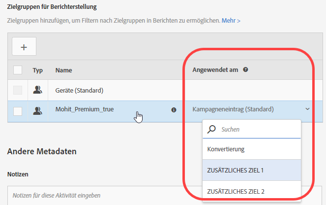 </p> </li> 
     </ul> </p> <p>Weitere Informationen finden Sie unter  <a href="../c-target/apply-reporting-audience-success-metric.md#concept_5F11149ACCA84FE79C7B9F766B6B0595" format="dita" scope="local">Eine Berichterstellungszielgruppe auf eine Erfolgsmetrik anwenden</a>. </p> </td> 
  </tr> 
  <tr> 
   <td colname="col1" class="premium"> <p>Automatisches Targeting </p> </td> 
   <td colname="col2"> <p> 
     <ul id="ul_6F89BD36373E47C4B3A6F8584D431D82"> 
      <li id="li_5F7B590AF8F24066ADD270E9F75CB12F"> <p>Automatische Targeting-Aktivitäten unterstützen jetzt eine Berichterstellung auf Segmentebene. (TGT-22777) </p> <p>Weitere Informationen finden Sie unter <a href="../c-activities/auto-target-to-optimize.md#concept_67779E5B7F67427A97D7EA2A6FB919B3" format="dita" scope="local">Automatisches Targeting für personalisierte Erfahrungen</a>. </p> </li> 
      <li id="li_35042E7D6BB04265B42F08A23A774E92"> <p>Sie können den Kontroll-Prozentsatz bei automatischen Targeting-Aktivitäten anpassen. (TGT-26467) </p> <p> 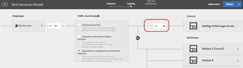 </p> <p>Weitere Informationen finden Sie unter <a href="../c-activities/auto-target-to-optimize.md#concept_67779E5B7F67427A97D7EA2A6FB919B3" format="dita" scope="local">Automatisches Targeting für personalisierte Erfahrungen</a>. </p> </li> 
     </ul> </p> </td> 
  </tr> 
  <tr> 
   <td colname="col1"> <p>Angebote </p> </td> 
   <td colname="col2"> <p> 
     <ul id="ul_667DDEDDC5284C8393F8BCA5CD9EF12A"> 
      <li id="li_E00DB93297EC4100B46E42D867757DAA"> <p>Sie können jetzt Details zur Angebotsdefinition in einer Pop-up-Karte in der Angebotsbibliothek anzeigen, ohne das Angebot zu öffnen. (TGT-26377) </p> <p>  </p> <p>Weitere Informationen finden Sie unter <a href="../c-experiences/c-manage-content/manage-content.md#concept_17874A6FCBB743AA84C5988E8571CCF3" format="dita" scope="local">Angebote</a>. </p> </li> 
      <li id="li_F71AC4FDAC0E4BEE81D39490E82686C0"> <p>Sie können Angebote und Ordner in der Angebotsauswahl kopieren und bearbeiten, während Sie eine Aktivität erstellen. (TGT-26936) </p> <p> 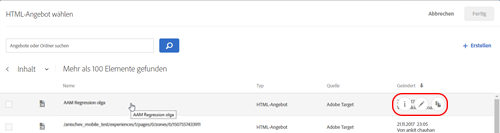 </p> <p>Weitere Informationen finden Sie unter <a href="../c-experiences/c-manage-content/manage-content.md#concept_17874A6FCBB743AA84C5988E8571CCF3" format="dita" scope="local">Angebote</a>. </p> </li> 
     </ul> </p> </td> 
  </tr> 
  <tr> 
   <td colname="col1"> <p>Form-Based Experience Composer </p> </td> 
   <td colname="col2"> <p>Im Form-Based Experience Composer wurden Verfeinerungen durch die volle Zielgruppen-Funktionalität ersetzt. Verfeinerungen für vorhandene Aktivitäten wurden in  Zielgruppen „Nur Aktivität“ migriert. (TGT-13646) </p> <p>Weitere Informationen finden Sie unter <a href="../c-experiences/form-experience-composer.md#task_FAC842A6535045B68B4C1AD3E657E56E" format="dita" scope="local">Form-Based Experience Composer</a>. </p> </td> 
  </tr> 
  <tr> 
   <td colname="col1"> <p>Antwort-Token </p> </td> 
   <td colname="col2"> <p>Sie können jetzt Antwort-Token von Target erstellen, ohne zu warten, bis diese in Target erstellt oder importiert werden. Zuvor konnten Sie in der Antwort-Token-Benutzeroberfläche nur die über API erstellten Token sehen. Die Änderungen an der Funktion helfen Ihnen auch dabei, duplizierte Antwort-Token zu vermeiden. (TGT-26534) </p> <p>Weitere Informationen finden Sie unter <a href="../administrating-target/response-tokens.md#concept_2B21B222F6A344D68CA5929817E836C4" format="dita" scope="local">Antwort-Token</a>. </p> </td> 
  </tr> 
 </tbody> 
</table>

**Erweiterungen, Korrekturen und Änderungen**

Diese Version von [!DNL Target] enthält folgende kundenrelevante Verbesserungen, Fehlerbehebungen und Änderungen:

* Sie können importierte Zielgruppen (Target Classic, Experience Cloud usw.) aus der Zielgruppenbibliothek löschen. Sie werden von Target gewarnt, wenn Sie versuchen, eine Zielgruppe zu löschen, die für eine aktive Aktivität verwendet wird. (TGT-25171)
* Aus Target Classic importierte Zielgruppen werden jetzt in der Zielgruppenbibliothek als „Adobe Target Classic“ gekennzeichnet. Bislang wurde in der Benutzeroberfläche kein Unterschied zwischen Target Standard/Premium und Target Classic gemacht. (TGT-27093)
* Sammlungen gelten jetzt für alle Kriterien (einschließlich kürzlich angezeigte Elemente). (TGT-26646)
* Sie können in der Zielgruppenbibliothek nach Arbeitsbereichen filtern (gilt für Target Premium-Benutzer mit Enterprise-Benutzerberechtigungen). (TGT-26813)
* Es wurden Verbesserungen an der Benutzeroberfläche für Berichte vorgenommen, um eine bessere Scrollfunktionalität in Tabellen sowie eine optimierte Platzierung von Filter-Dropdownlisten zu gewährleisten. (TGT-23713 und TGT-26819)

### Änderungen an der Target-Plattform (13. Oktober 2017)  {#section_6C298C5C3D01415CB4B658EB2166096C}

<table id="table_8457FAE3508F454F9DFDEF093FBD7E40"> 
 <thead> 
  <tr> 
   <th colname="col1" class="entry"> Ändern </th> 
   <th colname="col2" class="entry"> Details </th> 
  </tr> 
 </thead>
 <tbody> 
  <tr> 
   <td colname="col1"> <p> <span class="filepath"> at.js </span> </p> </td> 
   <td colname="col2"> <p><b>13. Oktober 2017</b> </p> <p> <span class="filepath"> at.js</span>, Version 1.2.1 ist verfügbar. Weitere Informationen finden Sie unter <a href="../c-implementing-target/c-implementing-target-for-client-side-web/target-atjs-versions.md#reference_DBB5EDB79EC44E558F9E08D4774A0F7A" format="dita" scope="local">at.js-Versionsdetails </a>. </p> <p> 
     <ul id="ul_14D6BB3B51974789BBFC036A45B7A56B"> 
      <li id="li_AE9826C8FC4A4DF4BE61BB72C2946C93"> <p>Es wurde ein Problem bei der Verfolgung per Klick auf einen Link mit target="_blank" behoben, das das Öffnen des Links auf einer neuen Registerkarte in Target verhindert hat. </p> </li> 
     </ul> </p> </td> 
  </tr> 
 </tbody> 
</table>

### Target Standard/Premium 1.7.9.1 (25. September und 12. Oktober 2017) {#section_ECC5DD8B6ED443788B46F53E25FC896E}

Diese Version beinhaltet die folgenden Funktionen und Erweiterungen (die Problemnummern in Klammern dienen der internen Verwendung bei Adobe):

<table id="table_0A8817F64F434875A485FD671C6988AB"> 
 <thead> 
  <tr> 
   <th colname="col1" class="entry"> Funktion </th> 
   <th colname="col2" class="entry"> Beschreibung </th> 
  </tr> 
 </thead>
 <tbody> 
  <tr> 
   <td colname="col1"> <p> Mobile Erlebnisvorschau </p> </td> 
   <td colname="col2"> <p><b>Aktualisiert am 12. Oktober 2017</b> </p> <p> Von nun an können Sie auf der Benutzeroberfläche mehrere mobile App-Aktivitäten auswählen und auf Ihrem Gerät eine Vorschau dafür anzeigen. Mithilfe dieser Funktion können Sie sich für die Vorschau und Qualitätssicherung mehrerer Erlebnisse registrieren, ohne sich auf spezielle Testversionen und Simulationen verlassen zu müssen. </p> <p>Für diese Funktion ist es erforderlich, dass Sie die entsprechende Version 4.14 (oder später) des Adobe Mobile-SDK herunterladen und installieren. </p> <p>Weitere Informationen finden Sie unter     <a href="../c-target-mobile-app/target-mobile-preview.md#concept_5FBF12C2FDFC42429FE4F5CFBD78E19D" format="dita" scope="local">Target Mobile-Vorschau</a>. </p> </td> 
  </tr> 
  <tr> 
   <td colname="col1"> <p>Mobile Batch- und Vorabrufbereitstellung </p> </td> 
   <td colname="col2"> <p><b>Aktualisiert am 12. Oktober 2017</b> </p> <p> Der Inhalt für mehrere Mboxes kann in einem einzelnen Aufruf vorab abgerufen und lokal auf dem Gerät zwischengespeichert werden, ohne sich darüber Gedanken machen zu müssen, wie, wann und ob der Endbenutzer den Inhalt anzeigt. </p> <p>Für diese Funktion ist es erforderlich, dass Sie die entsprechende Version 4.14 (oder später) des Adobe Mobile-SDK herunterladen und installieren. </p> <p>Weitere Informationen finden Sie unter  <a href="../c-target-mobile-app/prefetch-offer-content.md#concept_A355D9D55E1C429AA31FA4055A1DDFAF" format="dita" scope="local">Vorzeitiger Abruf des Angebotsinhalts</a>. </p> </td> 
  </tr> 
  <tr> 
   <td colname="col1"> <p>Aktivitäten </p> </td> 
   <td colname="col2"> <p>Der Arbeitsablauf zum Erstellen von Aktivitäten wurde wie folgt erweitert: </p> <p> 
     <ul id="ul_2D251AC11FC54E86AE84DEFFB6FDF43C"> 
      <li id="li_AB8F12B3CF654120BD16EAE570517741"> <p>Beim Bearbeiten einer Aktivität können Sie die gewünschten Änderungen in dem momentan angezeigten Schritt vornehmen. Klicken Sie auf das Dropdown-Menü der unterteilten Schaltfläche. Wählen Sie dann <span class="wintitle">Weiter</span> aus, um zum nächsten Schritt zu wechseln. Klicken Sie auf <span class="wintitle">Speichern und schließen</span>, um Ihre Änderungen zu speichern und die Seite <span class="wintitle">Übersicht</span> der Aktivität anzuzeigen. Alternativ können Sie auf <span class="wintitle">Speichern</span> klicken, um Ihre Änderungen zu speichern und den aktuellen Schritt beizubehalten. </p> <p> 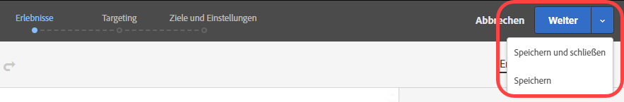 </p> <p>Weitere Informationen finden Sie unter <a href="../c-activities/edit-activity.md#concept_BB064C0D4A194BD1A1AE7CCA1E6BB8F0" format="dita" scope="local">Aktivität bearbeiten oder als Entwurf speichern </a>. </p> </li> 
      <li id="li_4C71E2570ECF4BBAB08443D89230CE82"> <p>Beim Bearbeiten einer Aktivität können Sie den gewünschten Schritt im Arbeitsablauf öffnen, die gewünschten Änderungen vornehmen (z. B. Erlebnisprozentsätze, Zielgruppen usw.) und die Aktivität anschließend speichern oder schließen, ohne den dreistufigen geführten Arbeitsablauf durchlaufen zu müssen. </p> <p> 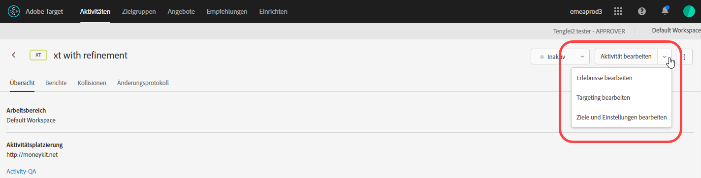 </p> <p>Weitere Informationen finden Sie unter <a href="../c-activities/edit-activity.md#concept_BB064C0D4A194BD1A1AE7CCA1E6BB8F0" format="dita" scope="local">Aktivität bearbeiten oder als Entwurf speichern </a>. </p> </li> 
      <li id="li_43C15B13E4F7475E9376A98222AA0253"> <p>Wenn Sie eine neue, noch nicht gespeicherte Aktivität erstellen oder eine Aktivität bearbeiten, die zuvor in Entwurfsform gespeichert wurde, werden unter der Trennschaltfläche die Optionen für <span class="wintitle">Entwurf speichern</span> angezeigt. </p> <p> 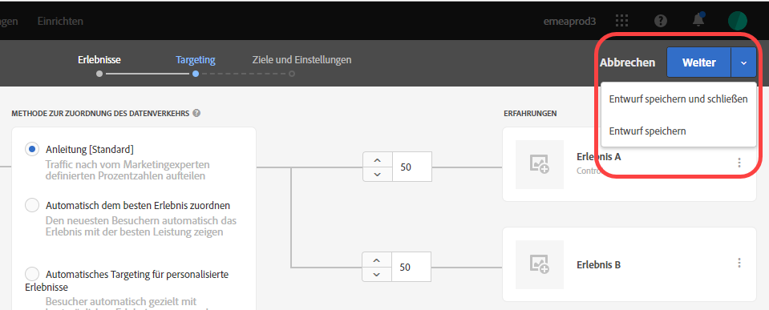 </p> <p>Weitere Informationen finden Sie unter <a href="../c-activities/edit-activity.md#concept_BB064C0D4A194BD1A1AE7CCA1E6BB8F0" format="dita" scope="local">Aktivität bearbeiten oder als Entwurf speichern </a>. </p> </li> 
      <li id="li_36EF9AD13B2D40ADB99343C9F758D5FD"> <p>Sie können nun eine Zielgruppe bearbeiten oder kopieren, indem Sie den Mauszeiger über die gewünschte Zielgruppe im Dialogfeld <span class="wintitle">Zielgruppe auswählen</span> bewegen, während Sie in Schritt 2 des dreistufigen geführten Arbeitsablaufs das Targeting auswählen. </p> <p>  </p> </li> 
     </ul> </p> <p>Weitere Informationen finden Sie unter <a href="../c-activities/t-test-ab/t-test-create-ab/ab-audience.md#concept_A268236C1224451DB7844BF67F41A087" format="dita" scope="local">Zielgruppe wählen </a>. </p> </td> 
  </tr> 
  <tr> 
   <td colname="col1"> <p>Berichterstellung </p> </td> 
   <td colname="col2"> <p>Für die Berichterstellung sind die folgenden neuen Funktionen und Erweiterungen verfügbar: </p> <p> 
     <ul id="ul_2D1AF91D1B4E478FBFFA0B83EE30075E"> 
      <li id="li_98E67A4DA8BF4CFF90C279FAC12F4C54"> <p>Sie können die Zählmethodologie für Diagramme in Berichten wählen. Beachten Sie, dass dies für Aktivitäten zum automatischen Targeting und zur automatisierten Personalisierung (AP) nicht unterstützt wird. </p> <p>Weitere Informationen finden Sie in der Zeile „Zählmethodologie“ unter  <a href="../c-reports/c-report-settings/report-settings.md#concept_4BB6A7FDAB6F4806A632F9CD989B8BFA" format="dita" scope="local"> Berichteinstellungen</a>. </p> </li> 
      <li id="li_5803CE90DB764C9E983702CB6C1AFEE3"> <p>Sie können in einem einzelnen Bericht für A/B-Aktivitäten zum automatischen Targeting mehrere Metriken anzeigen. (TGT-23464) </p> <p>Weitere Informationen finden Sie unter <a href="../c-reports/c-report-settings/view-multiple-metrics.md#concept_9E3C3F6F3EC1412FAF252975AC0720B7" format="dita" scope="local">Anzeigen mehrerer Metriken in einem Bericht </a>. </p> </li> 
     </ul> </p> </td> 
  </tr> 
  <tr> 
   <td colname="col1"> <p>Zielgruppen </p> </td> 
   <td colname="col2"> <p>Von nun an können Sie die Definitionen von Zielgruppen anzeigen, die aus Target Classic importiert oder per API erstellt wurden. (TGT-22630) </p> <p>  </p> <p>Weitere Informationen finden Sie unter „Anzeigen von Zielgruppendefinitionen“ in  <a href="../c-target/c-audiences/audiences.md#concept_65BE870D290E412D8BBF557EEA67C271" format="dita" scope="local"> Info über Zielgruppen </a>. </p> </td> 
  </tr> 
  <tr> 
   <td colname="col1"> <p>Code-Editor </p> </td> 
   <td colname="col2"> <p>Für den Form-based Experience Composer und HTML-Angebotseditor wird von nun an derselbe Code-Editor verwendet, den der Visual Experience Composer (VEC) in benutzerdefiniertem Code nutzt. (TGT-25808) </p> <p>Diese Erweiterung ermöglicht Ihnen beim Verwenden des Code-Editors im Form-based Experience Composer und beim Erstellen von HTML-Angeboten die folgenden Funktionen: </p> <p> 
     <ul id="ul_CBB17806FBF34774A8160A61204ED014"> 
      <li id="li_22665F583F1742E280D5BC7EC4203007"> <p>Für eine bessere Nutzbarkeit sind nun Zeilennummern sichtbar. </p> </li> 
      <li id="li_B0D863CDAD2E46A4B133BB86886EB527"> <p>Syntaxhervorhebung zum Vermeiden einer falschen Syntax für HTML-Angebote. </p> </li> 
     </ul> </p> <p>Weitere Informationen finden Sie unter  <a href="../c-experiences/c-visual-experience-composer/c-vec-code-editor/vec-code-editor.md#concept_B3A6E9EE3A60406DB640E205EA1745B5" format="dita" scope="local"> Code-Editor </a>. </p> </td> 
  </tr> 
  <tr> 
   <td colname="col1"> <p>Geotargeting </p> </td> 
   <td colname="col2"> <p>Beim Geotargeting können Sie nun Breiten- und Längengrade verwenden. (TGT-12129) </p> <p>Weitere Informationen finden Sie unter <a href="../c-target/c-audiences/c-target-rules/geo.md#concept_5B4D99DE685348FB877929EE0F942670" format="dita" scope="local">Geo</a>. </p> </td> 
  </tr> 
  <tr> 
   <td colname="col1"> <p>Node.JS-SDK </p> </td> 
   <td colname="col2"> <p>Sie können das node.js-SDK unter <a href="https://www.npmjs.com/package/@adobe/target-node-client" format="https" scope="external">npm @adobe/target-node-client</a> installieren, um in node.js-Anwendungen serverseitige Tests problemlos implementieren und ausführen zu können. Der VisitorID-Service ist im Knoten-SDK aktiviert, um all Ihre Adobe-Daten zu verbinden. Zudem können Sie Adobe Analytics als Berichtsquelle verwenden (A4T). </p> </td> 
  </tr> 
 </tbody> 
</table>

**Erweiterungen, Korrekturen und Änderungen**

Diese [!DNL Target]-Version beinhaltet die folgenden Verbesserungen, Korrekturen und Änderungen für den Kunden (Problemnummern in Klammern dienen der internen Verwendung bei Adobe):

* Benutzer mit Genehmigerberechtigungen können nun API-Authentifizierungstoken generieren und aktivieren. (TGT-24074)

   Weitere Informationen finden Sie unter [Einstellungen für Profil-API](../c-implementing-target/c-considerations-before-you-implement-target/c-methods-to-get-data-into-target/profile-api-settings.md#concept_5C4ABA5FA64E4D6CAE9C5902572F2794).

* Wenn Sie eine Aktivität im Visual Experience Composer erstellen und der Benutzer die Seite neu lädt, werden die Aktivitäts-URL und die zugewiesenen Eigenschaften in der Benutzeroberfläche beibehalten. Das erneute Laden kann erforderlich sein, wenn für die Aktivität gemischte Inhalte verwenden werden (sichere und unsichere Inhalte) oder wenn Probleme mit Berechtigungen vorliegen. (TGT-28230)
* Die Nachrichtenübermittlung bei gemischtem Inhalt in einer Aktivität (sichere und unsichere Inhalte) wurde verbessert. Die Nachricht enthält Informationen, um die Benutzer beim Ausführen der nötigen Schritte zum Öffnen einer HTTP-Website oder einer Website mit gemischten Aufrufen (HTTPS und HTTP) zu unterstützen. (TGT-26271)

Weitere Informationen finden Sie unter [Zulassen von gemischtem Inhalt in Ihrem Browser](../c-experiences/c-visual-experience-composer/r-troubleshoot-composer/mixed-content.md#concept_46D022D50280468C9EF6D5DF6EFC911C).

* Der Arbeitsablauf wurde verbessert, wenn die Zielgruppe eines Benutzers während der Konfiguration der Optionen auf den Seiten &quot;Administration&quot;, &quot;Audiencen&quot;und &quot;Recommendations&quot;abgelaufen ist. Wenn der Benutzer auf „Speichern“ klickt, wird die Nachricht zum Ablauf der Sitzung angezeigt. Nach dem erneuten Anmelden wird der Benutzer jedoch in einem Dialogfeld über die erfolgreiche Anmeldung informiert, und die Benutzeroberfläche bleibt ohne Datenverlust auf derselben Seite in Target erhalten. (TGT-25557)

### Änderungen an der Target-Plattform (27. September 2017) {#section_AC32516DFBA64AD2AC9A74171D452778}

<table id="table_701D8D53D1DF4F28ADAC6EC221B0208A"> 
 <thead> 
  <tr> 
   <th colname="col1" class="entry"> Ändern </th> 
   <th colname="col2" class="entry"> Details </th> 
  </tr> 
 </thead>
 <tbody> 
  <tr> 
   <td colname="col1"> <p> <span class="filepath"> at.js </span> </p> </td> 
   <td colname="col2"> <p><b>27. September 2017</b> </p> <p> <span class="filepath"> at.js</span>-Version 1.2.0 ist nun als Wartungsversion verfügbar, die größtenteils Fehlerkorrekturen enthält. Weitere Informationen finden Sie unter <a href="../c-implementing-target/c-implementing-target-for-client-side-web/target-atjs-versions.md#reference_DBB5EDB79EC44E558F9E08D4774A0F7A" format="dita" scope="local">at.js-Versionsdetails </a>. </p> <p> 
     <ul id="ul_D11024549C3643C7A756988087498D24"> 
      <li id="li_E1B3994125B64F6AB20B29FE8BCD8459"> <p>Es wurde ein Problem behoben, das Standardaktionen zum Verfolgen von Sonderfällen per Klick verhindert hat. (TNT-28089) </p> </li> 
      <li id="li_53806C902AA04B31B59AA87A1E707348"> <p>Es wurde ein Problem bei der Verfolgung per Klick auf einen Link mit <span class="codeph">target="_blank"</span> behoben, das das Öffnen des Links auf einer neuen Registerkarte in Target verhindert hat. (TNT-28072) </p> </li> 
      <li id="li_94F5794330D14C71BA07B3F17D0705FD"> <p> IP-Adressen können als Cookie-Domäne verwendet werden. (TNT-28002) </p> </li> 
      <li id="li_7D2A11B17672419583F9632CDA00D28F"> <p>Es wurde ein Problem behoben, das in Weiterleitungsangeboten mit einer globalen Mbox oder anderen regionalen Mboxes ein Flackern verursacht hat. (TNT-27978) </p> </li> 
      <li id="li_BA27A749A7A242478080F3D8E04148FC"> <p> Es wurde ein Problem behoben, durch das die Einrichtung der Erlebnis-Targeting-Aktivität im VEC fehlschlägt, wenn ein Wechsel zwischen dem Durchsuchen und dem Erstellen erfolgt. (TNT-27942) </p> </li> 
      <li id="li_FA11ABA5B9CD435080426805C5359A51"> <p> Es wurde eine falsche Behandlung der Flackerstilklassen für klickbasierte Verfolgungselemente behoben. (TNT-27896) </p> </li> 
      <li id="li_E2DFBAE52FCA4996BA083868CBFCCD10"> <p>Es wurde ein Problem behoben, durch das globale Mbox-Parameter mit allen Mbox-Parametern gemischt wurden. (TNT-27846) </p> </li> 
      <li id="li_B3153BBD66AA4D51AE81EF6C903CF78D"> <p>Es wurden Änderungen vorgenommen, die sicherstellen, dass Handlebars, Mustache und andere clientseitige Vorlagenbibliotheken von <span class="filepath">at.js</span> ordnungsgemäß verarbeitet werden. (TNT-27831) </p> </li> 
      <li id="li_B859939C1B5A4DF78CF8ADF236B88306"> <p>Es wurden Änderungen vorgenommen, die sicherstellen, dass <span class="codeph">sdidParamExpiry</span> ordnungsgemäß initialisiert und an die Besucher-API übergeben wird. Dies ist eine Regression, die <span class="codeph">at.js 1.1.0</span> hinzugefügt wurde. Vorherige <span class="filepath">at.js</span>-Versionen sind nicht betroffen. Dies betrifft nur Clients, die Weiterleitungsangebote und A4T verwenden. (TNT-27791) </p> </li> 
      <li id="li_24A748DFB7824AE6AC7331B7EA940BFF"> <p>Es wurden Änderungen vorgenommen, die sicherstellen, dass <span class="codeph">SCRIPT</span> unabhängig vom verwendeten Typattribut ausgeführt wird. (TNT-27865) </p> </li> 
     </ul> </p> </td> 
  </tr> 
  <tr> 
   <td colname="col1"> <p>Erlebnis-Targeting (XT) </p> </td> 
   <td colname="col2"> <p><b>21. September 2017</b> </p> <p>Mit der am 21. September veröffentlichten Version ändert sich in Target die Art und Weise, wie Benutzer in Experience Targeting (XT)-Aktivitäten in Erlebnisse eingebunden werden (Landingpage-Kampagnen in Target Classic). Bei allen neuen und vorhandenen Aktivitäten in Target Standard/Premium und Target Classic müssen die Benutzer die Erlebnis-Targeting-Regeln für alle Impressionen erfüllen, damit sie den Erlebnisinhalt weiterhin anzeigen und in Berichten berücksichtigt werden konnten. Wenn sich der Benutzer zuvor nicht mehr für ein Erlebnis qualifiziert hat, wurde weiterhin der Inhalt aus dem letzten Erlebnis angezeigt, für das er sich qualifiziert hatte. Dasselbe galt für die Berücksichtigung in Berichten. </p> <p>Diese Änderung erfolgt automatisch im Rahmen der Veröffentlichung für alle vorhandenen Aktivitäten und für neue Aktivitäten, die nach der Veröffentlichung erstellt werden. Wenn die vorherige Methode (vor dem 21. September) verwendet werden soll, können Sie mithilfe von Profilskripten Zielgruppen erstellen, sodass ein Benutzer einmal eine Bedingung erfüllen muss, damit er künftig weiterhin in die jeweilige Zielgruppe fällt. Verwenden Sie anschließend diese Zielgruppen für die einzelnen Erlebnisse in der Aktivität. </p> </td> 
  </tr> 
 </tbody> 
</table>

### Target Standard/Premium 17.8.1 (22. August 2017) {#section_71A554D072F04B18B359C1626529E5D8}

<table id="table_AAC16F89060D4CC09762A370B86C0885"> 
 <thead> 
  <tr> 
   <th colname="col1" class="entry"> Funktion </th> 
   <th colname="col2" class="entry"> Beschreibung </th> 
  </tr> 
 </thead>
 <tbody> 
  <tr> 
   <td colname="col1" class="premium"> <p>Berechtigungen für Unternehmensbenutzer für Target Premium </p> </td> 
   <td colname="col2"> <p>Erstellen Sie separate Arbeitsbereiche in Target und weisen Sie dann Benutzern verschiedene Rollen und Berechtigungen für individuelle digitale Eigenschaften zu. </p> <p>Weitere Informationen finden Sie unter  <a href="../administrating-target/c-user-management/property-channel/property-channel.md#concept_E396B16FA2024ADBA27BC056138F9838" format="dita" scope="local"> Berechtigungen für Unternehmensbenutzer </a>. </p> <p>Weitere Informationen zur Einführung finden Sie unter <a href="../r-release-notes/known-issues-resolved-issues.md#concept_625C3A16B7F24D4B82EFF130F0945541" format="dita" scope="local">Bekannte Probleme und gelöste Probleme</a>. </p> </td> 
  </tr> 
  <tr> 
   <td colname="col1"> <p>QA-Modus </p> </td> 
   <td colname="col2"> <p>Führen Sie leichte Aktivitäts-QAs mit unveränderbaren Vorschaulinks, optionalem Zielgruppen-Targeting und QA-Berichterstellung durch, die basierend auf Live-Aktivitätsdaten segmentiert bleiben. </p> <p>Weitere Informationen finden Sie unter <a href="../c-activities/c-activity-qa/activity-qa.md#concept_9329EF33DE7D41CA9815C8115DBC4E40" format="dita" scope="local">Activitäts-QA </a>. </p> </td> 
  </tr> 
 </tbody> 
</table>

**Erweiterungen, Korrekturen und Änderungen**

Diese [!DNL Target]-Version beinhaltet die folgenden Verbesserungen, Korrekturen und Änderungen für den Kunden (Problemnummern in Klammern dienen der internen Verwendung bei Adobe):

* Wir haben weitere Stellen hinzugefügt, an denen Sie Details zur Zielgruppendefinition auf einer Pop-up-Karte der Target-Benutzeroberfläche anzeigen können, ohne die Zielgruppe zu öffnen. Beachten Sie, dass diese Funktion nur für in [!DNL Target Standard/Premium. (TGT-25772)] erstellte Zielgruppen gilt
* Von nun an können Sie Definitionen von Ad-hoc-Zielgruppen in der Erstellung/Übersicht für Aktivitäten anzeigen. (TGT-25570)
* Die folgenden Variablen sind von nun an verfügbar als  [Geschwindigkeitsarrays](../c-recommendations/c-design-overview/customizing-a-template.md#concept_94F1554C3F2E4CDB9A2C3D78F10EDA59): `entiites` und `entityN.categoriesList`.

### Änderungen an der Target-Plattform (3. August 2017) {#section_FA5BF6808EA74F3A9E8E941530879208}

<table id="table_1B43199F1AE64E69AE65313B23741444"> 
 <thead> 
  <tr> 
   <th colname="col1" class="entry"> Ändern </th> 
   <th colname="col2" class="entry"> Details </th> 
  </tr> 
 </thead>
 <tbody> 
  <tr> 
   <td colname="col1"> <p> <span class="filepath"> at.js </span> </p> </td> 
   <td colname="col2"> <p><b>3. August 2017</b> </p> <p> <span class="filepath"> at.js</span>, Version 1.1 ist verfügbar. Weitere Informationen finden Sie unter <a href="../c-implementing-target/c-implementing-target-for-client-side-web/how-to-deployatjs/implementing-target-without-a-tag-manager.md#concept_1E1F958F9CCC4E35AD97581EFAF659E2" format="dita" scope="local">at.js herunterladen</a>. </p> <p>Folgende Verbesserungen und Fehlerbehebungen sind in Version 1.1 von <span class="filepath">at.js</span> enthalten: </p> <p> 
     <ul id="ul_B7408267413347888938E2E7D48ABDBD"> 
      <li id="li_4DDF6DCFE6014C6795B6A9C9DFB54C21"> <p>Die Verarbeitung von Antwort-Token wurde hinzugefügt. Weitere Informationen finden Sie unter <a href="../administrating-target/response-tokens.md#concept_2B21B222F6A344D68CA5929817E836C4" format="dita" scope="local">Antwort-Token</a>. </p> </li> 
      <li id="li_741CD22B7D074FBA90180B2E36FACE0D"> <p>Es wurde ein Problem behoben, damit <span class="codeph">document.currentScript polyfill</span> nicht mit Angular 1.X in Konflikt gerät. </p> </li> 
      <li id="li_EF1B3D3DCC7F4D2490D2BFE660EC661C"> <p>Es wurden Änderungen vorgenommen, die sicherstellen, dass die Klick-Verfolgung nicht mit der Sichtbarkeitseigenschaft in Konflikt gerät. Klick-Verfolgungselemente sind mit der CSS-Klasse <span class="codeph">at-element-click-tracking</span> statt mit <span class="codeph">at-element-marker</span> markiert. </p> </li> 
     </ul> </p> </td> 
  </tr> 
 </tbody> 
</table>

### Target Standard/Premium 17.7.3 (3. August 2017)  {#section_D90CB766679442C7A0642E5D79657674}

<table id="table_C81EA97B251547169BC9681E5DDB4B8F"> 
 <thead> 
  <tr> 
   <th colname="col1" class="entry"> Funktion </th> 
   <th colname="col2" class="entry"> Beschreibung </th> 
  </tr> 
 </thead>
 <tbody> 
  <tr> 
   <td colname="col1"> <p>Antwort-Token </p> </td> 
   <td colname="col2"> <p>Mithilfe von Antwort-Token können Sie automatisch berechtigte Variablen (z. B. Profilattribute) in den Target-Antworten ausgeben, mit denen Aktivitäten bereitgestellt werden (d. h. Anzeigen von Mboxes). Antwort-Token können zu Debugging-Zwecken oder für die Integration mit Drittanbietern (z. B. Clicktale) verwendet werden. </p> <p>Antwort-Token ähneln den Server-Plugins von <span class="keyword">Adobe Target Classic</span> und stellen die Funktionsparität zwischen den beiden Lösungen bereit. </p> <p> <p>Hinweis: Antwort-Token sind in <span class="filepath">at.js</span> 1.1 oder neuer verfügbar.</span>. </p> </p> <p>Weitere Informationen finden Sie unter <a href="../administrating-target/response-tokens.md#concept_2B21B222F6A344D68CA5929817E836C4" format="dita" scope="local">Antwort-Token</a>. </p> </td> 
  </tr> 
 </tbody> 
</table>

### Target Standard/Premium 17.7.2 (27. Juli 2017) {#section_6980EC04D3CF4A00919953B9B10BC472}

<table id="table_DB51BD66756F4EBD875ED008B2C7C5D0"> 
 <thead> 
  <tr> 
   <th colname="col1" class="entry"> Funktion </th> 
   <th colname="col2" class="entry"> Beschreibung </th> 
  </tr> 
 </thead>
 <tbody> 
  <tr> 
   <td colname="col1" class="premium"> <p>Automatisches Targeting </p> </td> 
   <td colname="col2"> <p>Das automatische Targeting ist von nun an für alle Target Premium-Kunden verfügbar. </p> <p>Beim automatischen Targeting werden mehrere vermarkterdefinierte Erlebnisse mit hoher Leistung über das erweiterte maschinelle Lernen identifiziert. Zudem erhalten alle Besucher basierend auf ihrem individuellen Kundenprofil und dem Verhalten vorheriger Besucher mit ähnlichen Profilen ein optimal auf sie zugeschnittenes Erlebnis, um die Inhalte zu personalisieren und Konversionen zu fördern. </p> <p>Bei der Erstellung einer A/B-Aktivität nach dem Arbeitsablauf, der mit einer Anleitung erfolgt und drei Schritte umfasst, können Sie festlegen, dass Traffic mithilfe der Option <span class="wintitle">Automatisches Targeting für personalisierte Erlebnisse</span> zugeordnet werden soll: </p> <p> 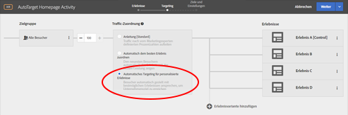 </p> <p>Weitere Informationen finden Sie unter <a href="../c-activities/auto-target-to-optimize.md#concept_67779E5B7F67427A97D7EA2A6FB919B3" format="dita" scope="local">Automatisches Targeting für personalisierte Erfahrungen</a>. </p> </td> 
  </tr> 
 </tbody> 
</table>

### Target Standard/Premium 17.7.1 (20. Juli 2017) {#section_BB75DE30174F4ADD963451909FB81D74}

<table id="table_BCE36E0D56804E7B8861858DCF2F380E"> 
 <thead> 
  <tr> 
   <th colname="col1" class="entry"> Funktion </th> 
   <th colname="col2" class="entry"> Beschreibung </th> 
  </tr> 
 </thead>
 <tbody> 
  <tr> 
   <td colname="col1"> <p>Zielgruppen </p> </td> 
   <td colname="col2"> <p>Sie können von nun an Details zur Zielgruppendefinition auf einer Pop-up-Karte an verschiedenen Stellen der Target-Benutzeroberfläche anzeigen, ohne die Zielgruppe öffnen zu müssen. Beachten Sie, dass diese Funktionalität nur für Zielgruppen gilt, die in <span class="keyword">Target Standard/Premium erstellt wurden. </span> </p> <p> 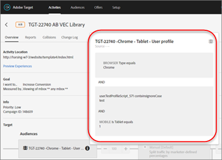 </p> </td> 
  </tr> 
  <tr> 
   <td colname="col1"> <p>Erfolgsmetriken </p> </td> 
   <td colname="col2"> <p>Zuvor war in Target eine Abhängigkeit für eine einzelne Metrik zulässig, und diese Metrik musste erreicht werden, bevor die zugehörige Anzahl inkrementiert wurde. Sie können nun für mehrere Metriken eine Abhängigkeit bereitstellen und die flexible Auswahl ermöglichen, ob die Metrik erreicht werden soll oder nicht, damit die Anzahl inkrementiert wird. </p> <p>Die Abhängigkeitsfunktionalität für mehrere Metriken wird ab sofort für Folgendes unterstützt: </p> <p> 
     <ul id="ul_EC856F910B704D648065EA7DA13EE5B0"> 
      <li id="li_1A82414FE50B414CAA1A0A88E80BCC1B"> <p>Recommendations-Aktivitäten. Diese Funktionalität wird für alle anderen Aktivitätstypen unterstützt. </p> </li> 
      <li id="li_2D6CF42264D445FCB6C400ED321DE952"> <p>Wenn Sie Analytics als Berichtsquelle verwenden (A4T). </p> </li> 
      <li id="li_E3A983A70BB04AE8B25A7CEC1F5FE1D9"> <p>Metriktyp „Angezeigte Seite“. </p> </li> 
      <li id="li_9AAF6BB275F7489BA691676E308172D5"> <p>Metriktyp „Elementklick“ für Visual Experience Composer (VEC)-Aktivitäten. </p> </li> 
     </ul> </p> <p>Weitere Informationen finden Sie in den folgenden Themen: </p> <p> 
     <ul id="ul_4B0EFFDD257C42579E19569DCBE15BE3"> 
      <li id="li_2402575F27F547968BD536C460BF81B5"> <p><a href="../c-activities/t-test-ab/t-test-create-ab/ab-goals-and-settings.md#reference_B25389FD6F3A4989801E740364B089CC" format="dita" scope="local">A/B-Ziele und -Einstellungen </a> </p> </li> 
      <li id="li_FB5E7CBC0154406C989F5A5C6CAA0C8F"> <p>Automatisierte Personalisierung (AP): <a href="../c-activities/t-automated-personalization/create-ap-activity.md#task_8AAF837796D74CF893CA2F88BA1491C9" format="dita" scope="local">Erstellen einer Aktivität zur automatisierten Personalisierung </a> </p> </li> 
      <li id="li_57C36A7945A24A52BCBD62CA0F15B668"> <p>Erlebnis-Targeting (XT): <a href="../c-activities/t-experience-target/t-xt-create/xt-goals-and-settings.md#reference_B25389FD6F3A4989801E740364B089CC" format="dita" scope="local">Ziele und Einstellungen </a> </p> </li> 
      <li id="li_06674A3152A547268A1AE5EE818EF1A5"> <p>Multivariate (MVT): <a href="../c-activities/c-multivariate-testing/t-create-multivariate-test/goals-and-settings.md#reference_B25389FD6F3A4989801E740364B089CC" format="dita" scope="local">Ziele und Einstellungen </a> </p> </li> 
     </ul> </p> </td> 
  </tr> 
  <tr> 
   <td colname="col1"> <p>Berichterstellung (A/B-Tests automatisch zuweisen) </p> </td> 
   <td colname="col2"> <p>Die Möglichkeit, mehrere Metriken anzuzeigen, ist von nun an für Aktivitäten vom Typ „A/B automatisch zuweisen“ verfügbar. </p> <p>Weitere Informationen finden Sie unter <a href="../c-reports/c-report-settings/view-multiple-metrics.md#concept_9E3C3F6F3EC1412FAF252975AC0720B7" format="dita" scope="local">Anzeigen mehrerer Metriken in einem Bericht </a>. </p> </td> 
  </tr> 
  <tr> 
   <td colname="col1"> <p>Zielgruppen </p> </td> 
   <td colname="col2"> <p>Die Zielgruppen-Website-Typen und Vergleichsoperatoren stimmen nun mit den Typen und Vergleichsoperatoren in Target Classic überein. </p> <p>Sie können Website-Zielgruppen auch mit einem eigenen „benutzerdefinierten Abfrageparameter“ oder „benutzerdefinierten Header“ erstellen. </p> <p>Weitere Informationen finden Sie unter  <a href="../c-target/c-audiences/c-target-rules/site-pages.md#concept_6425D5304568490899E8340CC94798A9" format="dita" scope="local"> Seiten der Site </a>. </p> </td> 
  </tr> 
  <tr> 
   <td colname="col1"> <p>Aktivitäten </p> </td> 
   <td colname="col2"> <p>In der Aktivitätenliste können Sie von nun an nach den Aktivitätstypen „Automatisch zuweisen“ und „Automatisches Targeting“ filtern. </p> <p>Weitere Informationen finden Sie unter <a href="../c-activities/activities.md#concept_D317A95A1AB54674BA7AB65C7985BA03" format="dita" scope="local">Aktivitäten</a>. </p> </td> 
  </tr> 
  <tr> 
   <td colname="col1" class="premium"> <p>Recommendations - Kriterien &amp; Promotions </p> </td> 
   <td colname="col2"> <p>Von nun an können Sie beim Filtern nach Entitätsattributübereinstimmung, Profilattributübereinstimmung und Parameterübereinstimmung leere Werte verarbeiten. </p> <p>Weitere Informationen finden Sie unter <a href="../c-recommendations/c-algorithms/use-dynamic-and-static-inclusion-rules.md#concept_4CB5C0FA705D4E449BD0B37B3D987F9F" format="dita" scope="local">Verwenden dynamischer und statischer Einschlussregeln </a>. </p> </td> 
  </tr> 
 </tbody> 
</table>

Diese [!DNL Target]-Version beinhaltet die folgenden Verbesserungen und Korrekturen für den Kunden (Problemnummern in Klammern dienen der internen Verwendung bei Adobe):

* Der Arbeitsablauf bei einem Timeout der [!DNL Target]-Sitzung eines Benutzers während der Erstellung oder Bearbeitung einer Aktivität oder eines Angebots wurde verbessert. Wenn der Benutzer auf [!UICONTROL Speichern] klickt, wird die Nachricht zum Ablauf der Sitzung angezeigt. Nach dem erneuten Anmelden wird der Benutzer jedoch in einem Dialogfeld über die erfolgreiche Anmeldung informiert, und die Benutzeroberfläche bleibt ohne Datenverlust auf derselben Seite in [!DNL Target] erhalten.

   Wenn ein Benutzer zeitweise eine Aktion auf einer [!DNL Target]-Seite ausführt und ein Sitzungstimeout auftritt, wird der Benutzer zunächst zur Wiederanmeldung und dann zu der zuletzt bearbeiteten Seite der [!DNL Target]-Benutzeroberfläche geleitet.

* Es wurde ein Problem behoben, durch das benutzerdefinierte Codeänderungen verloren gingen, wenn der Benutzer wegnavigiert (wenn er Erlebnisse ändert, die Seite oder Zielgruppe wechselt, auf „Weiter“ klickt usw.) und vergisst, Änderungen zu speichern. Der Benutzer wird von nun an zum Speichern von Änderungen aufgefordert. (TGT-23766)
* Beim Archivieren einer Aktivität wird „Aktivität archiviert“ anstelle von „Aktivität wird aktualisiert“ angezeigt. (KB-1517)
* Die Dropdown-Auswahl an den folgenden Stellen der Target-Benutzeroberfläche wurde durch Auto-Vervollständigen-Funktionalität ersetzt, um die Geschwindigkeit und die Leistung zu optimieren: (TGT-22939)

   * Aktivitätsseite > *Aktivität* > Schritt 3 > Report Suite-Wähler
   * Zielgruppen > Zielgruppe erstellen > Besucherprofil
   * Recommendations > Feed-Erstellung > Wenn Quelltyp > Analytics > Report Suite-Wähler

* Die Fehlermeldung, die angezeigt wird, wenn die „x-frame-options“ einer Website auf SAMEORIGIN festgelegt sind und die Website im Visual Experience Composer (VEC) nicht geladen werden kann, wurde verbessert. Die Meldung fordert den Benutzer auf, unter Administration > Visual Experience Composer zum Enhanced Experience Composer zu wechseln. (TGT-17356)
* Die Berichte in Target Standard/Premium werden von nun an in der Zeitzone Ihres Kontos statt in der Zeitzone des Target-Servers (US EST) angezeigt. (TGT-24868)
* Wenn in [!DNL Target] erstellte Aktivitäten außerhalb von [!DNL Target] aktualisiert werden (z. B. via Adobe I/O), werden die folgenden Aktivitätsattribute nach [!DNL Target] zurückimportiert:

   `thirdpartyId`

   `startDate`

   `endDate`

   `status`

   `priority`

   `marketingCloudMetadata(remoteModifiedBy)`

   Dieser Import wird ausgeführt, wenn die Aktivitätenseite geöffnet wird. Die maximale Verzögerung beträgt dabei zehn Minuten. (KB-1526)

### Target Standard/Premium 17.6.2 (22. Juni 2017)  {#section_F0372B07B56E454CB048CE79FF56E9CD}

<table id="table_8C4DB1B83B874E4C85CE9FF352E7B857"> 
 <thead> 
  <tr> 
   <th colname="col1" class="entry"> Funktion </th> 
   <th colname="col2" class="entry"> Beschreibung </th> 
  </tr> 
 </thead>
 <tbody> 
  <tr> 
   <td colname="col1" class="premium"> <p>AP-Aktivitäten (Automatisierte Personalisierung) </p> </td> 
   <td colname="col2"> <p> 
     <ul id="ul_F5BB1074DD4140C798CB55D68DEEF824"> 
      <li id="li_9596AABA14C64DEEB2E70E8ADED8AA74">Automatisierte Personalisierungsaktivitäten können mithilfe des formularbasierten Composers erstellt werden. </li> 
      <li id="li_315F5FF590404670A677FEA6E4E0DF5D">Neue Vertrauensnummern für die automatisierte Personalisierung </li> 
     </ul> </p> </td> 
  </tr> 
  <tr> 
   <td colname="col1" class="premium"> <p>Recommendations: Kriterien und Promotions </p> </td> 
   <td colname="col2"> <p> Von nun an können Sie dynamische Kriterien und Promotions basierend auf der Profilattributübereinstimmung und der Parameterübereinstimmung erstellen. </p> <p> 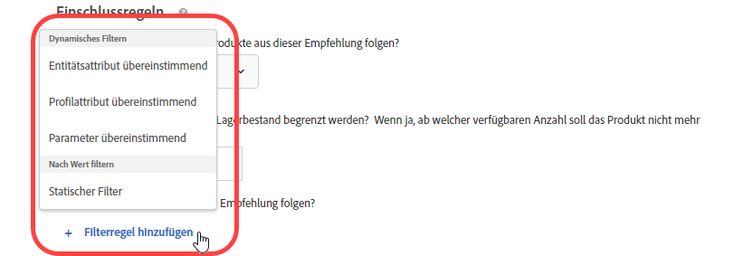 </p> <p> <p>Hinweis: Wenn Sie sich mit dem Konfigurieren von Einschlussregeln vor Target-Version 17.6.1 (Juni 2017) auskennen, werden Sie feststellen, dass sich einige Optionen und Operatoren geändert haben. Es werden nur die Operatoren angezeigt, die auf die ausgewählte Option angewendet werden können. Zudem wurden einige Operatoren umbenannt („stimmt überein“ heißt jetzt „gleich“), um die Konsistenz und die Intuitivität zu erhöhen. Alle vorhandenen Ausschlussregeln, die vor dieser Version erstellt worden sind, wurden automatisch in die neue Struktur migriert. Es ist keine Neustrukturierung Ihrerseits nötig. </p> </p> </td> 
  </tr> 
  <tr> 
   <td colname="col1"> <p>Verbesserungen des VEC-Code-Editors </p> </td> 
   <td colname="col2"> <p> Wenn sich das Seitenformat ändert und keine Aktionen angewendet werden können, wird nun neben jeder fehlgeschlagenen Aktion ein Warnhinweis angezeigt. Zuvor wurde der Benutzer mit einem allgemeinen Fehler darauf hingewiesen, dass sich die Seitenstruktur geändert hat. Von nun an markiert der Code-Editor alle fehlgeschlagenen Aktionen. </p> </td> 
  </tr> 
 </tbody> 
</table>

Diese Version von [!DNL Target] umfasst die folgenden Verbesserungen und Fehlerbehebungen für Kunden:

* Verbesserte Leistung auf Suchseiten für Hostgruppen und Empfehlungsentitäten.
* Fehlermeldungen mit detaillierteren Beschreibungen in Target, insbesondere mit Bezug auf Synchronisierungsfehler.
* Es wurde ein Problem behoben, durch das die Anzahl im Aktivitätsdiagramm auf der Benutzeroberfläche mitunter falsch war, wenn die automatische Deduplizierung nach dem Erstellen von Ausschlussgruppen angewendet wurde.
* Es wurde ein Problem behoben, bei dem die manuellen Einschlüsse auf der Benutzeroberfläche möglicherweise nicht korrekt widergespiegelt wurden, wenn eine vorhandene Aktivität der Ausschlussgruppe bearbeitet wurde.

### Target Standard/Premium 17.6.1 (8. Juni 2017)  {#section_1D05FE23CE3744DDB5D28E933341F575}

<table id="table_47117524922A472AA977C652B581B356"> 
 <thead> 
  <tr> 
   <th colname="col1" class="entry"> Funktion </th> 
   <th colname="col2" class="entry"> Beschreibung </th> 
  </tr> 
 </thead>
 <tbody> 
  <tr> 
   <td colname="col1"> <p>Experience Targeting (XT)-Aktivitäten </p> </td> 
   <td colname="col2"> <p>Mithilfe der Drag-and-drop-Funktionalität können Sie beim Erstellen oder Bearbeiten von XT-Aktivitäten Zielgruppen und Erlebnisse in der gewünschten Reihenfolge anordnen. Die Besucher werden der Reihe nach von oben nach unten für Erlebnisse bewertet. </p> <p> 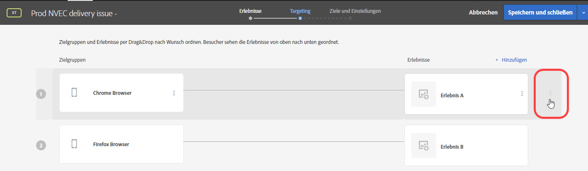 </p> <p>Weitere Informationen finden Sie unter <a href="../c-activities/t-experience-target/t-xt-create/xt-add-experience.md#task_454646F2895242D3B92DC395A0CE1A00" format="dita" scope="local"> Erlebnis erstellen </a>. </p> </td> 
  </tr> 
  <tr> 
   <td colname="col1"> <p>Berichterstellung: A/B, XT und Recommendations </p> </td> 
   <td colname="col2"> <p>Berichte für A/B, XT und Recommendations beinhalten visuelle Darstellungen, mit deren Hilfe Sie das Konfidenzintervall und den Lift visuell darstellen können, sodass sich der Gewinner genauer ermitteln lässt. Sie können die Maus über die Darstellungen bewegen, um die tatsächlichen Werte anzuzeigen. Diese Funktion steht nicht für Aktivitäten zur Verfügung, die Analytics als Berichtsquelle verwenden (A4T). </p> <p> 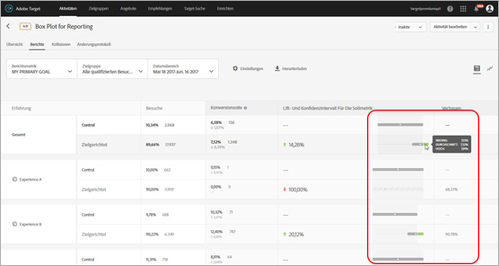 </p> <p>Weitere Informationen finden Sie unter <a href="../c-reports/c-report-settings/report-settings.md#concept_4BB6A7FDAB6F4806A632F9CD989B8BFA" format="dita" scope="local">Berichtseinstellungen</a>. </p> </td> 
  </tr> 
  <tr> 
   <td colname="col1" class="premium"> <p>AP-Aktivitäten (Automatisierte Personalisierung) </p> </td> 
   <td colname="col2"> <p>Sie können Ausschlussgruppen in AP-Aktivitäten erstellen, um sicherzustellen, dass Erlebnisse mit den zugewiesenen Angeboten automatisch ausgeschlossen werden. </p> </td> 
  </tr> 
  <tr> 
   <td colname="col1" class="premium"> <p>Recommendations: Kriterien und Promotions </p> </td> 
   <td colname="col2"> <p><b>(Veröffentlichung am 22. Juni 2017 geplant)</b> Von nun an können Sie dynamische Kriterien und Promotions basierend auf der Profilattributübereinstimmung und der Parameterübereinstimmung erstellen. </p> <p>  </p> <p>Weitere Informationen finden Sie unter <a href="../c-recommendations/c-algorithms/use-dynamic-and-static-inclusion-rules.md#concept_4CB5C0FA705D4E449BD0B37B3D987F9F" format="dita" scope="local">Verwenden dynamischer und statischer Einschlussregeln </a>. </p> <p> <p>Hinweis: Wenn Sie sich mit dem Konfigurieren von Einschlussregeln vor Target-Version 17.6.1 (Juni 2017) auskennen, werden Sie feststellen, dass sich einige Optionen und Operatoren geändert haben. Es werden nur die Operatoren angezeigt, die auf die ausgewählte Option angewendet werden können. Zudem wurden einige Operatoren umbenannt („stimmt überein“ heißt jetzt „gleich“), um die Konsistenz und die Intuitivität zu erhöhen. Alle vorhandenen Ausschlussregeln, die vor dieser Version erstellt worden sind, wurden automatisch in die neue Struktur migriert. Es ist keine Neustrukturierung Ihrerseits nötig. </p> </p> </td> 
  </tr> 
  <tr> 
   <td colname="col1"> <p>Benennen von Aktivitäten </p> </td> 
   <td colname="col2"> <p>Vor dem Speichern werden Sie nun zum Benennen der Aktivität aufgefordert. Das Speichern einer Aktivität ohne Namen ist nicht möglich. </p> </td> 
  </tr> 
  <tr> 
   <td colname="col1"> <p>Neuer Ort für das Target-Forum </p> </td> 
   <td colname="col2"> <p> Das Target-Forum befindet sich nun auf der neuen <a href="https://forums.adobe.com/community/experience-cloud/marketing-cloud/target" format="https" scope="external">Adobe Community-Plattform </a>. </p> </td> 
  </tr> 
 </tbody> 
</table>

### Target Standard/Premium 17.4.1 (27. April 2017) {#section_24E6889AF1E0405497F6F77A407A9A46}

Dieses Release umfasst die folgenden Funktionen und Erweiterungen:

<table id="table_9554D0094421417C88548BDC97B710F5"> 
 <thead> 
  <tr> 
   <th colname="col1" class="entry"> Funktion </th> 
   <th colname="col2" class="entry"> Details </th> 
  </tr> 
 </thead>
 <tbody> 
  <tr> 
   <td colname="col1"> Berichterstellung </td> 
   <td colname="col2"> <p><b>Anzeigen mehrerer Ziele/Metriken: </b>Sie können nun mehrere Metriken in A/B- und Experience Targeting (XT)-Aktivitäten anzeigen. Davon ausgenommen sind die A/B-Aktivitäten  <a href="../c-activities/automated-traffic-allocation/automated-traffic-allocation.md#concept_A1407678796B4C569E94CBA8A9F7F5D4" format="dita" scope="local"> Automatisierte Zuordnung</a> und <a href="../c-activities/auto-target-to-optimize.md#concept_67779E5B7F67427A97D7EA2A6FB919B3" format="dita" scope="local">Automatisches Targeting</a> von A/B-Aktivitäten. </p> <p>Weitere Informationen finden Sie unter <a href="../c-reports/c-report-settings/view-multiple-metrics.md#concept_9E3C3F6F3EC1412FAF252975AC0720B7" format="dita" scope="local">Anzeigen mehrerer Metriken in einem Bericht </a>. </p> </td> 
  </tr> 
 </tbody> 
</table>

Diese Version von [!DNL Target] konzentriert sich auf Backend-Korrekturen und enthält folgende Verbesserungen und Problembehebungen (Problemnummern in Klammern dienen der internen Verwendung durch Adobe):

* Es wurde ein Problem behoben, durch das die Einstellung „Anzahl inkrementieren, Benutzer freigeben &amp; erneute Eingabe zulassen“ in den erweiterten Einstellungen für Aktivitäten nicht korrekt funktionierte. (TNT-26556)
* Es wurde ein Problem behoben, durch das das Entfernen von Kundenattributdaten aus Target verhindert wurde, nachdem diese auf der Experience Cloud-Benutzeroberfläche mit NULL aktualisiert worden waren. (TNT-26462)

### Änderungen an der Target-Plattform (13. April 2017)  {#section_B59C26405EB7482AA80820D6D39B9C44}

<table id="table_6167ECB7B44F40DCADF299F46F1F795C"> 
 <thead> 
  <tr> 
   <th colname="col1" class="entry"> Ändern </th> 
   <th colname="col2" class="entry"> Details </th> 
  </tr> 
 </thead>
 <tbody> 
  <tr> 
   <td colname="col1"> <p> <span class="filepath"> at.js </span> </p> </td> 
   <td colname="col2"> <p> <span class="filepath"> at.js</span>, Version 0.9.6 ist verfügbar. Weitere Informationen finden Sie unter <a href="../c-implementing-target/c-implementing-target-for-client-side-web/how-to-deployatjs/implementing-target-without-a-tag-manager.md#concept_1E1F958F9CCC4E35AD97581EFAF659E2" format="dita" scope="local">at.js herunterladen</a>. </p> <p>Folgende Verbesserungen und Fehlerbehebungen sind in Version 0.9.6 von <span class="filepath">at.js</span> enthalten: </p> <p> 
     <ul id="ul_108DF85393614C69988E299485D338FD"> 
      <li id="li_4117C900982240B5AFFCFE1B2716A443"> <p>Unterstützung für Umleitungsangebote für A4T. Nachdem Sie Version 0.9.6 von <span class="filepath">at.js</span> heruntergeladen haben, können Sie Umleitungsangebote in Aktivitäten verwenden, die <span class="keyword">Adobe Analytics</span> als Berichtsquelle für <span class="keyword">Target</span> (A4T) nutzen. Neben Version 0.9.6 von <span class="filepath">at.js</span> bestehen weitere Mindestanforderungen für Ihre Implementierung, um Umleitungsangebote und A4T nutzen zu können. Weitere wichtige Informationen finden Sie unter <a href="../c-integrating-target-with-mac/a4t/r-a4t-faq/a4t-faq-redirect-offers.md#concept_21BF213F10E1414A9DCD4A98AF207905" format="dita" scope="local">Umleitungsangebote – A4T-FAQ </a>. </p> </li> 
      <li id="li_DA5321D72E81496DB7C49D589E1A59C4"> <p>Vor <span class="filepath">at.js</span> 0.9.6 galt: Wenn eine Besucher-API auf der Seite vorhanden und die Einstellung <span class="codeph">visitorApiTimeout</span> zu aggressiv war, konnte dies dazu führen, dass in der <span class="keyword">Target</span>-Anfrage keine MCID-Daten gesendet wurden. So konnte es bei der Verwendung von A4T zu Problemen wie z. B. aufgetrennten Treffern in <span class="keyword">Analytics</span> kommen. </p> <p>Dieses Verhalten wurde in Version 0.9.6 von <span class="filepath">at.js</span> geändert: Auch wenn <span class="codeph">visitorApiTimeout</span> auf „1 ms“ festgelegt ist, versucht Target, Daten zu SDID, Tracking-Servern und Kunden-IDs zu erfassen und sie in der Target-Anfrage zu senden. </p> </li> 
      <li id="li_B11CE11D9A594CB1ABB85BD0D93C4A15"> <p>Die Einstellung <span class="codeph">selectorsPollingTimeout</span> wurde hinzugefügt. Weitere Informationen finden Sie unter <a href="../c-implementing-target/c-implementing-target-for-client-side-web/cmp-atjs-functions.md#concept_8DACBC47ABDE4279BB102B42609FE506" format="dita" scope="local">targetGlobalSettings()</a>. </p> </li> 
      <li id="li_D6F862099A374FE394F4DA3520A1BBF0"> <p>Das Antwortformat von <span class="codeph">getOffer()</span> wurde geändert. Weitere Informationen finden Sie unter <a href="../c-implementing-target/c-implementing-target-for-client-side-web/cmp-atjs-functions.md#reference_C81525D1598A4A1199740DCAB81A7FDF" format="dita" scope="local">adobe.target.getOffer(options) </a>. </p> </li> 
      <li id="li_80166567ED8945ECB37FEEE2C5F06ACE"> <p>Die Konsolenprotokollierung für nicht unterstützte <span class="codeph">&lt;!DOCTYPE&gt;</span>-Deklarationen wurde hinzugefügt. </p> </li> 
      <li id="li_02904EBAE8D3400092B762F0B28B0C86"> <p>Es wurde ein Problem behoben, bei dem <span class="keyword">Target Classic</span>-Plug-ins nicht ordnungsgemäß angewendet wurden, wenn mehrere Standardangebote an eine Mbox gesendet wurden. (TGT-22664)</p> </li> 
      <li id="li_7016022D9DDE4529B77984F195825AB7"> <p>Die Cookie-Einstellung für Domänen auf oberster Ebene mit zwei Buchstaben wurde verbessert, um zu gewährleisten, dass das Mbox-Cookie für entsprechende Domänen korrekt festgelegt wird (z. B. <span class="filepath">test.no</span>, <span class="filepath">autodrives.ca</span> usw.). </p> </li> 
      <li id="li_3B1F618DEC744056B5BB172C4DBB359A"> <p>Der Algorithmus zum Extrahieren der Domäne der obersten Ebene, die beim Speichern von Cookies verwendet werden sollte, hat sich in <span class="codeph">at.js</span>-Version 0.9.6 geändert. Aufgrund dieser Änderung können keine Cookies für Adressen gespeichert werden, die IP verwenden. IP-Adressen werden größtenteils zu Testzwecken verwendet. Als Problemumgehung können Sie jedoch DNS-Einträge verwenden oder die Hosts-Datei auf einer lokalen Box anpassen. </p> </li> 
      <li id="li_A52181499E63402DB4E16E33E36A9400"> <p>Die Verarbeitung von Aktionen zum Verschieben und Neuanordnen bei Zeichenfolgenwerten anstelle von Ganzzahlen als Eigenschaften wurde korrigiert. </p> </li> 
     </ul> </p> <p>Weitere Informationen zu dieser und vorherigen Versionen von <span class="filepath">at.js</span> finden Sie unter <a href="../c-implementing-target/c-implementing-target-for-client-side-web/target-atjs-versions.md#reference_DBB5EDB79EC44E558F9E08D4774A0F7A" format="dita" scope="local">at.js-Versionsdetails </a>. </p> </td> 
  </tr> 
 </tbody> 
</table>

### Target Standard/Premium 17.3.1 (30. März 2017 – aktualisiert: 13. April 2017) {#section_5C13660A8AA34F35A9CBEFEEC88738D0}

Dieses Release umfasst die folgenden Funktionen und Erweiterungen:

<table id="table_4BA8DA701BC64427957355E144570EFE"> 
 <thead> 
  <tr> 
   <th colname="col1" class="entry"> Funktion </th> 
   <th colname="col2" class="entry"> Beschreibung </th> 
  </tr> 
 </thead>
 <tbody> 
  <tr> 
   <td colname="col1"> <p>Analytics for Target (A4T) </p> <p>Umleitungsangebote </p> </td> 
   <td colname="col2"> <p><b>Aktualisiert: 13. April 2017</b> </p> <p>Sie können jetzt Umleitungsangebote in Aktivitäten verwenden, die <span class="keyword">Analytics</span> als Berichtsquelle nutzen. </p> <p>Diese Bibliotheken müssen sowohl auf der Seite mit dem Umleitungsangebot als auch auf der Seite, auf die der Besucher umgeleitet wird, enthalten sein. Im Rahmen dieser Änderungen werden neue URL-Parameter automatisch zu Ihren Umleitungs-URLs hinzugefügt, wenn der Besucher-ID-Service auf Ihrer Seite implementiert wird – unabhängig davon, ob Sie Analytics als Berichtsquelle für diese Aktivität verwenden. </p> <p>Weitere Informationen finden Sie unter <a href="../c-integrating-target-with-mac/a4t/r-a4t-faq/a4t-faq-redirect-offers.md#concept_21BF213F10E1414A9DCD4A98AF207905" format="dita" scope="local">Umleitungsangebote – A4T-FAQ</a>. </p> </td> 
  </tr> 
  <tr> 
   <td colname="col1"> <p>Zielgruppen </p> </td> 
   <td colname="col2"> <p>Beim Zielgruppen-Targeting wurden folgende Verbesserungen vorgenommen: </p> <p> 
     <ul id="ul_C920198404654C97A33190A29ACA6990"> 
      <li id="li_DB52EF909C9640649981940460CDF2B5"> <p><b>Wochen- und Tagesaufteilung:</b> Sie können Optionen zur <span class="wintitle">Wochen- und Tagesaufteilung</span> festlegen, um wiederkehrende Muster für das Zielgruppen-Targeting zu erstellen. </p> <p>Weitere Informationen finden Sie unter <a href="../c-target/c-audiences/c-target-rules/time-frame.md#concept_0FE1E8DACD104F8B870B0BADE3197F0A" format="dita" scope="local">Zeitraum </a>. </p> </li> 
      <li id="li_2541A6EF2D604CE098012A16909C237E"> <p><b> Ausschlüsse in kombinierten Zielgruppen: </b>Sie können jetzt Ausschlussregeln hinzufügen und Zielgruppen ausschließen, wenn mehrere Zielgruppen kombiniert werden. </p> <p>Weitere Informationen finden Sie unter <a href="../c-target/combining-multiple-audiences.md#concept_A7386F1EA4394BD2AB72399C225981E5" format="dita" scope="local">Mehrere Zielgruppen kombinieren </a>. </p> </li> 
     </ul> </p> </td> 
  </tr> 
  <tr> 
   <td colname="col1" class="premium"> <p>Recommendations </p> </td> 
   <td colname="col2"> <p><b>Dynamische Promotions: </b>Target Recommendations unterstützen jetzt dynamische Übereinstimmungen für Promotions. </p> <p>Weitere Informationen finden Sie unter <a href="../c-recommendations/c-algorithms/use-dynamic-and-static-inclusion-rules.md#concept_4CB5C0FA705D4E449BD0B37B3D987F9F" format="dita" scope="local">Verwenden dynamischer und statischer Einschlussregeln </a>. </p> </td> 
  </tr> 
 </tbody> 
</table>

>[!NOTE]
>
>Die Möglichkeit mehrere Metriken in einem Bericht anzuzeigen, die mit Target 17.3.1 (30. März 2017) eingeführt worden war, wurde entfernt, weil es zu unerwartetem Verhalten kam. Diese Funktion wird in einer zukünftigen Version wieder verfügbar sein.

Diese Version von [!DNL Target] umfasst die folgenden Verbesserungen und Fehlerbehebungen:

* Die [!DNL Target]-Benutzeroberfläche wurde aktualisiert, um Umleitungsangebote in Aktivitäten zu unterstützen, die [!UICONTROL Analytics for Target] (A4T) als Berichtsquelle verwenden. Für diese Funktion wird die Bibliothek [!DNL at.js] 0.9.6 benötigt, die demnächst verfügbar sein wird.
* Die [!DNL Target]-Benutzeroberfläche wurde an einigen Stellen aktualisiert:

   * Auf einige Optionen in Berichten und Aktivitäten ([!UICONTROL Bearbeiten], [!UICONTROL Im Feed freigeben], [!UICONTROL Erlebnis-URLs anzeigen] usw.) erfolgt der Zugriff jetzt über das Symbol [!UICONTROL Weitere Optionen] (

      ).
   * In der Bibliothek [!UICONTROL Angebote] werden Angebote jetzt als Liste und nicht mehr als Karten angezeigt. Weitere kleinere Änderungen der Benutzeroberfläche der gesamten Bibliothek [!UICONTROL Angebote] wurden durchgeführt.

* Die Leistung der Listen [!UICONTROL Aktivität] und [!UICONTROL Zielgruppe] wurde signifikant verbessert. Außerdem wurden die Ladezeiten für Suchergebnisse deutlich beschleunigt.
* Im Bericht [!UICONTROL Angebotsebene] für [!UICONTROL Automatisierte Personalisierung] sind „Ansichten“ jetzt „Besuche“.
* [!DNL Target] unterstützt jetzt das Wechseln der Umgebungen (Hostgruppen) für Aktivitäten mit [!UICONTROL automatisierter Personalisierung].
* Aktivitäten mit [!UICONTROL automatisierter Personalisierung] unterstützen jetzt Hostgruppen.

### Target Standard/Premium 17.2.1 (21. Februar 2017) {#section_FC6412353DE64E848FFD5E8EFF72C7C7}

>[!NOTE]
>
>[!DNL Adobe Experience Manager] 6.2 mit FP-11577 (oder höher) unterstützt jetzt [!DNL at.js]-Implementierungen mit [!UICONTROL Adobe Target Cloud Services]-Integration. Weitere Informationen finden Sie unter [Feature Packs](https://docs.adobe.com/docs/en/aem/6-2/release-notes/feature-packs.html) und [Integrieren mit Adobe Target](https://docs.adobe.com/docs/en/aem/6-2/administer/integration/marketing-cloud/target.html) in der Dokumentation zu *Adobe Experience Manager 6.2*.

In dieser [!DNL Target]-Version liegt der Schwerpunkt auf Verbesserungen der Benutzerfreundlichkeit und der Leistung. Sie enthält außerdem folgende Verbesserungen und Fehlerbehebungen (die in Klammern angegebenen Nummern dienen Adobe zu internen Zwecken):

* Zum Hilfemenü, auf das über die rechte obere Ecke der [!DNL Target]-Benutzeroberfläche zugegriffen werden kann, wurden zusätzliche Elemente hinzugefügt. Zu den neuen Optionen gehören: „Blogs“ und „Videos“. Die Option „Adobe Experience Cloud-Status“ heißt jetzt „Adobe Target Standard/Premium-Status“. (TGT-22629)
* Beim Löschen einer Zielgruppe zeigt [!DNL Target] eine Liste der Aktivitäten an, die diese Zielgruppe verwenden. Der Benutzer kann in der Liste auf die einzelnen Aktivitäten klicken, damit die zugehörige [!UICONTROL Übersicht] angezeigt wird. (TGT-17997)
* `user.activeCampaigns` wurde dahingehend verbessert, dass die Kampagnen-ID für alle Kampagnen/Aktivitäten zurückgegeben werden, in denen sich der Benutzer befindet. Dies passiert auch dann, wenn er in der aktuellen Sitzung nicht mit der Kampagne/Aktivität interagiert hat. (TNT-26237)
* Die Schaltfläche [!UICONTROL Aktivität erstellen] auf der Seite [!UICONTROL Aktivitäten] ist jetzt bereits vor dem Laden sämtlicher in der Liste vorhandener Aktivitätennamen aktiv. Durch diese Verbesserung können Benutzer neue Aktivitäten schneller erstellen, wenn das Konto viele konfigurierte Aktivitäten enthält. (TGT-21470)
* Der Enhanced Experience Composer (EEC) wurde verbessert, um die Ladezeiten für Websites mit HTTPS zu verbessern, auf die über einen Proxy zugegriffen wird. Target ruft über einen Proxy keine Statistikressourcen mehr ab. (TGT-21793)
* Die Seite [!UICONTROL Ziele und Einstellungen] wurde verbessert. Dies gilt insbesondere für die Ladezeit, wenn für eine Aktivität viele Metriken definiert sind. (TGT-21654)
* Added a tool tip on the [!UICONTROL Goals &amp; Settings] page of all activities using [!UICONTROL Analytics for Target] (A4T) reporting informing users that a tracking server is not required if the activity&#39;s pages have at.js (version 0.9.1 or later) loaded. (TGT-22607)
* Metriknamen werden auf der Seite [!UICONTROL Ziele und Einstellungen] jetzt angezeigt, ohne dass der Benutzer die einzelnen Metriken erweitern muss, um den vollständigen Namen zu sehen. Durch diese Verbesserung können Benutzer Metriken schneller und effizienter bearbeiten. (TGT-21276)
* Sie können jetzt Einschlussregeln für [!DNL Recommendations] auf benutzerdefinierte Kriterien (als CSV-Datei hochgeladen) genau wie auf andere Kriterien anwenden. (TGT-21896)
* Die Benutzeroberfläche der Seite [!UICONTROL Angebote] wurde verbessert und vereinfacht. Dies betrifft insbesondere das Erstellen und Verwalten von Ordnern und das Erstellen von Angeboten. (TGT-22509 und TGT-22187)
* Die Benutzerfreundlichkeit des [!UICONTROL Visual Experience Composer] (VEC) wurde im Hinblick auf die Auswahl auszublendender Elemente verbessert.
(TGT-22224)
* Die Benutzerfreundlichkeit im [!UICONTROL Form-Based Experience Composer] wurde im Hinblick auf das Erstellen von Aktivitäten verbessert. Wenn ein Mbox-Ort ausgewählt wird, wird der Validierungsrahmen auch nach dem Klicken auf [!UICONTROL Weiter] angezeigt. (TGT-22221)
* In heruntergeladenen Berichten wurde die Unterscheidung zwischen aktiven und gelöschten Angeboten verbessert. (TGT-22449)
* Ein Problem wurde behoben, das verhindert hatte, dass ältere Assets in der unbegrenzt scrollbaren Assetliste auf der Benutzeroberfläche der Experience Cloud Assets-Kerndienste angezeigt wurden. (TGT-19733)
* Ein Problem mit der Nichtberücksichtigung der Einstellung für extreme Bestellungen in heruntergeladenen CSV-Berichten wurde behoben. (TGT-21871)
* Das Problem, dass extreme Bestellungen im heruntergeladenen CSV-Bericht [!UICONTROL Bestelldetails] nicht korrekt gekennzeichnet waren, wurde behoben. (TGT-22500)
* Ein Problem wurde behoben, das für die Anzeige eines falschen Bestellzeitpunkts im heruntergeladenen [!UICONTROL Campaign Audit-Bericht] gesorgt hatte, obwohl der Bericht das richtige Bestelldatum enthielt. (TNT-26469)
* Ein Problem wurde behoben, das die ordnungsgemäße Funktion der Option [!UICONTROL JavaScript deaktivieren] auf Aktivitäten mit mehreren Seiten verhindert hatte. (TGT-15130)
* Wenn Sie den Form-Based Experience Composer mit einer anderen Mbox als der automatisch erstellten globalen Mbox (`target-global-mbox`) verwenden und dann eine Interaktionsmetrik als Erfolgsmetrik auswählen, dann wird die Metrik nur auf Seiten erhöht, auf denen die Mbox in der Aktivität verwendet wird. Wenn Ihre Mbox z. B. `homepage_mbox` ist, erhält die Metrik [!UICONTROL Seiten pro Besuch] die Anzahl der Treffer für `homepage_mbox` während des Besuchs.

   Wenn das nicht gewünscht ist, können Sie einen weiteren Ort zur Aktivität hinzufügen und die globale Mbox diesem Ort zuweisen und ihr Standardinhalt zuteilen. Diese Problemumgehung verbindet die globale Mbox mit der Aktivität und ermöglicht Target die Nutzung der Metrik für die Berichterstellung.

### Änderungen an der Target-Plattform (18. Januar 2017)  {#section_EA41802B2B24426FBA88D25E17DBE360}

<table id="table_3A2CD47252894F119B0E60BF6A9285B0"> 
 <thead> 
  <tr> 
   <th colname="col1" class="entry"> Ändern </th> 
   <th colname="col2" class="entry"> Details </th> 
  </tr> 
 </thead>
 <tbody> 
  <tr> 
   <td colname="col1"> <p> <span class="codeph"> at.js</span>, Version 0.9.4 </p> </td> 
   <td colname="col2"> <p>18. Januar 2017 </p> <p> <span class="codeph"> at.js</span>, Version 0.9.4 enthält folgende Änderungen: </p> <p> 
     <ul id="ul_8F149C28E2D946B9888B4D2F45167C3C"> 
      <li id="li_93E866BBFE374E93BCDB65BCFAC33B62"> <p> Mbox-Namen können jetzt Sonderzeichen wie das kaufmännische Und ( &amp; ) enthalten. (TNT-26144) </p> <p>Weitere Informationen finden Sie unter <a href="../c-implementing-target/c-implementing-target-for-client-side-web/how-to-deployatjs/implementing-target-without-a-tag-manager.md#concept_2FA0456607D04F82B0539C5BF5309812" format="dita" scope="local">at.js-Konfigurationen</a>. </p> </li> 
      <li id="li_99309046030B4D93B59113C01A8789DA"> <p>Funktion <span class="codeph">secureOnly</span> hinzugefügt, die anzeigt, ob <span class="codeph">at.js</span> nur HTTPS verwenden soll oder ob es möglich ist, dass basierend auf dem Seitenprotokoll zwischen HTTP und HTTPS umgeschaltet wird. Es handelt sich hierbei um eine erweiterte Einstellung, deren Standardwert „false“ (falsch) lautet und die von <span class="codeph">targetGlobalSettings</span> überschrieben werden kann. (TNT-26183) </p> <p>Weitere Informationen finden Sie unter <a href="../c-implementing-target/c-implementing-target-for-client-side-web/cmp-atjs-functions.md#concept_8DACBC47ABDE4279BB102B42609FE506" format="dita" scope="local">targetGlobalSettings()</a>. </p> </li> 
      <li id="li_D84D578C43A24D4896795999F841CEB8"> <p>Die Option <span class="wintitle">Unterstützung älterer Browser</span> ist in <span class="codeph">at.js</span>, Version 0.9.3 und älter verfügbar. Diese Option wurde in <span class="codeph">at.js</span>, Version 0.9.4 entfernt. </p> <p>Weitere Informationen finden Sie unter <a href="../c-implementing-target/c-implementing-target-for-client-side-web/how-to-deployatjs/implementing-target-without-a-tag-manager.md#concept_2FA0456607D04F82B0539C5BF5309812" format="dita" scope="local">at.js-Konfigurationen</a>. </p> </li> 
     </ul> </p> <p>Detaillierte Informationen über die Änderungen der Versionen von <span class="codeph">at.js</span> finden Sie in den <a href="https://docs.adobe.com/content/help/en/target/using/implement-target/client-side/target-atjs-versions.html" format="html" scope="external">Versionshinweisen zu „at.js“</a>. </p> </td> 
  </tr> 
 </tbody> 
</table>

### Target Standard/Premium 17.1.1 (19. Januar 2017) {#section_88AFA2F54CF24DF7822CFEBB07DFABE2}

Dieses Release umfasst die folgenden Funktionen und Erweiterungen:

<table id="table_4F7D4A71F5DF4E8782C7DBEEEF24AD04"> 
 <thead> 
  <tr> 
   <th colname="col1" class="entry"> Funktion </th> 
   <th colname="col2" class="entry"> Beschreibung </th> 
  </tr> 
 </thead>
 <tbody> 
  <tr> 
   <td colname="col1"> <p>Inhalt/Angebote </p> </td> 
   <td colname="col2"> <p>Folgende Verbesserungen sind nun für Angebote verfügbar: </p> <p> 
     <ul id="ul_7D8E81443E0F48B6A0C1D1DF6F27D292"> 
      <li id="li_EA529EF4EBC2416E9D3B9E7251E7AAAB"> <p>Die Inhaltsseite wurde in „Angebote“ umbenannt. Zudem finden sich nun rechts zwei Registerkarten, mit denen Code-Angebote und Bildangebote getrennt werden. </p> <p>Befanden sich vor dieser Version Code und Bilder im selben Ordner, werden diese von Target auf zwei duplizierte Ordner aufgeteilt. </p> </li> 
      <li id="li_9574FA6BDCFB4BAB938273BF7F4B21C8"> <p>Mit Target Classic, Adobe Experience Manager (AEM), Adobe Mobile Services (AMS) und APIs erstellte Angebote werden nun in der Benutzeroberfläche von Target Standard/Premium angezeigt. In Target Classic erstellte Angebote können in Target Standard/Premium bearbeitet werden. (TGT-15738) </p> <p> Angebote, die in den letzten zwei Jahren mit diesen Methoden aktualisiert wurden (d. h. ab Version Januar 2015), sind ebenfalls in Target Standard/Premium sichtbar. </p> </li> 
      <li id="li_CAD67C9EBB564525ABD2269D918275F8"> <p>Sie können Angebote nun nach Quelle und Typ filtern. </p> </li> 
     </ul> </p> <p>Weitere Informationen finden Sie unter <a href="../c-experiences/c-manage-content/manage-content.md#concept_17874A6FCBB743AA84C5988E8571CCF3" format="dita" scope="local">Angebote</a>. </p> <p>Folgende Verbesserungen wurden am Targeting nach geografischem Standort vorgenommen: </p> <p> 
     <ul id="ul_DD8B50F980B8447A8C37EA96530D8949"> 
      <li id="li_348E04AB29B14E6F83E3A7E7BF7D75B8"> <p>Sie können Werte des Typs <span class="codeph">profile.geolocation</span> nun direkt als Token in Angeboten, Plugins und so weiter verwenden. (TNT-25967) </p> </li> 
     </ul> </p> <p>Weitere Informationen finden Sie unter <a href="../c-target/c-audiences/c-target-rules/geo.md#concept_5B4D99DE685348FB877929EE0F942670" format="dita" scope="local">Geo</a>. </p> </td> 
  </tr> 
  <tr> 
   <td colname="col1"> <p>Berichterstellung </p> <p> <p>Hinweis: Diese Verbesserungen gelten nicht für Analytics for Target-(A4T-)Berichte. </p> </p> </td> 
   <td colname="col2"> <p>Folgende Verbesserungen der Berichterstellung sind nun in Target verfügbar. </p> <p> 
     <ul id="ul_ACFCA821B120419EA252EF5031309D52"> 
      <li id="li_0B634602BB044AEDB26DAF78189AB833"> <p>Die Benutzeroberfläche für Berichte wurde neu gestaltet. </p> </li> 
      <li id="li_309435D10AE84E8795C4CCC1F36747F7"> <p>Target-Berichte können nun zurückgesetzt werden, um alte Daten zu löschen. (TGT-5933) </p> </li> 
      <li id="li_9D30BFCC4CD6461B9DDCD5797A5E2B3A"> <p>Die Zählmethodikoptionen für die Berichterstellung umfassen nun Besucher (Standard), Besuche und Aktivitätsimpressionen. (TGT-10002) </p> </li> 
     </ul> </p> <p>Weitere Informationen finden Sie unter <a href="../c-reports/c-report-settings/report-settings.md#concept_4BB6A7FDAB6F4806A632F9CD989B8BFA" format="dita" scope="local">Berichtseinstellungen</a> und <a href="../c-reports/conversion-rate.md#concept_EC19BC897D66411BABAF2FA27BCE89AA" format="dita" scope="local">Zählmethode</a>. </p> <p>Folgende Verbesserungen der Berichterstellung sind nun für herunterladbare CSV-Berichte verfügbar: </p> <p> 
     <ul id="ul_18B0636A41B94F9F903ABFE3E13285DA"> 
      <li id="li_2422075AA0A34F868809C5D580FC5D4B"> <p>Der CSV-Angebotsbericht verfügt nun über zusätzliche Angaben zu den Angeboten. (TGT-18995) </p> </li> 
      <li id="li_659D126E846348D4BE4544962F41539F"> <p>Heruntergeladene CSV-Dateien mit Angebotsberichten enthalten nun für Berichte zur <span class="wintitle">automatisierten Personalisierung</span> stets Daten des Kontrollelements sowie zielgerichteten Segmenten. (TGT-22000) </p> </li> 
     </ul> </p> <p>Folgende Verbesserungen stehen nun für die Berichte zur automatisierten Personalisierung (AP) zur Verfügung. </p> <p> 
     <ul id="ul_5743684487CD4905BA998C298FD423D7"> 
      <li id="li_EB48BA21E00C4878B4408D24DD23BA9C"> <p>Verbesserte Berichtsladezeit für automatisierte Personalisierungsaktivitäten. </p> </li> 
      <li id="li_B8ECCE250A674B83A66705AD5C45B9C3"> <p>Das Konfidenzintervall für kontinuierliche Variablen (Metriktypen Umsatz und Interaktion) wird nun in Zusammenfassungsberichten zur automatisierten Personalisierung aufgeführt. </p> </li> 
     </ul> </p> </td> 
  </tr> 
  <tr> 
   <td colname="col1"> <p>Aktivitäten </p> </td> 
   <td colname="col2"> <p>Folgende Angebotsverbesserungen sind nun in Target verfügbar: </p> <p> 
     <ul id="ul_436556860E6C4AEEB35411A02E78A199"> 
      <li id="li_5CC3B995D0AF4B658B3D6C3F6895AA41"> <p>In <span class="keyword">Adobe Mobile Services</span> erstellte Angebote werden nun in der Benutzeroberfläche von <span class="keyword">Target Standard/Premium</span> angezeigt. (TGT-10806) </p> <p>Weitere Informationen finden Sie unter <a href="../c-activities/activities.md#concept_D317A95A1AB54674BA7AB65C7985BA03" format="dita" scope="local">Aktivitäten</a>. </p> </li> 
      <li id="li_684F9FC5CF414F4A892E6495352B5939"> <p>Sie können nun bei der Erstellung von multivariaten Tests über 10 Prozent der Erlebnisse aus dem Test ausschließen, vorausgesetzt Sie sind damit einverstanden, dass für die Analyse Offline-Berichterstellungen genutzt werden. (TGT-21719) </p> <p>Weitere Informationen finden Sie unter <a href="../c-activities/c-multivariate-testing/t-create-multivariate-test/preview-experiences.md#task_21A700587E88453A9FC2210C0DE53A28" format="dita" scope="local">Erlebnisse für einen multivariaten Test vorher ansehen</a>. </p> </li> 
      <li id="li_B2FC7414C76848B39AD6EA20EE483F06"> <p>Die Kampagnen-ID wird nun auf der Übersichtsseite von Aktivitäten angezeigt. Besonders nützlich ist dies für die Verwendung von APIs und für die Fehlerbehebung. (TGT-20928) </p> </li> 
      <li id="li_5A9880AFE5FB46168D92255AA088B854"> <p>Das Design der Seiten „Kollisionen“ und „Änderungsprotokoll“ wurde verbessert. </p> </li> 
      <li id="li_1489EA6C30C94B2AB394189E5FAFF6F6"> <p>Die maximal zulässige Länge anonymer Angebotsnamen für Aktivitäten mit automatisierter Personalisierung (AP) wurde von 30 auf 250 Zeichen angehoben. </p> </li> 
     </ul> </p> </td> 
  </tr> 
  <tr> 
   <td colname="col1"> <p>Zielgruppen </p> </td> 
   <td colname="col2"> <p>Folgende Verbesserungen sind nun für Zielgruppen verfügbar: </p> <p> 
     <ul id="ul_F1D1F97266134D4ABE627CF2DCE2C6D4"> 
      <li id="li_99A611FCC1254D229D79B8FD075B952A"> <p> Die <span class="wintitle">Gerätemarketingbezeichnung</span> ist nun als integrierte Option der Dropdownliste zur Erstellung von Zielgruppen-Targeting für Mobilgeräte verfügbar. </p> <p>Mithilfe dieser Änderungen können Sie problemlos ein Gerätemodell nach Namen wählen, anstatt nach der zugehörigen Modellnummer suchen zu müssen. Der Marketinggerätename des Galaxy S7 lautet beispielsweise „Samsung Galaxy S7 Edge“, das Gerätemodell hingegen „SM-G9350“. (TGT-18393) </p> <p>Weitere Informationen finden Sie unter <a href="../c-target/c-audiences/c-target-rules/mobile.md#concept_2A794199DC1A4D349FFFBC7DCF1FEB89" format="dita" scope="local">Mobilgeräte</a>. </p> </li> 
     </ul> </p> </td> 
  </tr> 
  <tr> 
   <td colname="col1" class="premium"> <p>Recommendations </p> </td> 
   <td colname="col2"> <p>Folgende Verbesserungen wurden an Recommendations vorgenommen: </p> <p> 
     <ul id="ul_9D3644890C0C472D8B485DE9A52898B3"> 
      <li id="li_1E5662348F6E4ABDB2B74FE3326F2FD3"> <p>Die Ergebniszeile des Sicherungsalgorithmus ist nun in den CSV-Downloads für am meisten angezeigte und am meisten gekaufte Elemente enthalten. Die Sicherungs-Recommendation beginnt mit „*,“ </p> </li> 
      <li id="li_91DFD809378D4C20918F8F875747CE07"> <p>Zusätzliche Statusmeldungen informieren Sie über den Fortschritt Ihrer Recommendations-Feeds. </p> <p>Weitere Informationen finden Sie unter <a href="../c-recommendations/c-products/feeds.md#concept_1228B31E3D0B483B9DD42C5E2AE436E3" format="dita" scope="local">Feeds </a>. </p> </li> 
     </ul> </p> </td> 
  </tr> 
  <tr> 
   <td colname="col1"> <p>Enhanced Visual Experience Composer (VEC) </p> </td> 
   <td colname="col2"> <p>IP-Adressen für den Enhanced Visual Experience Composer (VEC) wurden aktualisiert. </p> <p>Wenn Sie für das VEC verwendete IP-Adressen als Zulassungsliste angeben, fügen Sie die neuen IP-Adressen hinzu. </p> <p>Weitere Informationen finden Sie unter <a href="../c-experiences/c-visual-experience-composer/r-troubleshoot-composer/troubleshoot-composer.md#reference_77743144F10143A3A89D56E116D296E4" format="dita" scope="local">Fehlerbehebung beim Visual Experience Composer </a>. </p> </td> 
  </tr> 
 </tbody> 
</table>

## Versionen 2016 {#reference_607661929B504CCFAB3791B13C0DCDBE}

### Target Standard/Premium 16.10.2 (8. November 2016) {#section_2FDEFB3D56CC4BD7BC04DBEECFF6E942}

**Fehlerkorrekturen**

Dieses Release enthält die folgenden Fehlerbehebungen:

* Behebung eines Fehlers in [!DNL Recommendations], bei dem keine Feeds für Umgebungen erstellt werden konnten, die nicht dem Standard (Hostgruppen) entsprachen.
* Einführung einiger Verbesserungen zur Reduzierung von Synchronisierungsfehlern bei Aktivitäten.
* Sie können unter Verwendung von [!DNL Analytics for Target] (A4T) keine Umleitungsangebote mehr für Aktivitäten erstellen.

### Target Standard/Premium 16.10.1 (25. Oktober 2016) {#section_F76F7329FCAC452FB88F8BE0BA727044}

Dieses Release umfasst die folgenden Funktionen und Erweiterungen:

<table id="table_F8C01B2A9F07443490DB3025AC3AAC2A"> 
 <thead> 
  <tr> 
   <th colname="col1" class="entry"> Funktion </th> 
   <th colname="col2" class="entry"> Beschreibung </th> 
  </tr> 
 </thead>
 <tbody> 
  <tr> 
   <td colname="col1"> Automatische Zuordnung: Gewinnerabzeichen </td> 
   <td colname="col2"> <p>Es ist jetzt einfacher, einen Gewinner bei der automatischen Zuordnung von A/B-Aktivitäten zu bestimmen. </p> <p>Viele Marketingexperten machen den Fehler, ein Erlebnis vorzeitig zum Gewinner zu erklären, bevor endgültige Ergebnisse vorliegen. </p> <p>Mit der Funktion <span class="wintitle">„Automatisierte Traffic-Zuordnung“</span> zeigt <span class="keyword">Target</span> oben auf der Seite der Aktivität ein Abzeichen mit „Noch kein Gewinner“ an, bis bei der Aktivität die Mindestanzahl an Konversionen mit ausreichender Konfidenz erreicht wird. Wenn ein eindeutiger Gewinner feststeht, zeigt <span class="keyword">Target</span> „Gewinner: Erlebnis X“ an. </p> <p>Weitere Informationen finden Sie unter <a href="../c-activities/automated-traffic-allocation/automated-traffic-allocation.md#concept_A1407678796B4C569E94CBA8A9F7F5D4" format="dita" scope="local">Automatische Traffic-Zuordnung</a> und <a href="../c-activities/automated-traffic-allocation/determine-winner.md#concept_5741A89ED7224E1285A3BC34B2CCD0F9" format="dita" scope="local">Einen Gewinner bestimmen</a>. </p> <p> <p>Hinweis: Automatisch zugewiesene A/B-Aktivitäten werden von Analytics for Target (A4T) in Zukunft nicht mehr unterstützt. Mit dieser Version werden sämtliche aktiven automatisch zugewiesenen A/B-Aktivitäten, bei denen A4T aktiviert ist, auf den Modus <span class="wintitle">Manuell</span> umgestellt (gleiche Traffic-Zuordnung). </p> </p> </td> 
  </tr> 
  <tr> 
   <td colname="col1"> Targeting von Mobilgeräten nach Netzbetreiber </td> 
   <td colname="col2"> <p>Eine Zielgruppe für das Targeting von Mobilgeräten anhand des Mobilnetzbetreibers (Verizon, Sprint, AT&amp;T, T-Mobile usw.) erstellen. Die <span class="wintitle">Mobilnetzbetreiber</span>-Option ist unter den <span class="wintitle">Geo</span>-Einstellungen zu finden. </p> <p>Weitere Informationen finden Sie unter <a href="../c-target/c-audiences/c-target-rules/geo.md#concept_5B4D99DE685348FB877929EE0F942670" format="dita" scope="local">Geo</a>. </p> </td> 
  </tr> 
  <tr> 
   <td colname="col1"> mboxTrace-Authentifizierungstoken aus der Target-Benutzeroberfläche erstellen </td> 
   <td colname="col2"> <p>Erstellen Sie ein temporäres Authentifizierungstoken, um auf erweiterte <span class="keyword">Target</span>-Debugging-Werkzeuge zuzugreifen. </p> <p>Click <span class="uicontrol"> Generate Authentication Token </span> on the <span class="wintitle"> Implementation Details </span> page ( <span class="uicontrol"> Administration </span> &gt; <span class="uicontrol"> Implementation </span>). Der entstandene Parameter kann daraufhin Ihren Webseiten-URLs zur Fehlerbehebung hinzugefügt werden. </p> <p>Weitere Informationen finden Sie unter „Abrufen des Autorisierungstokens zur Verwendung mit Debuggingwerkzeugen“ in  <a href="../c-activities/c-troubleshooting-activities/content-trouble.md#concept_D2548B486C984B1E97ED7A72075B8EEA" format="dita" scope="local"> Fehlerbehebung Inhaltsbereitstellung </a>. </p> </td> 
  </tr> 
  <tr> 
   <td colname="col1" class="premium"> Recommendations: Sequenzierung des Kriterienkatalogs </td> 
   <td colname="col2"> <p>Die Nutzung von Katalogen von bis zu fünf vorab erstellten Kriterien erlaubt eine bessere Steuerung der Empfehlungen, die Nutzern angezeigt werden. </p> <p>Weitere Informationen finden Sie unter <a href="/help/c-recommendations/c-algorithms/create-criteria-sequence.md"> Create Criteria Sequences </a>. </p> </td> 
  </tr> 
  <tr> 
   <td colname="col1" class="premium"> Recommendations: Externe Promotions einfügen </td> 
   <td colname="col2"> <p>Fügen Sie Promotionsartikel hinzu und steuern Sie deren Platzierung in Ihren Recommendations-Designs. </p> <p>Weitere Informationen finden Sie unter <a href="../c-recommendations/t-create-recs-activity/adding-promotions.md#task_CC5BD28C364742218C1ACAF0D45E0E14" format="dita" scope="local">Promotions hinzufügen</a>. </p> </td> 
  </tr> 
  <tr> 
   <td colname="col1" class="firstlook"> <p><b>Erster Test</b> </p> Automatisches Targeting in A/B-Aktivitäten </td> 
   <td colname="col2"> <p> <p>Hinweis: Dieses „First Look“-Angebot ist in dieser Version nur für einige wenige Kunden zu Test- und Feedback-Zwecken aktiviert. </p> </p> <p>Durch das automatische Targeting von Erfahrungen in A/B-Tests kann dem richtigen Besucher die richtige Erfahrung angeboten werden. </p> <p>Weitere Informationen finden Sie unter <a href="../c-activities/auto-target-to-optimize.md#concept_67779E5B7F67427A97D7EA2A6FB919B3" format="dita" scope="local">Automatisches Targeting für personalisierte Erfahrungen</a>. </p> </td> 
  </tr> 
 </tbody> 
</table>

### Änderungen an der Target-Plattform (10. Oktober 2016) {#section_0761AED70C3E44EA9D8546107B162CC1}

<table id="table_E3E52A4362724D05A8472DB5F51A2429"> 
 <thead> 
  <tr> 
   <th colname="col1" class="entry"> Ändern </th> 
   <th colname="col2" class="entry"> Details </th> 
  </tr> 
 </thead>
 <tbody> 
  <tr> 
   <td colname="col1"> <p> <span class="codeph"> at.js</span>, Version 0.9.3 </p> </td> 
   <td colname="col2"> <p>10. Oktober 2016 </p> <p> <span class="codeph"> at.js</span>, Version 0.9.3 ist verfügbar. </p> <p> 
     <ul id="ul_E4D300700390433E9EF8D5C9D3AA7669"> 
      <li id="li_E916EB3A77ED4CFF90CF6B4D30F188B1"> <p>Stellt sicher, dass Mbox-Aufrufe in Microsoft Internet Explorer 11 ausgelöst werden, wenn veraltete Browser in den <span class="codeph">at.js</span>-Einstellungen deaktiviert sind. </p> </li> 
      <li id="li_1130509832CE429DB6DE636404CC54E1"> <p>Stellt sicher, dass Standardinhalte wiedergegeben werden, wenn ein dynamisches Remote-Angebot fehlschlägt (wenn beispielsweise die URL nicht korrekt ist und eine 404-Fehlermeldung angezeigt wird). </p> </li> 
      <li id="li_21B5225D894B43CB863A775C937F66F4"> <p>Stellt sicher, dass Elemente schnell angezeigt werden, wenn im DOM keine Selektoren für VEC-Clicktracking gefunden werden. </p> </li> 
     </ul> </p> <p>Weitere Informationen finden Sie unter <a href="../c-implementing-target/c-implementing-target-for-client-side-web/target-atjs-versions.md#reference_DBB5EDB79EC44E558F9E08D4774A0F7A" format="dita" scope="local">at.js-Versionsdetails </a>. </p> </td> 
  </tr> 
 </tbody> 
</table>

### Target Standard/Premium 16.9.1 (22. September 2016) {#section_3CD20678B6254DE1A9BD41FDD2255DDD}

Dieses Release umfasst die folgenden Funktionen und Erweiterungen:

<table id="table_FED049F97C054CA895E0AEA3F2B180BF"> 
 <thead> 
  <tr> 
   <th colname="col1" class="entry"> Funktion </th> 
   <th colname="col2" class="entry"> Beschreibung </th> 
  </tr> 
 </thead>
 <tbody> 
  <tr> 
   <td colname="col1"> Kombinieren von Zielgruppen </td> 
   <td colname="col2"> <p>Kombinieren mehrerer Zielgruppen (einschließlich <span class="keyword">Adobe Experience Cloud</span>- und <span class="keyword">Target</span>-Zielgruppen) ohne Zwischenschritte im Arbeitsablauf für die Erstellung von Aktivitäten. </p> <p>Sie können beispielsweise Stammkunden hinzufügen, indem Sie ein bestimmtes Segment für den Treuestatus in <span class="keyword">Audience Manager</span> hinzufügen und es mit einem <span class="keyword">Target</span>-Segment, bestehend aus aktuell für das Treueprogramm angemeldeten Benutzern, kombinieren, anstatt eine dritte, permanente Zielgruppe zu erstellen. </p> <p>Weitere Informationen finden Sie unter <a href="../c-target/combining-multiple-audiences.md#concept_A7386F1EA4394BD2AB72399C225981E5" format="dita" scope="local">Mehrere Zielgruppen kombinieren </a>. </p> </td> 
  </tr> 
  <tr> 
   <td colname="col1"> Targeting von Besuchern in einem bestimmten Zeitraum </td> 
   <td colname="col2"> <p>Fügen Sie ein Start- und Enddatum hinzu, um Zielgruppen-Targeting durchzuführen. </p> <p>Mithilfe der oben beschriebenen, neuen, kombinierten Ad-hoc-Zielgruppen können Sie sparsame Benutzer in den drei Tagen vor dem Black Friday mit bestimmten Inhalten ködern und nach dem Black Friday andere Inhalte bereitstellen. </p> <p>Weitere Informationen finden Sie unter <a href="../c-target/c-audiences/c-target-rules/time-frame.md#concept_0FE1E8DACD104F8B870B0BADE3197F0A" format="dita" scope="local">Zeitraum </a>. </p> </td> 
  </tr> 
  <tr> 
   <td colname="col1"> Speichern von Smart-Sammlungen </td> 
   <td colname="col2"> <p>In der Suchfunktion auf der <span class="wintitle">Inhaltsseite</span> ist nun die Möglichkeit zum Speichern von Ordnern („intelligente Sammlungen“ genannt) gegeben, die bei der Durchführung ähnlicher Suchen Zeit sparen. </p> <p>Weitere Informationen finden Sie unter <a href="../c-experiences/c-manage-content/filter-and-search-content.md#concept_3B59B8F025BF4CEA82ECC5199D365276" format="dita" scope="local">Inhalt durchsuchen und Smart-Sammlungen erstellen </a>. </p> </td> 
  </tr> 
  <tr> 
   <td colname="col1"> Form-Based Experience Composer </td> 
   <td colname="col2"> <p>Fügen Sie einem Bild einen Link hinzu. Es kann sich dabei um einen Clickthrough-Link, einen Ziellink oder einen Landinglink handeln. </p> <p>Weitere Informationen finden Sie unter <a href="../c-experiences/form-experience-composer.md#task_FAC842A6535045B68B4C1AD3E657E56E" format="dita" scope="local">Form-Based Experience Composer</a>. </p> </td> 
  </tr> 
 </tbody> 
</table>

**Verbesserungen**

Diese Version umfasst die folgenden Verbesserungen:

| Verbesserung | Beschreibung |
|---|---|
| Visual Experience Composer (VEC) | Verbesserte Fehlermeldungsfunktionen. |

**Bekannte Probleme**

* Die Option [!UICONTROL Mit JavaScript rendern] wird derzeit nicht unterstützt, wenn sie im Visual Experience Composer gemeinsam mit benutzerdefiniertem Code verwendet wird.

### Änderungen an der Target-Plattform (September 2016)  {#section_1955146045A247D393DB824669A2A916}

<table id="table_8FDAEED5D84C4C718AB863BD6C383F20"> 
 <thead> 
  <tr> 
   <th colname="col1" class="entry"> Ändern </th> 
   <th colname="col2" class="entry"> Details </th> 
  </tr> 
 </thead>
 <tbody> 
  <tr> 
   <td colname="col1"> <p> <span class="codeph"> at.js</span>, Version 0.9.2 </p> </td> 
   <td colname="col2"> <p>21. September 2016 </p> <p> <span class="codeph"> at.js</span>, Version 0.9.2 ist verfügbar. </p> <p> 
     <ul id="ul_0778A9049C9D48A7B6CB4B79A95F0F4C"> 
      <li id="li_689FF306179F4EC3B391DEE3C53F4B1D"> <p>Es wurde die Einstellung <span class="codeph">optoutEnabled</span> hinzugefügt, um die Abmeldung für Gerätediagramme zu ermöglichen. Ist diese Option als <span class="codeph">true</span> eingestellt und hat sich der Besucher gegen eine Verfolgung entschieden, ruft der Browser des Benutzers die Mbox nicht auf. Gerätediagramme sind derzeit als Betaversion verfügbar. Diese Einstellung ist standardmäßig als <span class="codeph">false</span> festgelegt, muss allerdings in <span class="codeph">true</span> geändert werden, wenn Sie Gerätediagramme nutzen.</p> </li> 
      <li id="li_663462C0680049F89CA8FE1853F31807"> <p>Erweiterte Unterstützung für <span class="codeph">CustomEvent</span> im Benachrichtigungsmechanismus. In der Vergangenheit konnte der Ereignis-Benachrichtigungsmechanismus von <span class="codeph">at.js</span> nicht mit Standard-DOM-APIs wie <span class="codeph">document.addEventListener()</span> verwendet werden. Sie können nun <span class="codeph">document.addEventListener()</span> verwenden, um <span class="codeph">at.js</span>-Ereignisse zu abonnieren, beispielsweise Abfrageereignisse und Wiedergabeereignisse. </p> </li> 
      <li id="li_3FB2914F8D2F4AFFAA9B4622E8CA1EFF"> <p>Es wurde ein Problem im Zusammenhang mit Angeboten behoben, die im Visual Experience Composer (VEC) erstellt wurden. In älteren Versionen wurden Auswahlwerkzeuge von Target ausgeblendet und nur eingeblendet, wenn alle Auswahlen übereinstimmten. In <span class="codeph">at.js</span> 0.9.2 werden einzelne Auswahlen von Target eingeblendet, sobald sie übereinstimmen. </p> </li> 
     </ul> </p> <p>Weitere Informationen finden Sie unter <a href="../c-implementing-target/c-implementing-target-for-client-side-web/target-atjs-versions.md#reference_DBB5EDB79EC44E558F9E08D4774A0F7A" format="dita" scope="local">at.js-Versionsdetails </a>. </p> </td> 
  </tr> 
 </tbody> 
</table>

### Target Standard/Premium 16.9.1 (22. September 2016) {#section_60ADF842E4A0424E8D2A81FB8B813A7A}

Dieses Release umfasst die folgenden Funktionen und Erweiterungen:

<table id="table_896218AECE4C4EC691B76E79CC7DC356"> 
 <thead> 
  <tr> 
   <th colname="col1" class="entry"> Funktion </th> 
   <th colname="col2" class="entry"> Beschreibung </th> 
  </tr> 
 </thead>
 <tbody> 
  <tr> 
   <td colname="col1"> Kombinieren von Zielgruppen </td> 
   <td colname="col2"> <p>Kombinieren mehrerer Zielgruppen (einschließlich <span class="keyword">Adobe Experience Cloud</span>- und <span class="keyword">Target</span>-Zielgruppen) ohne Zwischenschritte im Arbeitsablauf für die Erstellung von Aktivitäten. </p> <p>Sie können beispielsweise Stammkunden hinzufügen, indem Sie ein bestimmtes Segment für den Treuestatus in <span class="keyword">Audience Manager</span> hinzufügen und es mit einem <span class="keyword">Target</span>-Segment, bestehend aus aktuell für das Treueprogramm angemeldeten Benutzern, kombinieren, anstatt eine dritte, permanente Zielgruppe zu erstellen. </p> <p>Weitere Informationen finden Sie unter <a href="../c-target/combining-multiple-audiences.md#concept_A7386F1EA4394BD2AB72399C225981E5" format="dita" scope="local">Mehrere Zielgruppen kombinieren </a>. </p> </td> 
  </tr> 
  <tr> 
   <td colname="col1"> Targeting von Besuchern in einem bestimmten Zeitraum </td> 
   <td colname="col2"> <p>Fügen Sie ein Start- und Enddatum hinzu, um Zielgruppen-Targeting durchzuführen. </p> <p>Mithilfe der oben beschriebenen, neuen, kombinierten Ad-hoc-Zielgruppen können Sie sparsame Benutzer in den drei Tagen vor dem Black Friday mit bestimmten Inhalten ködern und nach dem Black Friday andere Inhalte bereitstellen. </p> <p>Weitere Informationen finden Sie unter <a href="../c-target/c-audiences/c-target-rules/time-frame.md#concept_0FE1E8DACD104F8B870B0BADE3197F0A" format="dita" scope="local">Zeitraum </a>. </p> </td> 
  </tr> 
  <tr> 
   <td colname="col1"> Speichern von Smart-Sammlungen </td> 
   <td colname="col2"> <p>In der Suchfunktion auf der <span class="wintitle">Inhaltsseite</span> ist nun die Möglichkeit zum Speichern von Ordnern („intelligente Sammlungen“ genannt) gegeben, die bei der Durchführung ähnlicher Suchen Zeit sparen. </p> <p>Weitere Informationen finden Sie unter <a href="../c-experiences/c-manage-content/filter-and-search-content.md#concept_3B59B8F025BF4CEA82ECC5199D365276" format="dita" scope="local">Inhalt durchsuchen und Smart-Sammlungen erstellen </a>. </p> </td> 
  </tr> 
  <tr> 
   <td colname="col1"> Form-Based Experience Composer </td> 
   <td colname="col2"> <p>Fügen Sie einem Bild einen Link hinzu. Es kann sich dabei um einen Clickthrough-Link, einen Ziellink oder einen Landinglink handeln. </p> <p>Weitere Informationen finden Sie unter <a href="../c-experiences/form-experience-composer.md#task_FAC842A6535045B68B4C1AD3E657E56E" format="dita" scope="local">Form-Based Experience Composer</a>. </p> </td> 
  </tr> 
 </tbody> 
</table>

**Verbesserungen**

Diese Version umfasst die folgenden Verbesserungen:

| Verbesserung | Beschreibung |
|---|---|
| Visual Experience Composer (VEC) | Verbesserte Fehlermeldungsfunktionen. |

**Bekannte Probleme**

* Die Option [!UICONTROL Mit JavaScript rendern] wird derzeit nicht unterstützt, wenn sie im Visual Experience Composer gemeinsam mit benutzerdefiniertem Code verwendet wird.

### Adobe Target Standard/Premium 16.8.1 (23. August 2016) {#section_A8854D4EDF014AEBB81F49EB104D4A20}

In der Version Adobe Target Standard/Premium 16.8.1 (23. August 2016) sind folgende Funktionen und Verbesserungen enthalten:

<table id="table_AE048CB9EA1C4C7BBC2E9D90D26F7395"> 
 <thead> 
  <tr> 
   <th colname="col1" class="entry"> Funktion </th> 
   <th colname="col2" class="entry"> Beschreibung </th> 
  </tr> 
 </thead>
 <tbody> 
  <tr> 
   <td colname="col1"> <p>Verwaltung von Hosts und Umgebungen (Hostgruppen) </p> </td> 
   <td colname="col2"> <p>Optimieren Sie Ihre Sites und Umgebungen für Schritte vor der Produktion für einfache Verwaltung und separate Berichterstattung. </p> <p>Zwecks einfacher Verwaltung werden Hosts in Umgebungen zusammengefasst. Zu den aktuellen Umgebungen gehören Produktion, Staging und Entwicklung. Es können außerdem neue Umgebungen hinzugefügt werden. </p> <p>Diese Funktion entspricht den Funktionen von <span class="keyword">Target Classic </span>. </p> <p>Weitere Informationen finden Sie unter <a href="../administrating-target/hosts.md#concept_516BB01EBFBD4449AB03940D31AEB66E" format="dita" scope="local">Hosts</a>. </p> </td> 
  </tr> 
  <tr> 
   <td colname="col1"> <p>Kategorieaffinität </p> </td> 
   <td colname="col2"> <p>Die Kategorieaffinitätsfunktion erfasst automatisch alle Kategorien, die ein Benutzer besucht, und berechnet die Affinität des Benutzers für diese Kategorien, sodass diese zielgerichtet und segmentiert eingesetzt werden können. Hierdurch wird gewährleistet, dass Inhalte zielgerichtet auf Besucher angewendet werden, die mit großer Wahrscheinlichkeit aufgrund dieser Informationen handeln. </p> <p>Diese Funktion entspricht den Funktionen von <span class="keyword">Target Classic </span>. </p> <p>Weitere Informationen finden Sie unter <a href="../c-target/c-visitor-profile/category-affinity.md#concept_75EC1E1123014448B8B92AD16B2D72CC" format="dita" scope="local">Kategorieaffinität</a>. </p> </td> 
  </tr> 
  <tr> 
   <td colname="col1"> <p>Aktivieren/Deaktivieren des Enhanced Experience Composer auf Aktivitätsebene </p> </td> 
   <td colname="col2"> <p>Aktivierung/Deaktivierung des <span class="wintitle">Enhanced Experience Composer</span> auf Kontoebene (gültig für alle Aktivitäten, die mit diesem Konto erstellt werden) oder individuell für einzelne Aktivitäten. </p> <p>Zuvor konnte der Enhanced Experience Composer lediglich auf Kontoebene aktiviert/deaktiviert werden. </p> <p>Weitere Informationen finden Sie unter  <a href="../c-experiences/experiences.md#concept_A2E10F6AFB3D4AEAB6951EE14688848D" format="dita" scope="local"> Erlebnisse </a>. </p> </td> 
  </tr> 
  <tr> 
   <td colname="col1"> <p class="premium">Automatisierte Personalisierung: Bericht über die Angebotsleistung </p> </td> 
   <td colname="col2"> <p>Laden Sie einen Leistungsbericht mit allen Erfolgsmetriken von Aktivitäten mit automatisierter Personalisierung herunter. </p> </td> 
  </tr> 
 </tbody> 
</table>

**Verbesserungen**

Diese Version umfasst die folgenden Verbesserungen:

<table id="table_E2E4BE72BD79413A821C6A6D1A3AB0F8"> 
 <thead> 
  <tr> 
   <th colname="col1" class="entry"> Verbesserung </th> 
   <th colname="col2" class="entry"> Beschreibung </th> 
  </tr> 
 </thead>
 <tbody> 
  <tr> 
   <td colname="col1"> <p>Neugestaltung der Oberfläche des Code-Editors </p> </td> 
   <td colname="col2"> <p>Die Oberfläche des Code-Editors wurde aktualisiert, um ihr ein intuitiveres und benutzerfreundliches Aussehen zu verleihen. </p> <p>Weitere Informationen finden Sie unter  <a href="../c-experiences/c-visual-experience-composer/c-vec-code-editor/vec-code-editor.md#concept_B3A6E9EE3A60406DB640E205EA1745B5" format="dita" scope="local"> Code-Editor </a>. </p> </td> 
  </tr> 
 </tbody> 
</table>

Die folgenden Probleme sind bekannt:

* Ein Teil des Oberflächentextes für [!UICONTROL Kategorieaffinitäten] ist derzeit nur auf Englisch verfügbar. Text in anderen Sprachen soll in der Septemberversion von [!DNL Target] enthalten sein.

### Änderungen an der Target-Plattform (Juli 2016) {#section_09C18773707B4059852A41C764F817E4}

<table id="table_33B60910EAE24BAFA778F280F72FB683"> 
 <thead> 
  <tr> 
   <th colname="col1" class="entry"> Ändern </th> 
   <th colname="col2" class="entry"> Details </th> 
  </tr> 
 </thead>
 <tbody> 
  <tr> 
   <td colname="col1"> <p> <span class="filepath"> at.js</span>, Version 0.9.1 </p> </td> 
   <td colname="col2"> <p>14. Juli 2016 </p> <p> <span class="filepath"> at.js</span>, Version 0.9.1 ist verfügbar. </p> <p>Weitere Informationen finden Sie unter <a href="../c-implementing-target/c-implementing-target-for-client-side-web/target-atjs-versions.md#reference_DBB5EDB79EC44E558F9E08D4774A0F7A" format="dita" scope="local">at.js-Versionsdetails </a>. </p> </td> 
  </tr> 
 </tbody> 
</table>

### Adobe Target Standard/Premium 16.7.1 (21. Juli 2016) {#section_DB583EF9A30247A488EE319583911F22}

In der Version Adobe Target Standard/Premium 16.7.1 (21. Juli 2016) sind folgende Funktionen und Verbesserungen enthalten:

<table id="table_EBA34BD2F5C745DD9EC5231AD79F6C00"> 
 <thead> 
  <tr> 
   <th colname="col1" class="entry"> Funktion </th> 
   <th colname="col2" class="entry"> Beschreibung </th> 
  </tr> 
 </thead>
 <tbody> 
  <tr> 
   <td colname="col1"> Prioritätseinstellungen für Aktivitäten </td> 
   <td colname="col2"> <p>Sie können die Aktivitätspriorität nun auf einen Wert zwischen 0 und 999 festlegen, sodass Sie deutlich besser steuern können, welche Aktivität angezeigt werden soll, wenn demselben Ort mit derselben Zielgruppe mehrere Aktivitäten zugeordnet sind. </p> <p>This option must be enabled in <span class="wintitle"> Administration </span> &gt; <span class="wintitle"> Reporting </span> . </p> <p>Die Option für die Feinjustierung der Priorität kann auf Aktivitäten mit A/B-Tests, automatisierter Personalisierung, Erlebnis-Targeting und Multivarianz-Tests angewendet werden. </p> <p>Weitere Informationen finden Sie in den folgenden Themen: </p> <p> 
     <ul id="ul_FD92CD06CF25480887AC171274262E18"> 
      <li id="li_D321FAED82944D2685DA69EB310D80BE"><b>A/B-Tests: </b> <a href="../c-activities/t-test-ab/t-test-create-ab/ab-goals-and-settings.md#reference_B25389FD6F3A4989801E740364B089CC" format="dita" scope="local"> Ziele und Einstellungen </a> </li> 
      <li id="li_12ECDFD71DB94E22A85AB13B487E8503"><b>Automatisierte Personalisierung:</b> <a href="../c-activities/t-automated-personalization/automated-personalization.md#task_8AAF837796D74CF893CA2F88BA1491C9" format="dita" scope="local">Automatisierte Personalisierung </a> </li> 
      <li id="li_84B893C214994246AB36E28E84C51460"><b>Erlebnis-Targeting:</b> <a href="../c-activities/t-experience-target/t-xt-create/xt-goals-and-settings.md#reference_B25389FD6F3A4989801E740364B089CC" format="dita" scope="local">Ziele und Einstellungen </a> </li> 
      <li id="li_26533B659C0E49D6A6D3B3FEBE9CA930"><b>Multivarianz-Test:</b> <a href="../c-activities/c-multivariate-testing/t-create-multivariate-test/goals-and-settings.md#reference_B25389FD6F3A4989801E740364B089CC" format="dita" scope="local">Ziele und Einstellungen </a> </li> 
      <li id="li_FBACF2B73B2E491BBB85618153AC4568"><b>Aktivitäten:</b> <a href="../c-activities/activity-settings.md#task_C6B2FF8374724933BE79A83549B9CD02" format="dita" scope="local">Aktivitätseinstellungen </a> </li> 
     </ul> </p> </td> 
  </tr> 
  <tr> 
   <td colname="col1" class="premium"> Recommendations-Attribute mit mehreren Werten </td> 
   <td colname="col2"> <p>Alle benutzerdefinierten Attribute in <span class="keyword">Recommendations</span> unterstützen nun mehrere Entitätswerte. </p> <p>Weitere Informationen finden Sie unter <a href="../c-recommendations/c-products/custom-entity-attributes.md#concept_E5CF39BCAC8140309A73828706288322" format="dita" scope="local">Benutzerdefinierte Entitätsattribute</a>. </p> </td> 
  </tr> 
  <tr> 
   <td colname="col1"> Unterstützung für dynamische/Remote-Angebote </td> 
   <td colname="col2"> <p>Dynamischer Inhalt kann nun als Teil beliebiger formularbasierter Aktivitäten in <span class="keyword">Target Standard/Premium</span> bereitgestellt werden. Dynamischer Inhalt wird außerhalb von <span class="keyword">Target</span> gespeichert. </p> <p>Weitere Informationen finden Sie unter <a href="../c-experiences/c-manage-content/about-remote-offers.md#concept_657016A0E6174C22B89036E9C8A0170F" format="dita" scope="local">Erstellen von Remote-Angeboten</a>. </p> </td> 
  </tr> 
  <tr> 
   <td colname="col1"> Kopieren von Zielgruppen und Profilskripten </td> 
   <td colname="col2"> <p>Sie können nun bestehende Zielgruppen kopieren und sie anschließend zur Erstellung ähnlicher Zielgruppen bearbeiten. </p> <p>Weitere Informationen finden Sie unter  <a href="../c-target/c-audiences/create-audience.md#task_E18BD77A9A8F4ED0AC50569F94556558" format="dita" scope="local"> Erstellen einer Zielgruppe </a>. </p> <p>Sie können auch bestehende Profilskripte kopieren. </p> <p>Weitere Informationen finden Sie unter <a href="../c-target/c-visitor-profile/profile-parameters.md#concept_8C07AEAB0A144FECA8B4FEB091AED4D2" format="dita" scope="local">Profilskript-Attribute</a>. </p> </td> 
  </tr> 
  <tr> 
   <td colname="col1"> Verwenden von Klassen zur Festlegung von Elementauswahlen </td> 
   <td colname="col2"> <p>Elementauswahlen können in automatisierter Personalisierung oder Multivarianz-Tests nun auf Klassen oder IDs aufgebaut werden. In älteren Versionen stand diese Funktion nur für A/B-Tests zur Verfügung. </p> <p>Weitere Informationen finden Sie unter <a href="../c-experiences/c-visual-experience-composer/vec-selectors.md#concept_4EB7663E255F439B8D24079D23479337" format="dita" scope="local"> Element-Selektoren, die im Visual Experience Composer verwendet werden </a>. </p> </td> 
  </tr> 
  <tr> 
   <td colname="col1" class="premium"> Recommendations: Ähnlichkeit von Inhalten </td> 
   <td colname="col2"> <p> Verwenden von Regeln zur Ähnlichkeit von Inhalten zur Bereitstellung von Empfehlungen basierend auf Artikeln oder Medienattributen. </p> </td> 
  </tr> 
 </tbody> 
</table>

<table id="table_699755B33F8F48ECABB6FC7E78289A79"> 
 <thead> 
  <tr> 
   <th colname="col1" class="entry"> Verbesserung </th> 
   <th colname="col2" class="entry"> Beschreibung </th> 
  </tr> 
 </thead>
 <tbody> 
  <tr> 
   <td colname="col1"> <p>Verbesserungen bei der Berichterstellung </p> </td> 
   <td colname="col2"> <p>In heruntergeladenen Berichten zu Erfolgsmetriken werden nun die Namen der Metriken und Segmente anstelle von IDs angezeigt. </p> </td> 
  </tr> 
  <tr> 
   <td colname="col1" class="premium"> Bewertung der Mbox-Eingabebedingung bei jeder Abfrage in Aktivitäten mit automatisierter Personalisierung </td> 
   <td colname="col2"> <p>In Aktivitäten mit automatisierter Personalisierung werden Eingabekriterien (URL-Targeting, Vorlageregeln, Zielgruppen-Targeting) bei jeder Abfrage bewertet, um eine passendere Bereitstellung zu ermöglichen. </p> <p>Weitere Informationen finden Sie unter <a href="../c-activities/t-automated-personalization/automated-personalization.md#task_8AAF837796D74CF893CA2F88BA1491C9" format="dita" scope="local">Automatisierte Personalisierung </a>. </p> </td> 
  </tr> 
 </tbody> 
</table>

### Adobe Target Standard/Premium 16.6.1 (16. Juni 2016) {#section_C1E9F43111BF4160AF31482CD53E00BD}

Für Juni ist keine neue Version geplant.

**Fehlerkorrekturen**

Dieses Release enthält die folgenden Fehlerbehebungen:

* Behebung eines Fehlers, bei dem neuen Kunden beim Bearbeiten ihrer Seite im Visual Experience Composer eine weiße Seite angezeigt wurde.

**Bekannte Probleme**

Die folgenden Probleme sind bekannt:

* Wenn „JavaScript deaktivieren“ in einer mehrseitigen Aktivität für Seite A ausgewählt wird, wird JavaScript global deaktiviert, obwohl „JavaScript deaktivieren“ nicht für andere Seiten festgelegt wurde.
* Problem mit der Erlebnisvorschau-URL für Erlebnisse mit Umleitung. Klicken Sie als Workaround in Experience Composer auf **[!UICONTROL Konfigurieren]**, wählen Sie **[!UICONTROL Mehrere Zielgruppen]** und fügen Sie **[!UICONTROL Alle Besucher]** als einzige Zielgruppe hinzu. Speichern Sie dann Ihre Aktivität. Dieser Vorgang wirkt sich nicht auf die Bereitstellung Ihrer Aktivität aus, ermöglicht jedoch die Darstellung der Vorschau. Es ist geplant, das Problem in der Juliversion von Adobe Target zu beheben.

* In der Dokumentation ist das erwartete Verhalten des Kontrollkästchens für die Umleitungs-URL beschrieben. Aufgrund eines Fehlers wird das Kontrollkästchen jedoch nicht standardmäßig ausgewählt. Dieser Fehler wird in einer der nächsten Versionen behoben.

   Möchten Sie die Option in bestehenden Aktivitäten mit Umleitungsangeboten aktivieren, nutzen Sie folgende Problemumgehung:

   1. Öffnen Sie das Pop-up für die Umleitung auf eine bestimmte URL.
   1. Ändern Sie die URL in die Test-URL und speichern Sie die Einstellung.
   1. Ändern Sie die Test-URL erneut in die erwartete Umleitungs-URL der Kampagne.
   1. Aktivieren Sie das Kontrollkästchen „Aktuelle Abfrageparameter einbeziehen“ und speichern Sie.

   Wird die Option aktiviert, während Sie ein neues Umleitungsangebot erstellen, werden die Abfrageparameter höchstwahrscheinlich in die Umleitung integriert.

   Ist diese Option bei älteren Aktivitäten im Experience Composer aktiviert, enthält die Umleitung die Abfrageparameter. Ist sie nicht aktiviert, werden aktuelle Abfrageparameter nicht in die Umleitung aufgenommen.

### Adobe Target Standard/Premium 16.5.1 (19. Mai 2016)  {#section_406CE09317994F55A26C2FDB77C77FEA}

In der Version Adobe Target Standard/Premium 16.5.1 (19. Mai 2016) sind folgende Funktionen und Verbesserungen enthalten:

<table id="table_DDC5356FD6B8443EAA6EB81C03ADF73A"> 
 <thead> 
  <tr> 
   <th colname="col1" class="entry"> Funktion </th> 
   <th colname="col2" class="entry"> Beschreibung </th> 
  </tr> 
 </thead>
 <tbody> 
  <tr> 
   <td colname="col1"> Erlebnisversionen </td> 
   <td colname="col2"> <p>Versionen für verschiedene Zielgruppen können jetzt in Erlebnisse in A/B-Aktivitäten integriert werden. </p> <p>Weitere Informationen zu diesem Thema finden Sie unter <a href="../c-activities/t-test-ab/t-test-create-ab/target-experience-to-multiple-audiences.md#task_0138112E283A4A5B9F8AB9AAF2FBC2FF" format="dita" scope="local"> Targeting eines Erlebnisses für mehrere Zielgruppen</a>. </p> </td> 
  </tr> 
  <tr> 
   <td colname="col1"> QS-/Vorschau-URLs </td> 
   <td colname="col2"> <p>Vorschau-URLs sind nun für den Form-Based Experience Composer verfügbar. </p> <p>Weitere Informationen zu diesem Thema finden Sie unter <a href="../c-activities/t-automated-personalization/experience-preview.md#task_586C6655A6FD4AF08F5678FC3F481EFC" format="dita" scope="local">Erlebnis-URLs anzeigen</a> </p> </td> 
  </tr> 
  <tr> 
   <td colname="col1" class="premium"> Benutzerdefinierte Algorithmen in Recommendations </td> 
   <td colname="col2"> <p>Benutzerdefinierte Algorithmuszuordnungen können in einer CSV-Datei hochgeladen werden. Hierfür ist nicht länger die XML-basierte API erforderlich. </p> <p>Siehe <a href="../c-recommendations/c-algorithms/recommendations-csv.md#task_1BBA49883E794670A09F0ABE1B3F4288" format="dita" scope="local">Hochladen benutzerdefinierter Kriterien </a>. </p> </td> 
  </tr> 
  <tr> 
   <td colname="col1"> Analytics for Target: Analytics-Trackingserver </td> 
   <td colname="col2"> <p>Damit eine ordnungsgemäße Berichtsverfolgung möglich ist, müssen Sie bei der Erstellung oder Bearbeitung von Aktivitäten mit Analytics for Target (A4T) einen Trackingserver festlegen. Bestehende Aktivitäten werden weiterhin mit den vorhandenen Einstellungen ausgeführt. </p> <p>Siehe <a href="../c-integrating-target-with-mac/a4t/analytics-tracking-server.md#task_72077BA7E93C4A65A715A18F32228823" format="dita" scope="local">Verwenden eines Analytics-Tracking-Servers </a>. </p> </td> 
  </tr> 
  <tr> 
   <td colname="col1"> Neue Anleitungsvideos </td> 
   <td colname="col2"> <p>Die folgenden Anleitungsvideos wurden zur Hilfe hinzugefügt: </p> <p> 
     <ul id="ul_47BAE946E764404497B7D81EE4C5D076"> 
      <li id="li_E16E50F94D3748E2985FB78F75140626">Verwenden von DTM zur Übermittlung von Parametern an die globale mbox </li> 
      <li id="li_A8CCDE3EFF25430580E6C372000CF964">Verwenden von DTM zur Bereitstellung von Target </li> 
      <li id="li_8897F7B5930B448D87274CEDFCC75AE4">Einrichten eines Multivariater Tests </li> 
      <li id="li_2573DF52CE974ED0AF9EA433C97BC4C0">Erstellen einer A/B-Aktivität </li> 
      <li id="li_52F28040D54D43E787B763E6AA998614">Erläuterung von Aktivitätstypen </li> 
      <li id="li_577C8DDEB4CE429CA3C14BE5655F6E11">Konfigurieren der Aktivitätseinstellungen </li> 
      <li id="li_2F7FCA657FD04E02ADD6E6964A8EA1F0">Targeting von Aktivitäten </li> 
      <li id="li_A08B8AFF48764D1B9EA706977F72AA66">Erstellen von Zielgruppen </li> 
      <li id="li_493CDC3BEA5F4EA0821B971579177E03">Verwenden von Zielgruppen </li> 
      <li id="li_19045C86E1524649B56F82416934EF13">Verwenden der Inhaltsbibliothek </li> 
      <li id="li_8E89F3691A6F4400A2DFDFE5186DFA83">Verwenden von Profilskripten </li> 
      <li id="li_2EBB2B61BFA24F5FB858C0551AB20F70">Einrichten der Kontovoreinstellungen </li> 
      <li id="li_E1886818C7BF4F36B07EC293F1A45911">Erläuterung der Modi des Visual Experience Composer </li>  
      <li id="li_A87B876298344B2987BDC5FFD5580EC0">Erstellen und Verwalten von Benutzern in Target </li> 
      <li id="li_F90E1083444E4DBAA8C406AC293C0FD6">Festlegen von Erfolgsmetriken </li> 
     </ul> </p> </td> 
  </tr> 
  <tr> 
   <td colname="col1"> Verbesserungen an der Benutzeroberfläche </td> 
   <td colname="col2"> <p>Es wurden Verbesserungen an der Benutzeroberfläche von Visual Experience Composer und der Suche in Recommendations vorgenommen. </p> </td> 
  </tr> 
  <tr> 
   <td colname="col1" class="premium"> CSV-Download für Recommendations </td> 
   <td colname="col2"> <p>CSV downloads now have a line for all environments, including those that do not have entity recommendations (for example: 
     <code>
       # environment: 1724 
     </code>). </p> </td> 
  </tr> 
 </tbody> 
</table>

**Verbesserungen**

Der Bereitstellungsprozess für A4T wurde verbessert.

**Bekannte Probleme**

Die folgenden Probleme sind bekannt:

* Wenn „JavaScript deaktivieren“ in einer mehrseitigen Aktivität für Seite A ausgewählt wird, wird JavaScript global deaktiviert, obwohl „JavaScript deaktivieren“ nicht für andere Seiten festgelegt wurde.
* Problem mit der Erlebnisvorschau-URL für Erlebnisse mit Umleitung. Klicken Sie als Workaround in Experience Composer auf **[!UICONTROL Konfigurieren]**, wählen Sie **[!UICONTROL Mehrere Zielgruppen]** und fügen Sie **[!UICONTROL Alle Besucher]** als einzige Zielgruppe hinzu. Speichern Sie dann Ihre Aktivität. Dieser Vorgang wirkt sich nicht auf die Bereitstellung Ihrer Aktivität aus, ermöglicht jedoch die Darstellung der Vorschau. Es ist geplant, das Problem in der Juliversion von Adobe Target zu beheben.

### Neue Target-Implementierungsbibliothek „at.js“ 0.8.0 (5. Mai 2016)  {#section_6A44C277E82D409AB6DCD0901F43794A}

„at.js“ ist die neue Implementierungsbibliothek für Target und ist sowohl auf typische Webimplementierungen als auch auf Einzelseitenanwendungen ausgelegt.

Neben anderen Vorteilen sorgt „at.js“ für kürzere Ladenzeiten von Seiten bei Webimplementierungen, bessere Sicherheit und bietet bessere Implementierungsoptionen für Einzelseitenanwendungen.

„at.js “ enthält die Komponenten, die sich in „target.js“ befanden, weshalb kein Aufruf mehr an „target.js“ erfolgt.

Achten Sie bei der Implementierung von „at.js“ auf Folgendes:

* Visual Experience Composer-Weiterleitungen funktionieren nicht.
* Versionen von Internet Explorer, die älter als Version 8 sind, werden nicht unterstützt.
* Aufgrund der asynchronen Implementierung funktionieren ältere Integrationen, wie das Plug-in von Test&amp;Target zu SiteCatalyst, möglicherweise nicht mehr.
* Alle Aufrufe an Target erfolgen über „XMLHTTPRequest“ und Inhalte werden über JSON zurückgegeben.

### Adobe Target Standard/Premium 16.4.1 Fix (5. Mai 2016)  {#section_70552F61E83140C7B4D2A245198B630E}

* Die „at.js“-Version 0.8.0 kann nun über die Target-Oberfläche heruntergeladen werden.
* Änderungen an den Target-APIs. `applyOffer` erfordert jetzt `mbox param [0]`.

   ```
   adobe.target.applyOffer({ 
       "mbox": "target-global-mbox", 
    "params": {"test": "true"}, 
       "selector": ".banner-text", 
       "offer": offer 
   });
   ```

### Adobe Target Standard/Premium 16.4.1 (21. April 2016) {#section_C968860FAB81485BA12BD588F4ECA401}

Dieses Release umfasst die folgenden Funktionen und Erweiterungen:

<table id="table_162CC5A0DB324B38A8A4252A18976686"> 
 <thead> 
  <tr> 
   <th colname="col1" class="entry"> Funktion </th> 
   <th colname="col2" class="entry"> Beschreibung </th> 
  </tr> 
 </thead>
 <tbody> 
  <tr> 
   <td colname="col1"> Verbesserungen an der Benutzeroberfläche </td> 
   <td colname="col2"> <p>Die Benutzeroberfläche wurde in dieser Version stark überarbeitet. Die auffälligsten Änderungen sind die folgenden: </p> <p> 
     <ul id="ul_28F382C60ADE43F5A3A4BD0CD5A5CE52"> 
      <li id="li_C47240826E5844D6843314F453F042FC">Navigation von links nach oben verlegt, </li> 
      <li id="li_3BB03504E98C40CC85583DCD9A4CEA06">Dialogfelder verbessert, </li> 
      <li id="li_AE71506DF1E748A788C40E1F09951732">Aktivitätserstellungsfluss verbessert </li> 
     </ul> </p> <p>Die Art und Weise, wie Experience Cloud-Lösungen wie Target ausgewählt werden, hat sich ebenfalls geändert. Klicken Sie auf das Menüsymbol, um auf die Experience Cloud-Lösungen und -Service zuzugreifen: </p> <p>  </p> <p>Weitere Informationen zum Zugriff auf Target und zum Einrichten von Target als Standardseite nach der Anmeldung in Experience Cloud finden Sie in  <a href="../c-intro/target-access-from-mac.md#task_5467C72DAFCB4BB583762CAAFC00A5CF" format="dita" scope="local"> Zugriff auf Target über Adobe Experience Cloud </a>. </p> <p>Weitere Informationen zu den Verbesserungen der Benutzeroberfläche finden Sie unter <a href="https://docs.adobe.com/content/help/en/core-services/interface/release-notes/marketing-cloud-interface.html" format="https" scope="external">Neues in Adobe Experience Cloud - Frühling 2016 </a>. </p> </td> 
  </tr> 
  <tr> 
   <td colname="col1" class="premium"> Einschlussregeln können für Ersatzempfehlungen deaktiviert werden. </td> 
   <td colname="col2"> <p>Wenn Ersatzempfehlungen aktiviert sind, können Sie festlegen, dass keine Einschlussregeln auf Ihre Ersatzempfehlungen angewendet werden sollen. </p>  </td> 
  </tr> 
  <tr> 
   <td colname="col1" class="premium"> Recommendations: Neue Debugging-Funktionen im Textbereich mit <span class="codeph">mboxTrace </span> </td> 
   <td colname="col2"> <p>Wenn <span class="codeph">&amp;mboxTrace</span> zu einer URL hinzugefügt wird, werden die Empfehlungen auf der Seite durch Debugging-Informationen ersetzt, einschließlich Informationen zu geschalteten Empfehlungen, Kriterien, Entwurf, Ausschlüssen, Einschlüssen, geschalteten Ersatzempfehlungen und mehr. </p> </td> 
  </tr> 
  <tr> 
   <td colname="col1" class="premium"> Recommendations API: CSV-Datei für benutzerdefinierte Kriterien hochladen </td> 
   <td colname="col2"> <p>Sie können über die API eine CSV-Datei für benutzerdefinierte Kriterien hochladen. </p> <p>Diese Möglichkeit wird der Benutzeroberfläche von Target Premium in einer kommenden Version hinzugefügt. </p>  </td> 
  </tr> 
  <tr> 
   <td colname="col1" class="premium"> Recommendations API: neue Entwurfs-APIs </td> 
   <td colname="col2"> <p>Neue Entwurfs-APIs ermöglichen die Verwaltung Ihrer Recommendations-Entwürfe per API. </p>  </td> 
  </tr> 
  <tr> 
   <td colname="col1" class="premium"> Automatisierte Personalisierung: abhängige Erfolgsmetriken </td> 
   <td colname="col2"> Die automatisierte Personalisierung unterstützt nun die Möglichkeit, eine Erfolgsmetrik so einzuschränken, dass sie nur dann gezählt wird, wenn zuvor bereits eine andere Metrik erfüllt wurde. <p>Weitere Informationen finden Sie unter <a href="../c-activities/r-success-metrics/success-metrics.md#reference_D011575C85DA48E989A244593D9B9924" format="dita" scope="local">Erfolgsmetriken</a>. </p> </td> 
  </tr> 
  <tr> 
   <td colname="col1" class="premium"> Automatisierte Personalisierung: Zusammenfassungsansicht für Berichte herunterladen </td> 
   <td colname="col2"> Die Option zum Herunterladen ermöglicht Nutzern nun, sich die Zusammenfassungsansicht herunterzuladen (etwa zum Vergleichen von Kontroll- und automatisiertem Traffic), in der nach allen verfügbaren Erfolgsmetriken aufgeschlüsselt wird. </td> 
  </tr> 
  <tr> 
   <td colname="col1"> Kundenattribute können als Token in Angeboten verwendet werden. </td> 
   <td colname="col2"> <p>Zuvor konnten Kundenattribute formatiert als <span class="codeph">crs.get('&lt;<span class="varname">Datenquellenname</span>&gt; in Profilskripten referenziert werden.&lt; <span class="varname"> Attribute name </span>&gt;') </span>. </p> <p>Diese Attribute stehen jetzt auch als Tokens in Profilskripts und direkt in Angeboten zur Verfügung, ohne dass zunächst ein Profilskript erforderlich ist. Das Token sollte folgende Form aufweisen: <span class="codeph">$crs. <span class="varname"> datasourceName </span>. <span class="varname"> attributeName </span> </span>. </p> <p>Siehe <a href="../c-target/c-visitor-profile/variables-profiles-parameters-methods.md#section_62B4821EB6564FF4A14159A837AD4EDB" format="dita" scope="local"> CRS Token </a>. </p> </td> 
  </tr> 
  <tr> 
   <td colname="col1"> Verbesserung benutzerdefinierter Codes </td> 
   <td colname="col2"> Mit benutzerdefiniertem Code kann nun der JavaScript-Code im Tag <span class="codeph">&lt;head&gt;</span> ausgeführt werden. Es wird bei der Ausführung des Codes nicht mehr abgewartet, bis das Tag <span class="codeph">&lt;body&gt;</span> im DOM vorhanden ist. Zuvor bestand diese Auswahl nur aus dem ersten Element im Tag <span class="codeph">&lt;body&gt;</span>. </td> 
  </tr> 
  <tr> 
   <td colname="col1"> Neue Anleitungsvideos </td> 
   <td colname="col2"> Die Hilfe wurde um Anleitungsvideos ergänzt. Derzeit stehen Videos zu  <a href="../c-experiences/experiences.md#concept_A2E10F6AFB3D4AEAB6951EE14688848D" format="dita" scope="local"> Visual Experience Composer und formularbasierter Experience Composer</a>. In den kommenden Wochen werden weitere Videos hinzugefügt. </td> 
  </tr> 
 </tbody> 
</table>

**Fehlerkorrekturen**

Dieses Release enthält die folgenden Fehlerbehebungen:

* Der Fehler, der mit Version 48 von Chrome auftrat und der dazu führte, dass Visual Experience Composer in Chrome nicht richtig funktionierte, wurde behoben. Bitte aktualisieren Sie Chrome auf Version 50 oder eine neuere Version, um den Fehler zu beseitigen.

**Bekannte Probleme**

Die folgenden Probleme sind bekannt:

* Wenn „JavaScript deaktivieren“ in einer mehrseitigen Aktivität für Seite A ausgewählt wird, wird JavaScript global deaktiviert, obwohl „JavaScript deaktivieren“ nicht für andere Seiten festgelegt wurde.

### Adobe Target Standard/Premium 16.3.1 (15. März 2016)  {#section_A5A9B03A5CCD4213AD656BE722B5FF67}

Dieses Release umfasst die folgenden Funktionen und Erweiterungen:

<table id="table_F2A89DF1EAB443B4B4C7E0BC6118384B"> 
 <thead> 
  <tr> 
   <th colname="col1" class="entry"> Funktion </th> 
   <th colname="col2" class="entry"> Beschreibung </th> 
  </tr> 
 </thead>
 <tbody> 
  <tr> 
   <td colname="col1"> <p>Erster Test: </p> <p>Neue Target-Implementierungsbibliothek „at.js“ </p> </td> 
   <td colname="col2"> <p> <p>Hinweis: Diese Veröffentlichung ist per API-Download für erste Tests verfügbar. Sie wird in einer kommenden Version von Target auf der Benutzerfläche zur Verfügung stehen. In der Zwischenzeit können Sie die „at.js“-Bibliothek herunterladen, sie in Ihrer Umgebung testen und in Ihrer Target-Produktionsimplementierung einsetzen. </p> </p> <p> „at.js“ ist die neue Implementierungsbibliothek für Target und ist sowohl auf typische Webimplementierungen als auch auf Einzelseitenanwendungen ausgelegt. </p></p> <p>Neben anderen Vorteilen sorgt „at.js“ für kürzere Ladenzeiten von Seiten bei Webimplementierungen, bessere Sicherheit und bietet bessere Implementierungsoptionen für Einzelseitenanwendungen. </p> <p>„at.js “ enthält die Komponenten, die sich in „target.js“ befanden, weshalb kein Aufruf mehr an „target.js“ erfolgt. </p> <p>Achten Sie bei der Implementierung von „at.js“ auf Folgendes: </p> <p> 
     <ul id="ul_8C50C669AA7B4464A5FDECFCFD8662ED"> 
      <li id="li_6065B208480D46178055B40A2654E0C6">Visual Experience Composer-Weiterleitungen funktionieren nicht. </li> 
      <li id="li_A2FABD3C21994511A45DED84283E526E">Versionen von Internet Explorer, die älter als Version 8 sind, werden nicht unterstützt. </li> 
      <li id="li_04499B391F784B89B09A1D6329B1C790">Aufgrund der asynchronen Implementierung funktionieren ältere Integrationen, wie das Plug-in von Test&amp;Target zu SiteCatalyst, möglicherweise nicht mehr. </li>  
     </ul> </p> </td> 
  </tr> 
  <tr> 
   <td colname="col1"> Abhängige Erfolgsmetriken </td> 
   <td colname="col2"> <p>Diese Funktion ermöglicht, für einzelne Erfolgsmetriken festzulegen, dass für jemanden nur dann das Erreichen einer Erfolgsmetrik verbucht werden soll, wenn er zuvor eine andere Erfolgsmetrik erreicht hat. </p> <p> So könnte im Zuge eines Tests zum Beispiel das Heldenbild auf der Startseite geändert werden. Nehmen wir an, dass der Marketingexperte Konversionen nur für die Benutzer zählen möchte, die auf das Heldenbild geklickt haben. Er kann also eine Erfolgsmetrik für „hat Helden auf Startseite angeklickt“ festlegen und anschließend eine weitere für „Kauf“. Anschließend kann er eine Regel für die Metrik „Kauf“ einrichten, um sicherzustellen, dass Besucher zuerst die Erfolgsmetrik „hat Helden auf Startseite angeklickt“ erfüllt haben. </p> <p> <p>Hinweis: Falls Zielgruppen-Targeting für einen Ort in der Erfolgsmetrik festgelegt ist, wird diese Funktion von dieser Metrik nicht unterstützt. </p> </p> <p> Abhängige Erfolgsmetriken werden nur bei AB-, XT- und MVT-Aktivitäten unterstützt. Unterstützung für automatische Personalisierung und Recommendations wird später bereitgestellt. </p> <p>Weitere Informationen finden Sie unter <a href="../c-activities/r-success-metrics/success-metrics.md#reference_D011575C85DA48E989A244593D9B9924" format="dita" scope="local">Erfolgsmetriken</a>. </p> </td> 
  </tr> 
  <tr> 
   <td colname="col1"> Verbesserungen an der Benutzerfreundlichkeit der automatisierten Zuordnung </td> 
   <td colname="col2"> <p>Wenn das Modell für eine automatisierte Zuordnungsaktivität bereit ist, sind die folgenden Vorgänge über die Benutzeroberfläche nicht mehr zulässig: </p> <p> 
     <ul id="ul_52B790B2B0D746769A3471E09CE1A122"> 
      <li id="li_B9F0FFF019CE4CB697F5D0B60061DC27">Umschalten des Modus „Traffic-Zuordnung“ auf „Manuell“ </li> 
      <li id="li_C271B0BE4C5C4B06BB21703239E7B061">Ändern der Berichterstellungsquelle von „Adobe Target“ auf „Analytics“ oder umgekehrt </li> 
      <li id="li_E023DDA7ED9142B58D54F42904ADC994">Ändern des Zielmetriktyps </li> 
      <li id="li_619F4765CEEC48E0A45E1821C282A082">Ändern der Optionen im Bedienfeld „Erweiterte Einstellungen“ </li> 
     </ul> </p> <p>Weitere Informationen finden Sie unter <a href="../c-activities/automated-traffic-allocation/automated-traffic-allocation.md#concept_A1407678796B4C569E94CBA8A9F7F5D4" format="dita" scope="local">Automatisierte Traffic-Zuordnung</a> in der Dokumentation. </p> </td> 
  </tr> 
 </tbody> 
</table>

**Bekannte Probleme**

Die folgenden Probleme sind bekannt:

* Wenn „JavaScript deaktivieren“ in einer mehrseitigen Aktivität für Seite A ausgewählt wird, wird JavaScript global deaktiviert, obwohl „JavaScript deaktivieren“ nicht für andere Seiten festgelegt wurde.
* In Internet Explorer 10 können Probleme mit der Benutzeroberfläche auftreten, darunter Bildschirmflimmern und langsame Darstellung.
* Mit Version 48 von Chrome trat ein Problem auf, das dazu führte, dass Visual Experience Composer in Chrome nicht richtig funktionierte. Google arbeitet bereits an einer Lösung. Weitere Informationen erhalten Sie unter [https://code.google.com/p/chromium/issues/detail?id=582603](https://code.google.com/p/chromium/issues/detail?id=582603). So umgehen Sie das Problem:

   * Nutzen Sie Firefox oder Internet Explorer.
   * Enable the Enhanced Experience Composer, which can be configured from within the **[!UICONTROL Administration]** > **[!UICONTROL Visual Experience Composer]** tab.

### Adobe Target Standard/Premium 16.2.1 (18. Februar 2016) {#section_47E5CEE2EED24CB3B71D7457673F3200}

Dieses Release umfasst die folgenden Funktionen und Erweiterungen:

| Funktion | Beschreibung |
|---|---|
| Targeting von Aktivitätseinträgen nach Prozentsatz | Sie können Einträge nun in  [A/B](../c-activities/t-test-ab/t-test-create-ab/test-create-ab.md#task_68C8079BF9FF4625A3BD6680D554BB72)- und [Multivarianz](../c-activities/c-multivariate-testing/t-create-multivariate-test/create-multivariate-test.md#task_BF870FA60A8245AB8F0B775BE32EA710)-Aktivitäten auf einen Prozentsatz der Besucher oder Zielgruppenmitglieder beschränken. Beispiel: Sie können Einträge auf 50 % aller Besucher oder 45 % der Zielgruppe aus Kalifornien begrenzen. |
| Unterstützung für „Umsatz“, „Bestellungen“ und „Interaktion“ bei der automatisierten Zuordnung | Sie können nun Metriken für „Umsatz“ (RPV), „Bestellungen“ und „Interaktion“ als Ziele für A/B-Aktivitäten festlegen, für die die automatisierte Zuordnung ausgewählt ist. Zuvor wurden nur Konversionsmetriken unterstützt. Siehe [Automatisierte Traffic-Zuordnung](../c-activities/automated-traffic-allocation/automated-traffic-allocation.md#concept_A1407678796B4C569E94CBA8A9F7F5D4). |
| Nach Quelle filtern | Sie können die Aktivitätsliste nun nach der Quelle filtern, an der die Aktivität erstellt wurde. Zur Auswahl stehen Adobe Target und Adobe Experience Manager. Weitere Informationen zu diesem Thema finden Sie unter  [Aktivitäten](../c-activities/activities.md#concept_D317A95A1AB54674BA7AB65C7985BA03). |
| Leistungsverbesserungen bei der automatisierten Personalisierung | Die automatische Personalisierung wurde überarbeitet, um eine bessere Leistung mit einer hohen Anzahl an Kombinationen aus Angebot/Standort zu bieten. |

**Bekannte Probleme**

Die folgenden Probleme sind bekannt:

* Wenn „JavaScript deaktivieren“ in einer mehrseitigen Aktivität für Seite A ausgewählt wird, wird JavaScript global deaktiviert, obwohl „JavaScript deaktivieren“ nicht für andere Seiten festgelegt wurde.
* In Internet Explorer 10 können Probleme mit der Benutzeroberfläche auftreten, darunter Bildschirmflimmern und langsame Darstellung.
* Mit Version 48 von Chrome trat ein Problem auf, das dazu führte, dass Visual Experience Composer in Chrome nicht richtig funktionierte. Google arbeitet bereits an einer Lösung. Weitere Informationen erhalten Sie unter [https://code.google.com/p/chromium/issues/detail?id=582603](https://code.google.com/p/chromium/issues/detail?id=582603). So umgehen Sie das Problem:

   * Nutzen Sie Firefox oder Internet Explorer.
   * Enable the Enhanced Experience Composer, which can be configured from within the **[!UICONTROL Administration]** > **[!UICONTROL Visual Experience Composer]** tab.

### Adobe Target Standard/Premium 16.1.1 (28. Januar 2016) {#section_8BF7705B452C449F961AEFC568A0778C}

Dieses Release umfasst die folgenden Funktionen und Erweiterungen:

<table id="table_8525ECC9B6D0435ABEF8C27F747B7A0C"> 
 <thead> 
  <tr> 
   <th colname="col1" class="entry"> Funktion </th> 
   <th colname="col2" class="entry"> Beschreibung </th> 
  </tr> 
 </thead>
 <tbody> 
  <tr> 
   <td colname="col1"> Verbesserungen an der Benutzeroberfläche. </td> 
   <td colname="col2"> <p>Das Design der Aktivitätenliste und das der Zielgruppenliste sowie die Such-/Sortierfunktion wurden verbessert. Künftige Versionen werden weitere Änderungen an der Benutzeroberfläche enthalten. </p> <p>Weitere Informationen zu diesem Thema finden Sie unter  <a href="../c-activities/activities.md#concept_D317A95A1AB54674BA7AB65C7985BA03" format="dita" scope="local"> Aktivitäten </a>. </p> </td> 
  </tr> 
  <tr> 
   <td colname="col1"> „Super“-Zielgruppen </td> 
   <td colname="col2"> <p>Verwenden Sie zum Konfigurieren von Zielgruppen eine verschachtelte AND/OR-Logik. </p> <p>Siehe <a href="../c-target/c-audiences/create-audience.md#task_E18BD77A9A8F4ED0AC50569F94556558" format="dita" scope="local"> Erstellen einer Zielgruppe </a>. </p> </td> 
  </tr> 
  <tr> 
   <td colname="col1"> Auswählen von Hostgruppen in Berichten </td> 
   <td colname="col2"> <p>Hostgruppen sind in Berichten verfügbar. </p> <p> <p>Hinweis: Diese Option ist für die automatisierte Personalisierung nicht verfügbar. </p> </p> </td> 
  </tr> 
  <tr> 
   <td colname="col1"> Unterstützung für Internet Explorer 11 </td> 
   <td colname="col2"> <p>Internet Explorer 11 wird jetzt auf der Target-Benutzeroberfläche unterstützt. </p> <p>Siehe <a href="../c-implementing-target/c-considerations-before-you-implement-target/supported-browsers.md#reference_01B4BF99E7D545A7998773202A2F6100" format="dita" scope="local">Unterstützte Browser</a>. </p> </td> 
  </tr> 
  <tr> 
   <td colname="col1"> Anzeigen des Konfidenzintervalls in Target-Berichten für kontinuierliche Variablen </td> 
   <td colname="col2"> <p>Zeigen Sie den Konfidenzintervallbereich für den Metriktyp „Umsatz“ (RPV, AOV, Umsatz, Aufträge) und für Interaktionsmetriken an. </p> <p>Beispiel: Wenn RPV = 200,00 und Konfidenzintervallbereich = 50,00, sollte für RPV Folgendes angezeigt werden: 200,00 +/- 50,00 </p> <p>Diese Änderung wirkt sich auf A/B-Tests, Erlebnis-Targeting und Multivarianz-Tests aus. </p> <p>Siehe <a href="../c-reports/conversion-rate.md#concept_0D0002A1EBDF420E9C50E2A46F36629B" format="dita" scope="local">Konfidenzniveau und Konfidenzintervall</a>. </p> </td> 
  </tr> 
  <tr> 
   <td colname="col1"> Optimierung der URL-Regeln in Visual Experience Composer </td> 
   <td colname="col2"> <p>Zuvor stellten die URL-Vorlagenregeln in Visual Experience Composer eine „OR“-Bedingung für die Seiten-URL dar. Nun haben Sie die Auswahl zwischen „AND“ oder „OR“, wenn Sie mehrere URLs festlegen. Der Standardoperator ist „OR“. </p> </td> 
  </tr> 
  <tr> 
   <td colname="col1"> <p class="premium">Recommendations: </p> <p>Änderung an der Bereitstellungscodierung der globalen mbox </p> </td> 
   <td colname="col2"> <p>Beim Erstellen eines HTML-Entwurfs ist es heute üblich, diesen mit einem <span class="codeph">&lt;div&gt;</span>-Bereich zu umgeben. </p> <p>Informationen zum Erstellen eines Entwurfs finden Sie unter <a href="../c-recommendations/c-design-overview/create-design.md#task_CC5BD28C364742218C1ACAF0D45E0E14" format="dita" scope="local">Erstellen eines Entwurfs</a>. </p> </td> 
  </tr> 
  <tr> 
   <td colname="col1"> <p>Lebensdauerwert (LTV)-Verstärkungstechnik für maschinelles Lernen </p> </td> 
   <td colname="col2"> <p>Dieser neue Algorithmus ist auf langfristige Konversionen in vielen verschiedenen Sitzungen ausgerichtet anstatt nur darauf, Konversionen in dieser Sitzung zu erhöhen. Diese Technik ist für Websites geeignet, die viele wiederkehrende Besucher haben, da hierbei eine Optimierung des Gesamtumsatzes aus allen Interaktionen mit den jeweiligen Besuchern vorgenommen wird. </p> <p>Siehe <a href="../c-activities/t-automated-personalization/automated-personalization.md#task_8AAF837796D74CF893CA2F88BA1491C9" format="dita" scope="local">Automatisierte Personalisierung</a>. </p> </td> 
  </tr> 
  <tr> 
   <td colname="col1"> <p>Verbesserung: Targeting auf Hash-Fragmente (#) zulassen </p> </td> 
   <td colname="col2"> <p>Jetzt haben Sie die Möglichkeit, Targeting für einen Teil einer URL festzulegen, die auf einen Hashtag (#) folgt. </p> <p>Siehe <a href="../c-experiences/c-visual-experience-composer/temtest.md#task_2539D51A18044F82B0D9895636546781" format="dita" scope="local">Gleiches Erlebnis auf ähnlichen Seiten einbinden</a> und andere relevante Themen. </p> </td> 
  </tr> 
  <tr> 
   <td colname="col1"> <p> Bericht zu Erfolgsmetriken herunterladen </p> </td> 
   <td colname="col2"> <p> Sie können eine einzelne CSV-Datei mit allen Erfolgsmetriken statt eines Berichts herunterladen, der nur das letzte Aktivitätsziel enthielt. </p> <p>Siehe <a href="../c-reports/reports.md#concept_B5077F5503AA4C98901AA99EDCE6CDE6" format="dita" scope="local">Berichte</a>. </p> </td> 
  </tr> 
 </tbody> 
</table>

**Fehlerkorrekturen**

Dieses Release enthält die folgenden Fehlerbehebungen:

* Es wurde ein Problem behoben, das dazu führte, dass alle AEM-basierten Aktivitäten als Erlebnis-Targeting (XT)-Aktivitäten festgelegt wurden. AEM verwendet jetzt die richtigen Aktivitätstypen für A/B- und XT-Aktivitäten.
* Eine Option zur Verwendung von Nicht-Konversionsmetriken als Ziel in den neuen automatisch zugeordneten Aktivitäten wurde entfernt. Diese Einschränkung wird in einem künftigen Release aufgehoben.
* Ein Problem, durch das das Löschen eines in Target Classic erstellten Profilskripts in Target Standard verhindert wurde, wurde behoben.
* Es wurde ein Problem behoben, durch das in einem formularbasierten Workflow eine Nicht-HTML-Recommendations-Vorlage in ein `<div>`-Element eingeschlossen wurde.
* Ein Problem, durch das eine Zeitüberschreitung bei Kollisionsberechnungen bei einer großen Anzahl an Aktivitäten verursacht wurde, wurde behoben.
* Ein Problem, durch das im CSV-Download der Zusammenfassungsbericht anstatt des Erfolgsmetrikberichts angezeigt wurde, wurde behoben.
* Die Pop-up-Meldung „Eindeutige ID“, die manchmal beim Bearbeiten von Elementen angezeigt wurde, wurde entfernt.

**Bekannte Probleme**

Die folgenden Probleme sind bekannt:

* Wenn „JavaScript deaktivieren“ in einer mehrseitigen Aktivität für Seite A aktiviert ist, bleibt JavaScript für alle Seiten aktiviert, doch die Funktionalität bleibt deaktiviert.
* In Internet Explorer 10 können Probleme mit der Benutzeroberfläche auftreten, darunter Bildschirmflimmern und langsame Darstellung.
* Mit Version 48 von Chrome trat ein Problem auf, das dazu führte, dass Visual Experience Composer in Chrome nicht richtig funktionierte. Google arbeitet bereits an einer Lösung. Weitere Informationen erhalten Sie unter [https://code.google.com/p/chromium/issues/detail?id=582603](https://code.google.com/p/chromium/issues/detail?id=582603). So umgehen Sie das Problem:

   * Nutzen Sie Firefox oder Internet Explorer.
   * Enable the Enhanced Experience Composer, which can be configured from within the **[!UICONTROL Administration]** > **[!UICONTROL Visual Experience Composer]** tab.

## Versionen 2015 {#reference_8E940F500A374F9FBCD68CDE9E7E1A00}

### Adobe Target Standard/Premium 15.10.1 (2. November 2015) {#section_B5135D75FA0D42A1A3C2711CA3A1B812}

<!-- 

target/r_release-notes-2015.xml

 -->

Dieses Release umfasst die folgenden Funktionen und Erweiterungen:

<table id="table_EE13D9B959DA4FB0AD6BC03FBF78AEF6"> 
 <thead> 
  <tr> 
   <th colname="col1" class="entry"> Funktion </th> 
   <th colname="col2" class="entry"> Beschreibung </th> 
  </tr> 
 </thead>
 <tbody> 
  <tr> 
   <td colname="col1"> <p>Automatische Zuordnung in A/B-Tests </p> </td> 
   <td colname="col2"> <p> Sie haben jetzt die Möglichkeit, Traffic automatisch zuzuordnen, um die Gesamtsteigerung der Kampagne zu erhöhen und erfolgreichsten Erlebnisse schneller zu ermitteln. Dieser Algorithmus steigert die Kampagnenleistung und gewährleistet gleichzeitig die Integrität eines A/B-Tests. </p> <p>Der Algorithmus beruht auf der gemessenen Leistung (z. B. Konversionsrate) und den Konfidenzintervallen, um eine Traffic-Verteilung zu erstellen, die bis zu zweimal pro Stunde geändert wird. </p> <p>Wesentliche Vorteile </p> <p> 
     <ul id="ul_A41C74C0C7C844F3A923CD6EA5D5D952"> 
      <li id="li_86D3C6A4993F4DC0907BF42986E6CCD1">Bewahrt die Integrität eines A/B-Tests, indem sichergestellt wird, dass Besucher bei demselben Erlebnis bleiben, wie sie es bei einem manuellen A/B-Test tun würden. </li> 
      <li id="li_B849EB2709F84831A1B7A4F312EAFA7E">Ermittelt einen statistisch bedeutenden Sieger schneller als mit manuellen A/B-Tests </li> 
      <li id="li_3F258C6DEB7245E2924115C5628BC3C6">Bietet höhere durchschnittliche Kampagnensteigerungen im Vergleich zu manuellen A/B-Tests </li> 
      <li id="li_C9E82388B93E4A298000984B69CBAEDE">Ermöglicht es Ihnen, jederzeit auf einen manuellen Test umzuschalten </li> 
     </ul> </p> <p>Siehe <a href="../c-activities/automated-traffic-allocation/automated-traffic-allocation.md#concept_A1407678796B4C569E94CBA8A9F7F5D4" format="dita" scope="local">Automatisierte Traffic-Zuordnung</a>. </p> </td> 
  </tr> 
  <tr> 
   <td colname="col1"> <p>Kundenattribute </p> </td> 
   <td colname="col2"> <p> Laden Sie Daten der Vertragsparteien, so genannte Kundenattribute, unter Nutzung des Experience Cloud-Core-Service hoch und wählen Sie Attribute für die Freigabe in Target aus. Diese Funktion wurde im März für Analytics gestartet und wird jetzt direkt in Target integriert. </p> <p> Sie könnten zum Beispiel Kundendaten wie Mitgliedsstatus (Gold, Silber usw.), Einkaufshistorie, Wunschziele, Händler vor Ort usw. in Ihrem CRM- oder eCommerce-/POS-System nutzen. Jetzt können Sie diese Daten in Experience Cloud hochladen. Nachdem der Benutzer auf Ihrer Website authentifiziert wurde, kann Target diese Daten dem Surfverhalten der Benutzer zuordnen. </p> <p>Siehe <a href="https://docs.adobe.com/content/help/en/core-services/interface/customer-attributes/attributes.html" format="https" scope="external">Kundenattribute</a> </p> </td> 
  </tr> 
  <tr> 
   <td colname="col1"> <p>Wenn Analytics als Berichtsquelle für Target ausgewählt wird, stehen mehrere Kampagnen zur Verfügung. </p> </td> 
   <td colname="col2"> <p>Wenn Sie Analytics als Berichtsquelle für Target auswählen, wählen Sie eine Analytics-Report Suite, um Target-Aktivitätsdaten zu empfangen. Wählen Sie dazu zunächst ein Analytics-Unternehmen aus, an das Ihr Konto gebunden ist, und wählen Sie anschließend die der Aktivität entsprechende Report Suite aus. Es stehen nur Report Suites, die für die Verbindung mit Adobe Target bereitgestellt werden, zur Auswahl zur Verfügung. Wenn nicht die erwarteten Report Suites angezeigt werden, versuchen Sie, sich bei Adobe Experience Cloud ab- und dann wieder anzumelden, und wiederholen Sie den Vorgang. Wenn die Report Suite weiterhin nicht in der Liste zu finden ist, wenden Sie sich an den Kundendienst. </p> </td> 
  </tr> 
  <tr> 
   <td colname="col1"> <p>Neue integrierte Optionen für die Erstellung von Zielgruppen </p> </td> 
   <td colname="col2"> <p>Es gibt neue integrierte Optionen für Zielgruppen: </p> <p> 
     <ul id="ul_16E7B53E324B4FB79E1B1E97A1CE65AC"> 
      <li id="li_60B55A81119E48FE83639B9740A2FD21">Sprechen Sie Zielgruppen basierend auf der in ihrem Browser verwendeten Sprache an. Dies ist genauer als das geobasierte Sprachen-Targeting. </li> 
      <li id="li_84CAAE7E02CA48FA9C7C00C0415046B6">Sprechen Sie Besucher basierend auf der Browser-Version an und nicht nur basierend darauf, welcher Browser verwendet wird. </li> 
      <li id="li_AAF8170CAF4C45BB965D1A9A4E9204D5">Sie können jetzt als Zielgruppe mehrere Browser und nicht nur einen festlegen. </li> 
     </ul> </p> <p>Weitere Informationen finden Sie unter <a href="../c-target/c-audiences/c-target-rules/browser.md#concept_221D8EEF53CC45AEACEB17CF336A3658" format="dita" scope="local"> Browseroptionen </a>. </p> </td> 
  </tr> 
  <tr> 
   <td colname="col1" class="premium"> <p class="Premium">Recommendations </p> <p class="Premium">Frühere Käufe ausschließen </p> </td> 
   <td colname="col2"> <p>Target schließt jetzt automatisch zuvor erworbene Artikel aus den Empfehlungen für einen Besucher aus. Diese Option kann für alle Kriterien deaktiviert werden. </p> <p>Bei allen sofort einsatzfähigen Kriterien ist diese Option jetzt aktiviert, einschließlich der Kriterien, die in Aktivitäten verwendet wurden, die vor dieser Version ausgeführt wurden. Wenn Sie vorherige Käufe nicht ausschließen möchten, sollten Sie diese Aktivitäten bearbeiten. </p> </td> 
  </tr> 
  <tr> 
   <td colname="col1" class="premium"> <p class="Premium">Recommendations </p> <p> Attributgewichtung </p> </td> 
   <td colname="col2"> <p> Die Kriterien der Recommendations-Rangregeln wurden geändert. Diese Änderung wirkt sich auf vorhandene Empfehlungen aus. </p> <p> Passen Sie den Algorithmus mit der Attributgewichtung an. Marketingexperten können den Algorithmus mithilfe von wichtigen Beschreibungen oder Metadaten zum Inhaltskatalog beeinflussen. Richten Sie Sonderangebote mit höherer Gewichtung ein, damit diese häufiger in der Empfehlung auftreten. Artikel, die nicht Teil des Sonderangebots sind, werden nicht vollständig ausgeschlossen, jedoch weniger häufig angezeigt. Es können mehrere Gewichtungen auf denselben Algorithmus angewendet werden, und die Gewichtungen können auf in der Empfehlung aufgeteiltem Traffic getestet werden. </p> <p>Diese neue Gewichtung wird automatisch auf alle Aktivitäten angewendet. </p></td> 
  </tr> 
  <tr> 
   <td colname="col1" class="premium"> <p class="Premium">Recommendations </p> <p>Zeit für Feed-Verarbeitung festlegen </p> </td> 
   <td colname="col2"> <p>Geben Sie die Zeit an, zu der ein Feed aktualisiert werden soll. </p> <p>Weitere Informationen finden Sie im Abschnitt <a href="../c-recommendations/c-products/feeds.md#task_C6CD9EA905744C2CA0BB8259BB74C867" format="dita" scope="local">Feed erstellen </a>. </p> </td> 
  </tr> 
  <tr> 
   <td colname="col1" class="premium"> <p class="Premium">Recommendations </p> <p>Verwenden Sie die Feed-Liste, um festzulegen, dass ein Feed „Niemals ausgeführt“ werden soll. </p> </td> 
   <td colname="col2"> <p>Legen Sie in der Feed-Liste einen Feed fest, der niemals ausgeführt werden soll, wenn Sie nicht möchten, dass dieser Feed aktualisiert wird. </p> <p>Weitere Informationen finden Sie im Abschnitt <a href="../c-recommendations/c-products/feeds.md#task_C6CD9EA905744C2CA0BB8259BB74C867" format="dita" scope="local">Feed erstellen </a>. </p> </td> 
  </tr> 
  <tr> 
   <td colname="col1" class="premium"> <p class="Premium">Recommendations </p> <p>Einen neuen Kriterientyp basierend auf Inhaltsähnlichkeit festlegen </p> </td> 
   <td colname="col2"> <p>Ein elementbasiertes Kriterium, das für folgende Zwecke verwendet werden kann: </p> <p> 
     <ul id="ul_86BDF2DE0FCE4665A2985D0C56E50A53"> 
      <li id="li_D83669F9019B431891E072C973B317D7">Aktuelle Artikel mit ähnlichen Attributen </li> 
      <li id="li_4E45848423F2450999C699C64E0EE9E2">Zuletzt gekaufte Artikel mit ähnlichen Attributen </li> 
      <li id="li_901D4AAF7BE244FCB9277DC7EDD91E32">Benutzerdefinierte Attribute, die mit einer angegebenen entity.id übereinstimmen und Elemente mit ähnlichen Attributen verwenden. </li> 
      <li id="li_49D52B0182F346E982C11A0C2DA50B4F">Zuletzt angezeigte Artikel mit ähnlichen Attributen </li> 
      <li id="li_2DBAF32476AC435EB57D08D96CB55683">Am häufigsten angezeigte Artikel mit ähnlichen Attributen </li> 
     </ul> </p> </td> 
  </tr> 
  <tr> 
   <td colname="col1"> Neue Aktivitätslisten-Filter </td> 
   <td colname="col2"> <p>Es wurden mehrere Filter hinzugefügt, mit deren Hilfe Sie die Aktivitäten anzeigen können, die Sie am ehesten in der Aktivitätenliste angezeigt bekommen möchten. </p> <p>Weitere Informationen zu diesem Thema finden Sie unter  <a href="../c-activities/activities.md#concept_D317A95A1AB54674BA7AB65C7985BA03" format="dita" scope="local"> Aktivitäten </a>. </p> </td> 
  </tr> 
  <tr> 
   <td colname="col1" class="premium"> <p class="Premium">Recommendations </p> <p>Verbesserung: Branchenrelevante Konfiguration von Kriterien </p> </td> 
   <td colname="col2"> <p>Während der Einrichtung wurden irrelevante Optionen entfernt. In der Vergangenheit waren einige Setup-Optionen für einige vertikale Märkte, zum Beispiel Medien, nicht immer relevant. </p> </td> 
  </tr> 
  <tr> 
   <td colname="col1" class="premium"> <p class="Premium">Recommendations </p> <p>Neue einsatzfähige Kriterien </p> </td> 
   <td colname="col2"> <p> 
     <ul id="ul_47E67312A04E414EB797F9AE2A1F7599"> 
      <li id="li_5EDF9006145B4498B2EAD95D642057C5">Mehr Videos wie dieses </li> 
      <li id="li_6A8DAACE7CD741D0BB766EBCB52BCD88">Mehr Artikel wie dieser </li> 
      <li id="li_1B44AB35B045416B8D8B72C428750822">Mehr Inhalte wie diese </li> 
      <li id="li_FEC84CCF3DF3444DAB39F4764DE897B0">Mehr Bildschirmpräsentationen wie diese </li> 
      <li id="li_5E874ACB5B004CACBDB4F8FF217BC593">Mehr Produkte wie diese </li> 
     </ul> </p> <p>Weitere Informationen finden Sie im Abschnitt <a href="../c-recommendations/c-algorithms/algorithms.md" format="dita" scope="local">Kriterien </a>. </p> </td> 
  </tr> 
  <tr> 
   <td colname="col1"> Verbesserung: Bei der Verwendung von Analytics als Berichtsquelle werden verbesserte Berichtsdetails angezeigt. </td> 
   <td colname="col2"> <p>Die bei der Verwendung von A4T angezeigten Details, die standardmäßig in einem Analytics-Bericht angezeigt werden, stimmen jetzt mit den im Target-Bericht angezeigten Details überein. </p> </td> 
  </tr> 
 </tbody> 
</table>

**Fehlerkorrekturen**

Dieses Release enthält die folgenden Fehlerbehebungen:

* Ein Problem im Global Experience Composer wurde behoben, bei dem verhindert wurde, dass für die Größenanpassung eines benutzerdefinierten Viewports an einer Ecke gezogen werden konnte.

**Bekannte Probleme**

Die folgenden Probleme sind bekannt:

* Wenn „JavaScript deaktivieren“ in einer mehrseitigen Aktivität für Seite A aktiviert ist, bleibt JavaScript für alle Seiten aktiviert, doch die Funktionalität bleibt deaktiviert.

### Adobe Target Standard/Premium 15.9.1 (30. September 2015)  {#section_A54204291A99476688E8C0BD8255F93C}

Dieses Release umfasst die folgenden Funktionen und Erweiterungen:

<table id="table_907A952F54084C2A9C61F10E2B7A7BFF"> 
 <thead> 
  <tr> 
   <th colname="col1" class="entry"> Funktion </th> 
   <th colname="col2" class="entry"> Beschreibung </th> 
  </tr> 
 </thead>
 <tbody> 
  <tr> 
   <td colname="col1"> Mobile Web Experience Composer </td> 
   <td colname="col2"> <p> Zeigen Sie Ihre Site so an, wie sie auf verschiedenen Mobilgeräten und auf Bildschirmen unterschiedlicher Größe aussieht. Legen Sie einmalig Site-Haltepunkte fest und verwenden Sie sie in all Ihren Aktivitäten, um sicherzustellen, dass Ihre Optimierungsaktivitäten auf allen Geräten, die Ihre Besucher verwenden, optimal aussehen. </p> <p>Weitere Informationen finden Sie unter <a href="../c-experiences/c-visual-experience-composer/mobile-viewports.md#concept_8E45527C4ABC41D59AA3553BEDC76FA5" format="dita" scope="local"> Mobile Viewports für responsive Erlebnisse </a>. </p> </td> 
  </tr> 
  <tr> 
   <td colname="col1"> Standort-Targeting für formularbasierte Aktivitätserstellung </td> 
   <td colname="col2"> <p> Wenden Sie Targeting auf Ihre Mbox-Standorte an, um einzugrenzen, wo Ihre Aktivitäten angezeigt werden. </p> <p>Weitere Informationen finden Sie unter <a href="../c-experiences/form-experience-composer.md#task_FAC842A6535045B68B4C1AD3E657E56E" format="dita" scope="local"> Form-Based Experience Compose</a>. </p> </td> 
  </tr> 
  <tr> 
   <td colname="col1"> Hintergrundfarbauswahl in Visual Experience Composer für MVT- und automatisierte Personalisierungsaktivitäten </td> 
   <td colname="col2"> <p>Mit einem Farbwähler können Sie beim Bearbeiten von automatisierten Personalisierungs- und Multivarianztest-Aktivitäten Hintergrundfarben auswählen. </p> <p>Diese Funktion war vorher nur für A/B- und Erlebniszielaktivitäten verfügbar. </p> <p>Siehe <a href="../c-experiences/c-visual-experience-composer/viztarget-options.md#reference_3BD1BEEAFA584A749ED2D08F14732E81" format="dita" scope="local">Visual Experience Composer-Optionen</a>. </p> </td> 
  </tr> 
  <tr> 
   <td colname="col1"> Rich-Text- und HTML-Bearbeitung in Visual Experience Composer für MVT- und automatisierte Personalisierungsaktivitäten </td> 
   <td colname="col2"> <p> Text- und HTML-Formatierung in einem textverarbeitungsähnlichen Fenster beim Bearbeiten von automatisierten Personalisierungs- und Multivarianztestaktivitäten. </p> <p> Diese Funktion war vorher nur für A/B- und Erlebniszielaktivitäten verfügbar. </p> <p>Diese Aktionen bieten durch das Hinzufügen von HTML-Tags oder durch Anwenden von Stilen Rich-Text-Bearbeitungsfunktionen. Diese Änderungen des Rich-Text-Editors für alle Aktionen können in der Quellansicht angezeigt werden. Benutzer können die Schaltfläche „HTML“ im Rich-Text-Editor drücken, um die Quellansicht anzuzeigen. Die vom Rich-Text-Editor hinzugefügten Stile können die Stile der Kundenwebsites beeinträchtigen. In diesen Fall können Benutzer die Quellansicht aufrufen und die Änderungen bearbeiten, um sie an die Stile ihrer Website anzupassen. </p> <p>Siehe <a href="../c-experiences/c-visual-experience-composer/viztarget-options.md#reference_3BD1BEEAFA584A749ED2D08F14732E81" format="dita" scope="local">Visual Experience Composer-Optionen</a>. </p> </td> 
  </tr> 
  <tr> 
   <td colname="col1" class="premium"> <p class="Premium">Recommendations </p> <p class="Premium">Formularbasierte Empfehlungen </p> </td> 
   <td colname="col2"> <p> Erstellen Sie Recommendations-Aktivitäten für Nicht-Website-Standorte, einschließlich E-Mails, Konsolen, Kiosken usw. </p> <p>Weitere Informationen finden Sie unter <a href="../c-experiences/form-experience-composer.md#task_FAC842A6535045B68B4C1AD3E657E56E" format="dita" scope="local"> Form-Based Experience Composer</a>. </p> </td> 
  </tr> 
  <tr> 
   <td colname="col1" class="premium"> <p class="Premium">Recommendations </p> <p> Informationen zum Schlüssel im Entwurf anzeigen </p> </td> 
   <td colname="col2"> <p>Zeigen Sie das Schlüsselelement in Ihrem Recommendations-Entwurf an. </p></td> 
  </tr> 
  <tr> 
   <td colname="col1" class="premium"> <p class="Premium">Automatisierte Personalisierung </p> <p>Konversionsbasierter Bericht </p> </td> 
   <td colname="col2"> <p> Wenn das Optimierungsziel eine Konversionsmetrik ist, werden jetzt im Bericht „Angebotsdetails“ die Auswirkungen der wichtigsten Vorhersagevariablen auf die Steigerung und die inkrementellen Konversionen angezeigt. Dieser Bericht war vorher nur umsatzbasiert, sodass diese Aktivität sicherstellt, dass Aktivitäten ohne Umsatzdaten weiterhin relevante und umsetzbare Einblicke generieren. </p> <p>Weitere Informationen finden Sie unter <a href="../c-reports/reports-ap.md#concept_C02BAFC922114A44846998FD956E345A" format="dita" scope="local"> Automatisierte Personalisierungsberichte </a>. </p> </td> 
  </tr> 
  <tr> 
   <td colname="col1"> E-Mail-Integration von Adobe Campaign in Target Standard </td> 
   <td colname="col2"> <p> Vorher war es erforderlich, Target Classic für die Einrichtung einer zielgerichteten E-Mail-Kampagne mithilfe von Adobe Campaign zu verwenden. Durch die Veröffentlichung von zwei neuen Funktionen in Target Standard (formularbasierte Aktivitätserstellung und Umleitung von Angeboten) kann jetzt Target Standard für die Einrichtung einer zielgerichteten E-Mail-Kampagne mit Adobe Campaign verwendet werden.</p></td> 
  </tr> 
  <tr> 
   <td colname="col1"> Umleitungsangebote bei der formularbasierten Aktivitätserstellung </td> 
   <td colname="col2"> <p> Unterstützung für die Funktion „Umleitungsangebote“ in Target Classic wurde zum Erstellungsfluss für formularbasierte Aktivitäten in Target Standard hinzugefügt. </p> <p>Weitere Informationen finden Sie unter <a href="../c-experiences/form-experience-composer.md#task_FAC842A6535045B68B4C1AD3E657E56E" format="dita" scope="local">Form-Based Experience Composer</a>. </p> </td> 
  </tr> 
  <tr> 
   <td colname="col1"> Verbesserung: Erlebnis-URLs in Aktivitäten verwenden keine Cookies auf der Site </td> 
   <td colname="col2"> <p> Die pro Aktivität verfügbaren Vorschau-Erlebnis-URLs sind jetzt zuverlässiger. Kopieren Sie ganz leicht die URLs und geben Sie sie für andere Team-Mitglieder frei, auch wenn diese nicht Adobe Target verwenden. </p> <p> <p>Hinweis: Aktualisierte Erlebnis-URLs funktionieren nur für Aktivitäten, die nach dem 30. Juli 2015 erstellt wurden. Ältere Cookies verwenden weiterhin die Cookie-basierte Vorschaufunktion. </p> </p> </td> 
  </tr> 
  <tr> 
   <td colname="col1"> <p> Berichtsoptimierungen für Analytics als Berichtsquelle für Target </p> </td> 
   <td colname="col2"> <p> Klicken Sie, um den vollständigen Analytics-Bericht direkt auf der Berichtsseite der Aktivität anzuzeigen. </p></td> 
  </tr> 
  <tr> 
   <td colname="col1"> Leistungsverbesserungen für Aktivitätsliste </td> 
   <td colname="col2"> <p>Die Ladezeit für Aktivitäten in der Liste wurde erheblich verringert. Such- und Filtervorgänge können viel schneller ausgeführt werden, vor allem, wenn sich viele Aktivitäten in der Liste befinden. </p> </td> 
  </tr> 
 </tbody> 
</table>

**Fehlerkorrekturen**

Dieses Release enthält die folgenden Fehlerbehebungen:

* Es wurde ein Problem behoben, bei dem verhindert wurde, dass Target Report Suites in der Target Report Suite-Auswahl angezeigt wurden, nachdem diese für Analytics for Target aktiviert wurden.
* Ein Problem wurde behoben, durch das die Suche nach Aktivitäten nach URL verhindert wurde.

**Bekannte Probleme**

Die folgenden Probleme sind bekannt:

* Wenn „JavaScript deaktivieren“ in einer mehrseitigen Aktivität für Seite A aktiviert ist, bleibt JavaScript für alle Seiten aktiviert, doch die Funktionalität bleibt deaktiviert.

### Adobe Target Standard/Premium 15.8.1 (20. August 2015)  {#section_1C26CB72316A404DB655EBE655F5B8C1}

Das Ziel dieser Version besteht darin, gleiche Funktionen wie in Target Classic bereitzustellen. Die am häufigsten verwendeten Funktionen in Target Classic sind jetzt auch in Target Standard verfügbar.

Dieses Release umfasst die folgenden Funktionen und Erweiterungen:

<table id="table_DF5B434D639345B4ACE2467B8966A908"> 
 <thead> 
  <tr> 
   <th colname="col1" class="entry"> Funktion </th> 
   <th colname="col2" class="entry"> Beschreibung </th> 
  </tr> 
 </thead>
 <tbody> 
  <tr> 
   <td colname="col1"> Profilskripte erstellen und bearbeiten </td> 
   <td colname="col2"> <p>Profilskripte führen Profilattribut-„Fänger“ bei jeder mbox-Anforderung aus. Wenn eine Mbox-Anforderung empfangen wird, führt Target sämtliche relevanten Profilskripte aus, bestimmt, welche Aktivitäten ausgeführt werden sollen, zeigt Inhalte an, die für diese Aktivität und dieses Erlebnis angemessen sind, und verfolgt anschließend den Erfolg der Aktivität. Auf diese Weise können Sie Informationen über den Besuch erfassen, z. B. Ort, Tageszeit und Anzahl der Besuche auf der Site, ob zuvor ein Kauf getätigt wurde usw. Diese Informationen werden dann zum Benutzerprofil hinzugefügt, sodass Sie die Besucheraktivitäten auf Ihrer Site besser verfolgen können. </p> <p>Siehe <a href="../c-target/c-visitor-profile/profile-parameters.md#concept_01A30B4762D64CD5946B3AA38DC8A201" format="dita" scope="local"> Profilattribute </a>. <!--(Copy help from Classic)--> </p> </td> 
  </tr> 
  <tr> 
   <td colname="col1"> Konfidenzintervall für binäre Metriken </td> 
   <td colname="col2"> <p>Aktualisierte Berichte, die Target-basierte Daten verwenden, zeigen das Konfidenzintervall der Steigerung im Vergleich zum Kontrollwert an. </p> <p>Siehe <a href="../c-reports/conversion-rate.md#concept_0D0002A1EBDF420E9C50E2A46F36629B" format="dita" scope="local">Konfidenzniveau und Konfidenzintervall</a>. </p> </td> 
  </tr> 
  <tr> 
   <td colname="col1"> Berichtsdaten für Exportaktivitäten herunterladen </td> 
   <td colname="col2"> <p>Sie können Daten im .csv-Format herunterladen, um sie schnell in Excel oder andere Datenanalyseprogramme zu importieren. Diese Funktion funktioniert bei A/B-, Erlebnisziel- und Multivarianzaktivitäten. </p> <p>Weitere Informationen finden Sie unter <a href="../c-reports/reports.md#section_3099BC87DCAE46A2B075E1FF5B6552A6" format="dita" scope="local">Herunterladen von Berichten </a>. </p> </td> 
  </tr> 
  <tr> 
   <td colname="col1"> Richt-Text- und HTML-Bearbeitung im Visual Experience Composer </td> 
   <td colname="col2"> <p>Beim Bearbeiten von Text und HTML für A/B- und Erlebniszielaktivitäten im Visual Experience Composer stehen Optionen zum Formatieren von Texten zur Verfügung. Sie können eine Schriftart und einen Schriftstil auswählen, die Textausrichtung ändern und andere Standardformatierungsoptionen für Texte anwenden. Beim Ändern von HTML können Sie zwischen der Codeansicht und der Rich-Text-Bearbeitungsansicht der HTML umschalten. </p> <p>Siehe <a href="../c-experiences/c-visual-experience-composer/viztarget-options.md#reference_3BD1BEEAFA584A749ED2D08F14732E81" format="dita" scope="local">Visual Experience Composer-Optionen</a>. </p> </td> 
  </tr> 
  <tr> 
   <td colname="col1"> Auswahl der Hintergrundfarbe im Visual Experience Composer </td> 
   <td colname="col2"> <p>Mithilfe eines Farbwählers können Sie beim Bearbeiten von A/B- und Erlebniszielaktivitäten im Visual Experience Composer Hintergrundfarben festlegen. Diese Option ist nicht verfügbar, wenn ein Hintergrundbild festgelegt ist. </p> <p>Siehe <a href="../c-experiences/c-visual-experience-composer/viztarget-options.md#reference_3BD1BEEAFA584A749ED2D08F14732E81" format="dita" scope="local">Visual Experience Composer-Optionen</a>. </p> </td> 
  </tr> 
  <tr> 
   <td colname="col1"> Aktivität archivieren </td> 
   <td colname="col2"> <p>Senden Sie eine Aktivität an das Archiv. Sie können eine archivierte Aktivität genehmigen und erneut aktivieren. Aktivitäten im Archiv werden standardmäßig nicht in der Aktivitätenliste angezeigt. </p> <p>Weitere Informationen zu diesem Thema finden Sie unter  <a href="../c-activities/activities.md#concept_D317A95A1AB54674BA7AB65C7985BA03" format="dita" scope="local"> Aktivitäten </a>. </p> </td> 
  </tr> 
  <tr> 
   <td colname="col1" class="premium"> <p>Automatisierte Personalisierung </p> <p>Kundenansprache auf Angebotsebene </p> </td> 
   <td colname="col2"> <p>Erlaubt es Marketingexperten, Targeting-Regeln auf Angebote in der automatisierten Personalisierung anzuwenden. Ermöglicht den Ausschluss einer spezifischen Benutzergruppe von der Anzeige bestimmter Angebote. </p> <p>Weitere Informationen finden Sie unter <a href="../c-activities/t-automated-personalization/ap-target-offers.md#task_F207ED7A41B84FD39BB6FCBFABF4B23E" format="dita" scope="local"> Target-AP-Angebote </a>. </p> </td> 
  </tr> 
  <tr> 
   <td colname="col1" class="premium"> <p>Recommendations Premium </p> <p>Anzahl von Aktivitäten, die den Entwurf verwenden, anzeigen </p> </td> 
   <td colname="col2"> <p>In der Entwurfsbibliothek wird angezeigt, wie viele aktive und inaktive Aktivitäten jeden einzelnen Entwurf verwenden. </p></td> 
  </tr> 
  <tr> 
   <td colname="col1" class="premium"> <p>Recommendations Premium </p> <p>Der benutzerdefinierte dynamische Titel wird im Entwurf angezeigt. </p> </td> 
   <td colname="col2"> <p>Wählen Sie einen Titel, der beim Verwenden eines bestimmten Entwurfs angezeigt werden soll. Dieser Titel muss nicht mit dem für Besucher auf der Seite angezeigten Titel übereinstimmen. </p></td> 
  </tr> 
  <tr> 
   <td colname="col1" class="premium"> <p>Recommendations Premium </p> <p>API-Token </p> </td> 
   <td colname="col2"> <p>Sie können Ihren Client-API-Token in Recommendations Premium festlegen. </p></td> 
  </tr> 
  <tr> 
   <td colname="col1"> Verbesserung: Häufig verwendete URLs </td> 
   <td colname="col2"> Beim Eingeben einer URL für eine Aktivität oder eine neue Seite innerhalb einer Aktivität werden die zuletzt und am häufigsten verwendeten URLs in einem Menü angezeigt. </td> 
  </tr> 
  <tr> 
   <td colname="col1"> Neue Targeting-Optionen für Mobilgeräte </td> 
   <td colname="col2"> <p>Sie können jetzt mehrere Mobilgeräte als Zielgruppe festlegen, ohne dass dafür ein Profilskript erforderlich ist. </p> <p>Weitere Informationen finden Sie unter  <a href="../c-target/c-audiences/c-target-rules/mobile.md#concept_2A794199DC1A4D349FFFBC7DCF1FEB89" format="dita" scope="local"> Mobile </a>. </p> </td> 
  </tr> 
 </tbody> 
</table>

### Adobe Target Standard/Premium 15.7.1 (30. Juli 2015) {#section_9C888BFD04A94DD58616D3F67D209CCC}

Dieses Release umfasst die folgenden Funktionen und Erweiterungen:

<table id="table_46FF5AF77D824ADC941B1E472234F05C"> 
 <thead> 
  <tr> 
   <th colname="col1" class="entry"> Funktion </th> 
   <th colname="col2" class="entry"> Beschreibung </th> 
  </tr> 
 </thead>
 <tbody> 
  <tr> 
   <td colname="col1"> Aktivitätsänderungsprotokoll </td> 
   <td colname="col2"> <p>Das Änderungsprotokoll listet Änderungen an einer Aktivität auf. Die Aktion und der Benutzer werden mit einem Zeitstempel für jede Änderung aufgeführt. </p> <p>Weitere Informationen finden Sie im Abschnitt <a href="../c-activities/change-log.md#task_D6F224E8CE8346699187D21CD9A2B4AB" format="dita" scope="local"> Aktivitätsänderungsprotokoll </a>. </p> </td> 
  </tr> 
  <tr> 
   <td colname="col1"> Mehrseitige Aktivität </td> 
   <td colname="col2"> <p>Mit einer mehrseitigen Aktivität können Sie eine Story über mehrere Seiten erstellen, mit einem für die einzelnen Seiten spezifischen Design. </p> <p>Sie möchten beispielsweise vielleicht ein Angebot für kostenlosen Versand bei Einkäufen über einem bestimmten Betrag testen. Dieses Angebot soll dann auf Ihrer Landingpage, einer Kategorieseite und bestimmten Produktseiten erscheinen, doch sie möchten es auf den verschiedenen Seitentypen in unterschiedlichen Größen und an unterschiedlichen Stellen haben. Sie könnten das Angebot auf Ihrer Startseite hervorheben und es mit kleineren Angeboten auf anderen relevanten Seiten verstärken. </p> <p>Sie können eine mehrseitige Aktivität auch verwenden, um verschiedene Layouts für Ihren Desktop und nicht responsive Mobilgeräteseiten zu definieren. </p> <p>Weitere Informationen finden Sie im Abschnitt  <a href="../c-experiences/c-visual-experience-composer/multipage-activity.md#concept_277E096063E14813AC5D8EDFA1D2ED48" format="dita" scope="local"> Mehrseitige Aktivität </a>. </p> </td> 
  </tr> 
  <tr> 
   <td colname="col1"> Formularbasierte Aktivitätserstellung </td> 
   <td colname="col2"> <p>Erstellen Sie eine Aktivität ohne Verwendung des Visual Experience Composer. Wählen Sie stattdessen die Standorte und Angebote anhand eines Formulars. Damit können Target Standard-Aktivitäten in E-Mails, mobilen Apps, Kiosks und an anderen Orten bereitgestellt werden, die nicht mit einem Visual Experience Composer arbeiten. </p> <p>Weitere Informationen finden Sie unter <a href="../c-experiences/form-experience-composer.md#task_FAC842A6535045B68B4C1AD3E657E56E" format="dita" scope="local"> Form-Based Experience Compose</a>. </p> </td> 
  </tr> 
  <tr> 
   <td colname="col1"> Konfigurierbare Erfolgsmetriken </td> 
   <td colname="col2"> <p> Anhand von fein abgestimmten Optionen können Sie festlegen, wie die Erfolgsmetriken gezählt werden sollen. Die Optionen umfassen das Zählen der Metrik pro Anzeige oder einmal pro Besucher sowie die Wahl, ob Benutzer in der Aktivität bleiben können oder entfernt werden. Dies entspricht den „erweiterten Optionen“ für Erfolgsmetriken, die in Target Classic verfügbar sind. </p> <p>Siehe <a href="../c-activities/r-success-metrics/success-metrics.md#reference_D011575C85DA48E989A244593D9B9924" format="dita" scope="local">Erfolgsmetriken</a>. </p> </td> 
  </tr> 
  <tr> 
   <td colname="col1"> Verbesserung: Erlebnisbeschränkung für Erlebnis-Targeting entfernt. </td> 
   <td colname="col2"> Die frühere Beschränkung auf zehn Erlebnisse im Erlebnis-Targeting wurde entfernt. </td> 
  </tr>  
  <tr> 
   <td colname="col1"> Profilsynchronisierung in Echtzeit für 3rdPartyId-Daten </td> 
   <td colname="col2"> Wenn sich ein Besucher der Site mitten in einer Sitzung anmeldet und die Kennung „3rdpartyId“ erhält, sind alle vorher geladenen Profilattribute, die mit „3rdPartyId“ verknüpft sind, sofort verfügbar. Siehe <a href="../c-target/c-audiences/c-target-rules/visitor-profile.md#concept_E972690B9A4C4372A34229FA37EDA38E" format="dita" scope="local">Besucherprofil</a>. </td> 
  </tr> 
  <tr> 
   <td colname="col1" class="premium"> Recommendations Premium: Suche nach Facettennamen </td> 
   <td colname="col2"> Sie können nun nach einem Facettennamen suchen </td> 
  </tr> 
  <tr> 
   <td colname="col1" class="premium"> Automatisierte Personalisierung: Tracking nach Erreichen des Zielsolls </td> 
   <td colname="col2"> <p> Früher hat Target ein Erlebnis erneut gestartet, sobald der Besucher das Modellierungsziel erreicht hatte. Nun können Benutzer zu Tracking-Zwecken in der Aktivität beibehalten werden, nachdem Sie das Modellierungsziel erreicht haben. </p> <p> Beispiel: Eine Aktivität „Automatisierte Personalisierung“ wird oft verwendet, um die Klickraten zu verbessern; dies wird als Modellierungsziel festgelegt. Es ist jedoch wichtig zu sehen, wie erhöhte Klickraten zur finalen Konversion führen; daher ist ein Tracking durch die finale Konversion entscheidend. </p> Siehe <a href="../c-activities/t-automated-personalization/automated-personalization.md#task_8AAF837796D74CF893CA2F88BA1491C9" format="dita" scope="local">Automatisierte Personalisierung</a>. </td> 
  </tr> 
 </tbody> 
</table>

**Fehlerkorrekturen**

Dieses Release enthält die folgenden Fehlerbehebungen:

* Analytics als Berichtsquelle für Target wird nun für XT-Aktivitäten unterstützt.
* Es wurde ein Problem behoben, das dazu führte, dass sich das in Analytics angezeigte Kontrollerlebnis änderte, sobald die Aktivität live ging.
* Es wurde ein Problem behoben, bei dem Werte nach einem # in einer URL bei der Erstellung der Zielgruppe bzw. des Segments als Teil des Pfads angesehen wurden.

**Bekannte Probleme**

Die folgenden Probleme sind bekannt:

* Wenn „JavaScript deaktivieren“ in einer mehrseitigen Aktivität für Seite A aktiviert ist, bleibt JavaScript für alle Seiten aktiviert, doch die Funktionalität bleibt deaktiviert.

### Adobe Target Standard/Premium 15.6.1 (25. Juni 2015)  {#section_43FEA310830E4E8E853FAB56B12B1301}

Dieses Release umfasst die folgenden Funktionen und Erweiterungen:

<table id="table_C0B37E1730014ADA8C36310093F5C43A"> 
 <thead> 
  <tr> 
   <th colname="col1" class="entry"> Funktion </th> 
   <th colname="col2" class="entry"> Beschreibung </th> 
  </tr> 
 </thead>
 <tbody> 
  <tr> 
   <td colname="col1"> <p>Verbesserte Kompatibilität für Visual Experience Composer </p> </td> 
   <td colname="col2"> <p> Eine neue Kontoeinstellung, die es Target erleichtert, die richtigen CSS-Selektoren zu erstellen. Es kann beispielsweise angegeben werden, ob Target Klassen oder IDs verwenden sollte. Dadurch wird die Kompatibilität mit AEM verbessert. Diese Einstellung kann pro Aktivität außer Kraft gesetzt werden. </p> </td> 
  </tr> 
  <tr> 
   <td colname="col1"> <p>Unterstützung von Erlebnis-Targeting für Analytics als Berichtsquelle </p> </td> 
   <td colname="col2"> <p>Sie können nun Analytics als Berichtsquelle für Erlebnis-Targeting-Aktivitäten verwenden. </p></td> 
  </tr> 
  <tr> 
   <td colname="col1" class="premium"> <p>Automatisierte Personalisierung: Visuelle Angabe des Modellstatus </p> </td> 
   <td colname="col2"> <p> Sobald ein prädiktives Modell die erforderlichen Qualitätskriterien erfüllt und als gültig gilt, wird es als fertig angesehen und zur Berechnung einer personalisierten Bewertung für die Angebotsentscheidung verwendet. Ein Uhrensymbol ändert sich zu einem Häkchen, wenn das Modell fertig ist und Target mit der Bereitstellung der personalisierten Inhalte beginnen kann. Da eine Steigerung erst erwartet wird, wenn die Modelle fertig sind, können Sie anhand der visuellen Angabe die richtige Erwartung festlegen. Verwenden Sie die Traffic-Schätzung im Visual Experience Composer, um eine Vorstellung davon zu bekommen, wann die Modelle fertig sein werden. </p></td> 
  </tr> 
  <tr> 
   <td colname="col1" class="premium"> <p>Recommendations Premium: Durchsuchen und Navigieren im Visual Experience Composer </p> </td> 
   <td colname="col2"> <p> Ermöglicht Ihnen, den Visual Experience Composer auf einer Seite zu öffnen und dann Links und Formulareinreichungen zu folgen, um andere Seiten auf Ihrer Site zu erreichen, wie zum Beispiel einen Einkaufswagen. Sobald Sie auf der Seite sind, die Sie testen möchten, stellen Sie den Visual Experience Composer wieder auf den „Erstellen“-Modus um und erstellen Sie Ihre Erlebnisse. Sie können zum Beispiel eine Nachricht auf der Versandseite ändern und diese dann gegen die Standardseite testen. </p> </td> 
  </tr> 
  <tr> 
   <td colname="col1" class="premium"> <p>Recommendations Premium: Facettierte Katalogsuche </p> </td> 
   <td colname="col2"> <p> Bietet Ihnen eine stabilere Methode zum Durchsuchen Ihres Katalogs. Erleichtert Ihnen auch die Eingrenzung der Suchergebnisse auf sehr spezifische Produkte. </p> </td> 
  </tr> 
  <tr> 
   <td colname="col1"> <p> Anzeige externer Kampagnen in der Liste der Target Standard-Aktivitäten </p> </td> 
   <td colname="col2"> <p> Sie können nun die Target Classic-Kampagnen in der Liste der Target Standard-Aktivitäten sehen. Wenn Sie Target Classic-Kampagnen herausfiltern und nur Target Standard anzeigen möchten, können Sie die Suchfilteroption „Quelle“ verwenden. Beispiel: Wählen Sie zur ausschließlichen Anzeige der Adobe Target Standard-Aktivitäten den Quellfilter und Typ „Adobe Target“ als Quelle aus. Die Fähigkeit zur Anzeige von Aktivitäten, die in Recommendations Classic oder Adobe Mobile Services erstellt wurden, wird in einer zukünftigen Version hinzugefügt. </p> <p>Sie können Aktivitäten, die in anderen Lösungen erstellt wurden, auf der Target-Benutzeroberfläche aktivieren und deaktivieren. Für alle anderen Änderungen müssen Sie die Aktivitäten in der ursprünglichen Lösung bearbeiten. </p> <p> Bei Aktivitäten, die in anderen Lösungen erstellt wurden, sind die Zielgruppeninformationen nicht auf der Seite „Übersicht“ sichtbar. Sehen Sie sich die Zielgruppeninformationen in der Lösung an, in der die Aktivität erstellt wurde. </p> <p>Weitere Informationen zu diesem Thema finden Sie unter  <a href="../c-activities/activities.md#concept_D317A95A1AB54674BA7AB65C7985BA03" format="dita" scope="local"> Aktivitäten </a>. </p> </td> 
  </tr> 
 </tbody> 
</table>

**Fehlerkorrekturen**

Dieses Release enthält die folgenden Fehlerbehebungen:

* Es wurde eine Meldung hinzugefügt, die besagt, dass eine Aktivität, die nicht angezeigt werden kann, für die Anzeige in Target Classic verfügbar ist.
* Es wurde ein Problem behoben, das dazu führte, dass URLs langsam umgeleitet wurden.
* Es wurde ein Problem behoben, das die Erfolgsmetriken für Klick-Tracking beschädigte, wenn andere Erfolgsmetriken in der Aktivität gelöscht wurden.
* Es wurde ein Problem behoben, bei dem das Bild, das zum Recommendations-Design hochgeladen wurde, im Visual Experience Composer nicht korrekt angezeigt wurde.
* Es wurde ein Problem mit der Traffic-Schätzung in den Aktivitäten der automatischen Personalisierung behoben, bei dem die Anzahl der Kombinationen anstelle der Summe der Angebote an den Standorten verwendet wurde.
* Es wurde ein Problem behoben, bei dem die Mbox-Parameter nicht immer auf den Bildschirmen zur Erstellung der Zielgruppen angezeigt wurden.
* Es wurde ein Problem behoben, das die Aktualisierungen zu den Miniaturen für Recommendations-Designs blockierte.

### Adobe Target Standard/Premium 15.5.1_Hotfix (28. Mai 2015)  {#section_D751F55A3812417FAA72BD6872AE3C2A}

Dieses Hotfix-Release enthält die folgenden Fehlerbehebungen:

* Es wurde ein Problem behoben, bei dem das Kontrollkästchen für „Geschätzter Umsatzanstieg“ nicht zu sehen war.
* Es wurde ein Problem behoben, das verhinderte, dass einige Benutzer die Schaltfläche „Aktivität erstellen“ nicht korrekt anzeigen konnten.
* Es wurde ein Problem behoben, das dazu führte, dass das Textfeld „Aktivitätsname“ im Visual Experience Composer während der Bearbeitung der A/B- und Erlebnis-Targeting-Aktivitäten verschwand.

### Adobe Target Standard/Premium 15.5.1 (21. Mai 2015)  {#section_FF0F959908784AF0906EFB9E8324F207}

Dieses Release umfasst die folgenden Funktionen und Erweiterungen:

<table id="table_3985F758176F4884A94AFDFB78B24209"> 
 <thead> 
  <tr> 
   <th colname="col1" class="entry"> Funktion </th> 
   <th colname="col2" class="entry"> Beschreibung </th> 
  </tr> 
 </thead>
 <tbody> 
  <tr> 
   <td colname="col1"> <p>Eintrag und Bearbeitung eines benutzerspezifischen Codes im Visual Experience Composer </p> </td> 
   <td colname="col2"> <p>Ermöglicht Ihnen, neue Aktionen anhand eines Code-Editors im Visual Experience Composer zu sehen, zu bearbeiten und hinzuzufügen. </p> <p>Weitere Informationen finden Sie unter <a href="../c-experiences/c-visual-experience-composer/c-vec-code-editor/vec-code-editor.md#concept_B3A6E9EE3A60406DB640E205EA1745B5" format="dita" scope="local">Code-Editor</a>. </p> </td> 
  </tr> 
  <tr> 
   <td colname="col1"> <p>Hinzufügen von JavaScript und CSS oben auf Ihrer Seite </p> </td> 
   <td colname="col2"> <p> Fügen Sie Ihren Seiten JavaScript-Code direkt unterhalb des Tags <span class="codeph">&lt;body&gt;</span> hinzu, ohne dafür ein Element auf Ihrer Seite auswählen zu müssen. </p> <p>Weitere Informationen finden Sie unter <a href="../c-experiences/c-visual-experience-composer/c-vec-code-editor/vec-code-editor.md#concept_B3A6E9EE3A60406DB640E205EA1745B5" format="dita" scope="local">Code-Editor</a>. </p> </td> 
  </tr> 
  <tr> 
   <td colname="col1"> <p>Neue Optionen zur Zielgruppenerstellung </p> </td> 
   <td colname="col2"> <p>Sie können nun ein Ziel nach folgenden Kriterien auswählen (im Geoabschnitt bei der Erstellung einer Zielgruppe): </p> <p> 
     <ul id="ul_FE1E3605FB8042E9B5E80C0DB0C6C2AD"> 
      <li id="li_6D112A4DB2344B4E9F1B84E943A43DD8">ISP </li> 
      <li id="li_5C95F3F55D194D81905F8138FB546288">Netzwerkdomäne </li> 
      <li id="li_63E3606516BC4FFC8C91E49297542464">Verbindungsgeschwindigkeit (Optionen: Breitband, Einwahl, Mobil, T1, T3, Satellit) </li> 
     </ul> </p> <p>Weitere Informationen finden Sie unter <a href="../c-target/c-audiences/audiences.md#concept_65BE870D290E412D8BBF557EEA67C271" format="dita" scope="local">Zielgruppen </a>. </p> </td> 
  </tr> 
  <tr> 
   <td colname="col1" class="premium"> <p>Neue Funktionen in Recommendations Premium </p> </td> 
   <td colname="col2"> <p> 
     <ul id="ul_6DC206CB52E34498BC762FCCF77807AA"> 
      <li id="li_B26568D642974F17B4B2D6E42CFDC5B9"> <p>Neuer Vorschaumodus für die Anzeige von Designs mit JavaScript </p></li> 
      <li id="li_B8D1ADE874D244F198CBD3387ED3E310"> <p>Die Katalogsuche unterstützt nun die kostenlose Suche für die englische Sprache </p> </li> 
      <li id="li_EB8D595EA8A84B37A3262F76543E1B05"> <p>Unterstützung auf Kontoebene für die Eingabe einer statischen Basis-URL, die allen relativen <span class="codeph">entity.thumbnailUrl</span>-Werten vorangestellt werden kann </p></td> 
  </tr> 
  <tr> 
   <td colname="col1" class="premium"> <p class="Premium"> Verbesserungen in Recommendations Premium </p> </td> 
   <td colname="col2"> <p> 
     <ul id="ul_1CF5F2D0CDE84DDC9C445B5CD878EEAA"> 
      <li id="li_EB225752776449C6B21C2B2514B508C5"> <p>Verbesserte Design-Vorschau im VEC </p> </li> 
      <li id="li_2CD8267EF166421DBB6EFBF704625848"> <p>Layout-Verbesserungen zu funktionsbereiten Designs </p> </li> 
      <li id="li_D737754C200844638B536A3BE02E9C5F"> Sammlungen werden im Targeting-Diagramm angezeigt</li> 
     </ul> </p> </td> 
  </tr> 
  <tr> 
   <td colname="col1" class="premium"> <p class="Premium"> Funktionalität von Recommendations Classic wird nun in Recommendations Premium unterstützt </p> </td> 
   <td colname="col2"> <p> 
     <ul id="ul_E0D6A9C12B514DE3B3EA753BB4D56662"> 
      <li id="li_2A728C8938834162A0C0C1C926AC5DD9"> Teilweises Vorlagen-Rendering <p>Weitere Informationen finden Sie im Abschnitt <a href="/help/c-recommendations/c-algorithms/create-new-algorithm.md#content" format="dita" scope="local">Inhaltseinstellungen </a>. </p> </li> 
      <li id="li_B1DFC829D19B4570AB5A7F937C7EF2CC"> Angabe der Sicherungsregeln pro Kriterium </li> 
      <li id="li_F8C9690CEC974E37B72A85C2FACFAA6D"> Unterstützung von FTPS für Protokoll-Feeds</li> 
      <li id="li_3C0FA493C87345E4BE994936DF0D0162"> Benutzerdefinierte Algorithmen werden nun automatisch als Kriterium angezeigt.</li> 
      <li id="li_5B074C9FB3CB46EBA6EB4D8B1098480E"> Stündliche automatische Neuindizierung von Produktkatalogen für Kunden ohne Feeds </li> 
     </ul> </p> </td> 
  </tr> 
  <tr> 
   <td colname="col1" class="premium"> <p>Automatisierte Personalisierung: QS-Links hinzugefügt </p> </td> 
   <td colname="col2"> <p> Sie können nun eine Vorschau des Erscheinungsbilds Ihrer Erlebnisse bei Bereitstellung anzeigen. Zeigen Sie die Links zu Ihren AP-Erlebnissen auf Ihrer Seite an und geben Sie sie frei; Sie erhalten dadurch eine „echte Vorschau“ der Erlebnisse außerhalb des Visual Experience Composer von Target. </p> <p>Siehe <a href="../c-activities/t-automated-personalization/automated-personalization.md#task_8AAF837796D74CF893CA2F88BA1491C9" format="dita" scope="local">Automatisierte Personalisierung</a>. </p> </td> 
  </tr> 
  <tr> 
   <td colname="col1"> <p>Analytics-gesteuerter Multivarianz-Test: Erlebnis-Vorschau im Leistungsbericht </p> </td> 
   <td colname="col2"> <p>Bei der Verwendung von Analytics als Berichtsquelle für Multivariater Tests können Sie Ihre Multivariater Test-Aktivitäten im Leistungsbericht als Vorschau anzeigen. </p> </td> 
  </tr> 
  <tr> 
   <td colname="col1"> <p> A/B-Tests und Erlebnis-Targeting: Aktivitätserstellungsfluss in drei Schritten </p> </td> 
   <td colname="col2"> <p> <a href="../c-activities/t-test-ab/t-test-create-ab/test-create-ab.md#task_68C8079BF9FF4625A3BD6680D554BB72" format="dita" scope="local"> Erstellen Sie A/B</a>- und <a href="../c-activities/t-experience-target/t-xt-create/xt-create.md#task_D6B3429AC31549E1A70EDF04B3DDC765" format="dita" scope="local">Erlebnistargeting</a>-Aktivitäten in drei statt vier Schritten. Durch diese Änderung läuft der Prozess der Erstellung dieser Aktivitäten mehr wie der Workflow anderer Aktivitätstypen, wie „Automatisierte Personalisierung“ und „Multivarianz-Tests“, ab. </p> </td> 
  </tr> 
  <tr> 
   <td colname="col1"> <p>Analytics als Berichtsquelle ist mit den meisten Aktivitätstypen verfügbar. </p> </td> 
   <td colname="col2"> <p> Die Aktivität „A/B mit Analytics“ ist nicht mehr vorhanden. Die Option zur Verwendung von Analytics als Berichtsquelle ist nun für alle Typen außer „Automatisierte Personalisierung“ und „Erlebnis-Targeting“ auf der Seite „Ziele und Einstellungen“ verfügbar. Dadurch gibt es bei Analytics-Daten keinen separaten Aktivitätstyp namens „A/B-Test“ mehr. </p> </td> 
  </tr> 
  <tr> 
   <td colname="col1"> <p> Anzeige externer Kampagnen in der Liste der Target Standard-Aktivitäten </p> </td> 
   <td colname="col2"> <p> Sie können nun die Target Classic-Kampagnen in der Liste der Target Standard-Aktivitäten sehen. Wenn Sie Target Classic-Kampagnen herausfiltern und nur Target Standard anzeigen möchten, können Sie die Suchfilteroption „Quelle“ verwenden. Beispiel: Wählen Sie zur ausschließlichen Anzeige der Adobe Target Standard-Aktivitäten den Quellfilter und Typ „Adobe Target“ als Quelle aus. Die Fähigkeit zur Anzeige von Aktivitäten, die in Recommendations Classic oder Adobe Mobile Services erstellt wurden, wird in einer zukünftigen Version hinzugefügt. </p> <p>Weitere Informationen zu diesem Thema finden Sie unter  <a href="../c-activities/activities.md#concept_D317A95A1AB54674BA7AB65C7985BA03" format="dita" scope="local"> Aktivitäten </a>. </p> </td> 
  </tr> 
  <tr> 
   <td colname="col1"> <p> Exportieren des Auftragsprüfberichts </p> </td> 
   <td colname="col2"> <p> Fähigkeit zum Exportieren/Herunterladen des Auftragsprüfberichts, der zu Target-Berichten hinzugefügt wurde. </p> </td> 
  </tr> 
  <tr> 
   <td colname="col1"> <p>Beta: A4T-Steigerung und Vertrauen </p> </td> 
   <td colname="col2"> <p> Steigerung und Vertrauen nun verfügbar für die Standardmetriken und benutzerdefinierten Ereignisse von Analytics. </p> </td> 
  </tr> 
 </tbody> 
</table>

**Fehlerkorrekturen**

Dieses Release enthält die folgenden Fehlerbehebungen:

* Es wurde ein Problem der Zielgruppenerstellung behoben, bei dem durch Änderungen an Operatoren die Attributwerte gelöscht wurden.
* Es wurden Verbesserungen vorgenommen, sodass benutzerdefiniert codierte regionale Mboxes im Visual Experience Composer ausgewählt werden können.
* Es wurde ein Problem in Recommendations behoben, bei dem Attribute mit Double-Byte-Zeichen (für mehrsprachige Fälle) Aufnahmefilterregeln umgingen.
* Alle Aktivitätstypen unterstützen nun die Aktivitätsnamen mit einer Länge von bis zu 200 Zeichen.

### Adobe Target Standard/Premium 15.3.1 (26. März 2015) {#section_591371851693496C820175753F588E73}

Dieses Release umfasst die folgenden Funktionen und Erweiterungen:

<table id="table_5A2F2058ACFB455E9F69484CA0C8D3DE"> 
 <thead> 
  <tr> 
   <th colname="col1" class="entry"> Funktion </th> 
   <th colname="col2" class="entry"> Beschreibung </th> 
  </tr> 
 </thead>
 <tbody> 
  <tr> 
   <td colname="col1"> <p>Visual Experience Composer: Verbesserungen </p> </td> 
   <td colname="col2"> <p>Inhalte, die lediglich eingeblendet werden, wenn der Mauszeiger darüber bewegt wird, wie zum Beispiel Flyout-Menüs und Mini-Einkaufswagen, können jetzt zur Bearbeitung im Visual Experience Composer ausgewählt werden. </p> <p>Siehe <a href="../c-experiences/experiences.md#concept_A2E10F6AFB3D4AEAB6951EE14688848D" format="dita" scope="local">Erlebnisse </a>. </p> </td> 
  </tr> 
  <tr> 
   <td colname="col1"> <p class="premium">Automatisierte Personalisierung: Traffic-Schätzung </p> </td> 
   <td colname="col2"> <p>Die Traffic-Schätzung, die zuvor nur für den Aktivitätstyp Multivarianz-Test zur Verfügung stand, ist jetzt für Aktivitäten des Typs automatisierte Personalisierung verfügbar. </p> <p><a href="../c-activities/t-automated-personalization/ap-traffic-estimator.md#task_71AA6922AFD447EA8C5E610A78ABA714" format="dita" scope="local">Schätzen des für Erfolg erforderlichen Traffics</a> </p> </td> 
  </tr> 
  <tr> 
   <td colname="col1"> <p class="premium">Automatisierte Personalisierung: visuelle Vorschau </p> </td> 
   <td colname="col2"> <p>Nutzen Sie die visuelle Vorschau, um jede Inhaltskombination innerhalb des Visual Experience Composer anzusehen. </p> <p>Siehe <a href="../c-activities/t-automated-personalization/ap-preview-experiences.md#task_21A700587E88453A9FC2210C0DE53A28" format="dita" scope="local"> Erlebnisvorschau für einen automatisierten Personalisierungstest </a>. </p> </td> 
  </tr> 
  <tr> 
   <td colname="col1"> <p class="premium">Recommendations: verbesserte Inhaltsanzeige </p> </td> 
   <td colname="col2"> <p>Sie können jetzt jedes Element sehen, das sich für eine Sammlung oder einen Ausschluss qualifiziert, während Sie die Sammlung ansehen oder bearbeiten. </p></td> 
  </tr> 
  <tr> 
   <td colname="col1"> <p class="premium">Recommendations: verbesserte Suchergebnisse </p> </td> 
   <td colname="col2"> <p>Die Gesamtzahl der Elemente, die einem Suchbegriff entsprechen, wird angezeigt. </p>  </td> 
  </tr> 
  <tr> 
   <td colname="col1"> <p>Hochladen von Kundenattributen in Adobe Analytics </p> </td> 
   <td colname="col2"> <p>Analytics-Benutzer, die Daten von Unternehmenskunden in einer CRM-Datenbank (Customer Relationship Management) erfassen, können diese Daten in Experience Cloud hochladen. </p> <p>Sobald die Daten in Experience Cloud hochgeladen sind, können Sie beispielsweise ein Zielgruppensegment in Analytics erstellen, das in der Segmentdefinition Kundenattribute enthält. Anschließend können Sie dieses Zielgruppensegment mithilfe von Target freigeben. </p> <p> <p>Hinweis: Target ist noch nicht in der Lage, rohe Kundenattribute direkt zu lesen. </p> </p></td> 
  </tr> 
 </tbody> 
</table>

**Fehlerkorrekturen**

Dieses Release enthält die folgenden Fehlerbehebungen:

* Bei Analytics for Target-basierte Aktivitäten werden jetzt die Spalten „Steigerung“ und „Konfidenz“ für die Analytics-Metriken verborgen, bei denen die Berechnungen nicht ausgeführt werden können.
* Es wurde ein Problem behoben, bei dem das kurze Format des `charset`-Metatags im Enhanced Experience Composer nicht erkannt wurde.

**Bekannte Probleme**

* Target-basierte Konversionsereignisse für Multivariater Tests in Target Standard/Premium werden nicht gemeldet, wenn Analytics als Berichterstellungsquelle für Target verwendet wird. Dieser Fehler wird voraussichtlich bald behoben.

### Adobe Target 15.2.1 (19. Februar 2015) {#section_9AA19B060D814E08A673FB752E21D0C3}

Dieses Release umfasst die folgenden Funktionen und Erweiterungen:

<table id="table_1558E5A5BAB64CC281C193F5A49E2ECE"> 
 <thead> 
  <tr> 
   <th colname="col1" class="entry"> Funktion </th> 
   <th colname="col2" class="entry"> Beschreibung </th> 
  </tr> 
 </thead>
 <tbody> 
  <tr> 
   <td colname="col1"> <p class="premium">Neuer Aktivitätstyp: Recommendations </p> </td> 
   <td colname="col2"> <p>Recommendations-Aktivitäten zeigen automatisch Produkte oder Inhalte an, die basierend auf früheren Benutzeraktivitäten für Ihre Kunden interessant sein könnten. Mit diesen Empfehlungen stellen Sie Kunden relevante Artikel vor, von denen diese andernfalls möglicherweise nichts gewusst hätten. </p> <p>Recommendations ist als Bestandteil der Target Premium-Lösung verfügbar. Sie ist nicht in Target Standard ohne Target Premium-Lizenz enthalten. </p> </td> 
  </tr> 
 </tbody> 
</table>

**Fehlerkorrekturen**

Dieses Release enthält die folgenden Fehlerbehebungen:

* Es wurde ein Fehler behoben, der dazu geführt hat, dass ein Umleitungsangebot beim erneuten Besuch auf einer Seite nicht funktioniert hat.

### Adobe Target 15.1.1 (22. Januar 2015)  {#section_059F9B41804B4FA58D05C4485EDF926D}

Dieses Release umfasst die folgenden Funktionen und Erweiterungen:

<table id="table_5D4C3C5695BA4A88BC65E2721CFB073A"> 
 <thead> 
  <tr> 
   <th colname="col1" class="entry"> Funktion </th> 
   <th colname="col2" class="entry"> Beschreibung </th> 
  </tr> 
 </thead>
 <tbody> 
  <tr> 
   <td colname="col1"> Neuer Aktivitätentyp: Multivarianz-Test </td> 
   <td colname="col2"> <p> Ein vollständiger Multivariater Test vergleicht alle möglichen Angebotskombinationen in Ihren Inhaltsbereichen, um Sie bei der Ermittlung der bestmöglichen Kombination von Inhalten zu unterstützen. Multivarianz-Tests zeigen auch, welcher Inhalt in welchem Bereich am stärksten zum Erfolg einer Aktivität beiträgt. Multivariater Tests werden häufig dazu eingesetzt, vollständige Seiten zu optimieren, nachdem ein A/B-Test zur Bestimmung eines optimalen Layouts verwendet wurde. Mithilfe des multivariaten Tests können Sie die einzelnen Werte auf der Seite (wie das Hauptbild, Schlagzeilen oder Werbeinhalt) optimieren. </p> <p>Ein Einführungsvideo sehen Sie unter <a href="https://my.adobeconnect.com/p2k6u8iiu6l/" format="https" scope="external">https://my.adobeconnect.com/p2k6u8iiu6l/ </a>. </p> </td> 
  </tr> 
  <tr> 
   <td colname="col1"> Durchsuchen von Seiten und In-Page-Elementen im Visual Experience Composer </td> 
   <td colname="col2"> <p> Ermöglicht Ihnen, den Visual Experience Composer auf einer Seite zu öffnen und dann Links und Formulareinreichungen zu folgen, um andere Seiten auf Ihrer Site zu erreichen, wie zum Beispiel einen Einkaufswagen. Sobald Sie auf der Seite sind, die Sie testen möchten, stellen Sie den Visual Experience Composer wieder auf den „Erstellen“-Modus um und erstellen Sie Ihre Erlebnisse. Sie können zum Beispiel eine Nachricht auf der Versandseite ändern und diese dann gegen die Standardseite testen. </p> <p> Der Durchsuchen-Modus ermöglicht Ihnen auch die Interaktion mit einer Seite, um den gewünschten Zustand zu erreichen, wie zum Beispiel das Blättern durch ein Bilderkarussel, das Öffnen eines Mini-Einkaufswagens oder das Schließen eines Pop-up-Fensters. Sobald sich die Seite im von Ihnen benötigten Zustand befindet, wechseln Sie in den „Erstellen“-Modus und erstellen Sie Ihren Test. </p> <p> Funktioniert momentan mit A/B-Tests, Erlebnis-Targeting und A/B-Tests mit Analytics. </p> <p>Weitere Informationen finden Sie unter <a href="../c-experiences/experiences.md#concept_A2E10F6AFB3D4AEAB6951EE14688848D" format="dita" scope="local">Erlebnisse</a>. </p> </td> 
  </tr> 
  <tr> 
   <td colname="col1"> Mobilgeräte-Targeting </td> 
   <td colname="col2"> Sie können beim Erstellen einer Zielgruppe Mobilgeräteoptionen auswählen. <p>Weitere Informationen finden Sie unter <a href="../c-target/c-audiences/audiences.md#concept_65BE870D290E412D8BBF557EEA67C271" format="dita" scope="local">Zielgruppen</a>. </p> </td> 
  </tr> 
  <tr> 
   <td colname="col1"> Klick-Tracking (automatisierte Personalisierung) </td> 
   <td colname="col2"> <p>Bei der automatisierten Personalisierung können Sie jetzt Klicks verfolgen. </p> </td> 
  </tr> 
  <tr> 
   <td colname="col1"> Hilfsprogramm zur Fehlersuche bei mboxTrace </td> 
   <td colname="col2"> <p> Untersuchen Sie Details zu Ihrer Target-Seitenimplementierung und zu Ihrem Aktivitäten-/Erlebnisbereitstellungsstatus, um die Fehlerbehebung zu verbessern. </p> <p>Weitere Informationen finden Sie unter <a href="../c-activities/c-troubleshooting-activities/content-trouble.md#concept_D2548B486C984B1E97ED7A72075B8EEA" format="dita" scope="local">Fehlerbehebung für Inhaltsbereitstellung</a>. </p> </td> 
  </tr> 
 </tbody> 
</table>

**Fehlerkorrekturen**

Dieses Release enthält die folgenden Fehlerbehebungen:

* Es wurde ein Problem behoben, aufgrund dessen der Bildsuchlauf in IE10 nicht ordnungsgemäß funktioniert hat.

## Versionen 2014 {#reference_A841709C803C4ECEB236F62E6513EB0F}

### Adobe Target 14.10.2 (6. November 2014) {#section_E7036B45DF974FB7B81E67261357A01B}

<!-- 

target/r_release-notes-2014.xml

 -->

Diese kleinere Veröffentlichung konzentriert sich hauptsächlich auf Serverstabilität. Dieser Patch umfasst keine neuen Funktionen.

### Adobe Target 14.10.1 (30. Oktober 2014)  {#section_D557CB331A004155B91CFE5B197076F3}

Dieses Release umfasst die folgenden Funktionen und Erweiterungen:

| Funktion | Beschreibung |
|---|---|
| Umleitungsangebote | Leiten Sie ein Erlebnis zu einer anderen URL um, sodass Sie eine Seite im Vergleich zu einer anderen Seite testen können. Siehe [Erstellen eines Umleitungsangebots](../c-experiences/c-visual-experience-composer/redirect-offer.md#task_9578678D42784F5EB9638F8AC8C911FA). |
| Anwenden von Targeting auf Erfolgsmetriken | Wählen Sie eine gespeicherte Zielgruppe zur Anwendung auf eine Erfolgsmetrik. Mit dieser Funktion können Sie einschränken, welche Aktionen als besonders erfolgreiches Ereignis gelten. Beispiel sind u. a. die Beschränkung von Konversionen auf Bestellungen von mehr als 0$ oder die Erfassung eines Erfolgs nur dann, wenn ein Benutzer eine bestimmte Seite in derselben Sitzung ansieht, in der er der Aktivität beigetreten ist. |
| Automatisierte Personalisierung: Auswahl und Bericht für RPV-/AOV-Metriken | Sie können jetzt die RPV- und AOV-Metriken im Erlebnis-Erstellungsablauf der automatisierten Personalisierung auswählen. Weitere Informationen über die Erstellung einer automatisierten Personalisierungsaktivität finden Sie unter  [Automatisierte Personalisierung](../c-activities/t-automated-personalization/automated-personalization.md#task_8AAF837796D74CF893CA2F88BA1491C9). |
| Verbesserte Berechtigungssteuerung | Nur Benutzer mit ausreichenden Berechtigungen können Zielgruppen bearbeiten. |

Diese Version umfasst die folgenden Verbesserungen:

* Die Übersichtsseite zeigt das Aktivitätsziel.
* Es wird eine Warnung angezeigt, wenn JavaScript in das HTML-Bearbeitungsfeld eingegeben wird.

### Adobe Target 14.9.1 (19. September 2014)  {#section_681F27FBFDFF46FE8A1A8E24A50A26F4}

Dieses Release umfasst die folgenden Funktionen und Erweiterungen:

| Funktion/Verbesserung | Beschreibung |
|---|---|
| Einfügen und Bearbeiten von JavaScript zulässig | Es besteht von nun an die Möglichkeit, benutzerdefiniertes JavaScript im Erlebnis-Editor zu bearbeiten und einzufügen, indem Sie im Aktionsmenü **[!UICONTROL HTML bearbeiten]** auswählen. |
| Automatischer Zielgruppenimport | Zielgruppen werden automatisch im Hintergrund importiert, wenn ein Benutzer die Zielgruppenliste öffnet und die importierten Zielgruppen älter als 10 Minuten sind. |
| Anhebung der Größe von HTML-Angeboten, die mit [!DNL Target Classic] synchronisiert werden können | Die vorherige Größenbeschränkung von 64 KB wurde auf 256 KB erhöht. |

Dieses Release enthält die folgenden Fehlerbehebungen:

* Es wurde ein Problem behoben, durch das Videoangebote in Firefox nicht korrekt geliefert wurden.
* Es wurde ein Problem behoben, durch das verhindert wurde, dass eine Rückgängigmachung für „Link bearbeiten“ im Visual Experience Composer als rückgängig gemacht angezeigt wird.
* Es wurde ein Problem im Experience-Editor für die automatisierte Personalisierung behoben, durch das ein geändertes Videoangebot nicht als geändert angezeigt wurde.
* Es wurde ein Fehler behoben, durch den die Kollisionsseite einer Aktivität in Google Chrome als leere Seite angezeigt wurde.

### Adobe Target 14.8.1 (21. August 2014)  {#section_02D0DFA7A8D145B2B3FEFF83591243E1}

Diese Version beinhaltet die folgenden neuen Funktionen und Erweiterungen:

| Funktion/Verbesserung | Beschreibung |
|---|---|
| Die Synchronisierung von HTML-Angeboten mit [!DNL Target Classic] wurde durch eine Erhöhung der Zeichenbeschränkung optimiert | Die Zeichenbeschränkung wurde erhöht, um HTML-Angebote, die mit Inhalt erstellt wurden, an die 256-KB-Beschränkung der mit [!DNL Target Classic]-synchronisierten HTML-Angebote anzupassen. |
| Die Benutzererfahrung beim Auftreten eines Fehlers im Erfahrungseditor wurde optimiert. | Der Erfahrungseditor zeigt eine Mitteilung an, wenn die Selektoren von DOM-Strukturänderungen auf der Seite beeinflusst werden. |

**Fehlerkorrekturen**

* Es wurde ein Fehler behoben, der die Erstellung eines Berichtsdiagramms bei gleichzeitigem Navigieren zwischen unterschiedlichen Aktivitäten verhinderte.
* Es wurde ein Fehler behoben, bei dem ausgewählte Links nicht als  ausgewählt markiert wurden, wenn der Benutzer auf der Seite **[!UICONTROL Ziele und Einstellungen]** auf [!UICONTROL „Link auswählen“] geklickt hat.

* Es wurde ein Fehler behoben, der verhinderte, dass eine neue Aktivität nach deren Aktivierung auf der [!UICONTROL Übersichtsseite] in der [!UICONTROL Aktivitätsliste] angezeigt wurde.

* Es wurde ein Fehler behoben, der verhinderte, dass Benutzer einen Link zum Klick-Tracking wählen konnten.
* Es wurde ein Fehler behoben, der zur Anzeige doppelter Angebote in einem Bericht auf Angebotsebene führte.
* Es wurde ein Fehler behoben, der das Einfügen von Mbox-Elementen verhinderte.
* Es wurde ein Fehler behoben, aufgrund dessen Link-Klick-Konversionen nicht möglich waren.
* Korrektur eines Click-Track-Konversionsfehlers, der `target="_blank" functions.` negierte
* Es wurde ein Fehler behoben, bei dem das Klick-Tracking über die Seite hinausnavigierte.

### Adobe Target 14.6.1 (25. Juni 2014)  {#section_A520F01EEE0A4C2CBB3F2A37E6DD6F83}

Diese Version enthält folgende neue Funktionen:

>[!NOTE]
>
>Einige Funktionen in dieser Version sind nur als Teil der [!DNL Target Premium]-Lösung verfügbar.

<table id="table_A2A978B157D54E17BD7366ADC04C8FC9"> 
 <thead> 
  <tr> 
   <th colname="col1" class="entry"> Funktion </th> 
   <th colname="col2" class="entry"> Beschreibung </th> 
  </tr> 
 </thead>
 <tbody> 
  <tr> 
   <td colname="col1"> <span class="keyword"> Automatisierte Personalisierung (Target Premium) </span> </td> 
   <td colname="col2"> <p> Die <span class="keyword">Automatisierte Personalisierung</span> bietet erweiterte Algorithmen des maschinellen Lernens zum Ankurbeln personalisierter Erlebnisse und verbesserter Konversionsraten für digitale Erfahrungen. </p> <p> <p>Hinweis: <span class="keyword">Die automatisierte Personalisierung</span> steht als Bestandteil der <span class="keyword">Target Premium</span>-Lösung zur Verfügung. Sie ist nicht in <span class="keyword">Target Standard</span> ohne <span class="keyword">Target Premium</span>-Lizenz enthalten. Wenn Sie über eine <span class="keyword">Target Standard</span>- oder <span class="keyword">Target Premium</span>-Lizenz verfügen, verwenden Sie die <span class="keyword">Target</span>-Karte in Adobe Experience Cloud. </p> </p> <p>Implementieren Sie eine Datei auf Ihrer Site. Dadurch können Sie per Point-and-Click auf sämtliche Inhalte klicken und anschließend zusätzliche Inhaltsoptionen für diesen Bereich visuell erstellen und auswählen. Anschließend bestimmt das Modellierungssystem automatisch, welche Inhalte an jeden Einzelnen gesendet werden, und zwar anhand der Daten, die das System über das Verhalten des Benutzers aufweist. Durch diese Fähigkeit erhält jeder Besucher ein personalisiertes Erlebnis. Der Marketingexperte muss keinen Test durchführen, dann die Ergebnisse analysieren und dann einen Sieger übermitteln, bevor sich der aus der Optimierung resultierende Erfolg einstellt. </p> <p> Die <span class="keyword">Automatisierte Personalisierung</span> bietet: </p> 
    <ul id="ul_9EF654B10FFA46169EE2E033683BA82E"> 
     <li id="li_8D201BF8F37B4B2489D039A0340E065E">Zwei Algorithmen des maschinellen Lernens: 
      <ul id="ul_E1DF69071C9047EEA692B5EF01176E4B"> 
       <li id="li_1F4ED87AB6D044C1BE04D0360F42D56F"> <span class="keyword"> Random Forest </span> </li> 
       <li id="li_BE6388BA88684501B741713CECF5AE91"> <span class="keyword"> Restvarianzmodell </span> </li> 
      </ul> </li> 
     <li id="li_36E18493A95B4C96BFA3133CDFD8826A">Codeschreibung in einer einzelnen Zeile mit WYSIWYG-Inhaltsbearbeitung </li> 
     <li id="li_79B1878FA64A40E88A973C57C39FC5FF">Das primäre Ziel für die Aktivität verwendet derzeit die Konversionsmetrik. Umsatz und Interaktion sind als zusätzliche Metriken verfügbar. </li> 
     <li id="li_FE94A79767EF4534BD02B2AFD7E27E1B">Verbindung zum <span class="keyword">Master-Marketingprofil</span> für die nahtlose Sammlung erweiterter Besucherverhaltensdaten </li> 
    </ul> <p>Siehe <a href="../c-activities/t-automated-personalization/automated-personalization.md#task_8AAF837796D74CF893CA2F88BA1491C9" format="dita" scope="local">Automatisierte Personalisierung</a>. </p> </td> 
  </tr> 
  <tr> 
   <td colname="col1"> Mehrere Aktivitäten auf einer Seite </td> 
   <td colname="col2"> <p>Die Inhalte mehrerer Target Standard-Aktivitäten können auf einer Seite über einen <span class="keyword">Target</span>-Server-Aufruf bereitgestellt werden. </p> <p> <p>Hinweis: Dies hat keinerlei Auswirkungen auf die Bewertung der Target Classic-Prioritäten. </p> </p><p>Informationen dazu, wie Target bestimmt, welches Erlebnis angezeigt wird, wenn mehrere Aktivitäten auf denselben Ort einer Seite abzielen, finden Sie unter <a href="../c-activities/priority.md#concept_1780C11FEA57440499F0047DD6900E0F" format="dita" scope="local">Priorität</a>. </p> </td> 
  </tr> 
 </tbody> 
</table>

**Fehlerkorrekturen**

* Es wurde ein Fehler behoben, bei dem freigegebene Zielgruppen, die gelöscht wurden, weiterhin in der Liste [!UICONTROL Zielgruppen] angezeigt wurden.
* Es wurde ein Fehler behoben, bei dem ein unerwartetes Dialogfeld [!UICONTROL „Speichern“] in Internet Explorer 10 angezeigt wurde.
* Es wurde ein Fehler behoben, der beim Speichern einer Kampagne auftrat.
* Es wurde ein Fehler behoben, bei dem ein Erlebnis nicht in Berichten angezeigt wurde.
* Es wurde ein Fehler behoben, der verhinderte, dass die Liste der Metriken in [!DNL Target] und [!DNL Analytics] nicht miteinander übereinstimmten.

* Es wurde ein Fehler behoben, der Benutzern gestattete, ihr globales Postfach so festzulegen, dass es von [!DNL Target Standard] zum Übermitteln von HTML-Inhalt verwendet wurde. Die Verwendung des globalen Postfachs auf diese Weise beeinflusste die Inhaltsübermittlung auf negative Art und Weise und die Fähigkeit von [!DNL Target Classic], mehrere Kampagnen an eine einzelne Seite in einer einzelnen Anforderung zu übermitteln.

* Es wurde ein Fehler behoben, der verursachte, dass entfernte Elemente weiterhin angezeigt wurden.

### Adobe Target Standard 14.5 (28. Mai 2014)  {#section_530EAB9376414D4989CA0740361DDCC2}

Diese Version enthält die folgenden Fehlerbehebungen:

* Es wurde ein Problem behoben, bei dem die Vorschau eines Erlebnisses nicht wie erwartet funktioniert hat.

### Adobe Target Standard 1.7 (28. April 2014)  {#section_2C2B9B6299ED4F48A3B983AB015F381A}

[Webinar zu Target Standard 1.7](https://my.adobeconnect.com/p1oabaz3cxi/)

Diese Version enthält folgende neue Funktionen:

<table id="table_11CD9EE0C9534FF19C9154784C4BFCF0"> 
 <thead> 
  <tr> 
   <th colname="col1" class="entry"> Funktion </th> 
   <th colname="col2" class="entry"> Beschreibung </th> 
  </tr> 
 </thead>
 <tbody> 
  <tr> 
   <td colname="col1"> Adobe Analytics-erweiterte Berichterstellung für Adobe Target </td> 
   <td colname="col2"> Adobe Analytics-Kunden können Analytics als Standard-Berichtquelle während des <a href="../c-activities/t-test-ab/t-test-create-ab/create-a4t.md#task_FE48F7B077C44A5BA015B087428412EF" format="dita" scope="local">Testsetup-Prozesses</a> auswählen. Sie müssen nicht mehr alle Erfolgsmetriken oder Zielgruppen auswählen, mit denen Ihre Ergebnisse gefiltert werden sollen. Bei der Berichterstellung können Sie eine beliebige Erfolgsmetrik oder ein Zielgruppensegment auswählen, die bzw. das in Analytics definiert ist, und es dann nachträglich auf Ihre Berichterstellung anwenden, um durch umfangreiche Filterung und Aufschlüsselung bestmögliche Analysen zu erhalten. <p> <p>Hinweis: Um Zugriff auf diese Funktion anzufordern, besuchen Sie <a href="https://www.adobe.com/go/audiences" format="http" scope="external">https://www.adobe.com/go/audiences</a>. </p> </p> </td> 
  </tr> 
  <tr> 
   <td colname="col1"> Marketing-Masterprofil für Zielgruppen in Echtzeit </td> 
   <td colname="col2"> Nutzen Sie das Marketing-Masterprofil, das Besucher-IDs und Daten zu einem einsatzfähigen Profil zusammenfasst, welches dann lösungsübergreifend genutzt werden kann. Wenn Sie während der Segmenterstellung in Adobe Analytics ein Kontrollkästchen aktivieren, wird das Segment in der benutzerdefinierten Zielgruppenbibliothek von Adobe Target verfügbar gemacht. Ein in Analytics oder in Audience Manager erstelltes Segment oder kann verwendet werden, um Besucher in Target gezielt anzusprechen. <p> <p>Hinweis: Um Zugriff auf diese Funktion anzufordern, besuchen Sie <a href="https://www.adobe.com/go/audiences" format="http" scope="external">https://www.adobe.com/go/audiences</a>. </p> </p> </td> 
  </tr> 
  <tr> 
   <td colname="col1"> Aktivitätstyp „Erlebnis-Targeting“ </td> 
   <td colname="col2"> <a href="../c-activities/t-experience-target/experience-target.md#task_A53DF336CB9F4D7BB87EF2106099EFC4" format="dita" scope="local"> In einer Aktivität können mehrere Erlebnisse für unterschiedliche Zielgruppen enthalten sein </a>. <p> <p>Hinweis: Diese Funktion ist mit der Landingpage-Kampagne in Target Advanced vergleichbar. </p> </p> </td> 
  </tr> 
  <tr> 
   <td colname="col1"> Testen von mehreren Seiten </td> 
   <td colname="col2"> <p> <a href="../c-experiences/c-visual-experience-composer/temtest.md#task_2539D51A18044F82B0D9895636546781" format="dita" scope="local"> Mit dieser Funktion können Sie auf mehreren Webseiten gleichzeitig einen Test oder eine Targeting-Aktivität ausführen </a>. So können Sie jetzt Tests an alle Produktseiten senden oder die globale Navigation auf jeder einzelnen Seite Ihrer Site ändern. Welche Seiten in der Gruppe enthalten sein sollen, können Sie in einem einfachen Rule Builder festlegen. </p> </td> 
  </tr> 
 </tbody> 
</table>

**Fehlerkorrekturen**

Diese Version enthält die folgenden Fehlerbehebungen:

* Ein Problem wurde behoben, das die Komprimierung von `target.js` durch Edge verhindert hat.
* Ein Problem in Berichten wurde behoben, das verhindert hat, dass die Konversionsanzahl in der Aktivitätszeile für A/B-Aktivitäten angezeigt wird.
* Das Problem, dass ein Bericht nicht mehr angezeigt wird, nachdem ein Erlebnis mit Daten gelöscht wurde, wurde behoben.
* Es wurde ein Workaround erstellt, um einen Chrome Version 34-Fehler automatisch zu umgehen, durch den Seiten mit gemischtem Inhalt nicht angezeigt werden konnten. Nun können alle Versionen von Chrome verwendet werden.

**Bekannte Probleme**

Dieses Release weist die folgenden bekannten Probleme auf. Dieser Fehler wird im nächsten Update behoben.

* Klick-Tracking funktioniert nicht mit Elementen, die mithilfe des Visual Experience Composer neu angeordnet wurden. Richten Sie Klick-Tracking nicht für neu angeordnete Elemente ein, bis dieser Fehler behoben ist.
* Es tritt ein Synchronisierungsfehler auf, wenn Geo-Zielgruppen in Target Standard erstellt werden und die Geolokation in Target Advanced deaktiviert ist.
* Ein Bild kann nicht ausgetauscht werden, wenn das Bild in CSS referenziert wird.
* Wenn Sie ein Bild austauschen und dann seine Größe ändern, wird das Erlebnis im Experience Editor nicht richtig angezeigt.

### Adobe Target Standard 1.6 (17. März 2014)  {#section_DB1319CDD8944F6FB749E525EB551017}

Diese Version enthält folgende neue Funktionen:

| Funktion | Beschreibung |
|---|---|
| Lokalisierte Versionen verfügbar | Target Standard wurde für Französisch, Deutsch, Japanisch und Spanisch lokalisiert. |
| Vereinfachte Implementierung | Target Standard wurde verbessert, um die Implementierung für bestehende Target Advanced-Benutzer zu erleichtern. Bei dieser neuen Implementierung werden Ihre vorhandenen globalen Mboxes zum Ausführen von Adobe Standard-Aktivitäten verwendet. |

**Fehlerkorrekturen**

Diese Version enthält die folgenden Fehlerbehebungen:

* Ein Problem wurde behoben, bei dem die Optionen „Element entfernen“ und „HTML bearbeiten“ in manchen Fällen nicht funktionierten.

**Bekannte Probleme**

Dieses Release weist die folgenden bekannten Probleme auf. Dieser Fehler wird im nächsten Update behoben.

* „Gewinner“ funktioniert nur basierend auf „Ziel“ und wird nicht basierend auf den ausgewählten Metriken geändert.
* Klick-Tracking funktioniert nicht mit Elementen, die mithilfe des Visual Experience Composer neu angeordnet wurden. Richten Sie Klick-Tracking nicht für neu angeordnete Elemente ein, bis dieser Fehler behoben ist.
* Es tritt ein Synchronisierungsfehler auf, wenn Geo-Zielgruppen in Target Standard erstellt werden und die Geolokation in Target Advanced deaktiviert ist.
* Ein Bild kann nicht ausgetauscht werden, wenn das Bild in CSS referenziert wird.
* Der neue Mbox-Typ „viztarget“ funktioniert nicht mit der Target Advanced/Adobe Analytics-Integration v4 (aktuelle Version).
* In Berichten stimmen das in der Grafik angezeigte Nummernformat und die Währung nicht mit der Tabelle überein, wenn etwas anderes als Dollar festgelegt ist.
* Im Zielgruppensuchfeld werden nur ASCII-Zeichen unterstützt.
* Bei Benutzern der spanischen und japanischen Versionen erscheint ein Fehler, wenn eine Aktivität nach dem Festlegen der Start- und Enddaten gespeichert wird. Es wird empfohlen, ohne das Festlegen von Start- und Enddaten zu speichern. Aktivieren und deaktivieren Sie Ihre Aktivität besser bei Bedarf über die Aktivitätsübersicht oder die Seite mit der Aktivitätsliste.

### Adobe Target Standard 1.5 (25. Februar 2014)  {#section_5E9E3DDBCB82494AA62A21AC9282063F}

Diese Version enthält folgende neue Funktionen:

<table id="table_67115780726F48859DC8E46E34567DC3"> 
 <thead> 
  <tr> 
   <th colname="col1" class="entry"> Funktion </th> 
   <th colname="col2" class="entry"> Beschreibung </th> 
  </tr> 
 </thead>
 <tbody> 
  <tr> 
   <td colname="col1"> Aktivitätskollisionen </td> 
   <td colname="col2"> <p> Target Standard bietet jetzt eine Liste der Aktivitätskollisionen. Eine Aktivitätskollision tritt auf, wenn mehrere Aktivitäten eingerichtet sind, die Inhalt für dieselbe Seite bereitstellen sollen. Wenn eine Aktivitätskollision auftritt, wird auf der Seite möglicherweise nicht der erwartete Inhalt angezeigt, weil Sie eine andere Aktivität eingegeben haben. </p> <p> Es werden alle Aktivitäten mit der gleichen URL aufgelistet, unabhängig vom Zielgruppen-Targeting in der jeweiligen Aktivität. </p> <p> Enthält Ihre Aktivität mögliche Kollisionen, wird die Registerkarte <span class="wintitle">Kollisionen</span> auf der Aktivitätsübersichtsseite angezeigt. Auf dieser Registerkarte finden Sie eine Liste kollidierender Aktivitäten. Klicken Sie in der Liste auf eine Aktivität, damit eine Übersichtsseite für die Aktivität angezeigt wird. </p> <p>Siehe <a href="../c-experiences/c-visual-experience-composer/activity-collisions.md#concept_0BC6B929592744DFA7DA01FF4F91052E" format="dita" scope="local"> Aktivitätskollisionen </a>. </p> </td> 
  </tr> 
  <tr> 
   <td colname="col1"> Neue Targeting-Optionen: Profil, Benutzer </td> 
   <td colname="col2"> Sie können jetzt Profil- und Benutzerparameter als Ziel festlegen. Weitere Informationen finden Sie unter <a href="../c-target/c-audiences/audiences.md#concept_65BE870D290E412D8BBF557EEA67C271" format="dita" scope="local">Zielgruppen </a>. </td> 
  </tr> 
  <tr> 
   <td colname="col1"> Einfügen von Elementen </td> 
   <td colname="col2"> <p>Sie können neben der Bearbeitung von bestehendem Inhalt nun auch jede Art von Elementen zu Ihrer Seite hinzufügen. Fügen Sie Text, Code, Listen und mehr hinzu, um komplett unterschiedliche Erlebnisse zum Testen zu erstellen. </p> <p>Siehe <a href="../c-experiences/c-visual-experience-composer/viztarget-options.md#reference_3BD1BEEAFA584A749ED2D08F14732E81" format="dita" scope="local">Visual Experience Composer-Optionen</a>. </p> </td> 
  </tr> 
 </tbody> 
</table>

Dieses Release weist die folgenden bekannten Probleme auf. Dieser Fehler wird im nächsten Update behoben.

* „Gewinner“ funktioniert nur basierend auf „Ziel“ und wird nicht basierend auf den ausgewählten Metriken geändert.
* Klick-Tracking funktioniert nicht mit Elementen, die mithilfe des Visual Experience Composer neu angeordnet wurden. Richten Sie Klick-Tracking nicht für neu angeordnete Elemente ein, bis dieser Fehler behoben ist.
* Es tritt ein Synchronisierungsfehler auf, wenn Geo-Zielgruppen in Target Standard erstellt werden und die Geolokation in Target Advanced deaktiviert ist.
* Ein Bild kann nicht ausgetauscht werden, wenn das Bild in CSS referenziert wird.

### Adobe Target Standard 1.4 (20. Januar 2014)  {#section_CD27AEE32B4F40BDAB422711B96739A5}

Diese Version beinhaltet die folgenden neuen Funktionen und Erweiterungen:

<table id="table_9E303FF0CD954795A29369A6D4166DB5"> 
 <thead> 
  <tr> 
   <th colname="col1" class="entry"> Funktion </th> 
   <th colname="col2" class="entry"> Beschreibung </th> 
  </tr> 
 </thead>
 <tbody> 
  <tr> 
   <td colname="col1"> Schätzung der Umsatzsteigerung </td> 
   <td colname="col2"> <p>Target kann die Umsatzsteigerung schätzen, die Sie erzielen könnten, wenn sich alle Benutzer das erfolgreichste Erlebnis ansehen würden. </p> <p>Für diese Schätzung werden das Ausmaß der Steigerung durch das erfolgreichste Erlebnis und die Gesamtanzahl Ihrer Besucher über den Testzeitraum berücksichtigt. Sie zeigt die Steigerung an, die möglicherweise erzielt werden könnte, wenn alle Besucher das erfolgreichste Erlebnis zu Gesicht bekämen, sofern sich die Trends fortsetzen, die während des Tests herrschten. </p> <p> Die Genauigkeit der Schätzung hängt von verschiedenen Faktoren ab, einschließlich prognostizierter Zahlen, wenn sich aktuelle Trends fortsetzen. Bei diesen Werten handelt es sich um Schätzungen, die auf Leistungsdaten aus der Vergangenheit beruhen, weshalb sie nicht als finanzielle Richtlinien angesehen werden sollten. Zukünftige Ergebnisse können verschieden ausfallen. </p></td> 
  </tr> 
  <tr> 
   <td colname="col1"> Rückgängig/Wiederholen </td> 
   <td colname="col2"> <p>Sie können Änderungen rückgängig machen, die Sie während einer Bearbeitungssitzung an Ihren Aktivitäten vornehmen. Darüber hinaus können Sie rückgängig gemachte Änderungen wiederholen. </p> <p>Siehe <a href="../c-experiences/c-visual-experience-composer/viztarget-options.md#reference_3BD1BEEAFA584A749ED2D08F14732E81" format="dita" scope="local">Visual Experience Composer-Optionen</a>. </p> </td> 
  </tr> 
  <tr> 
   <td colname="col1"> Element verschieben </td> 
   <td colname="col2"> <p>Sie können Elemente auf Ihrer Seite verschieben. Im Gegensatz zu „Elemente neu anordnen“ werden bei der Option „Verschieben“ keine anderen Elemente verschoben, um Platz für das verschobene Element zu machen. Verwenden Sie die Pfeiltasten, um feine Korrekturen vorzunehmen. </p> <p>Siehe <a href="../c-experiences/c-visual-experience-composer/viztarget-options.md#reference_3BD1BEEAFA584A749ED2D08F14732E81" format="dita" scope="local">Visual Experience Composer-Optionen</a>. </p> </td> 
  </tr> 
  <tr> 
   <td colname="col1"> Elementgröße ändern </td> 
   <td colname="col2"> <p>Sie können die Größe eines Elements auf Ihrer Seite ändern. Wenn Sie „Größe ändern“ auswählen, erscheint ein Handle an einer Ecke des Elements, an dem Sie es größer oder kleiner ziehen können. </p> <p>Siehe <a href="../c-experiences/c-visual-experience-composer/viztarget-options.md#reference_3BD1BEEAFA584A749ED2D08F14732E81" format="dita" scope="local">Visual Experience Composer-Optionen</a>. </p> </td> 
  </tr> 
  <tr> 
   <td colname="col1"> Bein Einrichtung einer Zielgruppe Ausrichtung auf Standort vornehmen </td> 
   <td colname="col2"> <p>Wenn Sie eine Zielgruppe erstellen, können Sie einen Standort (mbox) auswählen und Parameter für ihn festlegen. </p> <p>Siehe <a href="../c-target/c-audiences/create-audience.md#task_1D507519D3AD4390B507F188BD294DC1" format="dita" scope="local">Erstellen einer neuen Zielgruppe</a>. </p> </td> 
  </tr> 
  <tr> 
   <td colname="col1"> Vorschau-Links (Erweiterung) </td> 
   <td colname="col2"> <p>Vorschau-Links funktionieren erwartungsgemäß. </p> </td> 
  </tr> 
 </tbody> 
</table>

Dieses Release enthält die folgenden Fehlerbehebungen:

* Korrektur von Fehlern, die dazu führten, dass Vorschau-Links nicht ordnungsgemäß angezeigt wurden.

Dieses Release weist die folgenden bekannten Probleme auf. Diese Fehler werden im nächsten Update behoben.

* Wenn die geschätzte Steigerung in Target Standard aktiviert ist und Target Advanced eine andere Zeitzone hat als der Browser des Benutzers, wird der geschätzte Umsatzwert möglicherweise bis zu einem Tag lang nicht in der Aktivitätenliste oder in der Berichtsstatusleiste angezeigt. Da in der Berichtsansicht nur das Datum und nicht die Uhrzeit verwendet wird, erscheinen die Daten in der Berichtsansicht, jedoch nicht für die projizierte Steigerung.
* Klick-Tracking funktioniert nicht mit Elementen, die mithilfe des Visual Experience Composer neu angeordnet wurden. Richten Sie Klick-Tracking nicht für neu angeordnete Elemente ein, bis dieser Fehler behoben ist.
* Es tritt ein Synchronisierungsfehler auf, wenn Geo-Zielgruppen in Target Standard erstellt werden und die Geolokation in Target Advanced deaktiviert ist.
* Ein Bild kann nicht ausgetauscht werden, wenn das Bild in CSS referenziert wird.

## Versionen 2013

### Adobe Target Standard 1.3 (19. November 2013) {#section_D633ACA56FA941648219EB3748D814EC}

Diese Version beinhaltet die folgenden neuen Funktionen und Erweiterungen:

| Funktion | Beschreibung |
|---|---|
| Geotargeting | Zielsetzung nach Land, Bundesland, Stadt, PLZ oder DMA. |
| Verwenden Sie den Visual Experience Composer, um Elemente neu anzuordnen. | Sie können mit Visual Experience Composer untergeordnete Elemente innerhalb ihrer übergeordneten Elemente neu anordnen. |
| Die Vorschau wird direkt auf Ihrer Site angezeigt. | Sobald Sie eine Aktivität speichern, können Sie eine Vorschau direkt auf Ihrer Site anzeigen, auch wenn die Aktivität nicht live ist. So können Sie sehen, wie sie angezeigt wird, ohne sie über einen iFrame bereitzustellen. Sie können Links zu jedem Testerlebnis herunterladen, um diese Erlebnisse in Ihrem Browser anzuzeigen oder um sie an Ihre Team-Mitglieder zu senden. Personen, die diese Seiten anzeigen, werden nicht in den Berichten gezählt. |

Dieses Release enthält die folgenden Fehlerbehebungen:

* Korrektur eines Fehlers, der dazu führte, dass die Klick-Tracking-Metrik nicht aus einer Aktivität gelöscht wurde, wenn die Erlebnis-URL zurückgesetzt wurde.
* Korrektur eines Fehlers im Experience Composer, der dazu führte, dass beim Navigieren durch die Erlebnisse das standardmäßige Seitenerlebnis kurz aufflackerte, bevor der neue Inhalt angezeigt wurde.

Dieses Release weist die folgenden bekannten Probleme auf. Diese Fehler werden im nächsten Update behoben.

* Es tritt ein Synchronisierungsfehler auf, wenn Geo-Zielgruppen in Target Standard erstellt werden und die Geolokation in Target Advanced deaktiviert ist.
* Ein Bild kann nicht ausgetauscht werden, wenn das Bild in CSS referenziert wird.
* Klick-Tracking funktioniert nicht mit Elementen, die mithilfe des Visual Experience Composer neu angeordnet wurden. Richten Sie Klick-Tracking nicht für neu angeordnete Elemente ein, bis dieser Fehler behoben ist.
* Benutzer können die Aktion **[!UICONTROL Entfernen]** nicht für Inhalt verwenden, der in einer Mbox eingeschlossen ist.

### Adobe Target Standard 1.2 (31. Oktober 2013) {#section_420B5E910D7341AA8DB059C8E1071D53}

Bei dieser Version gibt es vier bekannte Probleme. Diese Fehler werden im nächsten Update behoben.

* Auf einigen Clustern wird die Bearbeitung eines wiederverwendbaren Angebots für Aktivitäten, die dieses Angebot außerhalb einer Mbox verwenden, möglicherweise nicht auf der Site des Kunden wiedergegeben.
* Wenn Bilder in einem Seitenbereich ausgetauscht werden, der nicht von einer Mbox gesteuert wird, wird möglicherweise ein 404-Fehler ausgegeben.
* Wenn Sie eine neue Zielgruppe erstellen oder eine bestehende Zielgruppe bearbeiten oder speichern, wird sie erst in der Zielgruppenliste angezeigt, wenn Sie den Bildschirm aktualisieren oder nach der Zielgruppe suchen.
* Wenn Sie ein HTML-Angebot aus Target Standard löschen, wird es nicht aus Target Advanced gelöscht.

Dieses Release enthält die folgenden Fehlerbehebungen und Erweiterungen:

* Korrektur mehrerer Fehler, die dazu geführt haben, dass einige Aktivitäten und Erlebnisse nicht ordnungsgemäß mit Target Advanced synchronisiert wurden.
* Es wurde ein Problem behoben, durch das [!DNL target.js] andere Skripte aus dem `<head>`-Abschnitt einer Seite verschob.

* Korrektur eines Fehlers, der dazu geführt hat, dass einige referenzierten Assets kopiert werden, wenn eine Aktivität kopiert wird.
* Korrektur eines Fehlers, der dazu geführt hat, dass aktualisierter Bildangebotsinhalt nicht in Scene7 und Target Advanced aktualisiert wurde.
* Korrektur eines Fehlers, der dazu führte, dass bei der Anwendung eines Suchfilters die in „Zielgruppen für die Berichterstellung“ ausgewählten Zielgruppen gelöscht wurden.
* Erweiterte Grafiken zeigen standardmäßig stündliche Ergebnisse, wenn ein Test weniger als zwei Tage live ist.
* Korrektur eines Fehlers, der dazu führte, dass das Kopieren einer nicht synchronisierten Aktivität fehlschlägt.
* Hinzufügen von Tastatureingabefunktionen zu Dropdown-Menüs für Standort.
* Verbesserung der Fehlermeldung, die beim Löschen eines in einer Aktivität verwendeten Angebots angezeigt wird.

### Adobe Target Standard 1.1 (18. Oktober 2013)  {#section_79FA6A61D2284D41A34F00014A342F07}

Dieses Release enthält die folgenden Fehlerbehebungen und Erweiterungen:

* Es wurde ein Fehler behoben, der dazu führte, dass die Aktivitätensynchronisierung beim ersten Synchronisierungsversuch nach dem Hinzufügen gültiger Erlebnisse zu einer Teilaktivität fehlschlug.
* Es wurde ein Fehler behoben, der nach dem Löschen und Hinzufügen eines Erlebnisses zu einem Fehler vom Typ 500 im Zusammenfassungsbericht führte.
* Es wurde ein Fehler behoben, der falsche Besucherdaten verursachte, wenn ein Besucher mehrere Erlebnisse anzeigte.
* Die Start- und Endzeiten einer Aktivität werden jetzt korrekt zwischen Standard und Advanced synchronisiert.
* Die Anzeige von gemischtem Inhalt wurde verbessert.
* Es wurde ein Fehler behoben, der zu einer Fehlfunktion des Visual Experience Composer führte, wenn JavaScript im HTML-Code die Browserdefinition des JSON-Objekts überschreibt.
* Es wurde ein Fehler behoben, bei dem die angezeigte Anzahl an Aktivitäten falsch war, wenn eine Sortierung nach Status vorgenommen wurde.
* Es wurde ein Fehler behoben, durch den Leerzeichen im Feld „Ziel“ nicht richtig validiert wurden.
* Es wurde ein Fehler behoben, der dazu führte, dass in Advanced mehrere Angebote für ein einzelnes erstellt wurden, wenn das Bild getauscht wurde.
* Es wurde ein Fehler behoben, der dazu führte, dass die Suche die Bilder in der Inhaltsauswahl nicht verarbeitete.
* Es wurde ein Fehler behoben, durch den die Aktivitätenlistensortierung beim Sortieren nach Namen oder Status umgekehrt wurde.
* Es wurde ein Fehler behoben, durch den anonyme Angebote nicht gelöscht wurden, wenn sie nicht länger in einer Aktivität verwendet wurden.
* Es wurde ein Fehler behoben, der dazu führte, dass beim Bearbeiten einer Aktivität ein falscher Erlebnisname auf einer freigegebenen Karte angezeigt wird.
* Es wurde ein Fehler behoben, durch den ein aktualisiertes Bildangebot nicht korrekt im Inhalt von Scene7 und Target Advanced aktualisiert wurde.
* Es wurde ein Fehler behoben, bei dem beim Kopieren einer Bildressource auch nicht zu kopierende Scene7-zugehörige Eigenschaften kopiert wurden.
