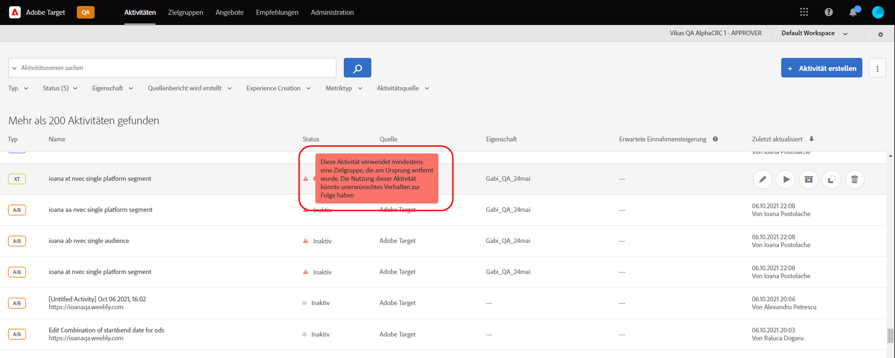
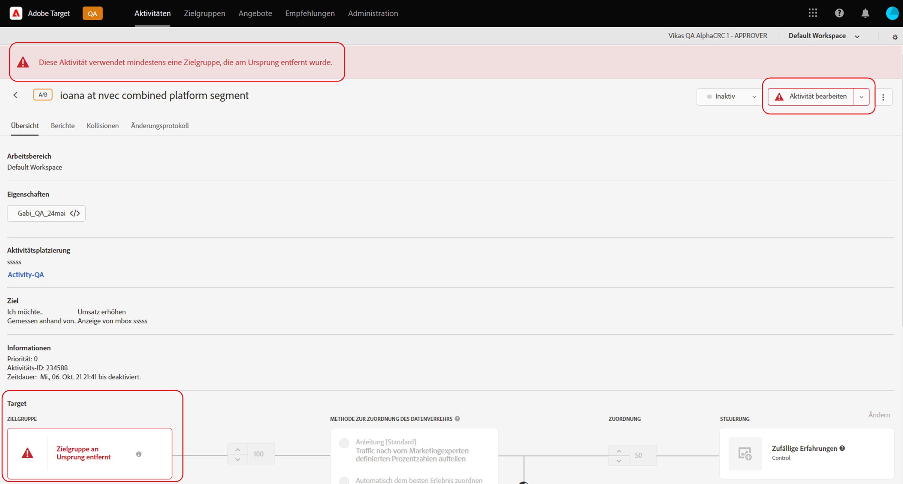

# Target-Versionshinweise (aktuell)

Diese Versionshinweise enthalten Informationen zu Funktionen, Verbesserungen und Fehlerkorrekturen in der [!DNL Adobe Target Standard]- und [!DNL Target Premium]-Version. Sie finden hier auch Versionshinweise zu den APIs, SDKs, der [!DNL Adobe Experience Platform Web SDK] und der JavaScript-Bibliothek (at.js) von Target sowie zu anderen Plattformänderungen.

>[!IMPORTANT]
>
>**Beendigung von mbox.js**: Ab dem 31. März 2021 unterstützt [!DNL Adobe Target] die Bibliothek „mbox.js“ nicht mehr. Seit dem 31. März 2021 schlagen alle Aufrufe aus mbox.js kontrolliert fehl. Dies wirkt sich auf Seiten mit [!DNL Target]-Aktivitäten aus, die Standardinhalte bereitstellen.
>
>Migrieren Sie zur aktuellen Version des neuen [!DNL Adobe Experience Platform Web SDK] oder zur JavaScript-Bibliothek „at.js“, um mögliche Probleme mit Ihren Sites zu vermeiden. Weitere Informationen finden Sie unter [Übersicht: Target für Client-seitiges Web implementieren](/help/c-implementing-target/c-implementing-target-for-client-side-web/implement-target-for-client-side-web.md).

(Die Problemnummern in Klammern dienen internen [!DNL Adobe]-Zwecken.)

## [!DNL Target Standard/Premium] 21.10.4 (21. Oktober 2021)

Dieses Maintenance Release enthält die folgende Erweiterung:

| Funktion | Details |
| --- | --- |
| Warenkorb-basiertes Recommendations | Es wurde eine neue Reihe von Algorithmen hinzugefügt, um Empfehlungen basierend auf dem Inhalt des Warenkorbs des Besuchers zu senden. Weitere Informationen finden Sie unter &quot;Warenkorb-basiert&quot; in [Kriterien erstellen](/help/c-recommendations/c-algorithms/create-new-algorithm.md) und &quot;Warenkorb-/Warenkorb-Ansichten/Checkout-Seiten&quot; und &quot;Bereits im Warenkorb des Besuchers befindliche Elemente ausschließen&quot; in [Recommendations planen und umsetzen](/help/c-recommendations/plan-implement.md). |

## [!DNL Target Standard/Premium] 21.10.3 (19. Oktober 2021)

Diese Wartungsversion enthält folgende Verbesserungen, Fehlerkorrekturen und Änderungen:

* Behobene Probleme, die das Öffnen von Kunden verhinderten [!UICONTROL A4T] Bereich in [!DNL Analysis Workspace] durch Klicken auf [!UICONTROL Ansicht in Analytics] Schaltfläche in [!DNL Target] Aktivität Berichte. (TGT-42099, TGT-42100)
* Es wurde ein Problem behoben, das [!UICONTROL Entwurf bearbeiten] Schaltfläche, die während der Bearbeitung nicht angezeigt wird [!UICONTROL A/B-Test] und [!UICONTROL Erlebnis-Targeting] (XT) Aktivitäten mit [!UICONTROL Formularbasierter Experience Composer]. (TGT-41980)
* Es wurde ein Problem behoben, durch das [!UICONTROL Kompatibel] Kontrollkästchen bei der Anzeige in der Kriterienauswahl beim Erstellen eines neuen [!UICONTROL Recommendations] Aktivität. (TGT-42053)
* Es wurde eine fehlerhafte Fehlermeldung behoben, die angezeigt wurde, wenn die Auswahl nicht möglich war [!DNL Analytics] als Berichte-Quelle (A4T) aufgrund des Fehlens von [!DNL Analytics] Berechtigungen. (TGT-41954)
* Mehrere Barrierefreiheitskorrekturen implementiert, um die Navigation über die Tastatur zu verbessern [!DNL Target] UI.

## [!DNL Target Standard/Premium] 21.10.2 (13. Oktober 2021)

Die folgenden Verbesserungen wurden hinzugefügt, wenn Sie [!DNL Target] [!UICONTROL Audiencen] mit [!DNL Adobe Experience Platform Web SDK]:

* Hinzugefügte Warnsymbole, Popup-Fenster und Nachrichten an verschiedenen Stellen in der [!DNL Target] UI, um anzugeben, dass die Audience an der Quelle gelöscht wurde und nicht mehr zur Verwendung in verfügbar ist [!DNL Target] Aktivitäten.

   Die folgenden Abbildungen zeigen einige der Orte, an denen Symbole, Popup-Fenster und Nachrichten angezeigt werden:

   * [!UICONTROL Aktivität] Liste

      

   * Aktivität [!UICONTROL Überblick] Seiten:

      

   * [!UICONTROL Erlebnisse] Schritt des Arbeitsablaufs für die Erstellung von Aktivitäten:

      ![Audience gelöscht bei Quellnachricht am [!UICONTROL Erlebnisse] Seite](assets/deleted-at-source-experiences.png)

   * [!UICONTROL Targeting] Schritt des Arbeitsablaufs für die Erstellung von Aktivitäten:

      ![Audience gelöscht bei Quellnachricht am [!UICONTROL Targeting] Seite](assets/deleted-at-source-targeting.png)

   * [!UICONTROL Ziele und Einstellungen] Schritt des Arbeitsablaufs für die Erstellung von Aktivitäten:

      ![Audience gelöscht bei Quellnachricht auf [!UICONTROL Ziele und Einstellungen] Seite](assets/deleted-at-source-goals-settings.png)

   * Audience ([!UICONTROL Audience ersetzen] zu [!UICONTROL Targeting] Schritt des Arbeitsablaufs für die Erstellung von Aktivitäten):

* Wenn Sie die Funktion &quot;Audiencen zusammenführen&quot;verwenden und eine der Audiencen aus der Quelle gelöscht wurde, [!UICONTROL Speichern] ist deaktiviert.

## [!DNL Target Standard/Premium] 21.10.1 (6. Oktober 2021)

Diese Version enthält die folgenden neuen Funktionen:

| Funktion | Details |
| --- | --- |
| [!UICONTROL Aktualisierung der Audiences-Benutzeroberfläche] | Im Rahmen der [!DNL Adobe Target] die kontinuierlichen Bemühungen des Teams, das Benutzererlebnis zu verbessern für [!DNL Target] Benutzer aktualisiert diese Version die [!UICONTROL Audiencen] und [!UICONTROL Profil-Skripte] Seiten in [!DNL Target] UI. Dieses Update vereinheitlicht und standardisiert Designmuster, die zuvor inkonsistent waren, und fügt neue Verbesserungen hinzu, wie:<ul><li>Möglichkeit, mehrere Audiencen gleichzeitig auszuwählen und zu löschen</li><li>Eine aktualisierte [Audience Builder-Design](/help/c-target/c-audiences/create-audience.md)</li><li>Unterstützung von Ausschlussregeln im [!UICONTROL Audience] Bibliotheksregelaufbau</li><li>Ein neuer Filter &quot;Audience-Quelle&quot;, der eine schnellere Erkennung der Audience ermöglicht</li><li>Dauerhafte Suche und Filteroptionen für Sitzungen</li></ul>Weitere Informationen finden Sie unter [Zielgruppen](/help/c-target/target.md). **HINWEIS**: Die neue [!UICONTROL Audiencen] Die Benutzeroberfläche wurde vorübergehend für alle Kunden deaktiviert, mit Ausnahme der Kunden, die sich derzeit in einem [!DNL Target] Beta-Programm. Diese Aktualisierung der Benutzeroberfläche wird für eine Teilgruppe von Kunden am Dienstag, 19. Oktober und für alle verbleibenden Kunden am Donnerstag, 21. Oktober 2021 erneut aktiviert. |
| [!UICONTROL Profil-Skripte] UI-Aktualisierung | Die [!UICONTROL Profil-Skripte] Bibliothek wurde ebenfalls aktualisiert und enthält eine aktualisierte Benutzeroberfläche sowie mehrere Produktivitätsaktualisierungen:<ul><li>Möglichkeit, mehrere Profil-Skripts gleichzeitig auszuwählen und zu löschen</li><li>Ein neuer Code-Editor für Profil-Skripte</li><li>Syntaxhervorhebung und Fehlerprüfung im Code-Editor</li><li>Automatische Vervollständigung von Token (mbox oder Profil) über Tastaturbefehle</li></ul>Weitere Informationen finden Sie unter [Besucher-Profil](/help/c-target/c-visitor-profile/visitor-profile.md). |
|  Recommendations-Kriterien erstellen und bearbeiten | Die [!UICONTROL Recommendations-Kriterien] Der Arbeitsablauf für Erstellung und Bearbeitung wurde optimiert, um die Auswahl der richtigen Empfehlungsalgorithmen und -einstellungen zum Erreichen Ihrer Ziele zu vereinfachen. Weitere Informationen finden Sie unter [Kriterien erstellen](/help/c-recommendations/c-algorithms/create-new-algorithm.md). |
|  Verbesserungen der Recommendations-Lookback-Fenster und der Algorithmusaktualisierungsfrequenz | Sie können nun Algorithmen für &quot;Am meisten angesehen&quot; und &quot;Topverkäufe&quot; mit einem sechsstündigen Lookback-Fenster ausführen, um den Inhalt zu erfassen, der zuletzt im Trend ist. Wenn das sechsstündige Lookback-Fenster ausgewählt wird, werden die Empfehlungsergebnisse alle 3-6 Stunden des Tages aktualisiert. Weitere Informationen finden Sie unter [Datenquelle](/help/c-recommendations/c-algorithms/create-new-algorithm.md#data-source) in *Kriterien erstellen*. |

## Zusätzliche Versionshinweise und Versionsdetails

| Ressource | Details |
|--- |--- |
| [Versionshinweise: Adobe Target Platform Experience Web SDK](https://experienceleague.adobe.com/docs/experience-platform/edge/release-notes.html?lang=de) | Details zu Änderungen in den einzelnen Versionen von Platform Web SDK. |
| [„at.js“-Versionsdetails](/help/c-implementing-target/c-implementing-target-for-client-side-web/target-atjs-versions.md) | Details zu den Änderungen in den einzelnen Versionen der at.js-JavaScript-Bibliothek von [!DNL Adobe Target] |

## Dokumentationsänderungen, historische Versionshinweise und Experience Cloud-Versionshinweise

Neben den Hinweisen für jede Version bieten die folgenden Ressourcen zusätzliche Informationen:

| Ressource | Details |
|--- |--- |
| Dokumentationsänderungen | Enthält detaillierte Informationen zu Aktualisierungen dieses Benutzerhandbuchs, die nicht in diesen Versionshinweisen enthalten sind. Weitere Informationen finden Sie unter [Dokumentationsänderungen](/help/r-release-notes/doc-change.md#reference_366123CF00994BACBBF9BBDF2C4D840C). |
| Versionshinweise für vorherige Versionen | Lesen Sie sich Informationen zu neuen Funktionen und Verbesserungen älterer Versionen von Target Standard und Target Premium durch. Weitere Informationen finden Sie unter [Versionshinweise für frühere Versionen](/help/r-release-notes/release-notes-for-previous-releases.md). |
| Adobe Experience Cloud-Versionshinweise | Zeigen Sie die aktuellen Versionshinweise für die Adobe Experience Cloud-Lösungen an. Weitere Informationen finden Sie in den [Versionshinweisen zu Experience Cloud](https://experienceleague.adobe.com/docs/release-notes/experience-cloud/current.html?lang=de). |

## Vorabinformationen zu Versionen {#section_5D588F0415A2435B851A4D0113ACA3A0}

Mit den folgenden Ressourcen können Sie sehen, was in der nächsten Target-Version zu finden ist.

| Ressource | Details |
|--- |--- |
| Adobe Priority-Produktaktualisierung | Um vorab Benachrichtigungen über bevorstehende Produktverbesserungen an Target und andere Adobe Experience Cloud-Lösungen zu erhalten, melden Sie sich für das Adobe Priority Product Update an: [https://www.adobe.com/subscription/priority-product-update.html](https://www.adobe.com/subscription/priority-product-update.html) |
| Bevorstehende Versionshinweise | Informationen zu den Target-Versionen des aktuellen Monats, einschließlich Informationen zu Vorversionen, finden Sie auf der Seite [Target-Versionshinweise – Vorabversion](/help/r-release-notes/target-release-notes.md). |
