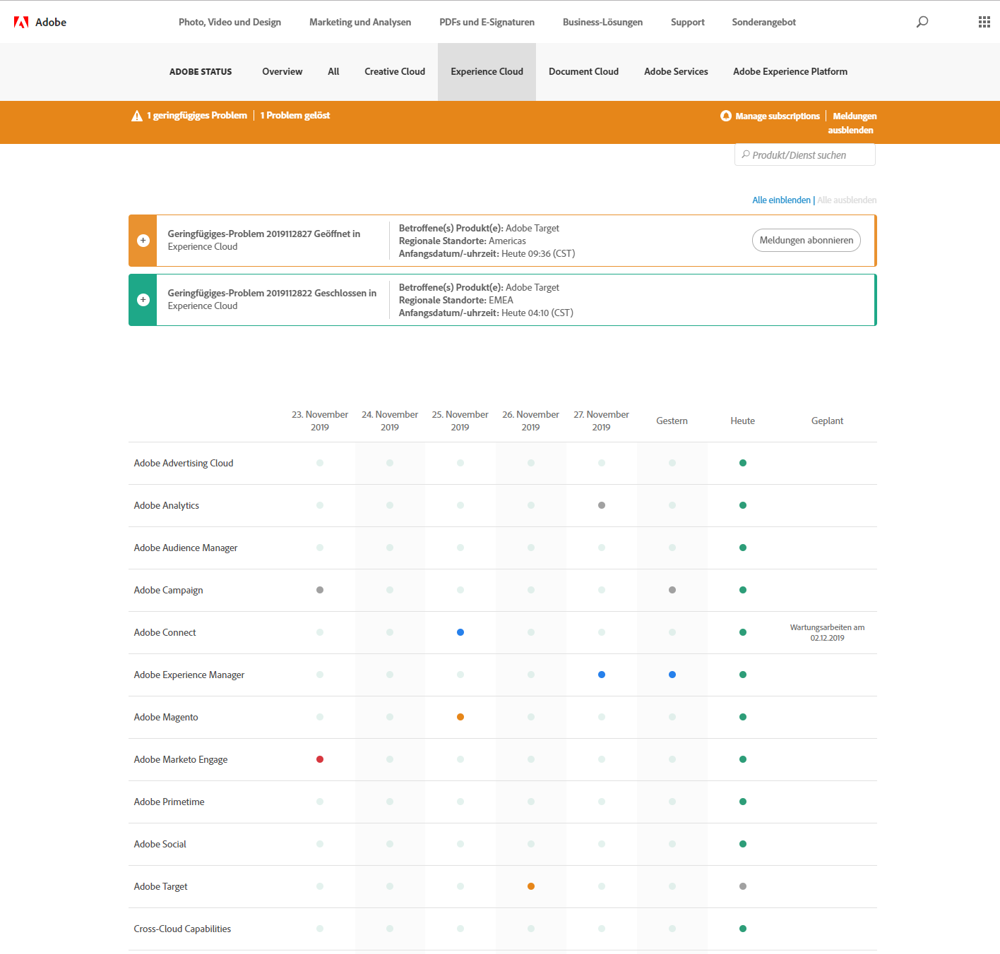
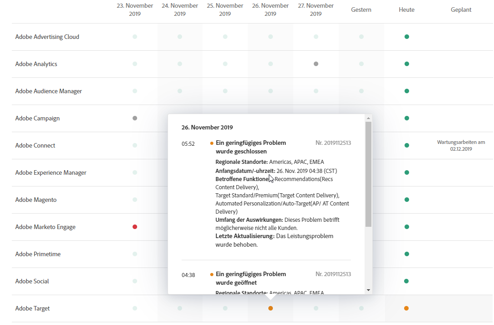

# Systemstatusaktualisierungen und proaktive Benachrichtigungen

Verwenden Sie die [!UICONTROL Adobe-Systemstatusseite] und proaktive Benachrichtigungen, um einen Überblick über den Status von [!DNL Adobe]-Produkten und [!DNL Adobe Experience Cloud]-Lösungen zu erhalten. Proaktive Benachrichtigungen benachrichtigen Sie zu Ausfall- und Wartungsereignissen.

## Systemstatusupdates

Auf der [!UICONTROL Adobe-Systemstatus]-Seite können Sie den aktuellen Status von [!DNL Target] und anderen [!DNL Adobe]-Produkten und [!DNL Adobe Experience Cloud]-Lösungen sehen. Mit dieser Seite können Sie feststellen, welche Probleme möglicherweise aufgrund von Systemaktualisierungen oder Routinewartungsarbeiten auftreten können.

Greifen Sie über folgende URL auf die Seite [!UICONTROL Systemstatus] zu:

[https://status.adobe.com](https://status.adobe.com)

Zum Anzeigen des Status von [!DNL Experience Cloud]-Lösungen einschließlich [!DNL Target] klicken Sie auf die Registerkarte [!UICONTROL Experience Cloud].

Oben auf der Seite finden Sie Informationen zu laufenden Wartungsereignissen sowie einen Link, über den Sie Updates für die einzelnen Lösungen abonnieren können.

In der obigen Abbildung wurden [!DNL Adobe Analytics], [!DNL Adobe Target] und [!DNL Adobe Campaign] Verwaltungsaktualisierungen unterzogen. Alle anderen Produkte funktionierten wie gewohnt. Es empfiehlt sich immer, diese Seite zu prüfen, wenn Probleme bei der Verwendung von [!DNL Target] auftreten.

Bei Veröffentlichung der monatlichen [!DNL Target]-Version wird eine Benachrichtigung in der Lösung angezeigt. Es werden jedoch auch kleinere Updates durchgeführt, die nur auf dieser Seite erwähnt werden.

Unten auf der Seite finden Sie einen Kalender der letzten sieben Tage, der alle täglichen Status zu allen Lösungen enthält. Fahren Sie mit dem Mauszeiger über die Statusanzeige, um mehr zu erfahren:

## Proaktive Benachrichtigungen

Proaktive Benachrichtigungen sind E-Mail-Warnungen, die an registrierte Kunden gesendet werden, um die folgenden Ereignisse im Kundenprofil des Kunden zu öffnen, einschließlich [!DNL Target]:

* Warnhinweise auf Lösungsebene (keine Isolierung bestimmter Dienste in der Lösung)
* CSOs (Ausfälle) vom Schweregrad 1 und Schweregrad 2
* CMRs (Wartungsereignisse)

>[!NOTE]
>
>Sie müssen sich registrieren, um diese Warnungen zu erhalten. Wenden Sie sich an Ihren [!DNL Adobe]-Kundenbetreuer (CSM) oder [!DNL Adobe]-Vertriebsbeauftragten (AE), um den Registrierungsprozess zu starten.

Die folgenden Abbildungen zeigen Beispiele für die proaktive Benachrichtigung per E-Mail:

