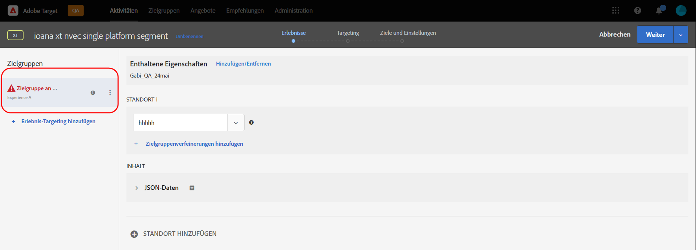
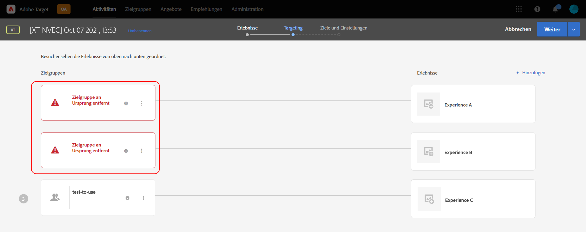

# Target-Versionshinweise (Vorabversion)

Dieser Artikel enthält Vorabinformationen zur kommenden Version. Veröffentlichungstermine, Funktionen und andere Informationen können ohne Ankündigung geändert werden.

**Zuletzt aktualisiert am: 11. Oktober 2021**

Informationen über die aktuelle Version finden Sie unter [Versionshinweise für Target](release-notes.md). Die Informationen auf diesen Seiten können je nach Veröffentlichungsdatum der Versionen identisch sein. Die Problemnummern in Klammern dienen internen [!DNL Adobe]-Zwecken.

>[!IMPORTANT]
>
>**Beendigung von mbox.js**: Ab dem 31. März 2021 unterstützt [!DNL Adobe Target] die Bibliothek „mbox.js“ nicht mehr. Seit dem 31. März 2021 schlagen alle Aufrufe aus mbox.js kontrolliert fehl. Dies wirkt sich auf Seiten mit [!DNL Target]-Aktivitäten aus, die Standardinhalte bereitstellen.
>
>Um potenzielle Probleme mit Ihren Sites zu vermeiden, migrieren Sie zur neuesten Version der neuen [!DNL Adobe Experience Platform Web SDK]- oder der JavaScript-Bibliothek „at.js“. Weitere Informationen finden Sie unter [Übersicht: Target für Client-seitiges Web implementieren](/help/c-implementing-target/c-implementing-target-for-client-side-web/implement-target-for-client-side-web.md).

## [!DNL Target Standard/Premium] 21.10.2 (13. Oktober 2021)

Die folgenden Verbesserungen wurden bei der Verwendung von [!DNL Target] [!UICONTROL Zielgruppen] mit dem [!DNL Adobe Experience Platform Web SDK] hinzugefügt:

* Es wurden Warnsymbole, Popup-Fenster und Meldungen an verschiedenen Stellen in der [!DNL Target]-Benutzeroberfläche hinzugefügt, die darauf hinweisen, dass die Zielgruppe an der Quelle gelöscht wurde und nicht mehr für [!DNL Target]-Aktivitäten verfügbar ist.

   Die folgenden Abbildungen zeigen einige Stellen, an denen Symbole, Popovers und Nachrichten angezeigt werden:

   *  Seite &quot;Aktivitätenliste&quot;

      

   * Activity [!UICONTROL Übersicht] Seiten:

      

   *  Erlebnisschritt des Workflows zur Aktivitätserstellung:

      

   *  Targeting-Schritt des Workflows für die Aktivitätserstellung:

      

   * [!UICONTROL Schritt Ziele und ] Einstellungen des Workflows zur Aktivitätserstellung:

      ![Zielgruppe gelöscht in Quellnachricht auf der Seite  [!UICONTROL &quot;Ziele und ] Einstellungen&quot;](assets/deleted-at-source-goals-settings.png)

   * Zielgruppenverfeinerungen ([!UICONTROL Ersetzen Sie Zielgruppe] im Schritt [!UICONTROL Zielgruppenbestimmung] des Workflows zur Aktivitätserstellung):

* Wenn Sie versuchen, die Funktion Zielgruppen kombinieren zu verwenden und eine der Zielgruppen an der Quelle gelöscht wurde, ist [!UICONTROL Speichern] deaktiviert.

## Vorabinformationen zu Versionen {#section_7B9D4AAFC6A74388B9D7DEF0658D8B63}

Um vorab Benachrichtigungen über bevorstehende Produktverbesserungen an Target und anderen Adobe Experience Cloud-Lösungen zu erhalten, melden Sie sich für das Adobe Priority Product Update an:

[https://www.adobe.com/subscription/priority-product-update.html](https://www.adobe.com/subscription/priority-product-update.html)
